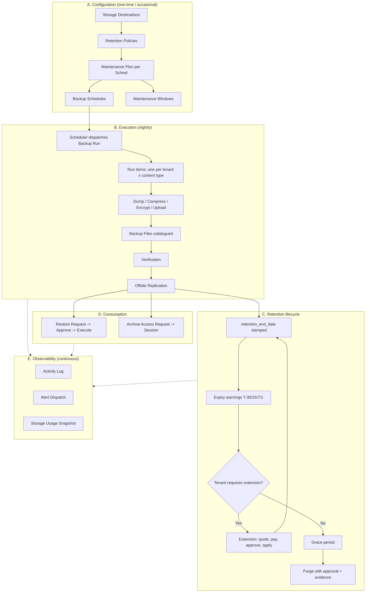
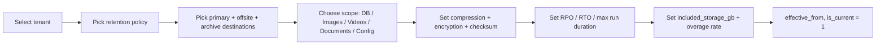
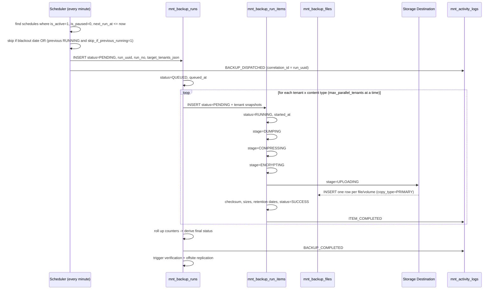
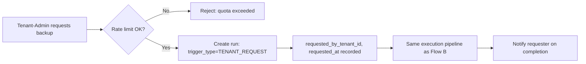
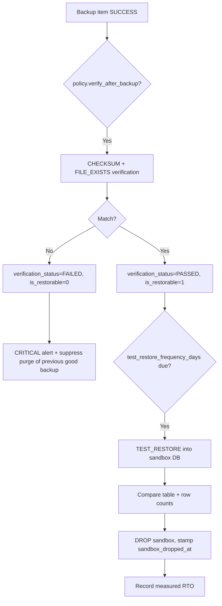
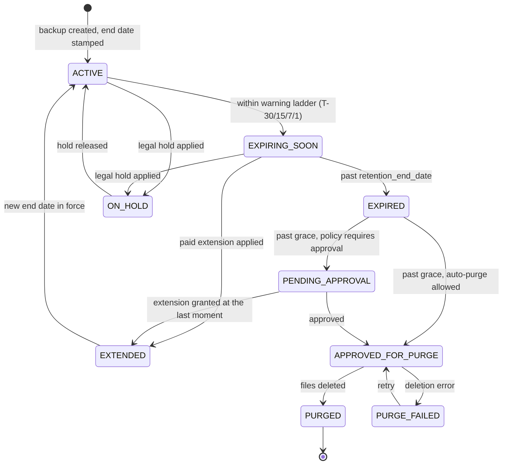
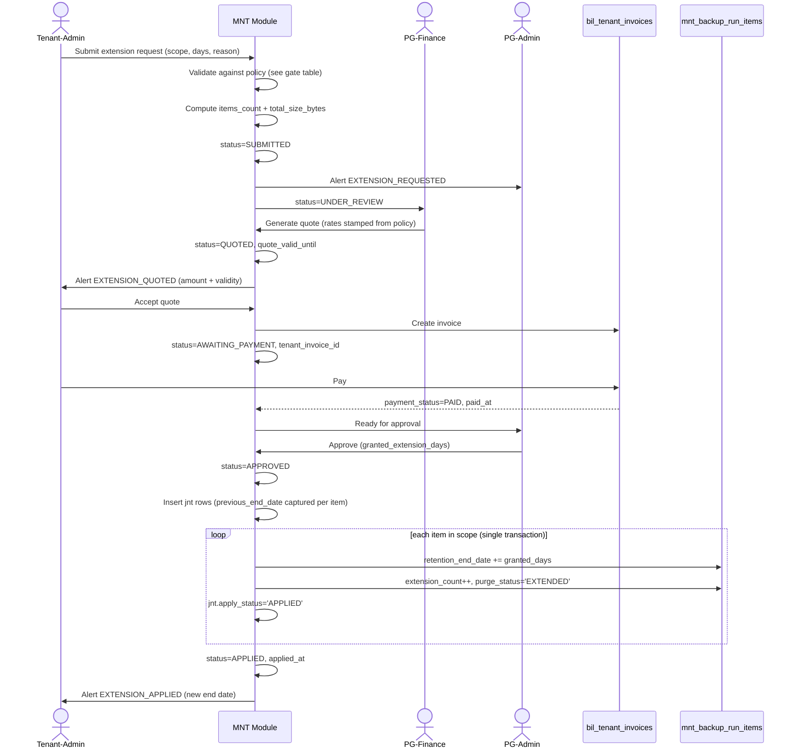
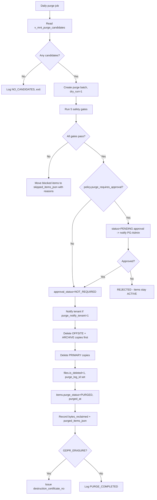
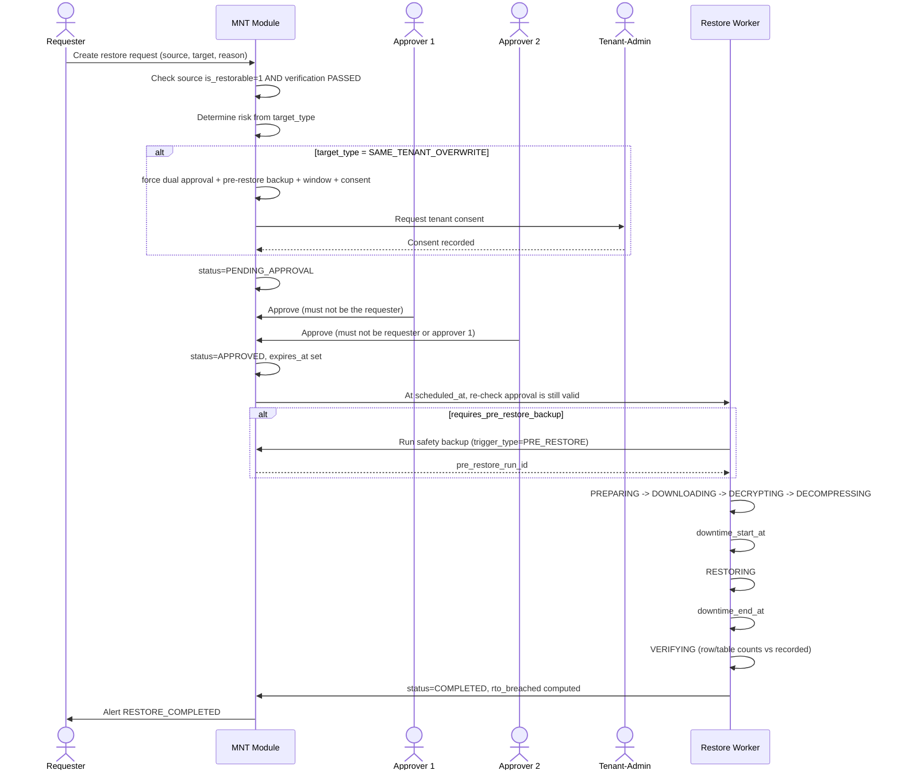
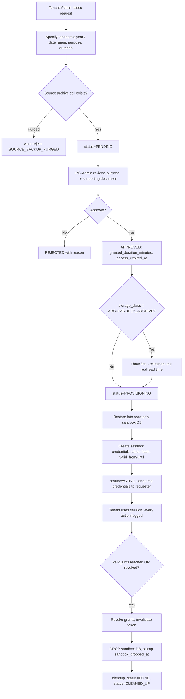

# MNT — Maintenance Module | Process Flow (v2)

**Module:** Maintenance — Backup, Archive, Retention & Restore
**Module Code:** `MNT` · **Prefix:** `mnt_` · **Database:** `prime_db`
**DDL:** `1-DDL_Modules/Maintenance/Maintenance_DDL_v2.sql`
**Dictionary:** `1-DDL_Modules/Maintenance/Maintenance_Data_Dictionary_v2.md`
**Version:** 2.0 · **Date:** 27-Jul-2026

---

## 1. What this module does

It protects every tenant's data — database, images, videos, PDFs, config — by:

1. **Planning** — per-school maintenance plans (retention policy + storage + scope + SLA).
2. **Scheduling** — cron schedules that dispatch backup runs.
3. **Executing** — dumping, compressing, encrypting, uploading, replicating.
4. **Proving** — checksum verification and periodic test restores.
5. **Retaining** — a definite end date per backup, with warnings before it lapses.
6. **Monetising** — paid extension of that end date on the tenant's request.
7. **Serving** — time-boxed tenant access to archived data.
8. **Recovering** — approved, audited, reversible restores.
9. **Destroying** — approved purge with evidence of destruction.
10. **Recording** — a complete activity log across all of the above.

---

## 2. Actors

| Actor | Who | What they can do |
|-------|-----|------------------|
| **PG-Admin** | Prime Gurukul platform administrator | Everything: configure, approve, restore, purge, waive fees |
| **PG-Support** | Platform support staff | Trigger backups, view history, raise requests. **Cannot** approve their own request, purge, or overwrite a live tenant DB |
| **PG-Finance** | Billing team | Generate quotes, confirm payment, waive charges |
| **Tenant-Admin** | School principal / IT head | Request on-demand backup, request retention extension, request archive access, view own history |
| **Tenant-User** | School staff | View own school's backup status (read only) |
| **System / Cron** | Scheduler & queue workers | Dispatch runs, verify, replicate, warn, purge, snapshot usage |

---

## 3. Master process map



---

## 4. FLOW A — Configuration setup

**Actor:** PG-Admin · **Frequency:** once, then on change · **Tables:** 1, 2, 3, 4, 5, 6

### A1. Register storage destinations

| # | Step | Writes |
|---|------|--------|
| 1 | Add primary destination (local NAS or S3) | `mnt_storage_destinations` |
| 2 | Add offsite destination (`is_offsite = 1`) — **mandatory for the 3-2-1 rule** | same |
| 3 | Optionally add a cold-archive destination | same |
| 4 | Store credentials in the vault; save only the **key name** in `credential_ref` | same |
| 5 | Run a health check → `health_status`, `last_health_check_at` | same |
| 6 | Mark exactly one `is_default = 1` (enforced by `uq_mntStorageDest_defaultFlag`) | same |

> **Gate:** if no active destination has `is_offsite = 1`, the module raises a configuration warning. A single-location backup does not survive a site loss.

### A2. Define retention policies

Seeded: `TRIAL_30D`, `STD_90D`, `GOLD_365D`, `STATUTORY_7Y`.

For each: GFS tiers, `default_retention_days`, `min_retention_days` (statutory floor), `grace_period_days`, the expiry-warning ladder, and the **extension price book** (`extension_rate_per_gb_month`, `extension_flat_fee_month`, `extension_min_charge`, `extension_tax_percent`).

### A3. Create a maintenance plan per school



**Plan resolution order for any tenant:**
`tenant-specific current plan` → `tenant_group plan` → `platform default (tenant_id IS NULL)`

**Superseding a plan:** never edit in place. Set `is_current = 0` and `effective_to` on the old row, insert a new row. `uq_mntPlan_currentPerTenant` guarantees only one live plan exists per tenant at any moment.

### A4. Create backup schedules

| Typical schedule | Cron | Type | Retention override |
|------------------|------|------|--------------------|
| Nightly full DB | `0 2 * * *` | FULL | inherit policy |
| 4-hourly log backup (PITR) | `0 */4 * * *` | LOG | 3 days |
| Weekly full media | `0 1 * * 0` | FULL | inherit policy |
| Monthly archival | `0 0 1 * *` | FULL | inherit policy |

Set `timezone` (Asia/Kolkata — **not** server time), `max_parallel_tenants`, `skip_if_previous_running = 1`, and `blackout_dates_json` for exam and result days.

### A5. Announce maintenance windows

Create the window, set `notify_days_before`; tenants receive the announcement and a 1-hour reminder. A destructive restore may only execute inside a window whose status is `IN_PROGRESS`.

---

## 5. FLOW B — Scheduled backup execution

**Actor:** System/Cron · **Frequency:** per schedule · **Tables:** 7, 8, 9, 10, 18, 19



### Step detail

| # | Step | Key writes |
|---|------|-----------|
| 1 | **Dispatch.** Scheduler finds due schedules. Blackout dates and overlap guard applied. | — |
| 2 | **Resolve targets.** Expand `target_scope` into a concrete tenant list; apply `mnt_schedule_tenant_jnt` exclusions. Snapshot the list. | `mnt_backup_runs.target_tenants_json` |
| 3 | **Create run.** `run_uuid` doubles as the idempotency key so a retried worker cannot create a duplicate. | `mnt_backup_runs` PENDING → QUEUED |
| 4 | **Create items.** One per (tenant × content type). Snapshot `tenant_code`, `tenant_name`, `database_name`, `database_host`, `domain_name` **now** — these must reflect the backup date forever. | `mnt_backup_run_items` |
| 5 | **Dump.** `mysqldump` for DATABASE items (honouring `exclude_tables_json`); file walk for media items (honouring `exclude_paths_json`, `max_file_size_mb`). | `stage = DUMPING` |
| 6 | **Compress.** Per `plan.compression_type` / `compression_level`. | `original_size_bytes` |
| 7 | **Encrypt.** Per `plan.encryption_algo`, key fetched via `encryption_key_ref`. **If encryption is required and fails, the item FAILS — it must never silently write plaintext student data.** | `is_encrypted`, `encryption_algo` |
| 8 | **Split.** If `split_volume_size_mb` is set, chunk into volumes. | `is_multipart`, `total_parts` |
| 9 | **Upload.** Write to `primary_destination_id` under `root_path`. | `mnt_backup_files` (`copy_type = PRIMARY`) |
| 10 | **Catalogue.** Per file: `directory_path`, `file_name`, `size_bytes`, `mime_type`, `checksum_value`, `etag`. | `mnt_backup_files` |
| 11 | **Stamp retention.** See the formula below. | `retention_*` columns |
| 12 | **Close item.** `status`, `completed_at`, `stored_size_bytes`, `manifest_json`. | `mnt_backup_run_items` |
| 13 | **Roll up.** Counters → derive run status. | `mnt_backup_runs` |
| 14 | **Verify + replicate.** Queue both. | tables 10, 9 |
| 15 | **Notify.** Success (INFO) or failure (ERROR/CRITICAL). | `mnt_alert_dispatches` |

### Retention stamping (step 11) — executed once, at item creation

```
retention_start_date        = DATE(completed_at)
retention_days              = COALESCE(schedule_tenant.retention_days_override,
                                       schedule.retention_days_override,
                                       policy.default_retention_days)
original_retention_end_date = retention_start_date + retention_days   -- IMMUTABLE
retention_end_date          = original_retention_end_date             -- extensions move THIS
grace_end_date              = retention_end_date + policy.grace_period_days
retention_class             = derived from schedule.frequency (DAILY/WEEKLY/MONTHLY/YEARLY)
purge_status                = 'ACTIVE'
```

### Run status derivation (step 13)

| Condition | Run status |
|-----------|-----------|
| all items SUCCESS | `COMPLETED` |
| all SUCCESS but some SUCCESS_WITH_WARNINGS | `COMPLETED_WITH_WARNINGS` |
| mix of SUCCESS and FAILED | `PARTIALLY_FAILED` |
| all items FAILED | `FAILED` |
| exceeded `max_run_duration_minutes` | `TIMED_OUT` |
| cancelled mid-flight | `CANCELLED` |

> A run is only truly complete when verification passed **and**, if `policy.require_offsite_copy = 1`, offsite replication succeeded.

### Failure handling

| Failure | Behaviour |
|---------|-----------|
| One tenant's dump fails | Item → FAILED; **run continues** for other tenants; run ends `PARTIALLY_FAILED` |
| Destination unreachable | Run FAILED; destination `health_status = UNREACHABLE`; CRITICAL alert |
| Disk above `low_space_threshold_pct` | WARNING alert before the run; run may be deferred |
| Encryption unavailable and `require_encryption = 1` | Item FAILED — never downgrade to plaintext |
| Run exceeds `max_run_duration_minutes` | TIMED_OUT + CRITICAL alert |
| Retry configured | New run row, `attempt_no + 1`, `retry_of_run_id` set — original failure is preserved, not overwritten |
| `consecutive_failure_count` hits `auto_disable_after_failures` | Schedule `is_active = 0` + CRITICAL alert |

---

## 6. FLOW C — On-demand backup (tenant-requested)

**Actor:** Tenant-Admin or PG-Support · **Tables:** 7, 8, 9, 18



`trigger_type = 'TENANT_REQUEST'`, `triggered_by_type = 'TENANT_USER'`, and `requested_at` is stored separately from `started_at` — the gap between the two is the queue wait the tenant actually experienced.

Rate limit: N on-demand backups per tenant per month (plan-driven), to stop one school saturating the backup window.

---

## 7. FLOW D — Verification

**Actor:** System · **Frequency:** after every backup + periodic drill · **Tables:** 10, 8, 19



| Level | Type | Cost | When |
|-------|------|------|------|
| 1 | `FILE_EXISTS` | trivial | every backup |
| 2 | `CHECKSUM` | low | every backup |
| 3 | `ARCHIVE_INTEGRITY` | medium | weekly |
| 4 | `SCHEMA_VALIDATION` | medium | monthly |
| 5 | `TEST_RESTORE` + `ROW_COUNT_MATCH` | high | per `test_restore_frequency_days` |
| 6 | `DR_DRILL` | highest | quarterly / annually |

**Rules**
- A FAILED verification sets `is_restorable = 0` so the corrupt backup disappears from the restore picker — nobody discovers the problem during an actual emergency.
- A failed verification **suppresses the purge of the previous good backup** until a fresh good one exists.
- `TEST_RESTORE` always targets a throwaway sandbox, never a live tenant DB. A sandbox still alive 24 h after completion is a cleanup defect.
- `PRE_PURGE` verification is mandatory before destroying a tenant's last remaining backup.
- The duration of a real test restore is the **measured RTO** — the honest number behind the SLA promise.

---

## 8. FLOW E — Offsite replication & tiering

**Actor:** System · **Tables:** 9, 8, 1

| # | Step |
|---|------|
| 1 | After a successful item, queue replication to `plan.offsite_destination_id` |
| 2 | Copy each PRIMARY file → insert `mnt_backup_files` row with `copy_type = 'OFFSITE_REPLICA'`, `source_file_id` set |
| 3 | Verify the replica checksum against the source |
| 4 | Stamp `has_offsite_copy = 1`, `offsite_copied_at` on the item; `is_offsite_replicated` on the run |
| 5 | Later, when `age > plan.move_to_archive_after_days`, transition to `archive_destination_id` → `copy_type = 'ARCHIVE_TIER'`, `storage_class = 'ARCHIVE'`, set `restore_lead_time_hours` |
| 6 | If `destination.is_immutable`, apply the object lock → `is_immutable_locked`, `object_lock_until` |

**3-2-1 rule:** 3 copies, on 2 media types, with 1 offsite. `require_offsite_copy = 1` makes it enforceable — until the replica is confirmed, the run is not complete.

---

## 9. FLOW F — Retention lifecycle & expiry warnings

**Actor:** System (daily) · **Tables:** 8, 19, 18



### Daily expiry-warning job

```
FOR each warning threshold D in policy.expiry_warning_days_json (default [30,15,7,1]):
    FOR each item WHERE retention_end_date = CURDATE() + D
                    AND is_legal_hold = 0
                    AND purge_status NOT IN ('PURGED','ON_HOLD'):
        dedupe_key = 'EXPIRY_WARN:item:' || item.id || ':' || D
        IF no mnt_alert_dispatches row with that dedupe_key:
            INSERT alert -> Tenant-Admin (EMAIL + IN_APP) and PG-Admin
            append {D: today} to item.expiry_warning_sent_json
            SET purge_status = 'EXPIRING_SOON'
```

The alert is **actionable**: `requires_action = 1` and `action_url` deep-links straight to the extension request form. That link is the module's revenue path.

---

## 10. FLOW G — Paid retention extension ★

**Actors:** Tenant-Admin → PG-Support → PG-Finance → PG-Admin · **Tables:** 13, 14, 8, 19, 18, `bil_tenant_invoices`

This is the flow the requirement calls out most explicitly: *"Backup will be kept for a certain period but Tenant can demand (Paid Service) to extend the duration."*



### Validation gates (before `SUBMITTED`)

| # | Gate | Failure message |
|---|------|-----------------|
| 1 | `policy.allow_extension = 1` | Extension not available on your plan |
| 2 | `requested_extension_days >= policy.extension_min_days` | Minimum extension is N days |
| 3 | `requested_extension_days <= policy.extension_max_days` (if set) | Maximum extension is N days |
| 4 | `item.extension_count < policy.max_extensions_allowed` (if set) | This backup has reached its extension limit |
| 5 | `retention_end_date + max_retention_days` not exceeded | Total retention cap reached |
| 6 | `current_end_date - CURDATE() >= policy.extension_lead_time_days` | Requests must be raised at least N days before expiry |
| 7 | No item in scope has `purge_status = 'PURGED'` | Some selected backups have already been deleted |
| 8 | Tenant has no overdue invoice (configurable) | Please clear outstanding dues first |

### Pricing (stamped at quote time — never recomputed later)

```
total_size_gb   = total_size_bytes / 1073741824
billable_months = CEIL(granted_extension_days / 30)

sub_total       = MAX( policy.extension_min_charge,
                       (policy.extension_flat_fee_month
                        + policy.extension_rate_per_gb_month * total_size_gb)
                       * billable_months )

discount_amount = sub_total * discount_percent / 100   (or a flat figure)
tax_amount      = (sub_total - discount_amount) * tax_percent / 100
total_amount    = sub_total - discount_amount + tax_amount
```

**Worked example** — 3 schools' databases, 12 GB total, extend 180 days, `STD_90D` policy (₹4.00/GB/month, 18% GST):

```
total_size_gb   = 12
billable_months = CEIL(180 / 30) = 6
sub_total       = (0 + 4.00 x 12) x 6           = ₹288.00
tax_amount      = 288.00 x 18%                   = ₹51.84
total_amount                                     = ₹339.84
```

> Rates are **copied into the request row**, not referenced. A price rise next month must never change a quote already issued.

### Apply step (single transaction)

```sql
-- per item in scope
INSERT INTO mnt_retention_extension_item_jnt
  (extension_request_id, backup_run_item_id, previous_end_date, new_end_date,
   extended_days, item_size_bytes, item_charge_amount, apply_status)
VALUES (:req, :item, :old_end, :old_end + :days, :days, :bytes, :share, 'PENDING');

UPDATE mnt_backup_run_items
   SET retention_end_date        = retention_end_date + INTERVAL :days DAY,
       grace_end_date            = retention_end_date + INTERVAL :grace DAY,
       extension_count           = extension_count + 1,
       total_extended_days       = total_extended_days + :days,
       last_extension_request_id = :req,
       purge_status              = 'EXTENDED',
       is_billable               = 1
 WHERE id = :item;

UPDATE mnt_retention_extension_item_jnt
   SET apply_status = 'APPLIED', applied_at = NOW()
 WHERE extension_request_id = :req AND backup_run_item_id = :item;
```

`original_retention_end_date` is **never touched** — it remains the evidence of the original entitlement, and the `chk_mntRunItems_extensionOnly` constraint makes it impossible for an "extension" to shorten retention.

### Free extension path

When `is_chargeable = 0` or `is_waived = 1`, the flow skips `QUOTED` and `AWAITING_PAYMENT`:
`SUBMITTED → UNDER_REVIEW → APPROVED → APPLIED`.
`waived_by` and `waiver_reason` record who gave the discount and why.

### Reversal (refund / failed payment)

For each `mnt_retention_extension_item_jnt` row: restore `retention_end_date = previous_end_date`, decrement `extension_count` and `total_extended_days`, recompute `grace_end_date`, set `apply_status = 'REVERSED'` with a reason. **Never guess the old date** — it is stored per item precisely for this.

### Auto-renewal

If `is_auto_renew = 1`, a job fires at `next_renewal_date` and creates a new request with `previous_request_id` pointing at this one, forming a visible commercial chain.

---

## 11. FLOW H — Purge (deletion of expired backups)

**Actors:** System → PG-Admin · **Tables:** 17, 8, 9, 18, 19



### The five safety gates

| Gate | Check | What it prevents |
|------|-------|------------------|
| `pre_purge_verified` | A newer, verified backup exists | Destroying the good copy before confirming the new one works |
| `legal_hold_checked` | No item has `is_legal_hold = 1` | Destroying evidence under litigation |
| `active_sessions_checked` | No `mnt_archive_access_sessions` in PROVISIONING/ACTIVE/IDLE | Deleting data someone is reading right now |
| `chain_dependency_checked` | No child item with `parent_item_id = this.id` | Orphaning incrementals and silently breaking a restore chain |
| `min_retention_respected` | `retention_start_date + policy.min_retention_days <= CURDATE()` | Breaching the statutory retention floor |

Additionally: `is_locked = 0` and `object_lock_until` (if set) must be in the past.

### Deletion order — deliberate

**OFFSITE/ARCHIVE copies first, PRIMARY last.** If deletion is interrupted halfway, the surviving copy is the primary one — the fastest to restore from and the one the catalogue points at. Deleting the primary first would leave the system dependent on a cold-tier copy with a 12-hour thaw time.

### Purge types and their approval requirements

| `purge_type` | Approval | Certificate | Notes |
|--------------|----------|-------------|-------|
| `SCHEDULED_RETENTION` | per policy | no | The normal nightly path |
| `MANUAL` | always | no | Dry run first, mandatory |
| `STORAGE_RECLAIM` | always | no | Emergency space recovery |
| `TENANT_OFFBOARDING` | always | optional | School leaving the platform |
| `GDPR_ERASURE` | **dual** | **yes** | Erasure right; irreversible by design |
| `DUPLICATE_CLEANUP` | single | no | Same checksum, multiple copies |
| `CORRUPT_CLEANUP` | single | no | Failed verification, unrestorable |
| `FAILED_RUN_CLEANUP` | none | no | Partial files from a failed run |

> `mnt_purge_logs.tenant_id` is `ON DELETE SET NULL` — the proof that a school's data was destroyed must **outlive** the school's own record. That is why `tenant_code` and `tenant_name` snapshots are mandatory on this table.

---

## 12. FLOW I — Restore

**Actors:** Requester → 2 approvers → System · **Tables:** 11, 12, 7, 6, 18, 19



### Approval matrix by target type

| `target_type` | Approvals | Pre-restore backup | Window | Tenant consent |
|---------------|-----------|--------------------|--------|----------------|
| `NEW_SANDBOX_DB` | 1 | no | no | no |
| `DOWNLOAD_TO_ADMIN` | 1 | no | no | no |
| `ALTERNATE_TENANT` | 2 | recommended | no | yes |
| `SAME_TENANT_OVERWRITE` | **2** | **mandatory** | **mandatory** | **mandatory** |
| `EXTERNAL_HANDOVER` | 2 + legal | no | no | yes |

**Hard rules**
- `approver1 ≠ approver2 ≠ requester`. Self-approval is prohibited — the standard control against a single compromised or mistaken account destroying a school's data.
- Source must have `is_restorable = 1` and `verification_status IN ('PASSED','PASSED_WITH_WARNINGS')`.
- An APPROVED request past `expires_at` becomes EXPIRED and must be re-approved. A March approval must not authorise a September restore.
- Approval is re-checked at execution time, not only at approval time.

### Rollback

If a restore goes wrong: create a **new** restore run sourced from `pre_restore_run_id`'s backup, then stamp `is_rolled_back = 1` and `rollback_run_id` on the failed run. This is why the pre-restore safety backup is mandatory for any overwrite — without it, a bad restore is unrecoverable.

### Point-in-time recovery

`restore_type = 'POINT_IN_TIME'` requires LOG backups covering base backup → `point_in_time_at`. Sequence: restore the base FULL, replay each INCREMENTAL in `chain_id` order, then apply binlogs up to the target instant. `data_loss_window_minutes` records the actual RPO achieved — the number the school will ask for.

---

## 13. FLOW J — Archive access

**Actors:** Tenant-Admin → PG-Admin → System · **Tables:** 15, 16, 8, 18, 19



### How schools actually ask

The request form leads with `archived_academic_year` (`'2019-2020'`) and `purpose_category`, because a school clerk asks *"give me the 2019-20 records for the board inspection"* — not *"give me item UUID a3f8…"*. The module resolves that to the right `backup_run_item_id`.

### Least privilege

| `access_mode` | What the tenant gets |
|---------------|----------------------|
| `REPORT_ONLY` | Pre-built reports only — no raw data |
| `FILE_DOWNLOAD` | Specific files, watermarked |
| `READ_ONLY_DB` | Read-only sandbox database (**default**) |
| `EXPORT_EXTRACT` | A one-off filtered extract |
| `SANDBOX_FULL` | Full sandbox — highest privilege, strongest justification |

Further narrowed by `specific_modules_json` / `specific_tables_json`. A school wanting one old transfer certificate does not need a full writable clone of its 2019 database.

### Security controls

- **MFA** (`require_mfa`, default 1) before the session opens.
- **IP allow-list** (`allowed_ip_list_json`).
- **Watermarking** (`is_watermarked`) so a leaked export is traceable.
- **Download/export off by default** — viewing and extracting are separate privileges.
- **NDA acknowledgement** before PII access.
- **Every action counted**: `query_count`, `records_viewed_count`, `downloads_count`, `bytes_transferred`. Bulk export, off-hours access, or an IP mismatch sets `suspicious_activity_flag = 1` for review.

### Teardown — non-negotiable

A cleanup job runs every 15 minutes: expire the session, revoke DB grants, **DROP the sandbox database**, invalidate the token, stamp `sandbox_dropped_at` and `cleanup_status = 'DONE'`. A sandbox left running is an unmonitored full copy of a school's student data. Rows stuck at `cleanup_status = 'FAILED'` are indexed so they are found and fixed rather than forgotten.

> **Interlock:** a backup item with a PROVISIONING/ACTIVE/IDLE session can never be purged — the check is built into `v_mnt_purge_candidates`.

---

## 14. FLOW K — Logging & alerting

**Actor:** System · **Tables:** 18, 19 · Continuous

Every state transition in every flow above writes to `mnt_activity_logs` with `correlation_id` set to the parent operation's UUID. One indexed lookup returns the complete narrative of a backup:

```
correlation_id = 'a3f8…'   ->  BACKUP_DISPATCHED     INFO
                               TENANT_RESOLVED       INFO   (200 tenants)
                               ITEM_STARTED          INFO   (Sunrise Public School, DATABASE)
                               DUMP_COMPLETED        INFO   (2.4 GB in 94s)
                               COMPRESS_COMPLETED    INFO   (2.4 GB -> 310 MB)
                               ENCRYPT_COMPLETED     INFO
                               UPLOAD_COMPLETED      INFO   (S3_MUM, 310 MB in 41s)
                               ITEM_COMPLETED        INFO
                               ITEM_FAILED           ERROR  (Green Valley, DB unreachable)
                               BACKUP_COMPLETED      WARNING (PARTIALLY_FAILED 199/200)
                               VERIFY_PASSED         INFO
                               OFFSITE_REPLICATED    INFO
```

**Config changes** additionally record `old_values_json` / `new_values_json` / `changed_fields_json`, which is what makes *"who shortened this school's retention from 90 days to 30, and when?"* answerable.

**Alert dedupe.** Every alert carries `dedupe_key`, unique with `channel`. The expiry-warning job can run hourly and each warning still goes out exactly once — without it a school receives 24 identical "your backup expires in 30 days" emails a day.

**Escalation ladder**

| Severity | Goes to | Channel | Quiet hours |
|----------|---------|---------|-------------|
| INFO | requester | IN_APP | respected |
| WARNING | PG-Support | EMAIL + IN_APP | respected |
| ERROR | PG-Support + PG-Admin | EMAIL + SMS | respected |
| CRITICAL | PG-Admin | EMAIL + SMS + SLACK | **ignored** |

---

## 15. FLOW L — Storage usage & billing

**Actor:** System (daily, after purge) · **Tables:** 20, 8, 9, `bil_tenant_invoices`

| # | Step |
|---|------|
| 1 | For each tenant × destination × content type × storage class, sum non-deleted `mnt_backup_files.size_bytes` |
| 2 | Split into `billable_bytes`, `extended_retention_bytes`, `legal_hold_bytes`, `offsite_bytes` |
| 3 | Compare against `plan.included_storage_gb` → `overage_gb` |
| 4 | Compute `estimated_cost` from `plan.overage_rate_per_gb_month` |
| 5 | Record `items_expiring_in_30_days` — **the upsell signal** for the account team |
| 6 | Insert one immutable row per dimension per day |
| 7 | At month end, `AVG(billable_gb)` over the period → `bil_tenant_invoices`; mark rows `is_billed = 1` |

> Billing is on the **average** GB-month, not the peak and not the last day. A school that held 900 GB for 3 days and 100 GB for 27 should not be billed for 900. That is precisely why a daily row exists.

---

## 16. Consolidated state machines

### Backup run
```
PENDING -> QUEUED -> RUNNING -> COMPLETED
                             -> COMPLETED_WITH_WARNINGS
                             -> PARTIALLY_FAILED
                             -> FAILED
                             -> TIMED_OUT
RUNNING <-> PAUSED
{PENDING, QUEUED, RUNNING, PAUSED} -> CANCELLED
{PENDING, QUEUED} -> SKIPPED
```

### Backup run item
```
PENDING -> RUNNING -> SUCCESS
                   -> SUCCESS_WITH_WARNINGS
                   -> FAILED
PENDING -> SKIPPED
{PENDING, RUNNING} -> CANCELLED
```

### Retention / purge (per item)
```
ACTIVE -> EXPIRING_SOON -> EXPIRED -> PENDING_APPROVAL -> APPROVED_FOR_PURGE -> PURGED
                                                                             -> PURGE_FAILED -> APPROVED_FOR_PURGE
{ACTIVE, EXPIRING_SOON} -> EXTENDED -> ACTIVE
{ACTIVE, EXPIRING_SOON, EXPIRED} -> ON_HOLD -> ACTIVE
```

### Retention extension request
```
DRAFT -> SUBMITTED -> UNDER_REVIEW -> QUOTED -> AWAITING_PAYMENT -> APPROVED -> APPLIED
                                                                             -> PARTIALLY_APPLIED
                                                                             -> FAILED
UNDER_REVIEW -> APPROVED (free / waived path, skips QUOTED + AWAITING_PAYMENT)
any -> REJECTED | CANCELLED | EXPIRED
```

### Restore request
```
DRAFT -> PENDING_APPROVAL -> APPROVED -> SCHEDULED -> IN_PROGRESS -> COMPLETED
                                                                  -> PARTIALLY_COMPLETED
                                                                  -> FAILED -> ROLLED_BACK
PENDING_APPROVAL -> REJECTED
APPROVED -> EXPIRED (past expires_at)
any -> CANCELLED
```

### Archive access request → session
```
Request: DRAFT -> PENDING -> UNDER_REVIEW -> APPROVED -> PROVISIONING -> ACTIVE -> EXPIRED -> COMPLETED
                                          -> REJECTED
         ACTIVE -> REVOKED
Session: PROVISIONING -> ACTIVE <-> IDLE -> EXPIRED -> CLEANED_UP
                      -> FAILED
         ACTIVE -> {REVOKED, TERMINATED} -> CLEANED_UP
```

### Purge batch
```
PENDING -> APPROVED -> QUEUED -> RUNNING -> COMPLETED
                                         -> COMPLETED_WITH_ERRORS
                                         -> FAILED
PENDING -> REJECTED
{PENDING, APPROVED, QUEUED} -> CANCELLED
PENDING -> SKIPPED (no candidates)
```

---

## 17. Scheduled jobs

| Job | Frequency | Purpose | Tables |
|-----|-----------|---------|--------|
| `DispatchBackupSchedulesJob` | every minute | Find and dispatch due schedules | 4, 7 |
| `ExecuteBackupItemJob` | on demand (queued) | Dump/compress/encrypt/upload one item | 8, 9 |
| `VerifyBackupJob` | after each backup | Checksum + file existence | 10 |
| `ReplicateOffsiteJob` | after each backup | Offsite copy | 9 |
| `TestRestoreDrillJob` | per policy | Full test restore into a sandbox | 10 |
| `TransitionStorageTierJob` | daily 03:00 | Move aged backups to cold tier | 8, 9 |
| `RetentionExpiryWarningJob` | daily 07:00 | T-30/15/7/1 warnings (deduped) | 8, 19 |
| `MarkExpiredBackupsJob` | daily 00:30 | ACTIVE → EXPIRED past end date | 8 |
| `PurgeExpiredBackupsJob` | daily 04:00 | Purge past grace, with gates | 17, 8, 9 |
| `ExpireArchiveSessionsJob` | every 15 min | Revoke + drop expired sandboxes | 16 |
| `ExpireStaleApprovalsJob` | daily 01:00 | Expire stale restore/extension approvals | 11, 13 |
| `AutoRenewExtensionsJob` | daily 08:00 | Fire auto-renewing extensions | 13 |
| `StorageHealthCheckJob` | every 30 min | Ping destinations, refresh used_bytes | 1 |
| `StorageUsageSnapshotJob` | daily 05:00 | Per-tenant usage facts (after purge) | 20 |
| `MaintenanceWindowNotifyJob` | hourly | Announcements and 1-hour reminders | 6, 19 |
| `DispatchAlertsJob` | every minute | Send queued alerts | 19 |
| `ArchiveActivityLogsJob` | monthly | Move logs older than 24 months to cold storage | 18 |

**Ordering constraint:** `PurgeExpiredBackupsJob` (04:00) must run **before** `StorageUsageSnapshotJob` (05:00), so the daily usage figure reflects end-of-day reality rather than counting data that was deleted an hour later.

---

## 18. Permission matrix

| Action | PG-Admin | PG-Support | PG-Finance | Tenant-Admin | Tenant-User |
|--------|:--------:|:----------:|:----------:|:------------:|:-----------:|
| Manage storage destinations | ✅ | 👁 | — | — | — |
| Manage retention policies | ✅ | 👁 | 👁 | — | — |
| Manage maintenance plans | ✅ | 👁 | 👁 | 👁 own | — |
| Manage schedules | ✅ | ✅ | — | — | — |
| Trigger manual backup | ✅ | ✅ | — | ✅ own (rate-limited) | — |
| View backup history | ✅ all | ✅ all | 👁 all | ✅ own | 👁 own |
| Download a backup file | ✅ | ⚠ approval | — | ⚠ approval | — |
| Run verification | ✅ | ✅ | — | — | — |
| Raise restore request | ✅ | ✅ | — | ✅ own | — |
| Approve restore | ✅ | — | — | — | — |
| Overwrite live tenant DB | ✅ (dual) | — | — | — | — |
| Raise extension request | ✅ | ✅ | ✅ | ✅ own | — |
| Generate extension quote | ✅ | — | ✅ | — | — |
| Approve extension | ✅ | — | ✅ | — | — |
| Waive extension fee | ✅ | — | ✅ | — | — |
| Raise archive access request | ✅ | ✅ | — | ✅ own | — |
| Approve archive access | ✅ | — | — | — | — |
| Apply / release legal hold | ✅ | — | — | — | — |
| Approve purge | ✅ | — | — | — | — |
| Execute GDPR erasure | ✅ (dual) | — | — | — | — |
| View activity logs | ✅ all | ✅ all | 👁 billing | 👁 own | — |

✅ full · 👁 read-only · ⚠ requires approval · — no access

---

## 19. Business rules

| # | Rule |
|---|------|
| BR-MNT-01 | Every tenant must resolve to exactly one current maintenance plan (own → group → platform default). |
| BR-MNT-02 | `retention_end_date` is stamped once at backup creation and only ever moves **forward**, enforced by `chk_mntRunItems_extensionOnly`. |
| BR-MNT-03 | `original_retention_end_date` is written once and never updated — the evidence of the original entitlement. |
| BR-MNT-04 | No backup may be purged before `policy.min_retention_days`, except a dual-approved `GDPR_ERASURE`. |
| BR-MNT-05 | `is_legal_hold = 1` blocks every purge path, including manual. |
| BR-MNT-06 | A FULL backup with unpurged incremental children cannot be deleted (FK RESTRICT + gate). |
| BR-MNT-07 | A backup with an active archive-access session cannot be purged. |
| BR-MNT-08 | A backup referenced by an open restore request cannot be purged (FK RESTRICT). |
| BR-MNT-09 | A failed verification sets `is_restorable = 0`, hiding the backup from the restore picker. |
| BR-MNT-10 | Deleting a tenant never deletes its backup catalogue (FK RESTRICT); off-boarding is an explicit purge. |
| BR-MNT-11 | Purge evidence outlives the tenant record — hence the mandatory `tenant_code` / `tenant_name` snapshots. |
| BR-MNT-12 | `SAME_TENANT_OVERWRITE` restores require dual approval, a pre-restore backup, a maintenance window and tenant consent. |
| BR-MNT-13 | Self-approval is prohibited: `approver1 ≠ approver2 ≠ requester`. |
| BR-MNT-14 | An approval past `expires_at` is void and must be re-obtained. |
| BR-MNT-15 | Extension rates are stamped at quote time; later price changes never alter an issued quote. |
| BR-MNT-16 | An extension must be requested at least `policy.extension_lead_time_days` before expiry. |
| BR-MNT-17 | Extension reversal uses the stored `previous_end_date`, never a recomputed value. |
| BR-MNT-18 | Storage billing uses the **average** GB-month over the period, not the peak. |
| BR-MNT-19 | Encryption keys are never stored in the database — only vault references. |
| BR-MNT-20 | `mnt_backup_files.public_url` must remain NULL; a non-null value is a security defect. |
| BR-MNT-21 | `mnt_activity_logs` is append-only; any UPDATE is an audit-integrity violation. |
| BR-MNT-22 | Every alert carries a `dedupe_key`; duplicates are suppressed, not resent. |
| BR-MNT-23 | Offsite copies are deleted before primary copies, so an interrupted purge leaves the fastest-to-restore copy intact. |
| BR-MNT-24 | A run is complete only when verification passed and (if required) offsite replication succeeded. |
| BR-MNT-25 | Cron expressions are evaluated in the schedule's `timezone`, never in server time. |
| BR-MNT-26 | If encryption is required and unavailable, the item FAILS — it never downgrades to plaintext. |
| BR-MNT-27 | Test-restore sandboxes and archive sandboxes must be dropped; a sandbox alive 24 h after use is a defect. |
| BR-MNT-28 | Purge runs after retention marking and before the daily usage snapshot. |

---

## 20. Screens implied by these flows

| # | Screen | Primary tables |
|---|--------|----------------|
| 1 | Storage Destination list / form + health panel | 1 |
| 2 | Retention Policy list / form (incl. price book) | 2 |
| 3 | Maintenance Plan list / form / version history | 3 |
| 4 | Backup Schedule list / form / calendar | 4, 5 |
| 5 | Maintenance Window calendar + announcement composer | 6 |
| 6 | Backup Run monitor (live progress) | 7, 8 |
| 7 | **Backup History grid** (the main tenant-facing screen) | `v_mnt_backup_history` |
| 8 | Backup detail: items → files → verifications | 8, 9, 10 |
| 9 | Verification / DR drill dashboard | 10 |
| 10 | Restore Request wizard + approval queue | 11 |
| 11 | Restore Run monitor + rollback | 12 |
| 12 | **Retention Extension request wizard** (tenant-facing) | 13, 14 |
| 13 | Extension quote / approval / billing queue | 13, `bil_tenant_invoices` |
| 14 | **Archive Access request** (tenant-facing) | 15 |
| 15 | Archive Access approval + live session monitor | 15, 16 |
| 16 | Purge candidates preview (dry run) + approval | `v_mnt_purge_candidates`, 17 |
| 17 | Purge history + destruction certificates | 17 |
| 18 | Activity log explorer (filter by run / tenant / severity) | 18 |
| 19 | Alert dispatch log | 19 |
| 20 | Storage usage dashboard + expiring-soon upsell list | 20 |
| 21 | Legal hold management | 8 |
| 22 | Module settings | 1, 2, 3 |

---

## 21. Requirement coverage

| Requirement (as stated) | Where it is implemented |
|--------------------------|-------------------------|
| Backup of DB, images, videos, PDF etc. | `mnt_maintenance_plans.backup_*` flags; `mnt_backup_run_items.content_type` |
| Keep for a certain period | `mnt_retention_policies.default_retention_days` → `mnt_backup_run_items.retention_end_date` |
| Remove old backups after that period | `mnt_purge_logs` + `PurgeExpiredBackupsJob` + `v_mnt_purge_candidates` |
| Extend the period on request | `mnt_retention_extension_requests` + `mnt_retention_extension_item_jnt` |
| Different plans for different schools | `mnt_maintenance_plans` (per tenant / group / platform default) |
| All maintenance activity detail | `mnt_backup_runs`, `mnt_restore_runs`, `mnt_purge_logs` |
| History of all backups performed | `mnt_backup_run_items` + `v_mnt_backup_history` |
| Storage location (path, file name) | `mnt_backup_files.directory_path` / `file_name` / `full_path` / `external_object_key` |
| File info (size, type) | `mnt_backup_files.size_bytes` / `file_type` / `mime_type` / `file_extension` |
| Scheduling (started, completed, status) | `mnt_backup_runs` and `mnt_backup_run_items` — run level **and** per tenant |
| Who raised the request and when | `triggered_by`, `triggered_by_name`, `triggered_by_type`, `requested_by_tenant_id`, `requested_at` |
| Tenant detail (name, code, DB name) | `mnt_backup_run_items` snapshot columns |
| Complete activity log | `mnt_activity_logs` |
| Tenant request to access archived DB for a period | `mnt_archive_access_requests` + `mnt_archive_access_sessions` |
| Paid extension of retention | `mnt_retention_extension_requests` commercial block + `bil_tenant_invoices` link |
| Extend the Backup End Date | `mnt_backup_run_items.retention_end_date` (forward-only, CHECK-enforced) |
| *"Include any other point I may have missed"* | Restore + rollback, verification & DR drills, pre-restore safety backup, legal hold, maintenance windows, incremental chains, offsite/3-2-1, storage tiering, encryption-key references, multi-part volumes, expiry pre-warnings with dedupe, RPO/RTO SLA tracking, purge approval + destruction certificates, GDPR/DPDP erasure, per-tenant storage usage for billing, suspicious-access detection |

---

## 22. Implementation sequence

| Phase | Scope | Tables |
|-------|-------|--------|
| **1. Foundation** | Destinations, policies, plans, schedules + seeds | 1, 2, 3, 4, 5 |
| **2. Core backup** | Run dispatch, item execution, file catalogue, activity log | 7, 8, 9, 18 |
| **3. Integrity** | Verification, offsite replication, alerts | 10, 19 |
| **4. Retention** | Expiry marking, warnings, purge with gates and evidence | 17, `v_mnt_purge_candidates` |
| **5. Monetisation** | Extension request → quote → payment → apply; usage snapshots | 13, 14, 20 |
| **6. Recovery** | Restore request, approval, execution, rollback | 11, 12 |
| **7. Archive access** | Request, session provisioning, teardown, audit | 15, 16 |
| **8. Operations** | Maintenance windows, dashboards, DR drills, reports | 6, all |

Phases 1–4 deliver a complete, compliant backup system. Phase 5 turns it into a revenue line. Phases 6–8 complete the operational picture.

---

## 23. Open decisions for review

| # | Decision | Recommendation |
|---|----------|----------------|
| 1 | `mnt_` prefix collides with the asset-maintenance module in `tenant_db` | Rename this module to `bkp_` at the next review; different databases mean there is no hard collision today, but the ambiguity will cost debugging time |
| 2 | Status values as ENUM vs `sys_dropdown_table` | Keep ENUM. These are state machines with code branching on each value, not user-configurable lists |
| 3 | Partitioning `mnt_activity_logs` | Defer. Revisit past ~50M rows; partitioning requires dropping the FKs, so it is a real trade-off, not a free win |
| 4 | Should tenants see other tenants' run status? | No. Tenant-facing views must filter on `tenant_id` at the query level, enforced by a global scope |
| 5 | Where do encryption keys live? | A dedicated KMS/vault. The DDL stores references only — this must be settled before Phase 2 |
| 6 | Retention of `mnt_activity_logs` itself | 24 months hot, then cold archive |
