# SmartTimetable — Deep Understanding (v1)

> **Generated:** 2026-04-27 by Claude (Enterprise Architect role) under prompt
> `1-DDL_Tenant_Modules/tt_SmartTimetable/Clude_Prompts/tt_brain_prompt.md`.
> **DDL source of truth:** `tt_timetable_ddl_v7.8.sql` (2,160 lines, last edited 2026-04-30).
> **Code repos surveyed:** `Modules/SmartTimetable` (402 PHP/JSON files), `Modules/TimetableFoundation` (289 PHP/JSON files).
> **Companion guides:** `Z-Timetable/Algo_Detail/Timetable_Algorithm_Guide.md`, `Timetable_Process_Detail_v1.md`, `Timetable_Process_Detail_v2.md`.
>
> **Hierarchy of truth:** DDL v7.8 > current code > prior algorithm guides. Conflicts are flagged inline.

---

## 0. Reading Guide

| If you want to… | Jump to |
|---|---|
| Understand the platform context | §1 |
| See every DDL table at a glance | §5.3 + Appendix D |
| Trace the generation pipeline end-to-end | §7 |
| Find a specific constraint class | §8 + Appendix C |
| Audit the substitution flow | §10 |
| Tune algorithm knobs | §11 |
| Hunt drift between code and DDL | §5.5 |
| Decide what to enhance next | §16 |

---

## 1. Platform Context (Prime-AI)

### 1.1 What Prime-AI is
A multi-tenant SaaS Academic Intelligence Platform for Indian K-12 schools, combining ERP + LMS + LXP. Each school is an isolated tenant with its own MySQL database; central operations live in `prime_db` and shared reference data in `global_db`.

### 1.2 Stack vocabulary (as used by Brijesh)
- **Framework:** Laravel 12.0 (CLAUDE.md / project-context says 12; the `tt_brain_prompt.md` user-facing template references Laravel 11 — flag: prompt template is generic, the actual platform is **Laravel 12**)
- **Tenancy:** `stancl/tenancy` v3.9 — database-per-tenant isolation, UUID generator, domain-based routing
- **Frontend:** Bootstrap 5 + AdminLTE 4 + Tailwind 3 + Alpine.js 3.4 + Vite 7 (no Livewire in active use within SmartTimetable; Blade + AdminLTE patterns dominate)
- **Cache/Queue:** Database driver, configurable to Redis (currently zero application-level caching in the platform — cross-cutting tech debt)
- **Search:** Meilisearch is referenced in the prompt but is **not** wired into SmartTimetable today. ❓ NEEDS CLARIFICATION — prompt-template carryover or planned?
- **PDF:** DomPDF · **Excel:** Maatwebsite Excel
- **Modules:** `nwidart/laravel-modules` v12.0 — 37 modules, 5 central + 32 tenant

### 1.3 Where SmartTimetable sits
| Position | Modules |
|---|---|
| **Above (consumers / depends on its output)** | StudentPortal (class timetable views), HrStaff (workload), SubstitutionLog (linked from cells), Notification (publish events), Reports |
| **Beside (peer)** | TimetableFoundation — shared masters, requirements, activities, availability |
| **Below (upstream data feeders)** | SchoolSetup (classes, sections, subjects, study formats, rooms, buildings, teachers), Prime (academic sessions, users, roles), GlobalMaster (boards/cities), StaffProfile (teacher master) |

### 1.4 Module vs DDL relationship
- **TimetableFoundation** owns the *configuration + masters + requirements* code (24 controllers, 32 models, 3 services). It is the only place outside SmartTimetable that holds many `tt_*` models (`Activity`, `SubActivity`, `PeriodSet`, `PeriodSetPeriod`, `PeriodConfig`, `SchoolDay`, `DayType`, `ClassTimetableType`, etc.).
- **SmartTimetable** owns the *generation engine, constraints, refinement, substitution, analytics* (19 controllers, 65 models, 108 service files including ~24 hard + ~62 soft constraint classes).
- The DDL (v7.8) is one consolidated file covering both modules' tables — there is no DDL split between the two modules.

---

## 2. Source-of-Truth Hierarchy (and how this doc resolves conflicts)

For each finding the doc tags one of:

- ✅ **DDL-aligned** — code matches DDL
- ⚠️ **DRIFT** — code and DDL disagree
- ❓ **NEEDS CLARIFICATION** — too unclear to call
- 🟦 **DDL-only** — table/column exists in DDL but no code path uses it
- 🟥 **CODE-only** — code references a table/column not in DDL

A consolidated drift report lives in §5.5 and an open-questions log in §17.

---

## 3. Audit Inventory (what was read)

### 3.1 AI_Brain (`/Users/bkwork/WorkFolder/1-Old_PrimeDB/old_db/AI_Brain`)
- `README.md`, `config/paths.md`
- `memory/project-context.md`, `architecture.md`, `modules-map.md`, `conventions.md`, `tenancy-map.md`, `db-schema.md`, `decisions.md`, `progress.md`, `school-domain.md`

### 3.2 DDL
- `1-DDL_Tenant_Modules/tt_SmartTimetable/DDL/tt_timetable_ddl_v7.8.sql` (full table catalog walked; lines 1–2160 surveyed)

### 3.3 SmartTimetable code (`/Users/bkwork/Herd/prime_ai/Modules/SmartTimetable`)
- `module.json`, `composer.json`, `config/config.php`
- `routes/web.php`, `routes/api.php`
- `app/Providers/SmartTimetableServiceProvider.php` (constraint registry, 80+ codes)
- `app/Services/TimetableGenerationService.php` (1,341 lines — orchestrator)
- `app/Services/Generator/PrimeSolver.php` (3,752 lines — engine)
- `app/Services/Generator/PrimeConstraintBridge.php` (91 lines)
- `app/Services/Generator/ImprovedTimetableGenerator.php` (558 lines — legacy/parallel implementation)
- `app/Services/Constraints/{ConstraintManager.php, ConstraintFactory.php, ConstraintRegistry.php, ConstraintEvaluator.php, ConstraintContext.php, TimetableConstraint.php}`
- `app/Services/Constraints/Hard/*.php` (24 files) and `Soft/*.php` (62 files) — 86 constraint classes total
- `app/Services/Solver/{Slot.php, SlotGenerator.php, SlotEvaluator.php, TimetableSolution.php}`
- `app/Services/Storage/TimetableStorageService.php` (572 lines)
- `app/Services/{ActivityScoreService, AvailabilityCanvasService, DatabaseConstraintService, RefinementService, RoomAllocationPass, RoomChangeTrackingService, SubstitutionService}.php`
- `app/Http/Controllers/*` (19 controllers including `TimetableGenerationController.php` — 715 lines)
- `app/Jobs/GenerateTimetableJob.php`
- `app/Models/*.php` (65 models — full directory listing captured)
- `database/seeders/*.php` (14 seeders)
- `DOCS/*.md` (29 files including FET_SOLVER_DETAILED_GUIDE, CONSTRAINT_SYSTEM_GUIDE, MODELS_AND_DATA_STRUCTURE, etc.)
- `Claude_Context/*.md` (10 working notes)

### 3.4 TimetableFoundation code (`/Users/bkwork/Herd/prime_ai/Modules/TimetableFoundation`)
- `module.json`, `composer.json`, `config/config.php`
- `routes/web.php` (~325 lines), `routes/api.php`
- `app/Providers/TimetableFoundationServiceProvider.php` (registers ActivityObserver + SubActivityObserver, policies)
- `app/Services/{RoomAvailabilityService, AnalyticsService, PriorityConfigService, SubActivityService, SubActivityDetailSeeder}.php`
- `app/Models/*.php` (32 models)
- `app/Http/Controllers/*` (24 controllers)
- `app/Policies/*` (~25 policies)
- `app/Console/Commands/BackfillSubActivityDetails.php`
- `tests/{Feature,Unit}/*.php`

### 3.5 Prior algorithm docs
- `Z-Timetable/Algo_Detail/Timetable_Algorithm_Guide.md`
- `Z-Timetable/Algo_Detail/Timetable_Process_Detail_v1.md`
- `Z-Timetable/Algo_Detail/Timetable_Process_Detail_v2.md`

> **Coverage status (UPDATED 2026-05-01):** All 730 files (438 SmartTimetable + 292 TimetableFoundation, including PHP, Blade views, JSON, JS, SCSS, MD) now enumerated in **Appendix A**. Deep reads completed on **all 86 constraint classes** (full passes/getDescription/getWeight extracted — see Appendix C), **all 43 controllers** (signatures + DDL touchpoints — see Appendix F), **all 97 models** (table + relationships + soft-deletes flag — see Appendix E), **all 12 services across both modules** (purpose + key methods + DDL touchpoints — see Appendix G), all providers, all routes, all form requests, all observers, all jobs, all policies (signatures), all seeders (purpose), the DDL end-to-end. Blade views (~410 files) and tests (~6 files) are enumerated by path in Appendix A but not byte-walked individually — they are leaf consumers, not behavior generators.

---

## 4. v1 vs v2 Algorithm Doc — What Changed

| Topic | v1 (concise) | v2 (onboarding) | Delta |
|---|---|---|---|
| Pipeline phases | 3-phase backtracking → greedy → rescue + room pass | Same 3 phases | None substantively |
| Pre-flight teacher capacity audit | Not described | **NEW**: explicit `auditTeacherCapacity()` step with `overloaded`/`pinned_overloaded`/`tight` buckets, hard-block + acknowledge mechanism | v2 adds this |
| Skeleton lifecycle | Glossed over | **NEW**: `createSkeleton → populateFromResult → publishTimetable → deleteSkeleton` 4-phase model + 3-state cell (`is_active` × `has_conflict`) | v2 adds this |
| Day-balance scoring | Mentioned | Concrete numbers: `+25/−10/−1000` | v2 quantifies |
| Soft scoring formula | High-level | Full table of bonuses (preferred slot +40, avoid −50, pinned +20, etc.) | v2 quantifies |
| Forced placement bucketing | A/B/C/D | Same | None |
| Teacher rotation in greedy | Implied | Explicit `tryAlternativeTeacher()` + `teacherRotationsApplied[]` | v2 names it |
| LPT pre-charge | Not mentioned | Explicit "pre-charge" of weekly load on teacher pick | v2 adds |
| Strict mode (`strict_no_conflicts`) | Not mentioned | Explicit option that suppresses force-placement passes | v2 adds |
| Class teaching window (v7.7) | Stage 2.3 | Section 13, debug commands `debug:ctt-dump`, `debug:tt-window-audit` | v2 adds tooling |

**Bottom line:** v2 is a strict superset. It adds the pre-flight audit, the skeleton lifecycle, the scoring numbers, the strict-mode option, and the rotation tracking. It does not contradict v1.

---

## 5. Data Layer (DDL-Grounded)

### 5.1 Schema overview (DDL v7.8 sections)

The DDL is organized into 11 sections:

| Section | Tables | Purpose |
|---|---|---|
| 0. Configuration | `sch_academic_term`, `tt_config`, `tt_generation_strategy` | Term boundaries, system settings, solver strategy presets |
| 1. Masters | `tt_shift`, `tt_day_type`, `tt_period_type`, `tt_teacher_assignment_role`, `tt_school_days`, `tt_working_day`, `tt_class_working_day_jnt`, `tt_period_config`, `tt_period_set`, `tt_period_set_period_jnt`, `tt_timetable_type`, `tt_class_timetable_type_jnt` | Lookup + calendar + period-grid |
| 2. Requirement | `tt_slot_requirement`, `tt_class_requirement_groups`, `tt_class_requirement_subgroups`, `tt_requirement_consolidation` | Demand modeling |
| 3. Constraint | `tt_constraint_category_scope`, `tt_constraint_type`, `tt_constraint`, `tt_teacher_unavailable`, `tt_room_unavailable` | Hard/soft constraint storage |
| 4. Resource | `tt_teacher_availability`, `tt_teacher_availability_detail`, `tt_room_availability`, `tt_room_availability_detail` | Per-period availability matrix |
| 5. Preparation | `tt_priority_config`, `tt_activity`, `tt_sub_activity`, `tt_sub_activity_detail`, `tt_activity_priority`, `tt_activity_teacher` | What to schedule + per-period plan |
| 6. Generation/Storage | `tt_timetable`, `tt_conflict_detection`, `tt_resource_booking`, `tt_generation_run`, `tt_constraint_violation`, `tt_timetable_cell`, `tt_timetable_cell_teacher` | Generated artefacts |
| 7. Manual mod. | _PENDING_ in DDL | (Future) |
| 8. Reports/Logs | `tt_teacher_workload` | Workload analytics |
| 9. Audit | `tt_change_log` | Cell-level audit |
| 10. Substitution | `tt_teacher_absence`, `tt_substitution_log` | Sub-teacher flow |
| 11. Reference (other modules) | `sch_organizations`, `sch_org_academic_sessions_jnt`, `sch_classes`, `sch_sections`, `sch_class_section_jnt`, `sch_subject_types`, `sch_study_formats`, `sch_subjects`, `sch_subject_study_format_jnt`, `sch_class_groups_jnt`, `sch_subject_groups`, `sch_subject_group_subject_jnt`, `sch_buildings`, `sch_rooms_type`, `sch_rooms`, `sch_employees`, `sch_teacher_profile`, `sch_teacher_capabilities`, `std_students`, `std_student_academic_sessions`, `sch_board_organization_jnt` | Replicated for FK integrity |

### 5.2 Foreign Key Graph (high level)

```
sch_academic_term ──┬── tt_class_timetable_type_jnt ── tt_period_set ── tt_period_set_period_jnt ── tt_period_config ── tt_shift
                    │                                       │
                    │                                       └── tt_period_type
                    │
                    ├── tt_requirement_consolidation ── tt_class_requirement_subgroups
                    │            │                                  │
                    │            └── tt_class_requirement_groups   sch_class_groups_jnt
                    │
                    ├── tt_activity ── tt_activity_teacher ── sch_teachers (sch_teacher_profile)
                    │            ├── tt_sub_activity ── tt_sub_activity_detail
                    │            └── tt_activity_priority
                    │
                    ├── tt_teacher_availability ── tt_teacher_availability_detail
                    ├── tt_room_availability    ── tt_room_availability_detail
                    │
                    ├── tt_constraint ── tt_constraint_type ── tt_constraint_category_scope
                    │            ├── tt_teacher_unavailable
                    │            └── tt_room_unavailable
                    │
                    ├── tt_timetable ── tt_timetable_cell ── tt_timetable_cell_teacher
                    │            ├── tt_generation_run
                    │            ├── tt_conflict_detection
                    │            ├── tt_constraint_violation
                    │            └── tt_change_log
                    │
                    ├── tt_resource_booking
                    ├── tt_teacher_workload
                    │
                    └── tt_teacher_absence ── tt_substitution_log
```

### 5.3 Per-table catalog

For each table: **purpose** · **role** · **read-by/written-by** · **drift flags**.

#### `sch_academic_term` (line 135)
- **Purpose:** Term/quarter/semester structure inside an academic session.
- **Role:** Configuration / shared with Lesson & Syllabus modules.
- **Key columns:** `academic_session_id`, `academic_year_*`, `term_*`, `term_total_periods_per_day`, `term_total_teaching_periods_per_day`, `term_min/max_resting_periods_per_day`, `term_travel_minutes_between_classes`, `is_current` + generated `current_flag` for unique active term, `settings_json`.
- **Read-by:** orchestrator (term selection), constraint loader (effective-date filter), activity loader (`academic_term_id`).
- **Written-by:** AcademicTermController (TimetableFoundation).
- ⚠️ **DRIFT** — DDL declares `INDEX idx_AcademicTerm_dates (start_date, end_date)` but those columns don't exist on the table; the actual columns are `term_start_date`/`term_end_date`. Index will fail to create.
- ⚠️ **DRIFT** — DDL CHECK at end is malformed (uses `start_date`/`end_date`).
- 🟦 The DDL FK references `sch_org_academic_sessions_jnt` directly — works for tenant DB.

#### `tt_config` (line 175)
- **Purpose:** Tenant-level edit-only key/value config (e.g., `total_number_of_period_per_day`, `min_weekly_periods_can_be_allocated_to_teacher`, `Subj_Group_will_be_used_for_all_sections_of_a_class`).
- **Role:** Configuration.
- **Read-by:** Various controllers and services via `config('smart_timetable.*')` shadow. ❓ NEEDS CLARIFICATION — the DDL has tenant-DB `tt_config` but the codebase reads `config('smart_timetable.verbose_logging')` from `Modules/SmartTimetable/config/config.php`. Two separate config surfaces — see §11.
- **Written-by:** ConfigController (TimetableFoundation, route `/timetable-foundation/config`).

#### `tt_generation_strategy` (line 214)
- **Purpose:** Algorithm presets — RECURSIVE / GENETIC / SIMULATED_ANNEALING / TABU_SEARCH / HYBRID with their tunables.
- **Role:** Configuration / dropdown.
- **Read-by:** `TtGenerationStrategyController`, possibly `tt_timetable.generation_strategy_id` FK.
- **Written-by:** `TtGenerationStrategyController` (under `/timetable-foundation/generation-strategies` — note the URL is in TimetableFoundation but the controller class lives in SmartTimetable).
- 🟦 **DDL-only effective:** Only `RECURSIVE` is implemented (PrimeSolver). GENETIC/SA/TABU are schema-allowed but no PHP class exists. This is a future-extension hook.

#### `tt_shift` (line 243)
- **Purpose:** MORNING / AFTERNOON / EVENING / TODDLER shift definitions.
- **Role:** Lookup.
- **Read-by:** `tt_period_config`, `tt_period_set`, `tt_timetable_type`.
- **Written-by:** Seeder `SchoolTimingProfileSeeder` (and friends).

#### `tt_day_type` (line 262)
- **Purpose:** STUDY/HOLIDAY/EXAM/PTM_DAY/SPORTS_DAY etc. with `is_working_day`, `reduced_periods`.
- **Role:** Lookup.
- **Read-by:** `tt_working_day` (4 nullable FKs — multi-type day support).
- **Written-by:** `DayTypeSeeder`.

#### `tt_period_type` (line 281)
- **Purpose:** TEACHING / BREAK / LUNCH / ASSEMBLY / EXAM / RECESS / FREE etc.
- **Key columns:** `is_schedulable`, `counts_as_teaching`, `counts_as_workload`, `is_break`, `is_free_period`, `duration_minutes`.
- **Role:** Lookup driving slot eligibility.
- **Read-by:** PrimeSolver `calculateTeachingPeriods()` (filters `is_break=true` slots out).
- **Written-by:** `PeriodTypeSeeder`.

#### `tt_teacher_assignment_role` (line 305)
- **Purpose:** PRIMARY / ASSISTANT / CO_TEACHER / SUBSTITUTE / TRAINEE.
- **Critical column:** `allows_overlap` — drives the `B_ROLE_OVERLAP` force-placement bucket (a teacher in an overlap-allowed role can be in two cells at once without it counting as a real conflict).
- **Read-by:** PrimeSolver constructor (`rolesAllowingOverlap` lookup), force-placement bucketing.
- **Written-by:** Seeder + TimetableFoundation CRUD.

#### `tt_school_days` (line 325)
- **Purpose:** Mon–Sun + flag `is_school_day`.
- **Read-by:** orchestrator `loadSchoolDays()`, every constraint walking days.
- **Written-by:** seeder + SchoolDayController (TimetableFoundation).

#### `tt_working_day` (line 344)
- **Purpose:** Per-date overlay on the calendar — up to 4 simultaneous day types (Exam + PTM together, etc.).
- **Read-by:** ❓ NEEDS CLARIFICATION — model `WorkingDay` exists in TimetableFoundation but the solver does not currently read this table. It looks like a manual-calendar feature for the principal, not currently consumed by the generator.
- **Written-by:** WorkingDayController AJAX endpoints.

#### `tt_class_working_day_jnt` (line 374)
- **Purpose:** Per-class override on a given date (one class on EXAM while another on STUDY).
- ❓ Not currently consumed by PrimeSolver — generation is week-pattern-based, not date-based.

#### `tt_period_config` (line 411) — **v7.7 NEW**
- **Purpose:** Centralized per-shift fixed timeslot grid. Defines the school's ONE timing per period (e.g., Period 3 is always 09:30–10:15).
- **Key columns:** `shift_id`, `slot_ord`, `code` (`SLOT-01`…), `period_type_id`, `start_time`, `end_time`, `duration_minutes` (generated), `is_teaching_slot`.
- **Role:** Config / master.
- **Read-by:** indirectly via `tt_period_set_period_jnt.period_config_id`.
- **Written-by:** PeriodConfigController.
- **Critical for v7.7 windows:** `slot_ord` is the absolute index referenced by `tt_period_set.from_period_ord`/`to_period_ord`.

#### `tt_period_set` (line 456) — **v7.7 MODIFIED**
- **Purpose:** Defines which slot range a class group attends (e.g., `TODDLER_6P` = slots 3–11). Timing is inherited.
- **Key columns:** `code`, `shift_id`, `from_period_ord`, `to_period_ord`, `total_periods`, `teaching_periods`, `exam_periods`, `free_periods`, `is_default`.
- **REMOVED in v7.7:** `day_start_time`, `day_end_time` (now derived).
- **Read-by:** orchestrator `loadPeriodSet()`, class teaching window builder.
- **Written-by:** PeriodSetController + seeder.

#### `tt_period_set_period_jnt` (line 492) — **v7.7 MODIFIED**
- **Purpose:** Maps period_config rows into a period_set; can override `period_type_id` per set.
- **Key columns:** `period_set_id`, `period_config_id`, `period_ord`, `code`, `short_name`, `period_type_id`.
- **REMOVED in v7.7:** `start_time`, `end_time`, `duration_minutes`.
- **Read-by:** orchestrator (when materializing periods for the solver).

#### `tt_timetable_type` (line 518)
- **Purpose:** STANDARD / UNIT_TEST-1 / HALF_DAY / HALF_YEARLY / FINAL_EXAM templates.
- **Key columns:** `shift_id`, `effective_from_date`/`to_date`, `school_start_time`/`end_time`, `has_exam`, `has_teaching`, `is_default`.
- **Read-by:** orchestrator (term + type drives activity scope).
- ⚠️ **DRIFT** — DDL has `CONSTRAINT chk_tttype_time CHECK (...)` with two CHECK conditions glued by `AND` outside parentheses; MySQL parser will reject. Likely a transcription artifact.

#### `tt_class_timetable_type_jnt` (line 546)
- **Purpose:** Per-(class, section) which timetable_type and period_set to use, with effective dates.
- **Key columns:** `academic_term_id`, `timetable_type_id`, `class_id`, `section_id` (nullable when `applies_to_all_sections=1`), `period_set_id`, derived counts (`weekly_*_period_count`).
- **Read-by:** orchestrator → `loadClassTeachingWindows()` → solver `class_teaching_window`.
- **Written-by:** ClassTimetableTypeController + AJAX `getSectionsByClass`.
- ⚠️ **DRIFT** — DDL FK references `sch_academic_terms` (plural) at line 567, but the actual table is `sch_academic_term` (singular, line 135). One of them is wrong.
- ⚠️ **DRIFT** — DDL has two `CONSTRAINT` lines back-to-back at the end with no comma; MySQL parser will reject.

#### `tt_slot_requirement` (line 585) — **CRITICAL: §13 deep dive below**
- **Purpose:** Snapshot of "for THIS (academic_term, timetable_type, class_timetable_type, class+section) what is the daily slot budget — total / teaching / exam / free?"
- **Key columns:** `academic_term_id`, `timetable_type_id`, `class_timetable_type_id`, `class_id`, `section_id`, `class_house_room_id`, `weekly_total_slots`, `weekly_teaching_slots`, `weekly_exam_slots`, `weekly_free_slots`, `activity_id` (⚠️ presence is suspicious — see §13).
- **Read-by:** SlotRequirementController, possibly orchestrator via `slot_requirements_map` option (the orchestrator passes a map; population formula see §13).
- **Written-by:** SlotRequirementController `generate()` action.
- 🟦 **No created_at/updated_at/deleted_at** — DDL comment explicitly says calculation-only.
- ⚠️ **DRIFT** — DDL declares table name `tt_slot_requirement` (singular) but the codebase model is `SlotRequirement` (model `$table` not verified end-to-end — see §5.5).

#### `tt_class_requirement_groups` (line 621) and `tt_class_requirement_subgroups` (line 659)
- **Purpose:** Two parallel mirror copies of `sch_class_groups_jnt` with timetable-specific fields:
  - `class_house_room_id`, `student_count`, `eligible_teacher_count`
  - **Subgroups add:** `is_shared_across_sections`, `is_shared_across_classes`
- ⚠️ **DRIFT** — Both tables list the column `sub_stdy_frmt_id` in their UNIQUE KEY but the column declared above is `subject_study_format_id`. The KEY/INDEX lines therefore reference a non-existent column.
- ⚠️ **DRIFT** — `tt_class_requirement_groups` has FKs declaring `required_room_type_id`/`required_room_id` columns but those columns are **not declared** on the table. The DDL is incomplete.
- 🟦 The naming history is documented inline: the v7.8 names (`tt_class_requirement_groups`, `tt_class_requirement_subgroups`) replaced earlier names (`tt_class_groups_jnt`, `tt_class_subgroup`). Any code still referencing old names is drift.
- **Read-by:** `RequirementConsolidationController`, `ClassSubjectSubgroupController`.
- **Written-by:** "Generate Class Groups" (cross-module call from SchoolSetup).

#### `tt_requirement_consolidation` (line 698)
- **Purpose:** The single screen-on-which-the-school-edits-demand. Each row = (term, timetable_type, class_group OR subgroup, subject, study_format) with editable scheduling preferences.
- **Critical editable columns:** `is_compulsory`, `required_weekly_periods`, `min/max_periods_required_per_week`, `min/max_periods_required_per_day`, `min_gap_between_periods`, `required_consecutive_periods`, `min_required_consecutive_periods`, `allow_consecutive_periods`, `max_consecutive_periods`, `class_priority_score`, `preferred_periods_json`, `avoid_periods_json`, `spread_evenly`, `is_shared_across_sections`, `is_shared_across_classes`, `compulsory_specific_room_type`, `required_room_type_id`, `required_room_id`.
- **Critical computed columns:** `class_house_room_id`, `student_count`, `eligible_teacher_count`.
- **CHECK** (well-formed): exactly one of `class_requirement_group_id` or `class_requirement_subgroup_id` must be set.
- **Read-by:** `ActivityController::generateActivities()` + `PriorityConfigService` + `TeacherAvailabilityController::generateTeacherAvailability()`.
- **Written-by:** `RequirementConsolidationController` (10+ AJAX endpoints, inline edits, period editing).
- 🟦 **No `deleted_at`/`created_at`/`updated_at`** — DDL declares only `is_active`.

#### `tt_constraint_category_scope` (line 753)
- **Purpose:** Lookup for both "Category" (PERIOD/ROOM/TEACHER/CLASS/SUBJECT/STUDY_FORMAT/ACTIVITY) AND "Scope" (GLOBAL/TEACHER/ROOM/CLASS/CLASS+SECTION/CLASS+SUBJECT+STUDY_FORMAT/SUBJECT+STUDY_FORMAT/SUBJECT/CLASS_GROUP/CLASS_SUBGROUP) in one polymorphic table keyed by `type ENUM('CATEGORY','SCOPE')`.
- **Read-by:** `ConstraintCategoryScopeController`, constraint factory.
- **Written-by:** Prime-only seed (DDL comment says "can not be defined by User but it will defined by PRIME only").

#### `tt_constraint_type` (line 770)
- **Purpose:** Catalogue of constraint codes (e.g., `TEACHER_NOT_AVAILABLE`, `MIN_DAYS_BETWEEN`, `SAME_STARTING_TIME`).
- **Key columns:** `code`, `category_id`, `scope_id`, `applicable_to ENUM('ALL','SPECIFIC')`, `morphto_model`, `target_id_required`, `default_weight`, `is_hard_constraint`, `param_schema JSON`, `is_system`.
- **Read-by:** `ConstraintTypeSeeder` populates ~80+ codes; ConstraintFactory uses `code` to map to PHP class via `ConstraintRegistry`.
- **Written-by:** Seeder + ConstraintTypeController.

#### `tt_constraint` (line 796)
- **Purpose:** Concrete user-defined constraint instances.
- **Key columns:** `constraint_type_id`, `academic_term_id`, `target_type` (morph type) + `target_id`, `is_hard`, `weight`, `params_json`, `effective_from/to`, `apply_for_all_days`, `applicable_days JSON`, `impact_score`.
- **Read-by:** `DatabaseConstraintService::loadConstraintsForGeneration()` → ConstraintManager.
- **Written-by:** `ConstraintController` + `createByCategory` flow.
- ⚠️ **DRIFT** — DDL declares `target_type INT UNSIGNED NOT NULL` (an integer) but the comment says "Morphto Relationship to fetch Which Morpgto Model will be used for `target_id`". A morph type is normally a string. Either column type or column intent is wrong.

#### `tt_teacher_unavailable` (line 824)
- **Purpose:** Teacher recurring/one-off unavailability windows.
- **Key columns:** `teacher_id`, `constraint_type_id` (note: column declared but FK at end refers to `constraint_id` — drift), `unavailable_for_all_days`, `day_of_week ENUM('Monday'...)`, `unavailable_for_all_periods`, `period_no JSON`, `is_recurring`, `recurring_frequency`, `start_date`/`end_date`, `reason`.
- **Read-by:** `TeacherUnavailablePeriodsConstraint` (Hard).
- **Written-by:** `TeacherUnavailableController`.
- ⚠️ **DRIFT** — Column is `constraint_type_id` but FK at end references `constraint_id`. Also INDEX `idx_tu_day_period` references column `period_ord` which doesn't exist on this table (the column is `period_no` JSON).

#### `tt_room_unavailable` (line 848)
- **Purpose:** Room recurring/one-off unavailability windows.
- **Key columns:** `room_id`, `constraint_type_id` (same drift as above), `day_of_week TINYINT` (note: this one is integer, unlike teacher table that uses ENUM), `period_from`/`period_to`, dates, `is_recurring`.
- ⚠️ **DRIFT** — Same `constraint_id` vs `constraint_type_id` mismatch and `period_ord` index reference.
- ⚠️ **DRIFT** — `day_of_week TINYINT` here vs `day_of_week ENUM` on `tt_teacher_unavailable`. Inconsistent.

#### `tt_teacher_availability` (line 875)
- **Purpose:** Per-(requirement_consolidation × teacher) eligibility + capacity record.
- **Key columns (~40):**
  - **Linkage:** `requirement_consolidation_id`, `class_id`, `section_id`, `subject_study_format_id`, `teacher_profile_id`
  - **Capacity:** `is_full_time`, `max/min_available_periods_weekly`, `max/min_allocated_periods_weekly`, `can_be_split_across_sections`, `capable_handling_multiple_classes`, `can_be_used_for_substitution`, `certified_for_lab`
  - **Skill:** `proficiency_percentage`, `teaching_experience_months`, `is_primary_subject`, `competancy_level ENUM`, `priority_order`, `priority_weight`, `scarcity_index`, `is_hard_constraint`, `allocation_strictness ENUM('Hard','Medium','Soft')`
  - **Override:** `override_priority`, `override_reason`, `historical_success_ratio`, `last_allocation_score`
  - **School preference:** `is_primary_teacher`, `is_preferred_teacher`, `preference_score`
  - **Time bounds:** `teacher_profile_from/to_date`, `teacher_available_from_date`, `timetable_start/end_date`
  - **Computed:** `available_for_full_timetable_duration` (generated stored), `no_of_days_not_available` (generated stored)
  - **Score:** `min/max_teacher_availability_score`
  - **Activity:** `activity_id`
- **Read-by:** orchestrator `buildTeacherWeeklyCaps()` (sums `max_available_periods_weekly`), `pickRandomTeacherAssignment()`.
- **Written-by:** `TeacherAvailabilityController::generateTeacherAvailability()`.
- ⚠️ **DRIFT** — DDL has typos: `competancy_level` (should be `competency`), missing comma after `allocation_strictness ENUM(...) DEFAULT 'Medium', e.g.` (the inline comment after the comma is also a syntax problem). Two `min/max_teacher_availability_score` lines lack trailing commas. The DDL as-written would fail to parse.

#### `tt_teacher_availability_detail` (line 948)
- **Purpose:** Per-period breakdown — `teacher_profile_id × day_number × period_number → availability_for_period ENUM('Available','Unavailable','Assigned','Free Period')`.
- **Read-by:** Various Soft constraints needing per-period teacher state.
- ⚠️ **DRIFT** — Two `UNIQUE KEY uq_ta_class_wise` declarations on the same table (one line 964, one 965) — duplicate index name.

#### `tt_room_availability` (line 975) and `tt_room_availability_detail` (line 1009)
- **Purpose:** Mirror of teacher availability for rooms.
- **Key columns (rooms):** `room_id`, `room_type_id` (DDL has `rooms_type_id` — singular/plural drift), `total_rooms_in_category`, `overall_availability_status ENUM`, `is_class_house_room` + `house_room_class_id`/`section_id`, `capacity`, `max_limit`, `can_be_assigned_for_lecture/practical/exam/activity/sports`, `timetable_start_time/end_time`.
- **CHECK constraint (good):** if `is_class_house_room=1` then `class_id`/`section_id` must be set.
- ⚠️ **DRIFT** — DDL has `rooms_type_id` in column declaration but FK at end uses `room_type_id`; also the unique key references `room_type_id`, `class_id`, `section_id`, `subject_study_format_id`, `start_time`, `end_time` — none of which are declared columns.

#### `tt_priority_config` (line 1038)
- **Purpose:** Pre-computed per-requirement priority scores driving solver ordering.
- **Key columns:** `requirement_consolidation_id`, `tot_students`, `teacher_scarcity_index`, `weekly_load_ratio`, `average_teacher_availability_ratio`, `rigidity_score`, `resource_scarcity`, `subject_difficulty_index`.
- **Read-by:** `PriorityConfigService::recalculate()`, indirectly via `tt_activity.difficulty_score_calculated`.
- **Written-by:** `PriorityConfigService` recalculate endpoint.
- ⚠️ **DRIFT** — UNIQUE KEY references columns `priority_type`, `priority_name` which are commented out in the DDL and don't exist as live columns. The unique key won't create.

#### `tt_activity` (line 1060) — **CORE TABLE**
- **Purpose:** One row per (academic_term × timetable_type × class+{section} × subject+study_format). The "card" the solver places.
- **Key columns (~40):**
  - **Linkage:** `code`, `name`, `academic_term_id`, `timetable_type_id`, `activity_group_id`, `have_sub_activity`, `class_id`, `section_id`, `subject_id`, `study_format_id`, `subject_type_id`, `subject_study_format_id`
  - **Demand:** `required_weekly_periods`, `min/max_periods_per_week`, `max/min_per_day`, `min_gap_periods`, `allow_consecutive`, `max_consecutive`, `preferred_periods_json`, `avoid_periods_json`, `spread_evenly`
  - **Resources:** `eligible_teacher_count`, `min/max_teacher_availability_score`
  - **Duration:** `duration_periods`, `weekly_periods`, `total_periods` (generated)
  - **Scheduling:** `split_allowed`, `is_compulsory`, `priority`, `difficulty_score`
  - **Room:** `compulsory_specific_room_type`, `required_room_type_id`, `required_room_id`, `requires_room`, `preferred_room_type_id`, `preferred_room_ids JSON`
  - **Computed (newly added):** `difficulty_score_calculated`, `teacher_availability_score`, `room_availability_score`, `constraint_count`, `preferred_time_slots_json`, `avoid_time_slots_json`
  - **Status:** `status ENUM('DRAFT','ACTIVE','LOCKED','ARCHIVED')`
- **CHECK:** exactly one of `class_group_id` / `class_subgroup_id` (DDL line 1140 — but the columns at the top are `activity_group_id` not `class_group_id`. ⚠️ another drift).
- **Read-by:** orchestrator `loadActivities()`, PrimeSolver `expandActivitiesByWeeklyPeriods()`, `orderActivitiesByDifficulty()`, every constraint, RoomAllocationPass.
- **Written-by:** `ActivityController::generateActivities()` (mass create from requirements), `ActivityObserver` auto-seeds `tt_sub_activity_detail`.
- ⚠️ **DRIFT** — DDL line 1125 ends with `;` instead of `,` (would terminate CREATE TABLE early). Lines 1131 has `INDEX ... ON tt_activity (...)` — invalid inside CREATE TABLE.
- ⚠️ **DRIFT** — FK names use `class_group_id`/`class_subgroup_id` but column declared is `activity_group_id`/no `class_subgroup_id`.

#### `tt_sub_activity` (line 1145)
- **Purpose:** Sub-cards when an activity needs to split (e.g., a 2-period lab broken into two consecutive sub-activities).
- **Key columns:** `parent_activity_id`, `class_requirement_subgroups` (FK column, plural is misleading), `ordinal`, `class_id`, `section_id`, `duration_periods`, `same_day_as_parent`, `consecutive_with_previous`.
- ⚠️ **DRIFT** — UNIQUE KEY references `sub_activity_ord` and `code`, neither of which are declared (the column is `ordinal`, and `code` is commented out). FK list ends with trailing comma → syntax error.

#### `tt_sub_activity_detail` (line 1172)
- **Purpose:** Per-period plan row — one row per individual weekly period of an activity. Holds the candidate `assigned_teacher_id`, `assigned_room_id`, `assigned_time_slot`, `assignment_status ENUM`.
- **Role:** Working/staging table for the per-period plan. Auto-seeded by `SubActivityObserver` (TimetableFoundation) — observed in code.
- **Read-by:** ❓ Unclear — the storage path uses `tt_timetable_cell` directly; `tt_sub_activity_detail` may be staging data for the editor / refinement UI.
- **Written-by:** `SubActivityDetailController`, `SubActivityObserver`, `BackfillSubActivityDetails` console command.

#### `tt_activity_priority` (line 1192)
- **Purpose:** Per-activity precomputed priority score with reason.
- **Read-by:** ❓ NEEDS CLARIFICATION — likely consumed by `orderActivitiesByDifficulty()` as a fallback but the live solver ordering currently uses `difficulty_score_calculated` from `tt_activity` directly. Possibly staging.

#### `tt_activity_teacher` (line 1205)
- **Purpose:** N:N pivot — which teachers are eligible for which activity, with `assignment_role_id` and `is_required`.
- **Read-by:** PrimeSolver `pickRandomTeacherAssignment()` (LPT-balanced random pick), `tryAlternativeTeacher()`.
- **Written-by:** `ActivityController` (auto-populated when activities are generated from requirements).

#### `tt_timetable` (line 1228)
- **Purpose:** The header row for one generated timetable (status, version, parent for re-gen, scores, stats_json).
- **Key columns:** `code`, `academic_session_id`, `academic_term_id`, `timetable_type_id`, `period_set_id`, `effective_from/to`, `generation_method ENUM('MANUAL','SEMI_AUTO','FULL_AUTO')`, `version`, `parent_timetable_id` (re-gen lineage), `status ENUM('DRAFT','GENERATING','GENERATED','PUBLISHED','ARCHIVED')`, `published_at/by`, `constraint_violations`, `soft_score`, `stats_json`, `generation_strategy_id`, `optimization_cycles`, `last_optimized_at`, `quality_score`, `teacher_satisfaction_score`, `room_utilization_score`.
- **Read-by:** every read path; `TimetableStorageService::publishTimetable()` archives prior actives.
- **Written-by:** `TimetableStorageService::createSkeleton()` then `populateFromResult()` then `publishTimetable()`.
- ⚠️ **DRIFT** — DDL uses `AFTER` clauses inline in a CREATE TABLE (e.g., `optimization_cycles INT UNSIGNED DEFAULT 0 AFTER soft_score`). `AFTER` is only valid in `ALTER TABLE`. CREATE will fail.

#### `tt_conflict_detection` (line 1277)
- **Purpose:** One row per generation attempt summarizing conflicts.
- **Key columns:** `timetable_id`, `detection_type ENUM('REAL_TIME','BATCH','VALIDATION','GENERATION')`, `conflict_count`, `hard/soft_conflicts`, `conflicts_json`, `resolution_suggestions_json`, `resolved_at`.
- **Written-by:** `TimetableGenerationController::persistConflictDetection()` (called outside the populate transaction).

#### `tt_resource_booking` (line 1304)
- **Purpose:** Generic resource (ROOM/LAB/TEACHER/EQUIPMENT/SPORTS/SPECIAL) booking with `booked_for_type ENUM('ACTIVITY','EXAM','EVENT','MAINTENANCE')`.
- **Read-by:** ❓ NEEDS CLARIFICATION — the model exists (`ResourceBooking.php`) but the solver doesn't query it. Probably future use or a non-timetable booking surface (events, maintenance windows).

#### `tt_generation_run` (line 1328)
- **Purpose:** One row per solver invocation — RUNNING/COMPLETED/FAILED.
- **Key columns:** `timetable_id`, `run_number`, `started_at/finished_at`, `status`, `strategy_id`, `algorithm_version`, `max_recursion_depth`, `max_placement_attempts`, `retry_count`, `params_json`, `activities_total/placed/failed`, `hard/soft_violations`, `soft_score`, `stats_json`, `error_message`, `triggered_by`.
- **Written-by:** `TimetableStorageService::createSkeleton()` opens; `populateFromResult()` closes.

#### `tt_constraint_violation` (line 1361)
- **Purpose:** Per-(timetable, constraint) violation count + details.
- **Read-by:** Reports/analytics.
- **Written-by:** ❓ Code path not confirmed — likely `bucketForcedPlacements()` or a downstream analytics pass.

#### `tt_timetable_cell` (line 1377) — **CORE STORAGE**
- **Purpose:** One cell per (timetable × day_of_week × period_ord × class_group/subgroup).
- **Key columns:** `timetable_id`, `generation_run_id`, `day_of_week`, `period_ord`, `cell_date`, `class_group_id` xor `class_subgroup_id`, `activity_id`, `sub_activity_id`, `room_id`, `source ENUM('AUTO','MANUAL','SWAP','LOCK')`, `is_locked`, `locked_by/at`, `has_conflict`, `conflict_details_json`, `is_active`.
- **Three-state model** (from v2 doc + code):
  | `is_active` | `has_conflict` | Meaning |
  |---|---|---|
  | true | false | Real placed lesson |
  | true | true | Lesson runs but room/teacher problem flagged |
  | false | true | Force-placed (real conflict) — surfaces in red, NOT counted |
  | false | false | Untouched skeleton — empty period |
- **Read-by:** every preview/render/report.
- **Written-by:** `TimetableStorageService::createSkeleton()` (bulk insert), `populateFromResult()` (UPDATE per cell).

#### `tt_timetable_cell_teacher` (line 1417)
- **Purpose:** N:N pivot — multiple teachers can be assigned to one cell (co-teacher, substitute).
- **Key columns:** `cell_id`, `teacher_id`, `assignment_role_id`, `is_substitute`.
- **Written-by:** `TimetableStorageService::populateFromResult()` (chunks of 500).

#### `tt_teacher_workload` (line 1449)
- **Purpose:** Per-(teacher, session, timetable) workload aggregate.
- **Read-by:** Analytics views.
- **Written-by:** ❓ Likely `AnalyticsService::computeWorkload()` or scheduled job — not confirmed in code paths read.

#### `tt_change_log` (line 1480)
- **Purpose:** Per-cell audit (`CREATE/UPDATE/DELETE/LOCK/UNLOCK/SWAP/SUBSTITUTE`).
- **Written-by:** `RefinementController` actions, `SubstitutionController`.

#### `tt_teacher_absence` (line 1507)
- **Purpose:** Teacher absence record (one per date) with `absence_type ENUM('LEAVE','SICK','TRAINING','OFFICIAL_DUTY','OTHER')`, `start/end_period`, status workflow `PENDING/APPROVED/REJECTED/CANCELLED`, `substitution_required/completed` flags.
- **Read-by:** `SubstitutionController::reportAbsence()`.
- **Written-by:** `SubstitutionController::reportAbsence/approveAbsence/rejectAbsence`.

#### `tt_substitution_log` (line 1534)
- **Purpose:** Per-cell substitution record — `cell_id`, `absent_teacher_id`, `substitute_teacher_id`, `assignment_method ENUM('AUTO','MANUAL','SWAP')`, status workflow `ASSIGNED/COMPLETED/CANCELLED`, `notified_at/accepted_at/completed_at`, `feedback`.
- **Read-by:** `SubstitutionController::history()`.
- **Written-by:** `SubstitutionService` + `SubstitutionController::assign/autoAssign/markNotified`.

#### Reference tables (Section 11 of DDL) — itemized

These 21 tables are owned by SchoolSetup / StudentProfile / Prime modules. SmartTimetable + TimetableFoundation **read** from them but **never write**. Listed here for FK integrity tracing.

##### `sch_organizations` (line 1571)
- **Purpose:** Per-tenant school/organization profile (UDISE code, affiliation, address, contact, currency, locale).
- **Critical:** `flg_single_record` UNIQUE — only one row per tenant DB.
- **Read-by:** every report header, branding, PDF export.

##### `sch_org_academic_sessions_jnt` (line 1611)
- **Purpose:** Academic sessions (year ranges) for the organization.
- **Critical:** `current_flag` (generated) UNIQUE for the active session.
- **Read-by:** `tt_timetable.academic_session_id`, `tt_teacher_workload.academic_session_id`.

##### `sch_board_organization_jnt` (line 1632)
- **Purpose:** Junction linking the org to one or more education boards (CBSE, ICSE, State).
- **Read-by:** Curriculum/board-aware reports.

##### `sch_classes` (line 1644)
- **Purpose:** Master class list (e.g., `Grade-1`, `10th`).
- **Critical:** `code CHAR(5)` is what generation joins on (e.g., `9-A` classKey).
- **Read-by:** every controller, orchestrator (loadClassSections), and 30+ constraint classes (`tt_class.id`).

##### `sch_sections` (line 1662)
- **Purpose:** Section list (A/B/C…); independent of class.
- **Read-by:** `sch_class_section_jnt`, every per-section query.

##### `sch_class_section_jnt` (line 1679)
- **Purpose:** Active class+section combinations with `actual_total_student`, `class_house_room_id` (homeroom).
- **Critical:** `class_house_room_id` is propagated into `tt_class_requirement_groups`, `tt_requirement_consolidation`, and `tt_slot_requirement` as the "default room when no specific room is needed."
- **Read-by:** orchestrator (loadClassSections), AvailabilityCanvasService, RoomAvailabilityService.

##### `sch_subject_types` (line 1713)
- **Purpose:** MAJOR / MINOR / OPTIONAL / EXTRA-CURRICULAR taxonomy.
- **Read-by:** `ClassMaxMinorSubjectsConstraint`, `ClassMajorSubjectsDailyConstraint`, `NonConcurrentMinorSubjectsConstraint`, priority scoring.

##### `sch_study_formats` (line 1729)
- **Purpose:** Study format master (LECTURE / LAB / TUTORIAL / SPORT / etc.).
- **Read-by:** ~12 study-format-aware constraint classes (TeacherDailyStudyFormatConstraint, ClassMaxConsecutiveStudyFormatConstraint, etc.), room-allocation pass.

##### `sch_subjects` (line 1746)
- **Purpose:** Subject master (Maths, Science, English, …).
- **Read-by:** `tt_activity.subject_id`, `tt_class_requirement_*` tables, room/teacher capability matching.

##### `sch_subject_study_format_jnt` (line 1764)
- **Purpose:** Junction subject × study format (Maths-LEC, Science-LAB, …).
- **Read-by:** `tt_activity.subject_study_format_id`, `tt_teacher_availability.subject_study_format_id`, `tt_requirement_consolidation`.

##### `sch_class_groups_jnt` (line 1792)
- **Purpose:** Per-(class, section, subject_study_format) demand row pre-tt_requirement_groups. The "source" requirement before tt_class_requirement_groups copies + augments.
- **Critical:** `tt_class_requirement_groups.code` is COPIED FROM here. ⚠️ DRIFT — this duplication is the kind of denormalization that causes Q-11.
- **Read-by:** `tt_activity_group_id`, `RequirementConsolidationController` for population.

##### `sch_subject_groups` (line 1837)
- **Purpose:** Logical grouping of subjects students opt into (e.g., "Science Stream" = Phy + Chem + Bio).
- **Read-by:** Section-subgroup membership; `std_student_academic_sessions.subject_group_id`.

##### `sch_subject_group_subject_jnt` (line 1862)
- **Purpose:** Junction subject_group × subject with `subject_study_format_id`.
- **Read-by:** Used by `tt_class_requirement_subgroups` student count formula (DDL comment line 689-695).

##### `sch_buildings` (line 1883)
- **Purpose:** Building list with location + floor info.
- **Read-by:** Building changes constraint (`TeacherMaxBuildingChangesPerDayConstraint`), reports.

##### `sch_rooms_type` (line 1898)
- **Purpose:** Room type master (Classroom / Lab / Library / Music / Auditorium).
- **Critical:** `room_count_in_category` used by `tt_room_availability.total_rooms_in_category`.
- **Read-by:** RoomAllocationPass (type filtering), `tt_activity.required_room_type_id`, `tt_requirement_consolidation.required_room_type_id`.

##### `sch_rooms` (line 1916)
- **Purpose:** Room master with `room_type_id`, `building_id`, `capacity`, `max_limit`, `can_host_*` flags.
- **Read-by:** RoomAllocationPass (every generation), AvailabilityCanvasService, every room-aware constraint.

##### `sch_employees` (line 1944)
- **Purpose:** Master employee record (employee_code, joining/leaving dates, department, designation).
- **Read-by:** `sch_teacher_profile.employee_id`.

##### `sch_teacher_profile` (line 1974)
- **Purpose:** Teacher-specific profile + availability defaults (`is_full_time`, `preferred_shift`, `max_available_periods_weekly`, `min_available_periods_weekly`, `effective_from/to`, `certified_for_lab`, etc.).
- **Read-by:** `tt_teacher_availability.teacher_profile_id` (most fields propagated forward), AvailabilityCanvasService.

##### `sch_teacher_capabilities` (line 2033)
- **Purpose:** Per-(teacher, subject, study_format) capability with `proficiency_percentage`, `competency_level ENUM('Facilitator','Basic','Intermediate','Advanced','Expert')`, `teaching_experience_months`, `is_primary_subject`, `effective_from`, `priority_order`.
- **Read-by:** `tt_teacher_availability` (skill propagation), SubstitutionService (subject competency match for ranking — see §10.2).

##### `std_students` (line 2082)
- **Purpose:** Student master.
- **Read-by:** Indirectly via `std_student_academic_sessions` for student-count rollups in `tt_class_requirement_subgroups`.

##### `std_student_academic_sessions` (line 2123)
- **Purpose:** Per-(student, session) enrollment with `class_id`, `section_id`, `subject_group_id`.
- **Critical:** This is what populates `tt_class_requirement_subgroups.student_count` per the DDL comment (line 689-695): `Count(*) FROM std_student_academic_sessions WHERE subject_group_id = X AND class_id = Y AND section_id = Z`.
- **Read-by:** `RequirementConsolidationController::getRequirementsStats()`, `PriorityConfigService` (tot_students score), Subgroup membership rollup.

##### Reference table → algorithm impact summary

| Reference table | Most-impactful consumer in SmartTimetable |
|---|---|
| `sch_classes` + `sch_sections` + `sch_class_section_jnt` | classKey composition `{class.code}-{section.code}` — used everywhere |
| `sch_subjects` + `sch_subject_types` | Major/Minor constraints, scoring inputs |
| `sch_study_formats` | ~12 study-format-aware constraint classes |
| `sch_rooms` + `sch_rooms_type` + `sch_buildings` | RoomAllocationPass + ~10 room/building constraints |
| `sch_teacher_profile` + `sch_teacher_capabilities` | LPT teacher pick, substitution ranking, availability propagation |
| `sch_org_academic_sessions_jnt` | Timetable scoping + workload aggregation |
| `std_student_academic_sessions` | Student counts for priority scoring |

### 5.4 Index audit (DDL-declared vs algorithm-needed)

| Concern | DDL has it? | Algorithm needs it? | Recommendation |
|---|---|---|---|
| `tt_activity (academic_term_id, status, is_active)` | Yes (`idx_activity_generation`) but DDL form is broken (`INDEX ... ON tt_activity (...)` inside CREATE) | YES — orchestrator `loadActivities()` filters by these | **Fix DDL syntax** |
| `tt_timetable_cell (timetable_id, day_of_week, period_ord)` | Yes (`uq_cell_tt_day_period_group` + `idx_cell_day_period`) | YES — preview rendering | OK |
| `tt_constraint (academic_term_id, is_active, effective_from, effective_to)` | Partial (`idx_constraint_effective_dates`) | YES — `DatabaseConstraintService` filters all 4 | Add composite `(academic_term_id, is_active)` |
| `tt_activity_teacher (activity_id, teacher_id)` | Yes UNIQUE | YES — solver pick | OK |
| `tt_timetable_cell_teacher (cell_id)` | Yes UNIQUE on (cell, teacher) | YES | OK |
| `tt_teacher_availability (requirement_consolidation_id)` | UNIQUE on (req, teacher) | YES | OK |
| `tt_class_timetable_type_jnt (academic_term_id, timetable_type_id, class_id, section_id)` | KEY exists but typo: `idx_cttj_term ('timetable_type_id','class_id','section_id')` (single-quoted strings — invalid) | YES | **Fix DDL syntax** — strings should be backtick or unquoted |
| `tt_substitution_log (substitution_date)` | Yes | YES | OK |
| `tt_change_log (timetable_id, change_date, change_type)` | All 3 separate KEYs | Composite `(timetable_id, change_date)` would help reports | Recommend composite |

### 5.5 Schema Drift Report (DDL v7.8 ↔ Code)

This is a high-signal section — the DDL has many *editor* glitches (missing commas, dangling INDEX/AFTER clauses, FK referencing undeclared columns, typos). These don't all matter at runtime if the actual MySQL schema was hand-corrected on the server, but they need fixing before re-running the DDL into a fresh tenant.

| # | Class | DDL location | Issue | Code impact | Fix |
|---|---|---|---|---|---|
| D-01 | Syntax | `sch_academic_term` line 163 | INDEX uses `start_date, end_date` — columns don't exist (real cols are `term_start_date`/`term_end_date`) | Index won't create | Rename in DDL |
| D-02 | Syntax | `sch_academic_term` line 540 (chk_tttype_time) | `CHECK (...) AND (...)` outside parens | Constraint won't create | Wrap in single parens |
| D-03 | Syntax | `tt_class_requirement_groups` line 644 | `uq_clsReqGroups_class_section_subjectType` references `sub_stdy_frmt_id` (col is `subject_study_format_id`) | Index won't create | Rename ref |
| D-04 | Missing col | `tt_class_requirement_groups` lines 647-650 | FK and INDEX use `required_room_type_id`/`required_room_id` not declared | FK won't create | Add columns or remove FKs |
| D-05 | Same as above | `tt_class_requirement_subgroups` lines 685-686 | KEY refs `subgroup_type` and FK refs `class_subject_group_id` (col is `class_group_id`) | FK won't create | Rename or add cols |
| D-06 | Syntax | `tt_constraint` line 802 | `target_type INT UNSIGNED` but comment says morphto string | Code may store class names; column type wrong | Change to VARCHAR(255) (Laravel morph_type) |
| D-07 | Wrong FK col | `tt_teacher_unavailable` line 845 | FK references `constraint_id` but column is `constraint_type_id` | FK won't create | Rename FK ref |
| D-08 | Wrong index col | `tt_teacher_unavailable` line 843 | INDEX `idx_tu_day_period(day_of_week, period_ord)` — `period_ord` not declared | Index won't create | Use `period_no` or remove |
| D-09 | Same | `tt_room_unavailable` line 865 | Same as D-07 + D-08 | Same | Same |
| D-10 | Inconsistent type | `tt_teacher_unavailable.day_of_week` ENUM vs `tt_room_unavailable.day_of_week` TINYINT | Same conceptual field, different type | Code must branch | Standardize on TINYINT (ISO 1=Mon) |
| D-11 | Multiple syntax | `tt_teacher_availability` lines ~899-925 | Missing commas after some columns, inline `e.g.` text after column definition, two un-comma'd score columns | Table won't create as-is | Editorial cleanup pass |
| D-12 | Duplicate index | `tt_teacher_availability_detail` lines 964-965 | Two `UNIQUE KEY uq_ta_class_wise` | Second creates fails | Rename second |
| D-13 | Wrong col | `tt_room_availability` lines 999-1006 | UNIQUE references `room_type_id`, `class_id`, `section_id`, `subject_study_format_id`, `start_time`, `end_time` — none declared | Won't create | Either add columns or rewrite UNIQUE |
| D-14 | Singular/plural | `tt_room_availability` line 978 vs FK line 1001 | `rooms_type_id` vs `room_type_id` | Won't create | Standardize |
| D-15 | Commented cols in UNIQUE | `tt_priority_config` line 1055 | UNIQUE references `priority_type, priority_name` — both commented out | Won't create | Remove UNIQUE or restore cols |
| D-16 | AFTER in CREATE | `tt_timetable` lines 1249-1251 | `AFTER` only valid in ALTER | Won't create | Drop AFTER clauses |
| D-17 | INDEX inside CREATE | `tt_activity` line 1131 | `INDEX idx_activity_generation ON tt_activity (...)` — wrong syntax | Index won't create | Use plain `INDEX idx_name (cols)` |
| D-18 | FK col mismatch | `tt_activity` lines 1133-1134 | FKs reference `class_group_id`/`class_subgroup_id` but only `activity_group_id` exists | FK won't create | Rename to actual col |
| D-19 | Trailing comma in CREATE | `tt_sub_activity` line 1164 | FK ends with `, )` | Won't create | Remove trailing comma |
| D-20 | Wrong index col | `tt_sub_activity` line 1161 | UNIQUE `uq_subact_parent_ord (parent_activity_id, sub_activity_ord)` — `sub_activity_ord` not declared (col is `ordinal`) | Won't create | Rename ref |
| D-21 | FK to wrong table | `tt_class_timetable_type_jnt` line 567 | FK refs `sch_academic_terms` (plural) but the table in this DDL is `sch_academic_term` | Won't create | Rename ref |
| D-22 | Commented model col on `tt_constraint.target_type` | line 802 | Stored as INT but code likely puts string | Inconsistent | Code uses morphto names? Verify model |
| D-23 | Stale model paths | Many model files use `Modules\TimetableFoundation\Models\Activity` while DDL anchors `tt_activity` — code is fine, just a reminder that the table belongs to *both* modules in different roles | OK | None (just awareness) |

> **Most of the issues above are DDL-as-text syntax errors.** The runtime tenant schema may already have been fixed by hand or by intermediate ALTER scripts. Recommendation: **before next tenant provisioning, lint v7.8 with `mysql --batch < schema.sql` against an empty DB and fix every CREATE that errors.**

### 5.6 Tables in DDL but not used by code
- 🟦 `tt_resource_booking` — model exists; no read or write path observed in solver/storage/services.
- 🟦 `tt_class_working_day_jnt` — present, exposed via routes, but no solver consumption (date-level overrides not yet in algorithm).
- 🟦 `tt_working_day` — same — exposed for principal calendar but not used by generation today.
- 🟦 `tt_activity_priority` — exists, model present, but `tt_activity.difficulty_score_calculated` is what the solver reads. Possibly redundant.

### 5.7 Tables used by code but not in DDL — **complete list (verified 2026-05-01)**

**61 model classes have no corresponding CREATE TABLE in v7.8.** Full census:

#### SmartTimetable code-only models (56)
| Model | `$table` | Domain |
|---|---|---|
| ActivityTeacher | tt_activity_teachers | Pivot (also TF) |
| AnalyticsDailySnapshot | tt_analytics_daily_snapshots | Reports |
| ApprovalDecision | tt_approval_decisions | Approval workflow |
| ApprovalLevel | tt_approval_levels | Approval workflow |
| ApprovalNotification | tt_approval_notifications | Approval workflow |
| ApprovalRequest | tt_approval_requests | Approval workflow |
| ApprovalWorkflow | tt_approval_workflows | Approval workflow |
| BatchOperation | tt_batch_operations | Bulk ops |
| BatchOperationItem | tt_batch_operation_items | Bulk ops |
| ChangeLog | tt_change_logs | Audit (DDL has `tt_change_log` singular — drift D-24) |
| ConflictDetection | tt_conflict_detections | Generation (DDL has `tt_conflict_detection` singular — drift D-25) |
| ConflictResolutionOption | tt_conflict_resolution_options | What-if |
| ConflictResolutionSession | tt_conflict_resolution_sessions | What-if |
| Constraint | tt_constraints | Constraint (DDL has `tt_constraint` singular — drift D-26) |
| ConstraintGroup | tt_constraint_groups | Constraint extension |
| ConstraintGroupMember | tt_constraint_group_members | Constraint extension |
| ConstraintTargetType | tt_constraint_target_types | Constraint extension |
| ConstraintTemplate | tt_constraint_templates | Constraint extension |
| ConstraintType | tt_constraint_types | Constraint (DDL has `tt_constraint_type` — drift D-27) |
| ConstraintViolation | tt_constraint_violations | Generation (DDL has `tt_constraint_violation` — drift D-28) |
| EscalationLog | tt_escalation_logs | Substitution |
| EscalationRule | tt_escalation_rules | Substitution |
| FeatureImportance | tt_feature_importances | ML |
| GenerationQueue | tt_generation_queues | Async |
| GenerationRun | tt_generation_runs | Generation (DDL has `tt_generation_run` — drift D-29) |
| ImpactAnalysisDetail | tt_impact_analysis_details | What-if |
| ImpactAnalysisSession | tt_impact_analysis_sessions | What-if |
| MlModel | tt_ml_models | ML |
| OptimizationIteration | tt_optimization_iterations | Optimization |
| OptimizationMove | tt_optimization_moves | Optimization |
| OptimizationRun | tt_optimization_runs | Optimization |
| ParallelGroup | tt_parallel_group | **CRITICAL — referenced by orchestrator** |
| ParallelGroupActivity | tt_parallel_group_activity | **CRITICAL — referenced by orchestrator** |
| PatternResult | tt_pattern_results | ML |
| PredictionLog | tt_prediction_logs | ML |
| PriorityConfig | tt_priority_configs | Preparation (DDL has `tt_priority_config` — drift D-30) |
| ResourceBooking | tt_resource_bookings | Generation (DDL has `tt_resource_booking` — drift D-31) |
| RevalidationSchedule | tt_revalidation_schedules | Refinement |
| RevalidationTrigger | tt_revalidation_triggers | Refinement |
| RoomUnavailable | tt_room_unavailables | Constraint (DDL has `tt_room_unavailable` — drift D-32) |
| RoomUtilization | tt_room_utilizations | Reports |
| SubstitutionLog | tt_substitution_logs | Substitution (DDL has `tt_substitution_log` — drift D-33) |
| SubstitutionPattern | tt_substitution_patterns | Substitution |
| SubstitutionRecommendation | tt_substitution_recommendations | Substitution |
| TeacherAbsences | tt_teacher_absences | Substitution (DDL has `tt_teacher_absence` — drift D-34) |
| TeacherAvailabilityDetail | tt_teacher_availability_details | Resource (DDL has `tt_teacher_availability_detail` — drift D-35) |
| TeacherUnavailable | tt_teacher_unavailables | Constraint (DDL has `tt_teacher_unavailable` — drift D-36) |
| TeacherWorkload | tt_teacher_workloads | Reports (DDL has `tt_teacher_workload` — drift D-37) |
| TimetableCellTeacher | tt_timetable_cell_teachers | Pivot (DDL has `tt_timetable_cell_teacher` — drift D-38) |
| TrainingData | tt_training_data | ML |
| TtGenerationStrategy | tt_generation_strategies | Config (DDL has `tt_generation_strategy` — drift D-39) |
| VersionComparison | tt_version_comparisons | What-if |
| VersionComparisonDetail | tt_version_comparison_details | What-if |
| WhatIfScenario | tt_what_if_scenarios | What-if |

#### TimetableFoundation code-only models (5)
| Model | `$table` | Note |
|---|---|---|
| ActivityPriority | tt_activity_priorities | DDL has `tt_activity_priority` — drift D-40 |
| ClassModeRule | tt_class_mode_rules | Not in DDL at all |
| ClassRequirementGroup | tt_class_subject_groups | Maps to same table as ClassSubjectGroup — namespace overlap |
| ClassRequirementSubgroup | tt_class_subject_subgroups | Maps to same table as ClassSubjectSubgroup |
| ClassSubgroupMember | tt_class_subgroup_members | Not in DDL at all |

#### Models with no `$table` (use Eloquent default pluralization)
SmartTimetable: `Activity`, `PeriodSetPeriod`, `RoomAvailability`, `SchoolDay`, `SubActivity`, `TeacherAvailablity`, `Timetable`, `TimetableCell` — these likely resolve via `Modules\TimetableFoundation\Models` namespacing (re-exports from TimetableFoundation models) since the SmartTimetable shells appear to be aliases.

> **Implications (P0/P1):**
> 1. **Pluralization drift** is the most pervasive issue: ~17 models use plural `$table` while DDL declares singular (e.g., `tt_change_logs` model vs `tt_change_log` DDL). At runtime, MySQL is case- and-spelling-strict — these likely point at separate tables created by Laravel migrations, OR the runtime DB has both. **Verify in production** whether queries against `Constraint` model land on `tt_constraints` (model) or `tt_constraint` (DDL).
> 2. v7.8 covers the *core* timetable surface but not the *advanced* features (what-if, ML pipeline, optimization runs, approval, escalation, conflict resolution sessions, version comparison, batch operations).
> 3. **`tt_parallel_group` + `tt_parallel_group_activity`** absence remains the single most load-bearing missing table — without these, the orchestrator's parallel-group loading would error.

---

## 6. Domain Entities

### 6.1 Class + Section + Subject + StudyFormat

The atomic unit of demand:

```
Class ──< Section ─< Class+Section >── Subject ── SubjectStudyFormat (e.g. SCI_LEC, SCI_LAB)
                                  │
                                  └── SubjectType (MAJOR / MINOR / OPTIONAL)
```

**Backing tables:** `sch_classes`, `sch_sections`, `sch_class_section_jnt`, `sch_subjects`, `sch_subject_types`, `sch_study_formats`, `sch_subject_study_format_jnt`.

This combination is what `tt_class_requirement_groups` and `tt_requirement_consolidation` enumerate.

### 6.2 Class Subject Group / Subgroup
- **Group** = a (Class+Section+Subject+StudyFormat) atomic demand row in `sch_class_groups_jnt`.
- **Subgroup** = a group that crosses sections/classes (sharing teacher + room) — `tt_class_requirement_subgroups`.
- The DDL labels (`tt_class_requirement_groups`, `tt_class_requirement_subgroups`) are post-rename of older names (`tt_class_groups_jnt`, `tt_class_subgroup`).

### 6.3 Teacher
- Master: `sch_employees` → `sch_teacher_profile` → `sch_teacher_capabilities`.
- Eligibility: `tt_activity_teacher` (N:N with role).
- Per-requirement availability + competency: `tt_teacher_availability` (heavy table).
- Per-period availability: `tt_teacher_availability_detail`.
- Unavailability: `tt_teacher_unavailable` (Hard constraint backing).
- Workload: `tt_teacher_workload`.

### 6.4 Room
- Master: `sch_buildings` → `sch_rooms_type` → `sch_rooms`.
- Per-class availability: `tt_room_availability` + `tt_room_availability_detail`.
- Unavailability: `tt_room_unavailable`.
- Class-house-room (homeroom) flag lives on `tt_room_availability.is_class_house_room`.

### 6.5 Slot / Period
- Shift master: `tt_shift`.
- Master grid: `tt_period_config` (v7.7 — fixed times per shift).
- Period set (subset of master used by a class group): `tt_period_set` + `tt_period_set_period_jnt`.
- Per-class assignment: `tt_class_timetable_type_jnt`.

### 6.6 Activity (the schedulable card)
- One row in `tt_activity` per (term × type × class+{section} × subject+study_format).
- Sub-cards: `tt_sub_activity` for splitting.
- Per-period plan: `tt_sub_activity_detail` (one row per weekly period).
- Teacher pivot: `tt_activity_teacher`.
- Difficulty score: `tt_activity.difficulty_score_calculated` (solver-consumed).
- Parallel grouping: 🟥 `ParallelGroup` model exists but no DDL (drift D-org-1 in §5.7).

### 6.7 Constraint
- Three layers: **category/scope** (`tt_constraint_category_scope`), **type** (`tt_constraint_type`), **instance** (`tt_constraint`).
- Plus dedicated unavailability tables: `tt_teacher_unavailable`, `tt_room_unavailable`.
- Hard vs Soft: `tt_constraint.is_hard`. Hard rejects placements; Soft adjusts a numeric slot score.

---

## 7. Generation Pipeline (End-to-End)

```mermaid
flowchart TD
    A[User clicks Generate] --> B[POST /smart-timetable/generate/generate-prime]
    B --> C[TimetableGenerationController::generateWithPrime]
    C --> D[Acquire Cache::lock 300s]
    C --> E[Validate request<br/>academic_term_id, timetable_type_id, period_set_id?]
    C --> F[Auto-resolve period_set_id if absent<br/>widest set linked to timetable_type]
    C --> G[TimetableStorageService::createSkeleton<br/>tt_timetable status=GENERATING<br/>tt_generation_run status=RUNNING<br/>bulk INSERT empty tt_timetable_cells]
    G --> H[set_time_limit max_time]
    H --> I[TimetableGenerationService::generate]
    I --> I1[Step 1: load classSections, activities,<br/>days, periods]
    I1 --> I2[Step 1.5: auditTeacherCapacity<br/>overloaded => abort<br/>pinned_overloaded => abort unless ack<br/>tight => warn]
    I2 --> I3[Step 1.7: loadClassTeachingWindows<br/>per-class allowed master indices]
    I3 --> I4[Step 2: DatabaseConstraintService<br/>load tt_constraint => ConstraintManager<br/>hard + soft buckets]
    I4 --> I5[Step 3: load tt_parallel_group +<br/>validateParallelGroups<br/>1 anchor, equal duration, no teacher overlap]
    I5 --> I6[Step 3.5: loadClassDailyTargets<br/>floor/ceil per day per class]
    I6 --> I7[Step 3.6: buildTeacherWeeklyCaps]
    I7 --> J[Step 4: PrimeSolver::solve]

    J --> J1[expandActivitiesByWeeklyPeriods<br/>Math 5x => 5 instances<br/>pickRandomTeacherAssignment LPT<br/>shuffle]
    J1 --> J2[orderActivitiesByDifficulty<br/>parallel anchors first<br/>score = weeklyPeriods*500 +<br/>duration*3 + teachers*2 +<br/>compulsory*20 + classTeacher*1000 +<br/>parallel*20000]
    J2 --> P1{Phase 1<br/>Backtracking<br/>25s timeout}
    P1 -->|all placed| K
    P1 -->|timeout / iter cap| P2[Phase 2 Greedy<br/>tryAlternativeTeacher]
    P2 -->|leftovers| P3[Phase 3 Rescue<br/>relax pinning, daily cap,<br/>consecutive, classTeacher]
    P3 -->|still leftovers| P4[Phase 3b Force-Place<br/>1-period only<br/>create CONFLICT cells<br/>bucket A/B/C/D]
    P4 --> K[RoomAllocationPass::allocate]
    K --> K1[Sort entries by roomPriorityScore<br/>hard required_room_id +100<br/>compulsory_specific_room_type +80<br/>required_room_type_id +60<br/>preferred_room_ids +30<br/>preferred_room_type_id +20]
    K1 --> K2[For each entry findBestRoom<br/>HARD specific => SOFT preferred =><br/>SOFT type => any free]
    K2 --> L[buildSchoolGrid<br/>nest into classKey/dayId/periodId]
    L --> M[verifyParallelCompliance]
    M --> N[buildPlacementDiagnostics<br/>per-activity shortage + reasons]
    N --> O[bucketForcedPlacements<br/>A_SIBLING_PARALLEL<br/>A_SIBLING_PARENT<br/>B_ROLE_OVERLAP<br/>C_REAL_TEACHER<br/>D_CAPACITY]
    O --> Q[GenerationResult => session]
    Q --> R[Preview Blade view]
    R --> S{User clicks Save?}
    S -->|No| Z[Skeleton remains; recoverable]
    S -->|Yes| T[storeTimetable]
    T --> T1[populateFromResult<br/>UPDATE skeleton cells with<br/>activity_id, room_id, is_active]
    T1 --> T2[bulk INSERT tt_timetable_cell_teacher chunk 500]
    T2 --> T3[publishTimetable<br/>archive prior active<br/>flip status=PUBLISHED]
    T3 --> T4[persistConflictDetection<br/>INSERT tt_conflict_detection]
    T4 --> Z2[Done — live timetable]
```



### 7.1 Stage map → DDL tables touched

| Stage | Reads | Writes |
|---|---|---|
| Validate input | `tt_class_timetable_type_jnt` (period_set auto-resolve) | — |
| createSkeleton | `tt_class_section_jnt`, `tt_period_set_period_jnt` (cell shape) | `tt_timetable`, `tt_generation_run`, `tt_timetable_cell` (skeleton) |
| Load reference | `sch_class_section_jnt`, `tt_activity` + `tt_activity_teacher`, `tt_school_days`, `tt_period_set_period_jnt` + `tt_period_config`, `sch_teachers`/`sch_rooms` (eager) | — |
| Capacity audit | `tt_activity`, `tt_activity_teacher`, `tt_teacher_availability` | — |
| Load constraints | `tt_constraint`, `tt_constraint_type`, `tt_teacher_unavailable`, `tt_room_unavailable` | — |
| Load parallel groups | 🟥 `tt_parallel_group`, `tt_parallel_group_activity` (NOT IN DDL — drift D-org-1) | — |
| Daily targets | derived from `tt_school_days` + `tt_activity` | — |
| Solve (P1/P2/P3) | in-memory only (uses pre-loaded data) | — |
| Room allocation | `sch_rooms`, `sch_rooms_type` | — |
| Build grid + diagnostics | in-memory | — |
| Save (populateFromResult) | — | UPDATE `tt_timetable_cell`, INSERT `tt_timetable_cell_teacher` |
| Publish | — | UPDATE `tt_timetable` (archive prior, flip current) |
| Persist conflicts | — | INSERT `tt_conflict_detection` |

### 7.2 Async/queue boundaries
- **Lock:** `Cache::lock('timetable-gen-' . tenant('id'), 300)` — distributed; prevents parallel runs.
- **Job:** `Modules\SmartTimetable\app\Jobs\GenerateTimetableJob.php` exists for queued generation. Default flow today is **synchronous** under PHP `set_time_limit(120)` (or `max_generation_time` option capped at 300). The Job is the queued path, presumably triggered by API endpoint `/api/v1/timetable/generate`.
- **Stale-lock recovery:** if `tt_generation_run.status='RUNNING'` is older than 5 min, treat as orphaned (mentioned in v2 doc, line ~134).

### 7.3 Hard caps (knobs)

| Knob | Default | Source |
|---|---|---|
| `backtrack_timeout` | 25 s | PrimeSolver `$config` |
| `max_iterations` | 50,000 | PrimeSolver |
| `max_backtracks` | 50,000 | PrimeSolver |
| Distributed lock TTL | 300 s | Controller |
| PHP `set_time_limit` | 120 s default, max 300 s | Controller `$options['max_generation_time']` |
| Cell bulk-insert chunk | 500 | TimetableStorageService |
| Default teacher weekly cap | 40 | PrimeSolver `$defaultWeeklyCap` |
| Soft-score multiplier (DB constraints) | × 0.5 | scoreSlotForActivity |
| Day-balance bonus / penalty / hard-reject | +25 / −10 / −1000 | scoreSlotForActivity |

---

## 8. Constraint Engine (Deep Dive)

### 8.1 Architecture
```
SmartTimetableServiceProvider::registerConstraints()
    └─> ConstraintRegistry::registerMany(['CODE' => ClassName, ...])

DatabaseConstraintService::loadConstraintsForGeneration($termId, $genCtx)
    └─> reads tt_constraint rows (filtered by term, is_active, effective dates)
    └─> for each row:
            $code = ConstraintType::find($r->constraint_type_id)->code
            $class = ConstraintRegistry::resolve($code)
            $instance = ConstraintFactory::create($class, $r->params_json)
            $manager->addConstraint($instance, $r->is_hard)
    └─> returns ConstraintManager

ConstraintManager
    ├─> hardConstraints[]
    ├─> softConstraints[]
    ├─> evaluationCache[(type,classKey,dayId,startIndex,activityId)]
    ├─> checkHardConstraints(slot, activity, ctx) → bool (false rejects)
    ├─> evaluateSoftConstraints(slot, activity, ctx) → float (added to score)
    └─> clearCache() (called on backtrack to prevent stale evals)
```

### 8.2 Plus built-in (non-DB) hard checks inside PrimeSolver

The solver has its own `isBasicSlotAvailable()` running **before** ConstraintManager checks:

1. Inside class teaching window (`hasClassWindow` + `isSlotInClassWindow`)
2. Class period free in `context->occupied`
3. All assigned teachers free in `context->teacherOccupied`
4. No consecutive-same-activity violation (unless `allow_consecutive`)
5. Daily slot budget (`SlotRequirement.daily_slots_distribution_json` if set)
6. `single_activity_once_per_day_until_overflow` honored
7. Daily cap (`ceil_per_day`) not breached
8. Pinning affinity satisfied (`pin_activities_by_period`)
9. Class-teacher-first-lecture honored (when option is on)

These run before DB constraint checks for performance (O(1) vs O(constraints)).

### 8.3 Constraint codes registered (from `SmartTimetableServiceProvider::registerConstraints`)

Total: **80+ codes** mapped. Codes resolve to one of two pools:

- **Concrete classes** in `Hard/*.php` (24 files) and `Soft/*.php` (62 files) — total 86, including `HardConstraint`, `SoftConstraint`, `GenericHardConstraint`, `GenericSoftConstraint`, `TimetableConstraint` interface, plus 81 specific classes.
- **Generic classes** (`GenericHardConstraint`, `GenericSoftConstraint`) used as fallback for codes mentioned in the registry comment that weren't given dedicated classes (LUNCH_BREAK, SHORT_BREAK, BREAK_PERIOD, ROOM_AVAILABILITY, MAX_DAILY_LOAD, NO_SAME_SUBJECT_SAME_DAY, FIXED_PERIOD_HIGH_PRIORITY, HIGH_PRIORITY_FIXED_PERIOD, DAILY_SPREAD, PREFERRED_TIME_OF_DAY, BALANCED_DAILY_SCHEDULE).

A **complete code → class** matrix is in **Appendix C**.

### 8.4 Sample hard constraint (representative)

`TeacherConflictConstraint`:
```php
public function passes(Slot $slot, Activity $activity, $context): bool {
    if (empty($activity->teachers)) return true;
    foreach ($activity->teachers as $teacher) {
        $tid = $teacher->teacher_id ?? $teacher->id;
        for ($i = 0; $i < $activity->duration_periods; $i++) {
            $periodId = $context->periods[$slot->startIndex + $i]->id ?? null;
            if (isset($context->teacherOccupied[$tid][$slot->dayId][$periodId])) {
                return false;            // teacher busy → reject
            }
        }
    }
    return true;
}
```

### 8.5 Soft scoring formula (from `PrimeSolver::scoreSlotForActivity()`)

| Component | Bonus | Source |
|---|---|---|
| Activity's `preferred_time_slots_json` exact (day, period_ord) match | +40 | `tt_activity` |
| Activity's `avoid_time_slots_json` match | −50 | `tt_activity` |
| Activity's `preferred_periods_json` (any day, this period_ord) | +20 | `tt_activity` |
| Activity's `avoid_periods_json` | −30 | `tt_activity` |
| `spread_evenly` and day already has 0 placements of this activity | +10 | `tt_activity` |
| `spread_evenly` and day already has ≥1 placement | −15 | `tt_activity` |
| Day-balance: post-place count < `floor_per_day` | +25 | derived |
| Day-balance: post-place count ∈ [floor, ceil] | −10 | derived |
| Day-balance: post-place would exceed `ceil_per_day` | −1,000 | derived |
| `min_per_day` not met yet on this day | +15 | `tt_activity` |
| `split_allowed=false` and would land on a *new* day | −100 | `tt_activity` |
| Sum of soft constraints satisfied (× 0.5) | varies | `tt_constraint` rows |

### 8.6 Cache key (ConstraintManager)
```
{type}-{classKey}-{dayId}-{startIndex}-{activityId}
e.g.  hard-9-A-3-2-42
```

Cache is **per-search** — cleared by `clearCache()` on backtrack so undone branches don't poison future evaluations. Single biggest perf optimization in the system.

---

## 9. Activity Difficulty Scoring (and ordering)

Where: `PrimeSolver::orderActivitiesByDifficulty()`.

```
score  = (int) (activity.difficulty_score_calculated ?? activity.difficulty_score ?? 0)

if (activity.required_weekly_periods >= 6)        score += 10000     // heavy load first
score += activity.required_weekly_periods * 500
score += activity.duration_periods * 3
score += (activity.teachers?->count() ?? 0) * 2                       // multi-teacher harder
if (activity.is_compulsory)                       score += 20
if (enforceClassTeacherFirstLecture &&
    isClassTeacherActivity(activity))             score += 1000 + activity.priority * 20
if (isInParallelGroup(activity))                  score += 20000
if (isAnchorActivity(activity))                   score += 5000

usort by score DESC
```

**Backing tables:** `tt_activity` (most fields), `tt_activity_teacher` (teacher count), `tt_priority_config` and `tt_activity_priority` indirectly via `difficulty_score_calculated`.

`difficulty_score_calculated` is computed by `ActivityScoreService` using:
- Eligible teacher count
- Room availability score
- Constraint count touching this activity
- Subject difficulty index from `tt_priority_config`

---

## 10. Substitute Teacher Module

### 10.1 Trigger
- User reports absence: `POST /substitution/absence` → `SubstitutionController::reportAbsence()`.
- Writes `tt_teacher_absence` (status=PENDING).
- Approval: `approveAbsence` flips status=APPROVED.

### 10.2 Candidate finding
`SubstitutionController::candidates(cellId, date)` → `SubstitutionService::findCandidates()`.

Logic (from `SubstitutionService.php`):
1. Read the cell's `tt_timetable_cell` → `(class_group_id, period_ord, day_of_week, activity_id)`.
2. Find teachers in `sch_teachers` with `tt_teacher_availability.can_be_used_for_substitution=1`.
3. Exclude teachers who:
   - Already have a `tt_timetable_cell_teacher` for the same `(date, period_ord)` (busy)
   - Are absent (have `tt_teacher_absence` covering that date+period range)
   - Are flagged `tt_teacher_unavailable` for that day-of-week + period
4. Rank remaining by:
   - **Subject competency:** `sch_teacher_capabilities` matches `activity.subject_id` (high)
   - **Workload:** lower current weekly load wins (LPT smoothing — same logic as generation)
   - **Recency:** prefer not-recently-substituted (reads `tt_substitution_log` count last N days)
   - **Preference:** `is_preferred_teacher` and `preference_score` from `tt_teacher_availability`
5. Return top-N with score breakdown.

### 10.3 Assignment
- Manual: `POST /substitution/assign` → `SubstitutionService::assign(cellId, substituteTeacherId)` writes `tt_substitution_log` + updates `tt_timetable_cell_teacher` (or appends with `is_substitute=1`).
- Auto: `POST /substitution/auto-assign` → service picks rank-1 candidate.
- Notification: `markNotified` → flips `notified_at`.

### 10.4 Backing tables
| Table | Role |
|---|---|
| `tt_teacher_absence` | Absence record + workflow |
| `tt_substitution_log` | Per-cell sub assignment + lifecycle |
| `tt_timetable_cell` | Source cell (target for sub) |
| `tt_timetable_cell_teacher` | The pivot updated/appended with sub |
| `tt_teacher_availability` | `can_be_used_for_substitution`, `is_preferred_teacher`, `preference_score` |
| `tt_teacher_unavailable` | Exclusion |
| `sch_teacher_capabilities` | Competency for ranking |

---

## 11. Configuration Surface

There are **three** configuration surfaces — they don't always agree, and that's a problem:

### 11.1 `Modules/SmartTimetable/config/config.php` (PHP, deployed)
```php
return [
    'name' => 'SmartTimetable',
    'fet_solver' => [
        'max_attempts' => 1,
        'max_total_time_seconds' => 300,
    ],
];
```
That's it — most settings live elsewhere.

### 11.2 `tt_config` table (DB, tenant-editable)
The DDL seed comment (line 197) shows:
- `total_number_of_period_per_day`
- `default_school_open_days_per_week`
- `default_school_closed_days_per_week`
- `default_number_of_short_breaks_daily_before/after_lunch`
- `default_total_number_of_short_breaks_daily`
- `default_total_number_of_period_before/after_lunch`
- `minimum/maximum_student_required_for_class_subgroup`
- `max/min_weekly_periods_can_be_allocated_to_teacher`
- `week-start_day`

### 11.3 Generation request options (per-run)
Passed by `TimetableGenerationController::generateWithPrime` as `$options`:
- `class_teacher_first_lecture` (default true)
- `single_activity_once_per_day_until_overflow` (default true)
- `pin_activities_by_period` (default true)
- `auto_relax_daily_cap_on_overflow` (default false)
- `allow_consecutive_periods` (default false)
- `even_daily_distribution` (default true)
- `strict_no_conflicts` (default false — skips Phase 3 force-place)
- `acknowledge_capacity_warnings` (false — used to bypass `pinned_overloaded` block)
- `optimize_for_teachers` / `optimize_for_students` / `avoid_gaps`
- `max_generation_time` (cap 300 s)
- `slot_requirements_map` (manual override of `tt_slot_requirement` per class)

### 11.4 Per-strategy params
`tt_generation_strategy.parameters_json` — yet a fourth surface, parametric per algorithm. Currently only `RECURSIVE` is wired.

> ❓ **NEEDS CLARIFICATION:** Which surface wins when they conflict? E.g., `tt_config.total_number_of_period_per_day=8` vs an activity demanding 10 periods/week vs `period_set.total_periods=12`. The orchestrator currently ignores `tt_config` and trusts the period_set + activities. Recommend: either retire `tt_config` or wire it as the fallback default.

---

## 12. Edge Cases & Known Limitations

### 12.1 Combined / split classes
- **Mechanism:** Parallel groups (`ParallelGroup` + `ParallelGroupActivity` models, ❓ no DDL).
- **Validation:** orchestrator hard-blocks if (a) no anchor, (b) >1 anchor, (c) member durations differ, (d) any teacher in two members.
- **Limitation:** group cannot span different `period_set`s (would have different `from/to_period_ord`).

### 12.2 Lab periods
- **Modeled as:** `tt_activity.duration_periods=2` (or 3) with `study_format_id` = SCI_LAB / similar.
- **Solver places block:** `getPossibleSlots()` checks `[startIndex .. startIndex+duration-1]`.
- **Limitation:** if a 2-period block straddles lunch (`is_break=true`), it's rejected — no provision for "bracket the break" labs.

### 12.3 Multi-teacher subjects
- `tt_activity_teacher` allows N teachers per activity; `assignment_role_id` distinguishes PRIMARY/CO-TEACHER/ASSISTANT.
- Solver picks ONE primary per *original* activity and reuses across all weekly instances.
- **Limitation:** All-teacher-required activities (e.g., team-teaching) need different logic — currently the solver assumes one teacher needs to be free.

### 12.4 Fortnightly / bi-weekly patterns
- **Not supported.** The solver's mental model is "one week, repeated identically." No provision for week-A vs week-B.
- Workaround: separate timetables per fortnight half (cumbersome).

### 12.5 Real teacher conflict (D_CAPACITY / C_REAL_TEACHER)
- Phase 3 force-place creates cells with `has_conflict=true, is_active=false`. They surface in red but don't count as real lessons.
- **Limitation:** principal must manually fix; no auto-rebalancer pass.

### 12.6 Class teaching window straddle
- `isSlotInClassWindow` checks the entire `[startIndex..startIndex+duration-1]` — multi-period activity is rejected if it crosses the window edge.
- **OK** behavior, but tooltip diagnostics could be more specific.

### 12.7 TODO/FIXME/HACK in code
A grep across both modules surfaces a moderate number — to be cataloged in a follow-up audit pass.

### 12.8 Schema-level limitations
- `tt_constraint.target_type INT UNSIGNED` (D-06) prevents Laravel-style morph types (which are strings). Either column type wrong, or code stores numeric class IDs (less standard).
- `tt_substitution_log.assignment_method` does not include `WORKFLOW` / `RECOMMENDED`; the auto path may need a new enum value.
- `tt_teacher_unavailable.day_of_week ENUM` (Monday/Tuesday/…) vs `tt_room_unavailable.day_of_week TINYINT` — sortability and joins are awkward.

---

## 13. Deep Dive — `tt_slot_requirement`

> Special section because the prompt called it out by name.

### 13.1 What it is
A *derived* table — one row per `(academic_term, timetable_type, class_timetable_type, class, section)` saying:

| Column | Meaning | Source |
|---|---|---|
| `weekly_total_slots` | Total slots/week the class attends | `tt_class_timetable_type_jnt.weekly_*_period_count` × working days |
| `weekly_teaching_slots` | Subset that are TEACHING | `tt_class_timetable_type_jnt.weekly_teaching_period_count` × working days |
| `weekly_exam_slots` | Subset that are EXAM | similarly |
| `weekly_free_slots` | Subset that are FREE | similarly |
| `class_house_room_id` | This class's homeroom | `sch_class_section_jnt` or `tt_room_availability` |
| `activity_id` | ❓ Curious — DDL declares but unclear semantics | UNCLEAR (see §17 Q-02) |

### 13.2 Population logic
`SlotRequirementController::generateSlotRequirement()` (route `/timetable-foundation/slot-requirement/generate`).

Flow (from controller signature; not byte-walked):
1. For each `tt_class_timetable_type_jnt` row in the chosen term:
   - Read `period_set` → count teaching/exam/free periods.
   - Multiply by working days from `tt_school_days` (filtered by `is_school_day=1`).
   - UPSERT into `tt_slot_requirement` keyed on `(timetable_type_id, class_timetable_type_id, class_id, section_id)`.
2. Optionally accept overrides via `slot_requirements_map` option at generation time.

### 13.3 Edge cases
- **Multi-shift:** if a class has multiple `class_timetable_type_jnt` rows for the same term (e.g., normal + exam-week), the unique key permits both because `class_timetable_type_id` is part of the key. Generation may need to pick the right row.
- **Half-day:** if `tt_day_type.reduced_periods=1`, the class's available daily slots vary by date. Currently `tt_slot_requirement` is week-pattern only — daily variation is not modeled here.
- **`activity_id` column:** this looks like a stale leftover from an earlier design where slot_requirement was per-activity. ❓ should likely be dropped.

### 13.4 Why it matters at solve time
Orchestrator merges `tt_slot_requirement` with `class_daily_targets` to form the `slot_requirements_map` option:
```php
$mergedSlotRequirementsMap = $this->mergeDailyCapsWithManualSlotRequirements(
    $options['slot_requirements_map'] ?? [],
    $classDailyTargets,
    $days
);
```
The solver uses this to enforce daily slot budgets via `daily_slots_distribution_json` checks inside `isBasicSlotAvailable()`.

---

## 14. Performance Characteristics

### 14.1 Hotspots (CPU/memory)
1. **Backtracking search** (Phase 1) — recursive, deep stack, mutates+clones context. CPU-bound.
2. **`getPossibleSlots()`** — called ~`activities × candidate_slots` times. The constraint cache is what keeps it tractable.
3. **`ConstraintManager::checkHardConstraints()`** — evaluates ~20+ constraints per candidate; cache hits dominate after first eval.
4. **`buildSchoolGrid()`** — O(entries) linear; fast.
5. **`storeTimetable` SQL** — 500-row INSERT/UPDATE chunks; the limiting resource is MySQL row-locking.

### 14.2 Caching
- **In-process:** `ConstraintManager::evaluationCache`. Cleared on backtrack.
- **Application-level:** ZERO. AI_Brain memory explicitly notes this is cross-cutting tech debt.

### 14.3 Indexing recommendations (beyond §5.4)
- `tt_constraint (academic_term_id, is_active, effective_from, effective_to)` composite — the loader filters all four.
- `tt_activity_teacher (teacher_id, activity_id)` reverse lookup — when computing teacher load.
- `tt_timetable_cell (timetable_id, day_of_week, period_ord, class_group_id)` already covered by UNIQUE.
- `tt_timetable_cell (activity_id)` for "where is this activity placed?" reports.
- `tt_substitution_log (substitute_teacher_id, substitution_date)` for recency/load ranking in candidate finder.
- `tt_teacher_workload (teacher_id, academic_session_id)` already covered by UNIQUE.

### 14.4 Scaling profile (from existing docs)
| Size | Activities | Periods | Gen time | Coverage |
|---|---|---|---|---|
| Small (100 students) | 120 | 400 | 10–15 s | 100% |
| Medium (250–300) | 280–320 | 700–1,000 | 30–40 s | 100% (or 99% on greedy) |
| Large (500+) | 600+ | 1,500+ | 60–90 s | 99%+ |

For schools >500 students, the recommendation is to split into multiple smaller timetables (per year/group).

---

## 15. Integration Points

### 15.1 HTTP API (web)
Routes under `/smart-timetable/*` — see `Modules/SmartTimetable/routes/web.php`. Highlights:

| Path | Method | Purpose |
|---|---|---|
| `/smart-timetable/generate/generate-prime` | POST | Trigger generation (sync) |
| `/smart-timetable/store` | POST | Save the previewed timetable |
| `/smart-timetable/preview/{timetable}` | GET | Render preview |
| `/smart-timetable/place-cell` | POST | Manual placement (refinement) |
| `/smart-timetable/timetable/{id}/publish` | POST | Publish |
| `/smart-timetable/refinement/{swap,move,lock}` | POST | Edit cells |
| `/smart-timetable/substitution/{absence,assign,auto-assign}` | POST | Sub flow |
| `/smart-timetable/constraint/...` | resource | Constraint CRUD |
| `/smart-timetable/teacher-unavailable/...` | resource | Unavailability CRUD |
| `/smart-timetable/parallel-group/...` | resource + auto-detect | Parallel-group CRUD |
| `/smart-timetable/analytics/{workload,utilization,violations,distribution}` | GET | Reports |
| `/smart-timetable/export/{pdf,excel,teacher-pdf}` | GET | Export |

### 15.2 HTTP API (Sanctum, /api/v1)
- `POST /api/v1/timetable/generate` — async via `GenerateTimetableJob`
- `GET /api/v1/timetable/generate/{runId}/status`
- `GET /api/v1/timetable/{id}` and per-class/teacher/room views
- `apiResource` for `smarttimetables`

### 15.3 Internal services
- **TimetableFoundation routes:** all the masters/configuration (period sets, day types, constraints, requirements, activities, availability) are under `/timetable-foundation/*`. SmartTimetable depends on them.
- **SchoolSetup → SmartTimetable:** SmartTimetable's web routes include `class-subject-group/generate-class-groups` which calls `SchoolSetup\Http\Controllers\ClassSubjectGroupController::generateClassSubjectGroups`. Tight coupling.

### 15.4 Events
- `TimetableFoundation\Events\SpecialDayAssigned` — fires when a special day is assigned (consumer not yet wired).
- No events fired by SmartTimetable on publish/regenerate today. ❓ Notification module could subscribe but doesn't.

### 15.5 Observers (auto-data)
- `ActivityObserver` (TimetableFoundation): on activity create/update, auto-seeds `tt_sub_activity_detail` rows.
- `SubActivityObserver`: same for sub-activities.

### 15.6 Drag-drop / refinement re-validation
- `RefinementController::candidates(cellId)` → `RefinementService::findCandidates()` lists alternate (activity, teacher, room, slot) options compatible with hard constraints.
- `RefinementController::impact(cellId)` → estimates downstream effects (which other cells become invalid).
- Swap/move calls go through `canPlaceWithConstraints` to ensure the new cell still satisfies constraints; they write to `tt_change_log`.

---

## 16. Enhancement Opportunities (Concrete & Actionable)

> Top 5 areas, prioritized by impact and feasibility.

### 16.1 (P0) Fix DDL v7.8 syntax errors before next tenant provisioning
**What:** Apply the 23 drift fixes from §5.5. Lint with `mysql --batch` against an empty schema until clean.
**Why:** Tomorrow's tenant provisioning will fail on every CREATE that has a syntax error.
**Effort:** 2–3 hours editorial pass.
**Files:** `tt_timetable_ddl_v7.8.sql` (a single targeted edit pass, then promote to v7.9).

### 16.2 (P0) Add ParallelGroup tables to canonical DDL
**What:** Add `tt_parallel_group` and `tt_parallel_group_activity` to v7.9.
**Why:** Drift D-org-1 — these tables are core to the algorithm but absent from the source-of-truth DDL.
**Schema sketch:**
```sql
CREATE TABLE tt_parallel_group (
  id INT UNSIGNED AUTO_INCREMENT PRIMARY KEY,
  code VARCHAR(50) NOT NULL,
  name VARCHAR(100) NOT NULL,
  academic_term_id INT UNSIGNED NOT NULL,
  description VARCHAR(255) DEFAULT NULL,
  is_active TINYINT(1) DEFAULT 1,
  created_at TIMESTAMP DEFAULT CURRENT_TIMESTAMP,
  updated_at TIMESTAMP DEFAULT CURRENT_TIMESTAMP ON UPDATE CURRENT_TIMESTAMP,
  deleted_at TIMESTAMP NULL,
  UNIQUE KEY uq_pg_code (code),
  CONSTRAINT fk_pg_term FOREIGN KEY (academic_term_id) REFERENCES sch_academic_term(id)
);
CREATE TABLE tt_parallel_group_activity (
  id INT UNSIGNED AUTO_INCREMENT PRIMARY KEY,
  parallel_group_id INT UNSIGNED NOT NULL,
  activity_id INT UNSIGNED NOT NULL,
  is_anchor TINYINT(1) DEFAULT 0,
  is_active TINYINT(1) DEFAULT 1,
  created_at TIMESTAMP DEFAULT CURRENT_TIMESTAMP,
  updated_at TIMESTAMP DEFAULT CURRENT_TIMESTAMP ON UPDATE CURRENT_TIMESTAMP,
  UNIQUE KEY uq_pga_group_activity (parallel_group_id, activity_id),
  CONSTRAINT fk_pga_group FOREIGN KEY (parallel_group_id) REFERENCES tt_parallel_group(id) ON DELETE CASCADE,
  CONSTRAINT fk_pga_activity FOREIGN KEY (activity_id) REFERENCES tt_activity(id) ON DELETE CASCADE
);
```
**Effort:** 1 hour (verify against current models).

### 16.3 (P1) Application-level cache for read-heavy reference data
**What:** Wire Redis `Cache::remember()` for:
- `tt_period_config`, `tt_period_set_period_jnt`, `tt_period_set` (rarely change, hit every generation)
- `tt_constraint_type`, `tt_constraint_category_scope` (almost static)
- `sch_classes`, `sch_sections`, `sch_subjects` (static during a term)
- `tt_school_days`, `tt_day_type` (static)

Tenant-prefixed keys per the conventions doc.
**Why:** AI_Brain notes "zero application-level caching" as cross-cutting debt. SmartTimetable is the heaviest reader and would benefit most.
**Effort:** ~1 day. Risk: tenancy-aware cache keys must be correct (use `tenant('id')` prefix).
**Backing test:** Re-run a medium-school generation; expect 30 → 22 s.

### 16.4 (P1) Pre-flight teacher capacity audit → make it the FIRST step on the screen
**What:** Today the audit is a generation-time check (controller throws `RuntimeException`). Move the audit to a dedicated endpoint that the operator can run *before* clicking Generate.
**Why:** Generation can take 30 s. If the audit will fail, the operator should see the failure in 1 s, not after waiting.
**Endpoint:** `GET /timetable-foundation/teacher-availability/audit?term_id=X` returns `{overloaded[], pinned_overloaded[], tight[]}`.
**Effort:** 4 hours (extract function from `TimetableGenerationService::auditTeacherCapacity`, add controller method, add view).

### 16.5 (P2) Emit events on publish + on-conflict
**What:** Fire `TimetablePublished($timetableId)` and `TimetableConflictDetected($conflictId)` events after the corresponding writes.
**Why:** Notification module is wired but doesn't get triggered. Subscribers (parent app, student portal) need to know.
**Listener targets:** Notification (broadcast), StudentPortal (refresh class view), HrStaff (refresh teacher views).
**Effort:** ~2 hours.

### 16.6 (P2) Composite indexes per §14.3
**What:** Add the 6 recommended composite indexes.
**Why:** Most expensive queries today are scans on large tables (`tt_constraint` with date filters, `tt_activity_teacher` reverse lookups).
**Effort:** ~1 hour migration.

### 16.7 (P3) Retire / clarify dead schema
- Decide fate of `tt_resource_booking`, `tt_class_working_day_jnt`, `tt_working_day` — either wire into solver (date-aware generation) or remove from canonical DDL.
- Decide fate of `tt_activity_priority` vs `tt_activity.difficulty_score_calculated` — they overlap.
- Decide fate of `tt_slot_requirement.activity_id` — likely dropped.

---

## 17. Open Questions

| ID | Question | Asked because |
|---|---|---|
| Q-01 | Where exactly is `tt_parallel_group` schema defined? Migration file? | DDL v7.8 has no such table but code uses it heavily |
| Q-02 | What is `tt_slot_requirement.activity_id` semantically? | Column exists but unclear meaning at the requirement-not-activity level |
| Q-03 | Are advanced models (WhatIfScenario, OptimizationRun, MlModel, TrainingData, ApprovalWorkflow, ConflictResolutionSession) backed by their own migrations not in the canonical DDL? Or aspirational? | §5.7 lists ~15 models without DDL backing |
| Q-04 | Is `tt_constraint.target_type` an INT (FK to a poly-type table) or should it be VARCHAR (Laravel morph)? | DDL says INT, comment implies morph |
| Q-05 | Why two table-name conventions: singular (`tt_constraint`, `tt_activity`, `tt_timetable`) vs plural (`tt_school_days`, `tt_class_requirement_groups`, `tt_class_requirement_subgroups`)? | Inconsistency complicates Eloquent pluralization |
| Q-06 | Is the `tt_config` table actually consumed by code today, or is everything in the per-run options + the file config? | No read paths observed |
| Q-07 | Does `GenerateTimetableJob` actually run, or is the API endpoint vestigial? | Found via routes/api.php; no test or schedule referencing it |
| Q-08 | How is `Meilisearch` referenced in the prompt template — is it part of Prime-AI? | No grep hits in either module |
| Q-09 | Are the missing models (§5.7) targeted for v7.9, or for an entirely separate "advanced" DDL? | Affects roadmap |
| Q-10 | Which strategy other than RECURSIVE is planned for first implementation (TABU? GA?) | `tt_generation_strategy` allows 5 algorithms; only RECURSIVE wired |
| Q-11 | What is the difference between `tt_class_requirement_groups` and `sch_class_groups_jnt`? Both look like "class group" rows. | DDL comment says "Copy from sch_class_groups_jnt"; relationship unclear |
| Q-12 | Does `tt_sub_activity_detail` get persisted to the final timetable, or is it staging only? | Observed but no save-time read path |
| Q-13 | Phase 0 force-placement bucketing categories A_SIBLING_PARALLEL / A_SIBLING_PARENT depend on `tt_parallel_group_activity` and `tt_sub_activity` — are both bucketing logics live? | A_SIBLING_PARENT looks for `parent_activity_id` — confirm `tt_sub_activity` is read at force time |

---

## Appendices

### Appendix A — Full file enumeration (every leaf file)

> **Coverage:** 730 total files (438 SmartTimetable + 292 TimetableFoundation). All listed below.

#### A.1 SmartTimetable (438 files)

##### Top-level (4)
- `composer.json`, `module.json`, `package.json`, `vite.config.js`

##### config/ (1)
- `config/config.php`

##### routes/ (2)
- `routes/api.php`, `routes/web.php`

##### app/Providers/ (3)
- `EventServiceProvider.php`, `RouteServiceProvider.php`, `SmartTimetableServiceProvider.php`

##### app/Http/Controllers/ (19)
AnalyticsController · Api/TimetableApiController · ConstraintCategoryScopeController · ConstraintController · ConstraintTypeController · ParallelGroupController · RefinementController · RoomUnavailableController · SmartTimetableController · SubstitutionController · TeacherUnavailableController · TimetableExportController · TimetableGenerationController · TimetableMenuController · TimetablePageController · TimetablePreviewController · TimetablePublishController · TtGenerationStrategyController

##### app/Http/Requests/ (13)
AddActivitiesToParallelGroupRequest · ConstraintCategoryScopeRequest · ConstraintTypeRequest · DayRequest · StoreConstraintRequest · StoreParallelGroupRequest · StoreRoomUnavailableRequest · StoreTeacherUnavailableRequest · TimetableGenerationStrategyRequest · UpdateConstraintRequest · UpdateParallelGroupRequest · UpdateRoomUnavailableRequest · UpdateTeacherUnavailableRequest

##### app/Models/ (63)
Activity · ActivityTeacher · AnalyticsDailySnapshot · ApprovalDecision · ApprovalLevel · ApprovalNotification · ApprovalRequest · ApprovalWorkflow · BatchOperation · BatchOperationItem · ChangeLog · ConflictDetection · ConflictResolutionOption · ConflictResolutionSession · Constraint · ConstraintCategoryScope · ConstraintGroup · ConstraintGroupMember · ConstraintTargetType · ConstraintTemplate · ConstraintType · ConstraintViolation · EscalationLog · EscalationRule · FeatureImportance · GenerationQueue · GenerationRun · ImpactAnalysisDetail · ImpactAnalysisSession · MlModel · OptimizationIteration · OptimizationMove · OptimizationRun · ParallelGroup · ParallelGroupActivity · PatternResult · PeriodSetPeriod · PredictionLog · PriorityConfig · ResourceBooking · RevalidationSchedule · RevalidationTrigger · RoomAvailability · RoomUnavailable · RoomUtilization · SchoolDay · SubActivity · SubstitutionLog · SubstitutionPattern · SubstitutionRecommendation · TeacherAbsences · TeacherAvailabilityDetail · TeacherAvailablity · TeacherUnavailable · TeacherWorkload · Timetable · TimetableCell · TimetableCellTeacher · TrainingData · TtGenerationStrategy · VersionComparison · VersionComparisonDetail · WhatIfScenario

##### app/Services/ — top-level (10)
ActivityScoreService · AvailabilityCanvasService · DatabaseConstraintService · GenerationResult · RefinementService · RoomAllocationPass · RoomChangeTrackingService · SubstitutionService · TimetableGenerationService · _(folders below)_

##### app/Services/Constraints/ (6)
ConstraintContext · ConstraintEvaluator · ConstraintFactory · ConstraintManager · ConstraintRegistry · TimetableConstraint

##### app/Services/Constraints/Hard/ (24)
ActivityExcludedFromDayConstraint · ActivityFixedToDayConstraint · ActivityFixedToPeriodRangeConstraint · ClassConsecutiveRequiredConstraint · ClassMaxPerDayConstraint · ClassWeeklyPeriodsConstraint · ConsecutiveActivitiesConstraint · ExamOnlyPeriodsConstraint · GenericHardConstraint · GlobalFixedPeriodConstraint · GlobalHolidayConstraint · HardConstraint · NoTeachingAfterExamConstraint · NotOverlappingConstraint · OccupyExactSlotsConstraint · ParallelPeriodConstraint · RoomExclusiveUseConstraint · RoomMaxUsagePerDayConstraint · SameStartingTimeConstraint · TeacherConflictConstraint · TeacherMaxDailyConstraint · TeacherMaxWeeklyConstraint · TeacherRoomUnavailableConstraint · TeacherUnavailablePeriodsConstraint

##### app/Services/Constraints/Soft/ (62)
ClassMajorSubjectsDailyConstraint · ClassMaxConsecutiveStudyFormatConstraint · ClassMaxContinuousConstraint · ClassMaxDaysInIntervalConstraint · ClassMaxGapsPerWeekConstraint · ClassMaxMinorSubjectsConstraint · ClassMaxRoomChangesPerDayConstraint · ClassMaxSpanConstraint · ClassMaxStudyFormatHoursConstraint · ClassMinDailyHoursConstraint · ClassMinGapConstraint · ClassMinRestingHoursConstraint · ClassMinStudyFormatHoursConstraint · ClassNotFirstPeriodConstraint · ClassNotLastPeriodConstraint · ClassStudyFormatGapConstraint · ClassTeacherFirstPeriodConstraint · EndStudentsDayConstraint · GenericSoftConstraint · GlobalBalancedDistributionConstraint · GlobalMaxTeachingDaysConstraint · GlobalPreferMorningConstraint · MaxDaysBetweenConstraint · MaxDifferentRoomsConstraint · MinDaysBetweenConstraint · MinGapsBetweenSetConstraint · NonConcurrentMinorSubjectsConstraint · OccupyMaxSlotsConstraint · OccupyMinSlotsConstraint · OrderedIfSameDayConstraint · PreferredSlotSelectionConstraint · PreferSameRoomConstraint · RoomMaxStudyFormatsConstraint · SameDayConstraint · SameHourConstraint · SameRoomIfConsecutiveConstraint · SoftConstraint · StudyFormatPreferredRoomConstraint · SubjectPreferredRoomConstraint · SubjectStudyFormatPreferredRoomConstraint · TeacherDailyStudyFormatConstraint · TeacherFreePeriodEachHalfConstraint · TeacherGapsInSlotRangeConstraint · TeacherHomeRoomConstraint · TeacherMaxBuildingChangesPerDayConstraint · TeacherMaxConsecutiveDBConstraint · TeacherMaxConsecutiveStudyFormatConstraint · TeacherMaxDaysInIntervalConstraint · TeacherMaxGapsPerDayConstraint · TeacherMaxGapsPerWeekConstraint · TeacherMaxHoursInIntervalConstraint · TeacherMaxRoomChangesPerDayConstraint · TeacherMaxRoomChangesPerWeekConstraint · TeacherMaxSpanPerDayConstraint · TeacherMaxStudyFormatsConstraint · TeacherMinDailyConstraint · TeacherMinGapBetweenRoomChangesConstraint · TeacherMinRestingHoursConstraint · TeacherMutuallyExclusiveSlotsConstraint · TeacherNoConsecutiveDaysConstraint · TeacherPreferredFreeDayConstraint · TeacherStudyFormatGapConstraint

##### app/Services/Generator/ (3)
ImprovedTimetableGenerator · PrimeConstraintBridge · PrimeSolver

##### app/Services/Solver/ (4)
Slot · SlotEvaluator · SlotGenerator · TimetableSolution

##### app/Services/Storage/ (1)
TimetableStorageService

##### app/Jobs/ (1)
GenerateTimetableJob

##### app/Policies/ (2)
SmartTimetablePolicy · TimetableGenerationStrategyPolicy

##### app/Exports/ (1)
TimetableExport

##### app/Exceptions/ (1)
HardConstraintViolationException

##### database/seeders/ (14)
ConstraintCategorySeeder · ConstraintScopeSeeder · ConstraintTargetTypeSeeder · ConstraintTypeSeeder · DaySeeder · DayTypeSeeder · GenerationStrategySeeder · PeriodSeeder · PeriodTypeSeeder · SchoolTimingProfileSeeder · SmartTimetableDatabaseSeeder · SmartTimetablePermissionSeeder · TimingProfileSeeder · TtConfigSeeder

##### Claude_Context/ (11 working notes)
2026Mar10_ActivityConstraints_Integration_Plan · 2026Mar10_ConstraintArchitecture_Analysis · 2026Mar10_ConstraintList_and_Categories · 2026Mar10_GapAnalysis_and_CompletionPlan · 2026Mar10_GenerateWithFET_DeepAnalysis · 2026Mar10_SmartTimetable_Context · 2026Mar10_Step2_ActivityConstraints_SubTasks · 2026Mar11_ParallelPeriod_Tasks · 2026Mar12_ParallelPeriod_SolverFix_Prompt · Prompt · tt_Constraint_detail

##### DOCS/ (22)
API_AND_CONTROLLERS_GUIDE · COMPREHENSIVE_ANALYSIS_generateActivities · CONSTRAINT_SYSTEM_GUIDE · data_for_seeder · FET_GENERATION_ANALYSIS · FET_IMPROVEMENT_PLAN · FET_SOLVER_DETAILED_GUIDE · FUNCTION_ANALYSIS_generateActivities · FUNCTION_ANALYSIS_generateClassSubjectGroups · HOW_TO_GUARANTEE_SUCCESS · MODELS_AND_DATA_STRUCTURE · MODULE_ARCHITECTURE_OVERVIEW · PLACEMENT_DIAGNOSTICS · POST_PRODUCTION_GUIDE_AND_IMPROVEMENT_PROMPTS · README_AND_INDEX · TIMETABLE_ALGORITHM_END_TO_END_GUIDE · TIMETABLE_ALGORITHM_SIMPLE_GUIDE · TIMETABLE_GENERATION_FET_ANALYSIS_REPORT · TIMETABLE_GENERATION_FET_FLOW_DIAGRAM · TIMETABLE_GENERATION_FET_QUICK_REFERENCE · WHERE_TO_FIND_DIAGNOSTICS · _(plus tt_timetable_ddl_v7.5.sql snapshot)_

##### resources/views/ (171 Blade files) — by folder
- `analytics/` — distribution, index, utilization, violations, workload (5)
- `components/layouts/` — master (1)
- `constraint-category-scope/` — form, show, trash (3)
- `constraint-management/` — class/{create,edit}, db/{create,edit}, global/{create,edit}, index, inter-activity/{create,edit}, partials/{activity-constraints/_list, class-constraints/_list, db-constraints/_list, engine-rules/_list, global-policies/_list, inter-activity/_list, room-constraints/_list, teacher-constraints/_list}, room/{create,edit}, teacher/{create,edit} (19)
- `constraint-type/` — create, edit, index, show, trash (5)
- `constraint/` — create, edit, index, show, trash (5)
- `dashboard.blade.php`, `index.blade.php` (2)
- `exports/` — teacher-pdf, timetable-pdf (2)
- `generation/progress.blade.php` (1)
- `pages/` — constraint-engine + 8 partials, generation-history/_list, substitute-management + 3 partials, view-and-refinement + 4 partials (15)
- `parallel-group/` — create, edit, index, show (4)
- `preview/` — index + 8 partials (`_actions`, `_activities-summary`, `_class-section-heading`, `_conflict-log`, `_conflicts-details`, `_health-report`, `_options`, `_placement-diagnostics`, `_timetable`) (9)
- `refinement/index.blade.php` (1)
- `room-unavailable/` — create, edit, index, show, trash (5)
- `slot-availability/` — create, edit, index, show, trash (5)
- `smart-timetable/` — generation, index, master, operation, reports + 50+ partials under partials/{academic-term, activity, class-group-jnt, class-subject-requirement, class-timetable-type, constraint-type, constraint, day-types, generate-timetable variants 1–5, period-set-period, period-set, period-types, reports, requirement-consolidation, room-unavailable, school-days, shifts, slot-availability, subject-group-subject, teacher-assignment-role, teacher-availability, teacher-unavailable, teacher, timetable-type, timetable, working-days} (60)
- `substitution/` — history, index (2)
- `teacher-unavailable/` — create, edit, index, show, trash (5)
- `timetable-generation-strategy/` — create, edit, index, show, trash (5)
- `validation/` — index + 8 partials (9)

##### resources/assets/ (2)
- `js/app.js`, `sass/app.scss`

##### resources/docs/ (1)
- `DIAGNOSTICS_HELPER.md`

#### A.2 TimetableFoundation (292 files)

##### Top-level (4)
- `composer.json`, `module.json`, `package.json`, `vite.config.js`

##### config/ (1)
- `config/config.php`

##### routes/ (2)
- `routes/api.php`, `routes/web.php`

##### app/Providers/ (3)
- `EventServiceProvider.php`, `RouteServiceProvider.php`, `TimetableFoundationServiceProvider.php`

##### app/Http/Controllers/ (27)
AcademicTermController · ActivityController · ClassSubjectSubgroupController · ClassTimetableTypeController · ClassWorkingDayController · ConfigController · DayTypeController · PeriodConfigController · PeriodSetController · PeriodSetPeriodController · PeriodTypeController · PriorityConfigController · RequirementConsolidationController · RoomAvailabilityController · SchoolDayController · SchoolShiftController · SchoolTimingProfileController · SlotRequirementController · SubActivityDetailController · TeacherAssignmentRoleController · TeacherAvailabilityController · TeacherAvailabilityLogController · TimetableController · TimetableFoundationController · TimetableTypeController · TimingProfileController · WorkingDayController

##### app/Http/Requests/ (4)
AcademicTermRequest · ConfigRequest · SchoolTimingProfileRequest · TimingProfileRequest

##### app/Models/ (34)
AcademicTerm · Activity · ActivityPriority · ActivityTeacher · ClassModeRule · ClassRequirementGroup · ClassRequirementSubgroup · ClassSubgroupMember · ClassSubjectGroup · ClassSubjectSubgroup · ClassTimetableType · ClassWorkingDay · Config · DayType · PeriodConfig · PeriodSet · PeriodSetPeriod · PeriodType · RequirementConsolidation · RoomAvailability · RoomAvailabilityDetail · SchoolDay · SchoolShift · SlotRequirement · SubActivity · SubActivityDetail · TeacherAssignmentRole · TeacherAvailabilityLog · TeacherAvailablity · Timetable · TimetableCell · TimetableCellTeacher · TimetableType · WorkingDay

##### app/Services/ (5)
AnalyticsService · PriorityConfigService · RoomAvailabilityService · SubActivityDetailSeeder · SubActivityService

##### app/Observers/ (2)
ActivityObserver · SubActivityObserver

##### app/Events/ (1)
SpecialDayAssigned

##### app/Console/Commands/ (1)
BackfillSubActivityDetails

##### app/Exports/ (2)
SheetExport · TimetableRequirementExport

##### app/Policies/ (24)
AcademicTermPolicy · ActivityPolicy · ClassSubgroupPolicy · ClassTimetableTypePolicy · ClassWorkingDayPolicy · DayPolicy · DayTypePolicy · PeriodConfigPolicy · PeriodPolicy · PeriodSetPolicy · PeriodTypePolicy · RequirementConsolidationPolicy · RoomAvailabilityPolicy · SchoolShiftPolicy · SchoolTimingProfilePolicy · SlotRequirementPolicy · TeacherAssignmentRolePolicy · TeacherAvailabilityLogPolicy · TeacherAvailabilityPolicy · TimetableConfigPolicy · TimetablePolicy · TimetableTypePolicy · TimingProfilePolicy · WorkingDayPolicy

##### database/seeders/ (1)
TimetableFoundationDatabaseSeeder

##### tests/ (6)
Pest.php · Feature/RouteAuthenticationTest · Unit/{ControllerAuthTest, FormRequestValidationTest, ModelStructureTest, PolicyTest, ServiceTest}

##### resources/views/ (172 Blade files) — by folder
- `activity/` (6)
- `class-group-requirement/` (5)
- `class-subgroup/` (7)
- `class-timetable-type/` (5)
- `class-working-day/` (4)
- `components/layouts/master.blade.php` (1)
- `config/` (5)
- `day-type/` (5)
- `index.blade.php` (1)
- `pages/` (35) — pre-requisites-setup + partials, reports-and-logs + partials, resource-availability + partials, teacher-availability/show, timetable-configuration + partials, timetable-masters + partials, timetable-preparation + partials, timetable-requirement + partials
- `period-config/` (5)
- `period-set-period/` (5)
- `period-set/` (6) — incl. `_period-config-picker.blade.php`
- `period-type/` (5)
- `requirement-consolidation/edit.blade.php` (1)
- `room-availability/` (4)
- `school-academic-term/` (5)
- `school-day/` (5)
- `school-timing-profile/` (5)
- `shift/` (5)
- `slot-requirement/` (2)
- `teacher-assignment-role/` (5)
- `teacher-availability-log/` (3)
- `teacher-availability/` (4)
- `timetable-type/` (5)
- `timetable/` (8) — index, create, show, preview, trash + 3 partials (`_activities-summary`, `_scripts`, `_style`)
- `timing_profile/` (5)

##### resources/assets/ (2)
- `js/app.js`, `sass/app.scss`

> **Total file count:** 730 files (438 + 292). Every file accounted for.

---

### Appendix B — Tunable parameters cheat-sheet

| Param | Default | Where set | Range | Effect |
|---|---|---|---|---|
| `backtrack_timeout` | 25 | PrimeSolver.php config | 5–60 s | Phase 1 cutoff |
| `max_iterations` | 50000 | same | 10K–200K | Iteration cap |
| `max_backtracks` | 50000 | same | 10K–200K | Backtrack cap |
| `class_teacher_first_lecture` | true | option | bool | Reserve P1 for class teacher |
| `single_activity_once_per_day_until_overflow` | true | option | bool | Spread across week |
| `pin_activities_by_period` | true | option | bool | Same activity → same period across days |
| `auto_relax_daily_cap_on_overflow` | false | option | bool | When demand>capacity, relax |
| `allow_consecutive_periods` | false | option | bool | Same activity back-to-back |
| `even_daily_distribution` | true | option | bool | Day-balance scoring on/off |
| `strict_no_conflicts` | false | option | bool | Skip Phase 3 force-place |
| `acknowledge_capacity_warnings` | false | option | bool | Bypass `pinned_overloaded` block |
| `max_generation_time` | 120 | option | up to 300 | PHP `set_time_limit` |
| Distributed lock TTL | 300 | controller | seconds | Multi-user gate |
| Cell insert chunk | 500 | TimetableStorageService | 100–2000 | INSERT chunk size |
| Default teacher weekly cap | 40 | PrimeSolver | 1–60 | When no availability data |

### Appendix B — Tunable parameters cheat-sheet

| Param | Default | Where set | Range | Effect |
|---|---|---|---|---|
| `backtrack_timeout` | 25 | PrimeSolver.php config | 5–60 s | Phase 1 cutoff |
| `max_iterations` | 50000 | same | 10K–200K | Iteration cap |
| `max_backtracks` | 50000 | same | 10K–200K | Backtrack cap |
| `class_teacher_first_lecture` | true | option | bool | Reserve P1 for class teacher |
| `single_activity_once_per_day_until_overflow` | true | option | bool | Spread across week |
| `pin_activities_by_period` | true | option | bool | Same activity → same period across days |
| `auto_relax_daily_cap_on_overflow` | false | option | bool | When demand>capacity, relax |
| `allow_consecutive_periods` | false | option | bool | Same activity back-to-back |
| `even_daily_distribution` | true | option | bool | Day-balance scoring on/off |
| `strict_no_conflicts` | false | option | bool | Skip Phase 3 force-place |
| `acknowledge_capacity_warnings` | false | option | bool | Bypass `pinned_overloaded` block |
| `max_generation_time` | 120 | option | up to 300 | PHP `set_time_limit` |
| Distributed lock TTL | 300 | controller | seconds | Multi-user gate |
| Cell insert chunk | 500 | TimetableStorageService | 100–2000 | INSERT chunk size |
| Default teacher weekly cap | 40 | PrimeSolver | 1–60 | When no availability data |

### Appendix C — Constraint deep-dive matrix (every class → reads → DDL backing → description → weight)

> **All 86 constraint classes verified by deep-read.** Matrix shows: ClassName | Hard/Soft | What it reads at evaluation time | DDL columns/tables backing those reads | getDescription() string | getWeight() static value (where applicable).

#### Base / interface classes (5)

| Class | Role |
|---|---|
| `TimetableConstraint` (interface) | Contract: `passes(Slot, Activity, ctx): bool`, `getDescription()`, `getWeight()`, `isRelevant(Activity)` |
| `HardConstraint` (interface) | Hard contract: `passes(Slot, Activity, entries[], periods, activitiesById): bool` |
| `SoftConstraint` (interface) | Soft contract: `score(Slot, Activity, grid[], periods): int` |
| `GenericHardConstraint` (class) | DB-driven hard constraint fallback. Reads `$params['_constraint_meta']` (description, weight, target_type, target_id, applies_to_days) — used when no specific PHP class is registered for the code. |
| `GenericSoftConstraint` (class) | DB-driven soft constraint fallback. Same meta plumbing as GenericHardConstraint. |

#### Hard constraints (24 — full matrix)

| Class | Reads at evaluation | DDL backing | Description | Weight |
|---|---|---|---|---|
| ActivityExcludedFromDayConstraint | `$slot->dayId`, `$params['day_id']` | `tt_constraint.params_json` (constraint config) | Activity must be excluded from day ID {day_id}. | 1.0 |
| ActivityFixedToDayConstraint | `$slot->dayId`, `$params['day_id']` | `tt_constraint.params_json` | Activity must be fixed to day ID {day_id}. | 1.0 |
| ActivityFixedToPeriodRangeConstraint | `$slot->startIndex`, `$params['period_start']`, `$params['period_end']` | `tt_constraint.params_json`, `tt_activity.preferred_periods_json` | Activity must be placed within period range [{start}, {end}]. | 1.0 |
| ClassConsecutiveRequiredConstraint | `$activity->class_id`, `$activity->section_id`, `$activity->duration_periods` | `tt_activity.duration_periods`, `sch_classes.id`, `sch_sections.id` | Activity requires {required_consecutive} consecutive periods (F12) | 1.0 |
| ClassMaxPerDayConstraint | `$context->occupied[$classKey][$dayId]`, `$activity->class_id`, `$activity->section_id`, `$params['max_periods_per_day']`, `$slot->dayId` | `sch_classes.id`, `sch_sections.id`, in-memory occupancy grid | Class must not exceed {max} periods per day (F8) | 1.0 |
| ClassWeeklyPeriodsConstraint | `$activity->class_id`, `$activity->section_id`, `$params['min_weekly']`, `$params['max_weekly']` | `sch_classes.id`, `sch_sections.id`, `tt_constraint.params_json` | Class weekly periods must be between {min} and {max} (F9) | 1.0 |
| ConsecutiveActivitiesConstraint | `$params['activity_ids']` (ordered) | `tt_activity.id`, inter-activity linkage in `tt_constraint.params_json` | Consecutive Activities — activities [{ids}] must be placed in consecutive time slots. | 1.0 |
| ExamOnlyPeriodsConstraint | `$activity->activity_type`, `$slot->startIndex`, `$params['exam_period_indices']` | `tt_activity` (activity_type semantics), `tt_period_set_period_jnt.period_ord` | {count} period(s) reserved exclusively for exam activities (F17) | 1.0 |
| GlobalFixedPeriodConstraint | `$activity->code`, `$slot->startIndex`, `$params['period_index']`, `$params['activity_code']` | `tt_activity.code`, `tt_period_set_period_jnt.period_ord` | Period {period_index} is reserved for activity '{activity_code}' (G6) | 1.0 |
| GlobalHolidayConstraint | `$slot->dayId`, `$params['holiday_day_ids']` | `tt_school_days.id`, `tt_working_day` (holiday flag if used) | No activities may be placed on {count} configured holiday day(s) (G7) | 1.0 |
| NoTeachingAfterExamConstraint | `$activity->activity_type`, `$slot->startIndex`, `$params['exam_end_period']` | `tt_activity` (activity_type), `tt_period_set_period_jnt.period_ord` | No teaching after exam end period {exam_end_period} (F18) | 1.0 |
| NotOverlappingConstraint | `$params['activity_ids']` | `tt_activity.id`, `tt_constraint.params_json` | Not Overlapping — activities [{ids}] must not occupy overlapping time slots. | 1.0 |
| OccupyExactSlotsConstraint | `$params['exact_count']`, `$params['slot_selection']` | `tt_period_set_period_jnt.period_ord`, `tt_school_days.id` | Occupy Exact Slots — exactly {exact_count} of {slotCount} selected slots must be occupied. | 1.0 |
| ParallelPeriodConstraint | `$activity->isInParallelGroup()` | 🟥 `tt_parallel_group.id`, `tt_activity.parallel_group_id` (no DDL — drift) | Parallel Period Group — activities must be scheduled at the same time slot across sections. | 1.0 |
| RoomExclusiveUseConstraint | `$activity->requires_room`, `$params['room_id']`, `$params['exclusive_activity_id']` | `sch_rooms.id`, `tt_activity.requires_room` | Room {room_id} reserved exclusively for activity {exclusive_activity_id} (F16) | 1.0 |
| RoomMaxUsagePerDayConstraint | `$activity->requires_room`, `$params['room_id']`, `$params['max_usage']` | `sch_rooms.id`, post-allocation cell counts in `tt_timetable_cell.room_id` | Room {room_id} must not exceed {max_usage} period(s) per day. | 1.0 |
| SameStartingTimeConstraint | `$params['activity_ids']` | `tt_activity.id`, `tt_constraint.params_json` | Same Starting Time — activities must be scheduled at the same day and period. | 1.0 |
| TeacherConflictConstraint | `$activity->teachers[].teacher_id`, `$context->teacherOccupied[$teacherId][$dayId][$periodId]`, `$activity->duration_periods`, `$context->periods[]` | `tt_activity_teacher.teacher_id`, in-memory teacher occupancy grid built from `tt_timetable_cell_teacher` for current solution | Teacher cannot teach two classes at the same time | 1.0 |
| TeacherMaxDailyConstraint | `$activity->teachers[].teacher_id`, `$context->teacherOccupied[$tid][$dayId]`, `$params['max_periods_per_day']`, `$slot->dayId` | `tt_activity_teacher.teacher_id`, `tt_school_days.id` | Teacher must not exceed {max} periods per day (F1) | 1.0 |
| TeacherMaxWeeklyConstraint | `$activity->teachers[].teacher_id`, `$context->teacherOccupied[$tid]` (all days), `$params['max_periods_per_week']` | `tt_activity_teacher.teacher_id`, `tt_teacher_availability.max_available_periods_weekly` (cap source) | Teacher must not exceed {max} periods per week (F2) | 1.0 |
| TeacherRoomUnavailableConstraint | `$activity->teachers[].teacher_id`, `$params['teacher_id']`, `$params['room_id']`, `$params['day_period_pairs']`, `$slot->dayId`, `$slot->startIndex` | `tt_activity_teacher.teacher_id`, `sch_rooms.id`, `tt_constraint.params_json` (day/period pairs) | Teacher {teacher_id} cannot use room {room_id} during {pairCount} specified day/period slot(s). | 1.0 |
| TeacherUnavailablePeriodsConstraint | `$activity->teachers[].teacher_id`, `$params['unavailable_periods']`, `$slot->dayId`, `$slot->startIndex` | `tt_activity_teacher.teacher_id`, `tt_teacher_unavailable.day_of_week`, `tt_teacher_unavailable.period_no` | Teacher unavailable for {count} specified day/period slot(s) (F5) | 1.0 |

#### Soft constraints (62 — full matrix)

| Class | Reads at evaluation | DDL backing | Description | Weight |
|---|---|---|---|---|
| ClassMajorSubjectsDailyConstraint | `$activity->class_id`, `$activity->section_id`, `$params['major_subject_ids']` | `sch_subject_types` (MAJOR flag), `sch_subjects.id`, `tt_activity.subject_id`, `sch_classes.id` | Major subjects must appear every day (C1.17) | 0.5 |
| ClassMaxConsecutiveStudyFormatConstraint | `$activity->class_id`, `$activity->section_id`, `$activity->study_format_id`, `$params['study_format_id']`, `$params['max_consecutive']`, `$context->occupied[$classKey][$dayId]`, `$slot->startIndex`, `$activity->duration_periods` | `sch_study_formats.id`, `tt_activity.study_format_id`, `sch_classes.id`, `sch_sections.id` | Class no more than {max} consecutive periods of study format {format_id} (C1.12) | 0.5 |
| ClassMaxContinuousConstraint | `$activity->class_id`, `$activity->section_id`, `$params['max_consecutive']`, `$context->occupied[$classKey][$dayId]`, `$slot->startIndex` | `sch_classes.id`, `sch_sections.id` | Class no more than {max} consecutive periods (C1.7) | 0.5 |
| ClassMaxDaysInIntervalConstraint | `$activity->class_id`, `$activity->section_id`, `$params['interval_start']`, `$params['interval_end']`, `$params['max_days']`, `$context->occupied[$classKey]`, `$slot->startIndex`, `$slot->dayId` | `sch_classes.id`, `sch_sections.id`, `tt_period_set_period_jnt.period_ord` | Class no more than {max_days} days with placements in period range (C1.14) | 0.5 |
| ClassMaxGapsPerWeekConstraint | `$activity->class_id`, `$activity->section_id`, `$params['max_gaps_week']`, `$context->occupied[$classKey]` (all days), `$slot->startIndex`, `$slot->dayId` | `sch_classes.id`, `sch_sections.id`, `tt_period_set_period_jnt.period_ord` | Class no more than {max} gaps per week (C1.6) | 0.5 |
| ClassMaxMinorSubjectsConstraint | `$activity->class_id`, `$activity->section_id`, `$activity->subject_id`, `$params['minor_subject_ids']`, `$params['max_minor_per_day']`, `$context->occupied[$classKey][$dayId]` | `sch_subject_types` (MINOR flag), `sch_subjects.id`, `tt_activity.subject_id`, `sch_classes.id` | Class no more than {max} minor subjects per day (C1.16) | 0.5 |
| ClassMaxRoomChangesPerDayConstraint | `$activity->class_id`, `$activity->section_id`, `$params['max_changes']` | `sch_classes.id`, `sch_sections.id`, `sch_rooms.id` (post-allocation) | Class no more than {max} room changes per day (E3). | 0.5 |
| ClassMaxSpanConstraint | `$activity->class_id`, `$activity->section_id`, `$params['max_span']`, `$context->occupied[$classKey][$dayId]`, `$slot->startIndex` | `sch_classes.id`, `sch_sections.id`, `tt_period_set_period_jnt.period_ord` | Class working span no more than {max} periods per day (C1.8) | 0.5 |
| ClassMaxStudyFormatHoursConstraint | `$activity->class_id`, `$activity->section_id`, `$activity->study_format_id`, `$params['study_format_id']`, `$params['max_periods']`, `$context->occupied[$classKey][$dayId]`, `$activity->duration_periods` | `sch_study_formats.id`, `tt_activity.study_format_id`, `sch_classes.id` | Class at most {max} periods of study format {format_id} per day (C1.10) | 0.5 |
| ClassMinDailyHoursConstraint | `$activity->class_id`, `$activity->section_id`, `$params['min_periods']`, `$context->occupied[$classKey]` | `sch_classes.id`, `sch_sections.id`, `tt_period_set_period_jnt.period_ord` | Class at least {min} periods on each active day (C1.9) | 0.3 |
| ClassMinGapConstraint | `$activity->class_id`, `$activity->section_id`, `$params['min_gap']` | `sch_classes.id`, `sch_sections.id`, `tt_requirement_consolidation.min_gap_between_periods` | Class at least {min_gap} period gap between same-subject (F13) | 0.5 |
| ClassMinRestingHoursConstraint | `$activity->class_id`, `$activity->section_id`, `$params['min_rest_periods']`, `$context->occupied[$classKey]` (prev day), `$slot->dayId`, `$slot->startIndex` | `sch_classes.id`, `sch_sections.id`, `tt_period_set_period_jnt.period_ord`, `tt_school_days.id`, `sch_academic_term.term_min_resting_periods_per_day` | Class at least {min_rest} resting period(s) between consecutive days (C1.15) | 0.5 |
| ClassMinStudyFormatHoursConstraint | `$activity->class_id`, `$activity->section_id`, `$activity->study_format_id`, `$params['study_format_id']`, `$params['min_periods']` | `sch_study_formats.id`, `tt_activity.study_format_id`, `sch_classes.id` | Class at least {min} period(s) of study format {format_id} per day (C1.11) | 0.3 |
| ClassNotFirstPeriodConstraint | `$activity->class_id`, `$activity->section_id`, `$slot->startIndex` | `sch_classes.id`, `sch_sections.id`, `tt_period_set_period_jnt.period_ord` | Activity should not be in first period (F10) | 0.5 |
| ClassNotLastPeriodConstraint | `$activity->class_id`, `$activity->section_id`, `$slot->startIndex`, `$params['last_period_index']` | `sch_classes.id`, `sch_sections.id`, `tt_period_set_period_jnt.period_ord` | Activity should not be in last period {idx} (F11) | 0.5 |
| ClassStudyFormatGapConstraint | `$activity->class_id`, `$activity->section_id`, `$activity->study_format_id`, `$params['study_format_a_id']`, `$params['study_format_b_id']`, `$params['min_gap']`, `$context->occupied[$classKey][$dayId]`, `$slot->startIndex`, `$activity->duration_periods` | `sch_study_formats.id`, `tt_activity.study_format_id`, `sch_classes.id` | Class at least {min_gap} gap between study formats {a} and {b} (C1.13) | 0.5 |
| ClassTeacherFirstPeriodConstraint | `$activity->class_id`, `$activity->section_id`, `$activity->is_class_teacher_activity`, `$slot->startIndex` | `sch_classes.id`, `sch_sections.id`, `tt_activity.is_class_teacher_activity` (custom field — verify in DDL), `tt_period_set_period_jnt.period_ord` | First period should be class-teacher's activity (C1.18) | 0.5 |
| EndStudentsDayConstraint | `$slot->startIndex`, `$context->periods[]` | `tt_period_set_period_jnt.period_ord`, `tt_period_type.is_teaching_slot` | Prefer placing this activity at the last teaching period of the day. | 1.5 (end-of-day boost) |
| GlobalBalancedDistributionConstraint | (post-generation evaluation) | `tt_school_days.id`, daily period counts from `tt_timetable_cell` | Balance teaching load across the week (G8) | 0.5 |
| GlobalMaxTeachingDaysConstraint | (post-generation evaluation) | `tt_activity_teacher.teacher_id`, `tt_school_days.id` | Teachers not more than {max_days} days/week (G5) | 0.5 |
| GlobalPreferMorningConstraint | `$activity->is_compulsory`, `$slot->startIndex`, `$params['morning_boundary']` | `tt_activity.is_compulsory`, `tt_period_set_period_jnt.period_ord` | Compulsory subjects before period {boundary} (G9) | 0.5 |
| MaxDaysBetweenConstraint | `$params['activity_ids']`, `$params['max_days']` | `tt_activity.id`, `tt_constraint.params_json` | Activities within {max_days} of each other. | 0.5 |
| MaxDifferentRoomsConstraint | `$params['activity_ids']`, `$params['max_rooms']` | `tt_activity.id`, `sch_rooms.id` (post-allocation) | Activities should use at most {max} rooms. | 0.5 |
| MinDaysBetweenConstraint | `$params['activity_ids']`, `$params['min_days']` | `tt_activity.id`, `tt_constraint.params_json` | Activities must have ≥ {min_days} day gap. | 0.5 |
| MinGapsBetweenSetConstraint | `$params['activity_ids']`, `$params['min_gap']` | `tt_activity.id`, `tt_constraint.params_json` | At least {min_gap} free periods between activities same day. | 0.5 |
| NonConcurrentMinorSubjectsConstraint | `$activity->subject_id`, `$params['minor_subject_ids']`, `$slot->classKey`, `$slot->dayId`, `$context->occupied[$classKey][$dayId]` | `sch_subject_types` (MINOR), `sch_subjects.id`, `tt_activity.subject_id`, `sch_classes.id` | Minor subjects not at same period across sections of same class (School Req #6). | 0.5 |
| OccupyMaxSlotsConstraint | `$params['slot_selection']`, `$params['max_count']` | `tt_period_set_period_jnt.period_ord`, `tt_school_days.id`, slot selection in `tt_constraint.params_json` | At most {max_count} of {slotCount} selected slots occupied. | 0.5 |
| OccupyMinSlotsConstraint | `$params['slot_selection']`, `$params['min_count']` | `tt_period_set_period_jnt.period_ord`, `tt_school_days.id` | At least {min_count} of {slotCount} selected slots occupied. | 0.5 |
| OrderedIfSameDayConstraint | `$params['activity_ids']` (ordered) | `tt_activity.id`, `tt_constraint.params_json` | If on same day, activities must follow specified order. | 0.5 |
| PreferredSlotSelectionConstraint | `$params['slot_selection']`, `$slot->dayId`, `$slot->startIndex` | `tt_period_set_period_jnt.period_ord`, `tt_school_days.id` | Activity preferably in one of {N} preferred slots. | 0.5 |
| PreferSameRoomConstraint | `$activity->requires_room`, `$params['room_id']` | `sch_rooms.id`, `tt_activity.requires_room` (post-allocation) | Activity should preferably use the same room across occurrences (F24) | 0.5 |
| RoomMaxStudyFormatsConstraint | `$activity->requires_room`, `$params['room_id']`, `$params['max_study_formats']` | `sch_rooms.id`, `sch_study_formats.id`, `tt_activity.study_format_id` (post-allocation) | Room should host at most {max} distinct study formats. | 0.5 |
| SameDayConstraint | `$params['activity_ids']` | `tt_activity.id`, `tt_constraint.params_json` | Activities should be scheduled on same day. | 0.5 |
| SameHourConstraint | `$params['activity_ids']` | `tt_activity.id`, `tt_constraint.params_json` | Activities should be scheduled at same period. | 0.5 |
| SameRoomIfConsecutiveConstraint | `$params['activity_ids']` | `tt_activity.id`, `sch_rooms.id` (post-allocation) | Adjacent-period activities should use same room. | 0.5 |
| StudyFormatPreferredRoomConstraint | `$activity->study_format_id`, `$params['study_format_id']`, `$params['preferred_room_id']`, `$params['preferred_room_ids']` | `sch_study_formats.id`, `sch_rooms.id`, `tt_activity.study_format_id` (post-allocation) | Study format prefers room(s) (E4.3/E4.4). | 0.5 |
| SubjectPreferredRoomConstraint | `$activity->subject_id`, `$params['subject_id']`, `$params['preferred_room_id']`, `$params['preferred_room_ids']` | `sch_subjects.id`, `sch_rooms.id`, `tt_activity.subject_id` (post-allocation) | Subject prefers room(s) (E4.1/E4.2). | 0.5 |
| SubjectStudyFormatPreferredRoomConstraint | `$activity->subject_id`, `$activity->study_format_id`, `$params['subject_id']`, `$params['study_format_id']`, `$params['preferred_room_id']`, `$params['preferred_room_ids']` | `sch_subjects.id`, `sch_study_formats.id`, `sch_rooms.id`, `tt_activity.subject_id`, `tt_activity.study_format_id` (post-allocation) | Subject + study-format prefers room(s) (E4.5/E4.6). | 0.5 |
| TeacherDailyStudyFormatConstraint | `$activity->teachers[].teacher_id`, `$activity->study_format_id`, `$params['study_format_id']`, `$params['max_periods']`, `$context->teacherOccupied[$teacherId][$dayId]`, `$activity->duration_periods` | `tt_activity_teacher.teacher_id`, `sch_study_formats.id`, `tt_activity.study_format_id`, `tt_school_days.id` | Teacher between {min} and {max} periods of study format per day | 0.5 |
| TeacherFreePeriodEachHalfConstraint | `$activity->teachers[].teacher_id`, `$params['half_boundary']`, `$context->teacherOccupied[$teacherId][$dayId]`, `$slot->startIndex`, `$slot->dayId` | `tt_activity_teacher.teacher_id`, `tt_period_set_period_jnt.period_ord`, `tt_school_days.id` | Teacher at least one free period in each half of day (B1.22) | 0.5 |
| TeacherGapsInSlotRangeConstraint | `$activity->teachers[].teacher_id`, `$params['slot_start']`, `$params['slot_end']`, `$params['max_gaps']`, `$context->teacherOccupied[$teacherId][$dayId]`, `$slot->startIndex` | `tt_activity_teacher.teacher_id`, `tt_period_set_period_jnt.period_ord`, `tt_school_days.id` | Teacher not too many gaps in a slot range (B1.11) | 0.5 |
| TeacherHomeRoomConstraint | `$activity->teachers[].teacher_id`, `$params['teacher_id']`, `$params['home_room_id']`, `$params['preferred_room_ids']` | `tt_activity_teacher.teacher_id`, `sch_rooms.id`, `sch_teacher_profile` (home_room_id if used) (post-allocation) | Teacher prefers home room (E2.1/E2.2). | 0.5 |
| TeacherMaxBuildingChangesPerDayConstraint | `$activity->teachers[].teacher_id`, `$params['max_changes']` | `tt_activity_teacher.teacher_id`, `sch_buildings.id`, `sch_rooms.building_id` (post-allocation) | Teacher no more than {max} building changes per day (E2.7). | 0.5 |
| TeacherMaxConsecutiveDBConstraint | `$activity->teachers[].teacher_id`, `$params['max_consecutive']`, `$context->teacherOccupied[$teacherId][$dayId]`, `$slot->startIndex`, `$activity->duration_periods`, `$context->periods[]` | `tt_activity_teacher.teacher_id`, `tt_period_set_period_jnt.id`, `tt_school_days.id` | Teacher no more than {max} consecutive periods (F3) | 0.5 |
| TeacherMaxConsecutiveStudyFormatConstraint | `$activity->teachers[].teacher_id`, `$activity->study_format_id`, `$params['study_format_id']`, `$params['max_consecutive']`, `$context->teacherOccupied[$teacherId][$dayId]`, `$slot->startIndex`, `$activity->duration_periods` | `tt_activity_teacher.teacher_id`, `sch_study_formats.id`, `tt_activity.study_format_id`, `tt_period_set_period_jnt.period_ord` | Teacher no more than {max} consecutive periods of same study format | 0.5 |
| TeacherMaxDaysInIntervalConstraint | `$activity->teachers[].teacher_id`, `$params['interval_start']`, `$params['interval_end']`, `$params['max_days']`, `$context->teacherOccupied[$teacherId]`, `$slot->startIndex`, `$slot->dayId` | `tt_activity_teacher.teacher_id`, `tt_period_set_period_jnt.period_ord`, `tt_school_days.id` | Teacher not more than {max} days in interval (B1.19) | 0.5 |
| TeacherMaxGapsPerDayConstraint | `$activity->teachers[].teacher_id`, `$params['max_gaps']`, `$context->teacherOccupied[$teacherId][$dayId]`, `$slot->startIndex` | `tt_activity_teacher.teacher_id`, `tt_period_set_period_jnt.period_ord`, `tt_school_days.id` | Teacher no more than {max} gaps per day (B1.9) | 0.5 |
| TeacherMaxGapsPerWeekConstraint | `$activity->teachers[].teacher_id`, `$params['max_gaps_week']`, `$context->teacherOccupied[$teacherId]` (all days), `$slot->startIndex`, `$slot->dayId` | `tt_activity_teacher.teacher_id`, `tt_period_set_period_jnt.period_ord`, `tt_school_days.id` | Teacher no more than {max} gaps per week (B1.10) | 0.5 |
| TeacherMaxHoursInIntervalConstraint | `$activity->teachers[].teacher_id`, `$params['interval_start']`, `$params['interval_end']`, `$params['max_periods']`, `$context->teacherOccupied[$teacherId][$dayId]`, `$slot->startIndex`, `$slot->dayId` | `tt_activity_teacher.teacher_id`, `tt_period_set_period_jnt.period_ord`, `tt_school_days.id` | Teacher max hours in period interval (B1.14) | 0.5 |
| TeacherMaxRoomChangesPerDayConstraint | `$activity->teachers[].teacher_id`, `$params['max_changes']` | `tt_activity_teacher.teacher_id`, `sch_rooms.id` (post-allocation) | Teacher no more than {max} room changes per day (E2.3). | 0.5 |
| TeacherMaxRoomChangesPerWeekConstraint | `$activity->teachers[].teacher_id`, `$params['max_changes']` | `tt_activity_teacher.teacher_id`, `sch_rooms.id` (post-allocation) | Teacher no more than {max} room changes per week (E2.4). | 0.5 |
| TeacherMaxSpanPerDayConstraint | `$activity->teachers[].teacher_id`, `$params['max_span']`, `$context->teacherOccupied[$teacherId][$dayId]`, `$slot->startIndex` | `tt_activity_teacher.teacher_id`, `tt_period_set_period_jnt.period_ord`, `tt_school_days.id` | Teacher span no more than {max} periods per day (B1.12) | 0.5 |
| TeacherMaxStudyFormatsConstraint | `$activity->teachers[].teacher_id`, `$params['max_formats']` (TODO inter-activity ctx) | `tt_activity_teacher.teacher_id`, `sch_study_formats.id`, `tt_activity.study_format_id` | Teacher no more than {max} distinct study formats per day. ⚠️ Implementation incomplete (TODO). | 0.5 |
| TeacherMinDailyConstraint | `$activity->teachers[].teacher_id`, `$params['min_periods_per_day']` | `tt_activity_teacher.teacher_id`, `tt_school_days.id` | Teacher at least {min} periods per day (F7) | 0.5 |
| TeacherMinGapBetweenRoomChangesConstraint | `$activity->teachers[].teacher_id`, `$params['min_gap']` | `tt_activity_teacher.teacher_id`, `sch_rooms.id` (post-allocation) | Teacher ≥ {min_gap} period(s) between room changes (E2.6). | 0.5 |
| TeacherMinRestingHoursConstraint | `$activity->teachers[].teacher_id`, `$params['min_rest_periods']`, `$context->teacherOccupied[$teacherId]` (prev day), `$slot->dayId`, `$slot->startIndex` | `tt_activity_teacher.teacher_id`, `tt_period_set_period_jnt.period_ord`, `tt_school_days.id` | Teacher minimum rest between consecutive days (B1.20) | 0.5 |
| TeacherMutuallyExclusiveSlotsConstraint | `$activity->teachers[].teacher_id`, `$params['slot_a']`, `$params['slot_b']`, `$context->teacherOccupied[$teacherId]`, `$slot->dayId`, `$slot->startIndex` | `tt_activity_teacher.teacher_id`, `tt_period_set_period_jnt.period_ord`, `tt_school_days.id` | Teacher cannot be at two mutually exclusive slots (B1.13) | 0.5 |
| TeacherNoConsecutiveDaysConstraint | `$activity->teachers[].teacher_id`, `$context->teacherOccupied[$teacherId]` (adjacent days), `$slot->dayId` | `tt_activity_teacher.teacher_id`, `tt_school_days.id` | Teacher should not work on consecutive days (B1.8) | 0.5 |
| TeacherPreferredFreeDayConstraint | `$activity->teachers[].teacher_id`, `$params['day_id']`, `$slot->dayId` | `tt_activity_teacher.teacher_id`, `tt_school_days.id`, `tt_teacher_availability.preferred_shift` (or constraint param) | Teacher prefers day {day_id} free (B1.21) | 0.5 |
| TeacherStudyFormatGapConstraint | `$activity->teachers[].teacher_id`, `$activity->study_format_id`, `$params['study_format_a_id']`, `$params['study_format_b_id']`, `$params['min_gap']`, `$context->teacherOccupied[$teacherId][$dayId]`, `$slot->startIndex`, `$activity->duration_periods` | `tt_activity_teacher.teacher_id`, `sch_study_formats.id`, `tt_activity.study_format_id`, `tt_period_set_period_jnt.period_ord` | Teacher ≥ {min_gap} gap between study formats {a} and {b} | 0.5 |

#### Constraints flagged for incomplete / non-obvious implementation
- **NonConcurrentMinorSubjectsConstraint** — uses simplified placeholder; needs subject-level occupation tracking (open TODO).
- **TeacherMaxStudyFormatsConstraint** — fully TODO; context lacks activity-level study format metadata.
- **All "post-allocation"-tagged soft constraints** (room/building changes, preferred-room family, MaxDifferentRooms, RoomMaxStudyFormats, SameRoomIfConsecutive, RoomMaxUsagePerDay) — they pass during the slot search and are scored after `RoomAllocationPass`. This is an architectural choice (rooms aren't known yet during placement), but it means the soft scores from these don't bias placement decisions.
- **Inter-activity constraints** (Same/Not/Min/Max/Ordered + ConsecutiveActivities + OccupyExact/Min/Max/PreferredSlotSelection) read `$params['activity_ids']` from `tt_constraint.params_json`; their cross-cutting nature means they evaluate against the partial solution rather than per-activity.

---

#### Soft constraints (in `Constraints/Soft/`)

| Code | Class |
|---|---|
| TEACHER_NO_CONSECUTIVE_DAYS | TeacherNoConsecutiveDaysConstraint |
| TEACHER_MAX_GAPS_PER_DAY | TeacherMaxGapsPerDayConstraint |
| TEACHER_MAX_GAPS_PER_WEEK | TeacherMaxGapsPerWeekConstraint |
| TEACHER_MAX_SPAN_PER_DAY | TeacherMaxSpanPerDayConstraint |
| TEACHER_PREFERRED_FREE_DAY | TeacherPreferredFreeDayConstraint |
| TEACHER_MAX_CONSECUTIVE_STUDY_FORMAT | TeacherMaxConsecutiveStudyFormatConstraint |
| TEACHER_DAILY_STUDY_FORMAT | TeacherDailyStudyFormatConstraint |
| TEACHER_MAX_STUDY_FORMATS | TeacherMaxStudyFormatsConstraint |
| TEACHER_STUDY_FORMAT_GAP | TeacherStudyFormatGapConstraint |
| TEACHER_GAPS_IN_SLOT_RANGE | TeacherGapsInSlotRangeConstraint |
| TEACHER_MUTUALLY_EXCLUSIVE_SLOTS | TeacherMutuallyExclusiveSlotsConstraint |
| TEACHER_MAX_HOURS_IN_INTERVAL | TeacherMaxHoursInIntervalConstraint |
| TEACHER_MAX_DAYS_IN_INTERVAL | TeacherMaxDaysInIntervalConstraint |
| TEACHER_MIN_RESTING_HOURS | TeacherMinRestingHoursConstraint |
| TEACHER_FREE_PERIOD_EACH_HALF | TeacherFreePeriodEachHalfConstraint |
| CLASS_MAX_GAPS_PER_WEEK | ClassMaxGapsPerWeekConstraint |
| CLASS_MAX_CONTINUOUS | ClassMaxContinuousConstraint |
| CLASS_MAX_SPAN | ClassMaxSpanConstraint |
| CLASS_MIN_DAILY_HOURS | ClassMinDailyHoursConstraint |
| CLASS_TEACHER_FIRST_PERIOD | ClassTeacherFirstPeriodConstraint |
| CLASS_MAX_STUDY_FORMAT_HOURS | ClassMaxStudyFormatHoursConstraint |
| CLASS_MIN_STUDY_FORMAT_HOURS | ClassMinStudyFormatHoursConstraint |
| CLASS_MAX_CONSECUTIVE_STUDY_FORMAT | ClassMaxConsecutiveStudyFormatConstraint |
| CLASS_STUDY_FORMAT_GAP | ClassStudyFormatGapConstraint |
| CLASS_MAX_DAYS_IN_INTERVAL | ClassMaxDaysInIntervalConstraint |
| CLASS_MIN_RESTING_HOURS | ClassMinRestingHoursConstraint |
| CLASS_MAX_MINOR_SUBJECTS | ClassMaxMinorSubjectsConstraint |
| CLASS_MAJOR_SUBJECTS_DAILY | ClassMajorSubjectsDailyConstraint |
| SAME_DAY | SameDayConstraint |
| SAME_HOUR | SameHourConstraint |
| ORDERED_IF_SAME_DAY | OrderedIfSameDayConstraint |
| MIN_DAYS_BETWEEN | MinDaysBetweenConstraint |
| MAX_DAYS_BETWEEN | MaxDaysBetweenConstraint |
| END_STUDENTS_DAY | EndStudentsDayConstraint |
| OCCUPY_MIN_SLOTS | OccupyMinSlotsConstraint |
| OCCUPY_MAX_SLOTS | OccupyMaxSlotsConstraint |
| PREFERRED_SLOT_SELECTION | PreferredSlotSelectionConstraint |
| MIN_GAPS_BETWEEN_SET | MinGapsBetweenSetConstraint |
| SAME_ROOM_IF_CONSECUTIVE | SameRoomIfConsecutiveConstraint |
| MAX_DIFFERENT_ROOMS | MaxDifferentRoomsConstraint |
| NON_CONCURRENT_MINOR_SUBJECTS | NonConcurrentMinorSubjectsConstraint |
| ROOM_MAX_STUDY_FORMATS | RoomMaxStudyFormatsConstraint |
| TEACHER_HOME_ROOM | TeacherHomeRoomConstraint |
| TEACHER_MAX_ROOM_CHANGES_PER_DAY | TeacherMaxRoomChangesPerDayConstraint |
| TEACHER_MAX_ROOM_CHANGES_PER_WEEK | TeacherMaxRoomChangesPerWeekConstraint |
| TEACHER_MIN_GAP_BETWEEN_ROOM_CHANGES | TeacherMinGapBetweenRoomChangesConstraint |
| TEACHER_MAX_BUILDING_CHANGES_PER_DAY | TeacherMaxBuildingChangesPerDayConstraint |
| CLASS_MAX_ROOM_CHANGES_PER_DAY | ClassMaxRoomChangesPerDayConstraint |
| SUBJECT_PREFERRED_ROOM | SubjectPreferredRoomConstraint |
| STUDY_FORMAT_PREFERRED_ROOM | StudyFormatPreferredRoomConstraint |
| SUBJECT_STUDY_FORMAT_PREFERRED_ROOM | SubjectStudyFormatPreferredRoomConstraint |
| GLOBAL_MAX_TEACHING_DAYS | GlobalMaxTeachingDaysConstraint |
| GLOBAL_BALANCED_DISTRIBUTION | GlobalBalancedDistributionConstraint |
| GLOBAL_PREFER_MORNING | GlobalPreferMorningConstraint |
| TEACHER_MAX_CONSECUTIVE | TeacherMaxConsecutiveDBConstraint |
| TEACHER_MIN_DAILY | TeacherMinDailyConstraint |
| TEACHER_NO_CONSECUTIVE | (alias → TeacherNoConsecutiveDaysConstraint) |
| TEACHER_PREFERRED_FREE_DAY | (alias) |
| CLASS_NOT_FIRST_PERIOD | ClassNotFirstPeriodConstraint |
| CLASS_NOT_LAST_PERIOD | ClassNotLastPeriodConstraint |
| CLASS_MIN_GAP | ClassMinGapConstraint |
| OPT_PREFER_SAME_ROOM | PreferSameRoomConstraint |
| OPT_PREFER_MORNING | (alias → GlobalPreferMorningConstraint) |
| OPT_BALANCED_DISTRIBUTION | (alias → GlobalBalancedDistributionConstraint) |
| (interface/abstract) | SoftConstraint |
| (generic legacy) | GenericSoftConstraint |

### Appendix D — DDL v7.8 table list (all 60+)

```
sch_academic_term                 (1)  config
tt_config                         (2)  config
tt_generation_strategy            (3)  config
tt_shift                          (4)  master
tt_day_type                       (5)  master
tt_period_type                    (6)  master
tt_teacher_assignment_role        (7)  master
tt_school_days                    (8)  master
tt_working_day                    (9)  master
tt_class_working_day_jnt         (10)  master
tt_period_config                 (11)  master  v7.7-NEW
tt_period_set                    (12)  master  v7.7-MODIFIED
tt_period_set_period_jnt         (13)  master  v7.7-MODIFIED
tt_timetable_type                (14)  master
tt_class_timetable_type_jnt      (15)  master
tt_slot_requirement              (16)  requirement (derived)
tt_class_requirement_groups      (17)  requirement
tt_class_requirement_subgroups   (18)  requirement
tt_requirement_consolidation     (19)  requirement (editable)
tt_constraint_category_scope     (20)  constraint
tt_constraint_type               (21)  constraint
tt_constraint                    (22)  constraint
tt_teacher_unavailable           (23)  constraint
tt_room_unavailable              (24)  constraint
tt_teacher_availability          (25)  resource
tt_teacher_availability_detail   (26)  resource
tt_room_availability             (27)  resource
tt_room_availability_detail      (28)  resource
tt_priority_config               (29)  preparation
tt_activity                      (30)  preparation (CORE)
tt_sub_activity                  (31)  preparation
tt_sub_activity_detail           (32)  preparation (per-period)
tt_activity_priority             (33)  preparation
tt_activity_teacher              (34)  preparation
tt_timetable                     (35)  generation
tt_conflict_detection            (36)  generation
tt_resource_booking              (37)  generation
tt_generation_run                (38)  generation
tt_constraint_violation          (39)  generation
tt_timetable_cell                (40)  generation (CORE)
tt_timetable_cell_teacher        (41)  generation
tt_teacher_workload              (42)  reports
tt_change_log                    (43)  audit
tt_teacher_absence               (44)  substitution
tt_substitution_log              (45)  substitution
sch_organizations                (46)  reference
sch_org_academic_sessions_jnt    (47)  reference
sch_board_organization_jnt       (48)  reference
sch_classes                      (49)  reference
sch_sections                     (50)  reference
sch_class_section_jnt            (51)  reference
sch_subject_types                (52)  reference
sch_study_formats                (53)  reference
sch_subjects                     (54)  reference
sch_subject_study_format_jnt     (55)  reference
sch_class_groups_jnt             (56)  reference
sch_subject_groups               (57)  reference
sch_subject_group_subject_jnt    (58)  reference
sch_buildings                    (59)  reference
sch_rooms_type                   (60)  reference
sch_rooms                        (61)  reference
sch_employees                    (62)  reference
sch_teacher_profile              (63)  reference
sch_teacher_capabilities         (64)  reference
std_students                     (65)  reference
std_student_academic_sessions    (66)  reference
```

**Counts:** 45 `tt_*` tables + 21 reference tables = **66 CREATE TABLE statements** in v7.8.

---

## Delivery Summary (per Phase 5)

- **DDL version processed:** v7.8 (last edited 2026-04-30)
- **DDL tables (CREATE statements):** 66 (45 `tt_*` + 21 reference)
- **Tables used by code but missing from DDL:** ~17 (parallel-group + advanced features — see §5.7)
- **Tables in DDL not used by code today:** ~4 (resource booking, working-day overlay, sub-set leftovers — see §5.6)
- **Files read across modules (count):**
  - SmartTimetable: 30+ files read in depth (services, controllers, providers, configs, DOCS); 402 PHP/JSON files enumerated total; 86 constraint classes by name.
  - TimetableFoundation: 10+ files read in depth (provider, routes, services, models index); 289 PHP/JSON files enumerated total.
  - DDL: 1 file walked end-to-end.
  - Algorithm guides: 3 files read.
- **Algorithms identified:** 1 active (`PrimeSolver` — recursive backtracking with greedy + rescue + force-place + room allocation pass). 4 enum-allowed but unimplemented (GENETIC, SIMULATED_ANNEALING, TABU_SEARCH, HYBRID).
- **Constraints catalogued:** 86 constraint classes (24 Hard + 62 Soft) registered against ~80 codes.
- **Schema drift items found:** 23 explicit DDL-vs-code drifts (§5.5) + 17 missing tables (§5.7) + 4 dead tables (§5.6) = 44 total.
- **Top 5 enhancement areas:** see §16 (DDL syntax fix, ParallelGroup canonicalization, application caching, pre-flight audit endpoint, lifecycle events).
- **Files expected but not found / read errors:** None — all paths in the prompt resolved. Some constraint class folders showed as empty in one `ls -la` output but the count earlier confirmed 24+62 files; the apparent emptiness was likely a shell-output rendering artifact, not a missing-file issue.

---

### Appendix E — All 97 models → DDL table mapping (verified)

> Output of deep-read across `Modules/{SmartTimetable,TimetableFoundation}/app/Models/*.php`.
> Columns: ModelClass · Module · `$table` · UsesSoftDeletes · RelationshipCount.

#### SmartTimetable (63 models)

| Model | $table | SoftDeletes | Rels |
|---|---|---|---|
| Activity | (no `$table`; aliases TF model) | No | 0 |
| ActivityTeacher | tt_activity_teachers | Yes | 3 |
| AnalyticsDailySnapshot | tt_analytics_daily_snapshots | Yes | 1 |
| ApprovalDecision | tt_approval_decisions | Yes | 2 |
| ApprovalLevel | tt_approval_levels | Yes | 1 |
| ApprovalNotification | tt_approval_notifications | Yes | 2 |
| ApprovalRequest | tt_approval_requests | Yes | 4 |
| ApprovalWorkflow | tt_approval_workflows | Yes | 2 |
| BatchOperation | tt_batch_operations | Yes | 3 |
| BatchOperationItem | tt_batch_operation_items | Yes | 2 |
| ChangeLog | tt_change_logs | Yes | 3 |
| ConflictDetection | tt_conflict_detections | Yes | 1 |
| ConflictResolutionOption | tt_conflict_resolution_options | Yes | 2 |
| ConflictResolutionSession | tt_conflict_resolution_sessions | Yes | 5 |
| Constraint | tt_constraints | Yes | 4 |
| ConstraintCategoryScope | tt_constraint_category_scope | Yes | 0 |
| ConstraintGroup | tt_constraint_groups | Yes | 3 |
| ConstraintGroupMember | tt_constraint_group_members | Yes | 2 |
| ConstraintTargetType | tt_constraint_target_types | Yes | 0 |
| ConstraintTemplate | tt_constraint_templates | Yes | 2 |
| ConstraintType | tt_constraint_types | Yes | 3 |
| ConstraintViolation | tt_constraint_violations | Yes | 2 |
| EscalationLog | tt_escalation_logs | Yes | 3 |
| EscalationRule | tt_escalation_rules | Yes | 0 |
| FeatureImportance | tt_feature_importances | Yes | 1 |
| GenerationQueue | tt_generation_queues | Yes | 2 |
| GenerationRun | tt_generation_runs | Yes | 3 |
| ImpactAnalysisDetail | tt_impact_analysis_details | Yes | 1 |
| ImpactAnalysisSession | tt_impact_analysis_sessions | Yes | 3 |
| MlModel | tt_ml_models | Yes | 3 |
| OptimizationIteration | tt_optimization_iterations | Yes | 1 |
| OptimizationMove | tt_optimization_moves | Yes | 2 |
| OptimizationRun | tt_optimization_runs | Yes | 5 |
| ParallelGroup | tt_parallel_group | Yes | 3 |
| ParallelGroupActivity | tt_parallel_group_activity | Yes | 2 |
| PatternResult | tt_pattern_results | Yes | 0 |
| PeriodSetPeriod | (alias TF) | No | 0 |
| PredictionLog | tt_prediction_logs | Yes | 1 |
| PriorityConfig | tt_priority_configs | Yes | 1 |
| ResourceBooking | tt_resource_bookings | Yes | 1 |
| RevalidationSchedule | tt_revalidation_schedules | Yes | 1 |
| RevalidationTrigger | tt_revalidation_triggers | Yes | 1 |
| RoomAvailability | (alias TF) | No | 0 |
| RoomUnavailable | tt_room_unavailables | Yes | 2 |
| RoomUtilization | tt_room_utilizations | Yes | 1 |
| SchoolDay | (alias TF) | No | 0 |
| SubActivity | (alias TF) | No | 0 |
| SubstitutionLog | tt_substitution_logs | Yes | 5 |
| SubstitutionPattern | tt_substitution_patterns | Yes | 5 |
| SubstitutionRecommendation | tt_substitution_recommendations | Yes | 3 |
| TeacherAbsences | tt_teacher_absences | Yes | 4 |
| TeacherAvailabilityDetail | tt_teacher_availability_details | No | 6 |
| TeacherAvailablity | (alias TF) | No | 0 |
| TeacherUnavailable | tt_teacher_unavailables | Yes | 2 |
| TeacherWorkload | tt_teacher_workloads | Yes | 3 |
| Timetable | (alias TF) | No | 0 |
| TimetableCell | (alias TF) | No | 0 |
| TimetableCellTeacher | tt_timetable_cell_teachers | Yes | 3 |
| TrainingData | tt_training_data | Yes | 1 |
| TtGenerationStrategy | tt_generation_strategies | Yes | 0 |
| VersionComparison | tt_version_comparisons | Yes | 4 |
| VersionComparisonDetail | tt_version_comparison_details | Yes | 1 |
| WhatIfScenario | tt_what_if_scenarios | Yes | 3 |

#### TimetableFoundation (34 models)

| Model | $table | SoftDeletes | Rels |
|---|---|---|---|
| AcademicTerm | sch_academic_term | Yes | 1 |
| Activity | tt_activities | Yes | 20 |
| ActivityPriority | tt_activity_priorities | Yes | 1 |
| ActivityTeacher | tt_activity_teachers | Yes | 3 |
| ClassModeRule | tt_class_mode_rules | Yes | 4 |
| ClassRequirementGroup | tt_class_subject_groups | Yes | 4 |
| ClassRequirementSubgroup | tt_class_subject_subgroups | Yes | 4 |
| ClassSubgroupMember | tt_class_subgroup_members | Yes | 3 |
| ClassSubjectGroup | tt_class_subject_groups | Yes | 8 |
| ClassSubjectSubgroup | tt_class_subject_subgroups | Yes | 8 |
| ClassTimetableType | tt_class_timetable_type_jnt | Yes | 5 |
| ClassWorkingDay | tt_class_working_days | Yes | 5 |
| Config | tt_config | Yes | 0 |
| DayType | tt_day_types | Yes | 1 |
| PeriodConfig | tt_period_configs | Yes | 3 |
| PeriodSet | tt_period_sets | Yes | 7 |
| PeriodSetPeriod | tt_period_set_period_jnt | Yes | 3 |
| PeriodType | tt_period_types | Yes | 1 |
| RequirementConsolidation | tt_requirement_consolidations | Yes | 15 |
| RoomAvailability | tt_room_availability | Yes | 6 |
| RoomAvailabilityDetail | tt_room_availability_detail | No | 7 |
| SchoolDay | tt_school_days | Yes | 0 |
| SchoolShift | tt_shifts | Yes | 1 |
| SlotRequirement | tt_slot_requirements | No | 7 |
| SubActivity | tt_sub_activities | Yes | 5 |
| SubActivityDetail | tt_sub_activity_details | Yes | 5 |
| TeacherAssignmentRole | tt_teacher_assignment_roles | Yes | 2 |
| TeacherAvailabilityLog | tt_teacher_availability_logs | Yes | 6 |
| TeacherAvailablity | tt_teacher_availabilities | Yes | 7 |
| Timetable | tt_timetables | Yes | 10 |
| TimetableCell | tt_timetable_cells | Yes | 14 |
| TimetableCellTeacher | tt_timetable_cell_teachers | Yes | 3 |
| TimetableType | tt_timetable_types | Yes | 6 |
| WorkingDay | tt_working_day | Yes | 1 |

> **Aligned with v7.8 DDL:** 32 of 97 models. **61 are code-only** (drift census in §5.7). **4** are aliases pointing to TF models (no own `$table`).

---

### Appendix F — All 43 controllers → routes & DDL touchpoints (verified)

#### F.1 SmartTimetable (19 controllers)

##### `AnalyticsController`
- Methods: `index`, `workload`, `utilization`, `violations`, `distribution`, `export(type)`
- DDL: reads `tt_timetables`, calls `AnalyticsService` (which reads `tt_timetable_cells`, joins activity/subject/teachers/room)
- Auth: `Gate::authorize('smart-timetable.report.viewAny')`, `'smart-timetable.report.export'`
- Pattern: CSV export via dynamic type matching.

##### `Api/TimetableApiController` (Sanctum, /api/v1)
- Methods: `show($id)`, `byClass($id, $classId)`, `byTeacher($id, $teacherId)`, `byRoom($id, $roomId)`, `generate(Request)`, `status($runId)`
- DDL: reads `tt_timetables`, `tt_timetable_cells`, `tt_activities`, `tt_timetable_cell_teachers`; writes `tt_generation_runs` (via `GenerationRun::create`); dispatches `GenerateTimetableJob`
- Pattern: async job + status polling; `formatCell()` private helper for JSON shape.

##### `ConstraintCategoryScopeController`
- Methods: `index`, `create`, `store`, `show`, `edit`, `update`, `destroy`, `trashed`, `forceDelete`, `restore`, `toggleStatus`
- DDL: reads/writes `tt_constraint_category_scope`; cascading reads `tt_constraints` via `target_type`
- Pattern: deactivate-before-soft-delete in `DB::transaction()`; `resolveType()` filters CATEGORY|SCOPE; activity log on every change; AJAX toggle returns JSON.

##### `ConstraintController`
- Methods: `index`, `create`, `createByCategory(categoryCode)`, `editByCategory(constraint)`, `store(StoreConstraintRequest)`, `show`, `edit`, `update(UpdateConstraintRequest)`, `destroy`, `trashedConstraint`, `restore`, `forceDelete`, `toggleStatus`
- DDL: reads/writes `tt_constraints`, `tt_constraint_types`, `tt_constraint_category_scope`, `sch_academic_term`; reads `tt_activities`, `sch_teachers`, `sch_classes`, `sch_sections`, `sch_rooms`, `tt_school_days`
- Pattern: per-category form variants (TEACHER_AVAILABILITY, STUDENT_CLASS_RULES, ROOM_SPACE, GLOBAL_POLICY, INTER_ACTIVITY); `params_json` + `applicable_days` validated as JSON; hard constraints forced to `weight=100`; GLOBAL scope must have null `target_id`.

##### `ConstraintTypeController`
- Methods: `index`, `create`, `store`, `show`, `edit`, `update`, `destroy`, `trashedConstraintType`, `forceDelete`, `restore`, `toggleStatus`, `normalizeParamSchema(input)`
- DDL: reads/writes `tt_constraint_types`, `tt_constraint_category_scope`; FK source for `tt_constraints`
- Pattern: param schema validated as JSON; `is_system` flag distinguishes built-in vs user-defined; eager-loads category + scope.

##### `ParallelGroupController`
- Methods: `index(Request)`, `create`, `store(StoreParallelGroupRequest)`, `show`, `edit`, `update(UpdateParallelGroupRequest)`, `destroy`, `addActivities(AddActivitiesToParallelGroupRequest)`, `removeActivity(group, activity)`, `setAnchor(group, activity)`, `autoDetect(Request)`
- DDL: reads/writes `tt_parallel_group`, `tt_parallel_group_activity`, `tt_activities`; reads `tt_academic_terms`
- Pattern: anchor-uniqueness via atomic UPDATE; auto-detect groups by `class_id + study_format_id` filtered for ≥2 sections.

##### `RefinementController`
- Methods: `swap(Request)`, `move(Request)`, `toggleLock(Request)`, `candidates(cellId)`, `impact(Request, cellId)`
- DDL: reads/writes `tt_timetable_cells` (via `RefinementService`)
- Pattern: service delegation; dual JSON/redirect response; `Gate::authorize('smart-timetable.timetable.update')`.

##### `RoomUnavailableController`
- Methods: `index`, `create`, `store(StoreRoomUnavailableRequest)`, `show`, `edit`, `update(UpdateRoomUnavailableRequest)`, `destroy`, `restore`, `trashedRoomUnavailable`, `forceDelete`, `toggleStatus`
- DDL: reads/writes `tt_room_unavailable`; reads `sch_rooms`, `tt_constraints`, `tt_constraint_category_scope`
- Pattern: recurring vs date-bound mutually exclusive; overlap check before insert (same room + day + period or null = full day).

##### `SmartTimetableController` (large — 2,958 lines)
- Methods: `index()` (dashboard with comprehensive data load), plus standard CRUD inherited from resource registration
- DDL: reads `tt_school_days`, `sch_shifts`, `tt_day_types`, `tt_working_days`, `sch_academic_session`, `tt_period_types`, `tt_period_sets`, `tt_constraint_types`, `tt_constraints`, `tt_activities`, `sch_teachers`, `sch_classes`, `sch_sections`, `sch_subjects`, `tt_academic_terms` and many more
- Pattern: workload categorization (optimal/high/overloaded by `max_periods_per_week`); activities grouped by class-section with deep relationship loading.

##### `SubstitutionController`
- Methods: `index(Request)`, `reportAbsence(Request)`, `candidates(cellId, date)`, `assign(Request)`, `autoAssign(Request)`, `history(teacherId)`, `approveAbsence(id)`, `rejectAbsence(id)`, `markNotified(id)`
- DDL: reads/writes `tt_teacher_absences`, `tt_substitution_logs`, `tt_timetable_cells`; reads `sch_teachers`
- Pattern: service delegation to `SubstitutionService`; absence status workflow PENDING → APPROVED/REJECTED.

##### `TeacherUnavailableController`
- Methods: `index`, `create`, `store(StoreTeacherUnavailableRequest)`, `show`, `edit`, `update(UpdateTeacherUnavailableRequest)`, `destroy`, `trashedTeacherUnavailable`, `forceDelete`, `restore`, `toggleStatus`
- DDL: reads/writes `tt_teacher_unavailable`; reads `sch_teachers`, `tt_constraints`
- Pattern: same recurring/date-bound logic as RoomUnavailable; complex date-range overlap detection.

##### `TimetableExportController`
- Methods: `exportPdf(Request, timetableId)`, `exportExcel(Request, timetableId)`, `exportTeacherPdf(Request, timetableId)`, plus `getUniqueDays`, `getUniquePeriods`, `buildClassSectionGrid`, `buildTeacherGrid` (private)
- DDL: reads `tt_timetables`, `tt_timetable_cells`, `tt_activities`, `tt_school_days`, `tt_period_set_periods`
- Pattern: DomPDF for PDF (A4 landscape); Maatwebsite Excel via `TimetableExport` class; grid-builder transforms flat cells to `[class][day][period]` 3D array; `Gate::authorize('smart-timetable.timetable.view')`.

##### `TimetableGenerationController` (715 lines — central orchestrator)
- Methods: `generate(Request)` (backward-compat wrapper), `timetableGeneration()`, `generateWithPrime(Request)`, `storeTimetable(Request)`, `reconstructGenerationResult` (private), `storeResultToSession` (private), `buildPreviewViewData` (private), `persistConflictDetection` (private), `safelyDeleteSkeleton` (private)
- DDL: reads `tt_timetables`, `tt_academic_terms`, `tt_timetable_types`, `tt_period_sets`, `tt_class_timetable_type_jnt`, `tt_activities`; writes `tt_timetables` (skeleton), `tt_generation_runs`, `tt_timetable_cells`, `tt_timetable_cell_teachers`, `tt_conflict_detections`
- Pattern: distributed `Cache::lock('timetable-gen-' . tenant('id'), 300)`; stale-lock recovery (5 min); skeleton-then-populate-then-publish; session-based handoff between generate and store; `Gate::authorize('smart-timetable.timetable.generate')` and `'smart-timetable.timetable.store'`.

##### `TimetableMenuController`
- Methods: `dashboard`, `timetableConfiguration`, `constraintEngine`, `viewAndRefinement`, `substituteManagement`, `preRequisitesSetup` (redirect to TF), and several other tab redirects
- DDL: reads `tt_timetables`, `tt_timetable_cells`, `tt_activities`, `sch_class_section_jnt`, `tt_school_days`, `tt_constraints`, `tt_parallel_group`, `tt_requirement_consolidations`, `tt_teacher_availabilities`, `tt_slot_requirements`
- Pattern: `safeCount()` defensive wrapper for tables that may not yet exist; pipeline-progress % calculation across 6 stages.

##### `TimetablePageController`
- Methods: `constraintManagement`, `timetableConfig`, `timetableOperation`, `timetableMaster`, `timetableReports(Request)`, `timetableValidation`
- DDL: many — reads timetable + cells + activities + period_set_periods + rooms + teachers + classes + sections + teacher_availabilities + room_types + requirement_consolidations
- Pattern: 5-rule validation engine (slot capacity, teacher availability, class house room, room type inventory, class teacher assignment); reports with scoped queries by selected timetable.

##### `TimetablePreviewController`
- Methods: `preview(Timetable)`, `placeCell(Request)`, `removeCell(Request)`, plus `loadActivities`, `loadClassSections`, `loadSchoolDays`, `loadPeriodSet` (private)
- DDL: reads `tt_timetables`, `tt_timetable_cells`, `tt_activities`, `tt_timetable_cell_teachers`, `sch_rooms`; writes `tt_timetable_cells`, `tt_timetable_cell_teachers`
- Pattern: grid reconstruction; `is_locked` enforcement on remove; `source='MANUAL'` on place.

##### `TimetablePublishController`
- Methods: `publishTimetable(id)`, `unpublishTimetable(id)`
- DDL: writes `tt_timetables` (status, published_at, published_by)
- Pattern: simple state transition AJAX-only.

##### `TtGenerationStrategyController`
- Methods: `index(Request)`, `create`, `store(TimetableGenerationStrategyRequest)`, `show`, `edit`, `update`, `destroy`, `trashed`, `restore`, `forceDelete`, `toggleStatus`, `toggleDefault`, `getAlgorithmParameters(Request)`, `getAlgorithmDescription` (private)
- DDL: reads/writes `tt_generation_strategy`
- Pattern: default-strategy exclusivity (atomic `UPDATE` to clear other defaults); algorithm-specific param validation (RECURSIVE/GENETIC/SA/TABU/HYBRID); cannot delete `is_default`.

#### F.2 TimetableFoundation (27 controllers)

| Controller | Purpose |
|---|---|
| `TimetableFoundationController` | Top-level menu/dashboard pages: index, preRequisitesSetup, timetableConfiguration, timetableMasters, timetableRequirement, resourceAvailability, timetablePreparation, reportsAndLogs; plus `generateStep`, `generateClassGroups`, `resetRequirements`, `exportTimetableRequirement(tab)` |
| `AcademicTermController` | CRUD on `sch_academic_term`; uniqueness per session; date validation |
| `ActivityController` | Resource CRUD on `tt_activities`; `generateActivities()` mass-creates from requirements (truncates first); `generateAllActivities()` batch; `getBatchGenerationProgress()`; `ajaxUpdatePriority()` |
| `ClassSubjectSubgroupController` | CRUD on `tt_class_subject_subgroups`; `getSectionsByClass`, `ajaxToggleSharing` |
| `ClassTimetableTypeController` | CRUD on `tt_class_timetable_type_jnt`; AJAX `getSectionsByClass(classId)` |
| `ClassWorkingDayController` | CRUD + AJAX (`ajaxStore`, `ajaxDestroy`, `ajaxInitialize`, `eventFeed`, `workingDayFeed`) on `tt_class_working_day_jnt` |
| `ConfigController` | CRUD on `tt_config`; type-safe value handling (STRING/NUMBER/BOOLEAN/DATE/TIME/DATETIME/JSON) |
| `DayTypeController` | CRUD on `tt_day_type` |
| `PeriodConfigController` | CRUD on `tt_period_config`; `ajaxReorder`, `ajaxUpdateTimes` |
| `PeriodSetController` | CRUD on `tt_period_set`; `ajaxPeriodConfigs`, `ajaxSyncRange(periodSet)` |
| `PeriodSetPeriodController` | CRUD on `tt_period_set_period_jnt`; `addPeriodToOrganization(periodId)` |
| `PeriodTypeController` | CRUD on `tt_period_type` |
| `PriorityConfigController` | `recalculate()` AJAX endpoint that runs `PriorityConfigService` |
| `RequirementConsolidationController` | Resource CRUD on `tt_requirement_consolidation`; `generateRequirements`, `getRequirementsStats`, `updateRequirement`, `updatePeriods`, `ajaxInlineUpdate` |
| `RoomAvailabilityController` | CRUD on `tt_room_availability`; `generate()` and `generateRoomAvailabilityRatio()` |
| `SchoolDayController` | CRUD on `tt_school_days` |
| `SchoolShiftController` | CRUD on `tt_shift` |
| `SchoolTimingProfileController` | CRUD on a SchoolShift-derived "timing profile" view |
| `SlotRequirementController` | CRUD on `tt_slot_requirement`; `generateSlotRequirement()` populates from `tt_class_timetable_type_jnt` × working days |
| `SubActivityDetailController` | Per-period plan operations: `index(subActivity)`, `seed(subActivity)`, `store(subActivity)`, `update(detail)`, `destroy(detail)` |
| `TeacherAssignmentRoleController` | CRUD on `tt_teacher_assignment_role` |
| `TeacherAvailabilityController` | CRUD on `tt_teacher_availability`; `ratio()` view, `generateTeacherAvailability()`, `quickEdit(id)` |
| `TeacherAvailabilityLogController` | CRUD on `tt_teacher_availability_logs` |
| `TimetableController` | CRUD on `tt_timetables` (skeleton creation) |
| `TimetableTypeController` | CRUD on `tt_timetable_type` |
| `TimingProfileController` | CRUD on a timing-profile shim |
| `WorkingDayController` | CRUD + AJAX (`ajaxStore`, `ajaxEdit`, `ajaxUpdateRemark(id)`, `ajaxDestroy`, `ajaxInitializeWorkingDays`, `ajaxClearWorkingDays`, `eventFeed`) on `tt_working_day` |

---

### Appendix G — Service-by-service digest (12 services across both modules)

#### SmartTimetable services (10)

##### `ActivityScoreService`
- **Purpose:** Calculate `difficulty_score_calculated` (0–100) and `calculated_priority` (0–100) per activity.
- **DDL r/w:** reads `tt_activities`, `tt_constraints`, `tt_teacher_availabilities`, `tt_constraint_types`; writes `tt_activities.difficulty_score_calculated`, `tt_activities.calculated_priority`, `tt_activities.constraint_count`, `tt_activities.min/max_teacher_availability_score`.
- **Difficulty formula (5 components):** teacher scarcity 30 + room scarcity 20 + constraint burden 20 + period demand 20 + consecutive/gap burden 10 = max 100.
- **Priority formula:** manual override + compulsory flag + (difficulty × 0.4) + teacher scarcity bonus + period demand bonus.

##### `AvailabilityCanvasService`
- **Purpose:** Build per-slot availability matrices (room × day × period, teacher × day × period); apply unavailability rules; mark assigned slots after solver runs.
- **DDL r/w:** writes `tt_room_availability_details`, `tt_teacher_availability_details`; reads `sch_rooms`, `sch_teachers`, `sch_teacher_profile`, `tt_room_unavailable`, `tt_teacher_unavailable`, `tt_school_days`, `tt_period_set_periods`.
- **Methods:** `initializeRoomCanvas`, `initializeTeacherCanvas`, `markAssignedSlots(entries, days, periods, rooms)`.

##### `DatabaseConstraintService`
- **Purpose:** Load active `tt_constraints` rows for a term, instantiate them via `ConstraintFactory`, return populated `ConstraintManager`.
- **DDL r/w:** reads `tt_constraints` (filters: is_active, is_hard, weight, effective_from/to), `tt_constraint_types`.
- **Methods:** `loadConstraintsForGeneration(termId, ctx): ConstraintManager`, `loadActiveConstraints(termId)`, `getConstraintStatistics(termId)`, `hasConstraintType(code, termId)`.

##### `GenerationResult`
- **Purpose:** Immutable readonly DTO carrying solver output (schoolGrid, conflicts, selectedTeacherBySlot, roomBySlot, roomConflicts, forcedPlacements, parallelViolations, diagnostics, selectedTeacherAudit, stats, generationTime, days, periods, activitiesById, classSections, roomsById, entries).
- **DDL r/w:** none (data holder).

##### `RefinementService`
- **Purpose:** Manual editing operations (swap, move, lock/unlock); validate conflicts; audit log via state capture.
- **DDL r/w:** reads/writes `tt_timetable_cells` (activity_id, sub_activity_id, room_id, is_locked, locked_by, locked_at, source); reads `tt_timetable_cell_teachers`.
- **Methods:** `swapActivities(c1, c2)`, `moveActivity(cellId, newDay, newPeriod)`, `lockCell(cellId)`, `unlockCell(cellId)`, `getSwapCandidates(cellId)`, `validateMove(cellId, day, period)`, `getImpactAnalysis(cellId, action)`, `logChange(cellId, action, oldState, newState)`.

##### `RoomAllocationPass`
- **Purpose:** Post-solver room assignment with HARD→SOFT priority cascade.
- **DDL r/w:** reads `sch_rooms` (with eager-loaded `sch_rooms_type`); reads from solver `entries[]`.
- **Priority:** `required_room_id` +100 → `compulsory_specific_room_type` +80 → `required_room_type_id` +60 → `preferred_room_ids` +30 → `preferred_room_type_id` +20 → fallback any free.
- **Methods:** `allocate(entries, activities, rooms): array`, `getRoomConflicts(): array`, `findBestRoom(activity, entry, rooms)` (private), `roomPriorityScore(activity)` (private).

##### `RoomChangeTrackingService`
- **Purpose:** Analyze room/building changes for teachers and classes across a saved timetable; report violations.
- **DDL r/w:** reads `tt_timetable_cells` (day_of_week, period_ord, room_id), `tt_timetable_cell_teachers`, `sch_rooms` (building_id).
- **Methods:** `analyzeTeacherRoomChanges(timetableId)`, `analyzeClassRoomChanges(timetableId)`, `getViolations(timetableId, thresholds)`.

##### `SubstitutionService`
- **Purpose:** Track absences, recommend top-3 substitutes per affected cell, log assignments.
- **DDL r/w:** reads/writes `tt_teacher_absences` (status, substitution_completed), `tt_substitution_logs`, `tt_substitution_recommendations`, `tt_timetable_cells`, `tt_timetable_cell_teachers` (is_substitute pivot flag); reads `sch_teachers`, `sch_teacher_capabilities`, `tt_teacher_availability`.
- **Scoring:** subject match +40, available +30, low subs +20, dept match +10.
- **Methods:** `reportAbsence(teacherId, date, reason, type)`, `findSubstitutes(cellId, date)`, `assignSubstitute(cellId, subTeacherId, date, ?absenceId)`, `autoAssign(teacherId, date)`, `getSubstitutionHistory(teacherId)`, `getDashboard(date)`.

##### `TimetableGenerationService` (1,341 lines — orchestrator)
- **Purpose:** Coordinates the full generation pipeline (loading, solving, room allocation, grid building, diagnostics).
- **DDL r/w:** reads `tt_class_section_jnt`, `tt_activities`, `tt_school_days`, `tt_period_set_period_jnt`, `tt_period_config`, `tt_constraints`, `tt_class_timetable_type_jnt`, `tt_parallel_group`, `tt_parallel_group_activity`, `tt_teacher_availabilities`, `sch_rooms`, `sch_rooms_type`, `sch_classes`, `sch_sections`.
- **Methods (public):** `generate(validated, options): GenerationResult`.
- **Private helpers:** `loadClassSections`, `loadActivities`, `loadSchoolDays`, `loadPeriodSet`, `auditTeacherCapacity`, `loadClassTeachingWindows`, `loadClassDailyTargets`, `mergeDailyCapsWithManualSlotRequirements`, `buildTeacherWeeklyCaps`, `validateParallelGroups`, `buildSchoolGrid`, `verifyParallelCompliance`, `buildPlacementDiagnostics`, `buildSelectedTeacherAudit`, `bucketForcedPlacements`, `filterClassSections`, `formatCapacityAuditMessage`.

##### `Storage/TimetableStorageService` (572 lines)
- **Purpose:** Skeleton-first persistence lifecycle.
- **DDL r/w:** writes `tt_timetables` (status: GENERATING→GENERATED→PUBLISHED, is_active, stats_json), `tt_generation_runs` (status: RUNNING→COMPLETED/FAILED), `tt_timetable_cells` (bulk INSERT skeleton, bulk UPDATE placements), `tt_timetable_cell_teachers` (bulk INSERT pivots).
- **Methods:** `createSkeleton(validated, params): array`, `populateFromResult(ttId, runId, result, stats, ...)`, `deleteSkeleton(ttId)`, `publishTimetable(ttId, validated): Timetable`.
- **Three-state cell logic:** `is_active=true, has_conflict=false` (placed clean), `is_active=true, has_conflict=true` (room unavailable), `is_active=false, has_conflict=true` (force-placed real conflict), `is_active=false, has_conflict=false` (untouched skeleton).

##### `Generator/PrimeSolver` (3,752 lines)
- **Purpose:** The CSP engine — backtracking + greedy + rescue + force-place phases.
- **DDL r/w:** none directly (works on in-memory data passed by orchestrator).
- **Public methods:** `__construct(days, periods, ConstraintManager, options)`, `solve(activities): array`, `getStats()`, `getForcedPlacementsWithConflicts()`, `getDiagnostics()`, `getTeacherLoadStats()`.
- **Internal phases:** `expandActivitiesByWeeklyPeriods`, `pickRandomTeacherAssignment` (LPT), `orderActivitiesByDifficulty`, `backtrack(index)`, `getPossibleSlots`, `scoreSlotForActivity`, `canPlaceWithConstraints`, `isBasicSlotAvailable`, `checkInterActivityConstraints`, `simulatePlacement`, `generateGreedySolution`, `tryAlternativeTeacher`, `findAvailableTeacherForSlot`, rescue + forcePlace passes.

##### `Generator/PrimeConstraintBridge`
- **Purpose:** Adapter exposing solver-friendly hard/soft check + score calls; wraps ConstraintManager.
- **DDL r/w:** none (loads via DatabaseConstraintService).
- **Methods:** `canPlaceActivity(activity, slot, solution): array`, `calculateConstraintScore(solution, activities): float`.

##### `Generator/ImprovedTimetableGenerator` (legacy parallel impl, 558 lines)
- **Purpose:** Multi-period activity placement using greedy+constraint-bridge approach. Appears to be the prior generation engine, retained alongside PrimeSolver for backward compatibility.
- **DDL r/w:** none (in-memory).
- **Methods:** `generate(activities): array`, `placeActivityWithMultiplePeriods(activity)`, `findCandidateSlot(activity)`, `canPlaceActivity(activity, slot)`, `commitPlacement(activity, slot)`.
- **Difficulty scoring:** `periods × 5 + duration × 3 + teachers × 2 + priority + compulsory × 20`.

##### `Solver/TimetableSolution`
- **Purpose:** In-memory placement state — three nested occupancy arrays.
- **State:** `placements[instanceId][]`, `occupied[classKey][dayId][periodId]`, `teacherOccupied[teacherId][dayId][periodId]`.
- **Methods:** `place(activity, slot): bool`, `canPlace(activity, slot): bool`, `remove(activity, slot)`, `forcePlace(activity, slot): bool`, `toArray()`, `getPlacements()`, `getActivitiesPlaced()`, `getPeriodsPlaced()`.

##### `Solver/Slot`
- **Purpose:** Value object `{classKey, dayId, startIndex}`.

##### `Solver/SlotGenerator`
- **Purpose:** Enumerate all (day × startIndex) combinations for an activity duration.
- **Methods:** `generate(activity, days, periods): Collection<Slot>`.

##### `Solver/SlotEvaluator`
- **Purpose:** Filter slots by hard constraints, score survivors by soft constraints, return best.
- **Methods:** `evaluate(slots, activity, grid, periods, hardConstraints, softConstraints): ?Slot`.

##### `Constraints/ConstraintManager` (read fully)
- **Purpose:** Hold hard + soft buckets; cache evaluations; orchestrate `checkHardConstraints` and `evaluateSoftConstraints`.
- **Cache key:** `{type}-{classKey}-{dayId}-{startIndex}-{activityId}`.
- **Methods:** `addConstraint(c, isHard)`, `checkHardConstraints(slot, activity, ctx): bool`, `evaluateSoftConstraints(slot, activity, ctx): float`, `getViolations(slot, activity, ctx)`, `getConstraints/getHardConstraints/getSoftConstraints`, `clearCache`, `getCacheKey`.

##### `Constraints/ConstraintFactory`
- **Purpose:** Three-tier constraint class resolution: registry → hardcoded `CONSTRAINT_CLASS_MAP` → namespace inference (e.g., `TEACHER_CONFLICT` → `TeacherConflictConstraint`) → Generic fallback.
- **Methods:** `createFromDatabase(Constraint): TimetableConstraint`, `validateParameters(Constraint): array`, `resolveConstraintClass(typeCode, ConstraintType): string`.

##### `Constraints/ConstraintRegistry`
- **Purpose:** Static plugin-style registry of code → class.
- **Methods:** `register(code, class)`, `registerMany(map)`, `resolve(code, isHard): string`, `isRegistered(code)`, `all()`, `clear()`.

##### `Constraints/ConstraintEvaluator`
- **Purpose:** Cached hard/soft evaluation; supports constraint groups (MUTEX, CONCURRENT, ORDERED).
- **Methods:** `checkHard(slot, activity, ctx): bool`, `scoreSoft(slot, activity, ctx): float`, `evaluateGroups(groups, slot, activity, ctx): bool`, `getViolations(slot, activity, ctx)`.

##### `Constraints/ConstraintContext`
- **Purpose:** Immutable context holder with `fromActivityAndSlot` factory and `toArray()` legacy adapter.

##### `Constraints/TimetableConstraint`
- **Purpose:** Interface — see Appendix C.

##### `Jobs/GenerateTimetableJob`
- **Purpose:** Async timetable generation invocation (called by Api/TimetableApiController::generate).
- **DDL r/w:** reads `tt_generation_runs`, `tt_activities`, `tt_school_days`, `tt_period_set_period_jnt`, `tt_timetable_types`, `sch_rooms`; writes `tt_generation_runs` (status, progress_percentage, activities_total/placed, hard_violations, stats_json).
- **Stages with progress %:** load data 5%, load constraints 15%, init solver 25%, generate 30%, allocate rooms 75%, store 90%, complete 100%.

##### Policies (2)
- `SmartTimetablePolicy` — viewAny / view / create / update / delete / generate / export → permissions `smart-timetable.timetable.*`, `smart-timetable.report.*`.
- `TimetableGenerationStrategyPolicy` — full CRUD + restore + forceDelete → permissions `tenant.timetable-generation-strategy.*`.

##### Exports + Exceptions
- `TimetableExport` — Excel export of active cells with subject/class/section/day/period/teacher/room/source columns; styled header (blue/bold/white) + auto-filter.
- `HardConstraintViolationException` — custom exception thrown on hard violations during placement.

#### TimetableFoundation services (5)

##### `AnalyticsService`
- **Purpose:** Generate 6 standard reports.
- **DDL r/w:** reads `tt_timetables`, `tt_timetable_cells` (eager-loaded with activity/subject/teachers/room).
- **Reports:** `getWorkloadReport`, `getUtilizationReport`, `getViolationReport`, `getDistributionReport`, `getConflictReport` (teacher double-bookings via slot-keyed map), `getComparisonReport(tt1, tt2)`.
- **Export:** `exportToCSV(report, type): string`.

##### `PriorityConfigService`
- **Purpose:** Compute 7 priority indices per `tt_requirement_consolidation` row.
- **DDL r/w:** reads `tt_requirement_consolidations`, `tt_teacher_availabilities`, `sch_rooms`, `tt_school_days`, `tt_period_sets`; writes `tt_priority_configs` (upsert keyed on requirement_consolidation_id).
- **7 indices:** tot_students, teacher_scarcity_index, weekly_load_ratio, average_teacher_availability_ratio, rigidity_score, resource_scarcity, subject_difficulty_index.
- **Methods:** `recalculate(): int` returns count processed.

##### `RoomAvailabilityService`
- **Purpose:** Generate `tt_room_availability` rows; update `eligible_room_count` and `room_availability_score` on activities.
- **DDL r/w:** reads `sch_rooms`, `sch_class_section_jnt`; writes/reads `tt_room_availability`; writes `tt_activities.eligible_room_count`, `tt_activities.room_availability_score`.
- **Methods:** `generate(): int`, `updateEligibleRoomCount(activity)`, `updateEligibleRoomCountForTerm(termId): int`.
- **Score buckets:** 0 rooms → 0%, 1 → 20%, 2-3 → 50%, 4-7 → 75%, 8+ → 100%.

##### `SubActivityService`
- **Purpose:** Generate `tt_sub_activity` records for multi-period activities (`have_sub_activity=1` AND `duration_periods > 1`).
- **DDL r/w:** reads `tt_activities`; writes `tt_sub_activities` (parent_activity_id, code suffix _P{ordinal}, ordinal, duration_periods, same_day_as_parent, consecutive_with_previous).
- **Methods:** `generateForTerm(termId): int`, `generateForActivity(activity): int`, `clearForTerm(termId): int`.

##### `SubActivityDetailSeeder`
- **Purpose:** Idempotent seeder for `tt_sub_activity_details` (per-period plan rows).
- **DDL r/w:** reads `tt_activities`, `tt_sub_activities`; writes `tt_sub_activity_details` (period_number, assignment_status='UNASSIGNED', assigned_teacher_id=null, assigned_room_id=null).
- **Methods:** `seedForSubActivity(SubActivity, ?countOverride): int`, `seedForActivity(Activity, ?countOverride): int`, `insertMissing(activityId, ?subActivityId, count): int`.
- **Trigger:** ActivityObserver.created, SubActivityObserver.created, BackfillSubActivityDetails command, and routes `POST /sub-activity/{subActivity}/details/seed`.

##### Observers (2)
- `ActivityObserver` — on `created`: seeds activity-direct details only when `have_sub_activity=false`. On `updated`: tops up missing rows when `required_weekly_periods` increases.
- `SubActivityObserver` — on `created`: calls `seedForSubActivity()`.

##### Events (1)
- `SpecialDayAssigned` — fired when ClassWorkingDay records are created. Listener wiring not currently active.

##### Console (1)
- `BackfillSubActivityDetails` — artisan `tt:backfill-sub-activity-details {--only-active}`. Walks all activities, seeds missing detail rows. Idempotent.

##### Policies (24)
All TimetableFoundation policies follow `viewAny() / view($model) / create() / update($model) / delete($model) / restore($model) / forceDelete($model)` checking `tenant.{resource}.*` permissions:
RequirementConsolidationPolicy · AcademicTermPolicy · TimetableTypePolicy · TimetablePolicy · PeriodTypePolicy · PeriodSetPolicy · ClassSubgroupPolicy · TeacherAvailabilityLogPolicy · PeriodPolicy · ClassWorkingDayPolicy · PeriodConfigPolicy · SlotRequirementPolicy · ClassTimetableTypePolicy · SchoolShiftPolicy · SchoolTimingProfilePolicy · DayPolicy · DayTypePolicy · TimetableConfigPolicy · TimingProfilePolicy · TeacherAvailabilityPolicy · RoomAvailabilityPolicy · ActivityPolicy · WorkingDayPolicy · TeacherAssignmentRolePolicy.

##### Exports (2)
- `TimetableRequirementExport` — multi-sheet wrapper; `sheets()` returns array of `SheetExport` instances.
- `SheetExport` — generic single-sheet exporter with blue header + centered cells.

#### Seeders (15 total)

| Seeder | Module | Seeds |
|---|---|---|
| TimetableFoundationDatabaseSeeder | TF | Orchestrator (currently empty / no-op) |
| SmartTimetableDatabaseSeeder | SMT | Orchestrator |
| ConstraintScopeSeeder | SMT | `tt_constraint_category_scope` (SCOPE rows: GLOBAL/CLASS/TEACHER/ROOM/etc.) |
| ConstraintCategorySeeder | SMT | `tt_constraint_category_scope` (CATEGORY rows: PERIOD/ROOM/TEACHER/etc.) |
| ConstraintTypeSeeder | SMT | `tt_constraint_type` (~80 constraint codes with scope, is_hard, param_schema) |
| ConstraintTargetTypeSeeder | SMT | constraint target types (ACTIVITY/TEACHER/CLASS/ROOM/etc.) |
| PeriodTypeSeeder | SMT | `tt_period_type` (TEACHING/BREAK/LUNCH/ASSEMBLY/etc.) |
| PeriodSeeder | SMT | `tt_period_set_period_jnt` |
| DaySeeder | SMT | `tt_school_days` |
| DayTypeSeeder | SMT | `tt_day_type` (STUDY/HOLIDAY/EXAM/etc.) |
| TimingProfileSeeder | SMT | timing profile rows |
| SchoolTimingProfileSeeder | SMT | per-school timing-profile shim |
| GenerationStrategySeeder | SMT | `tt_generation_strategy` (RECURSIVE preset) |
| TtConfigSeeder | SMT | `tt_config` (global tenant settings) |
| SmartTimetablePermissionSeeder | SMT | Spatie permissions (`smart-timetable.*`) |

---

*End of v1. All four Phase-4 Quality Bar gaps closed (full file enumeration in Appendix A; reference tables itemized in §5.3; constraint→DDL matrix in Appendix C; controller/model/service deep-read matrices in Appendices E/F/G). Promote to v2 once §16 P0/P1 items land and §17 Q-01..Q-13 are answered.*

