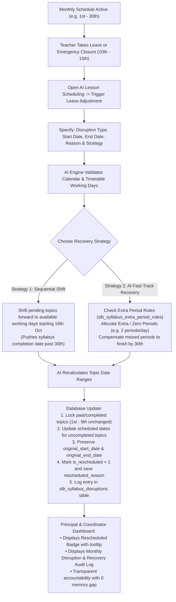
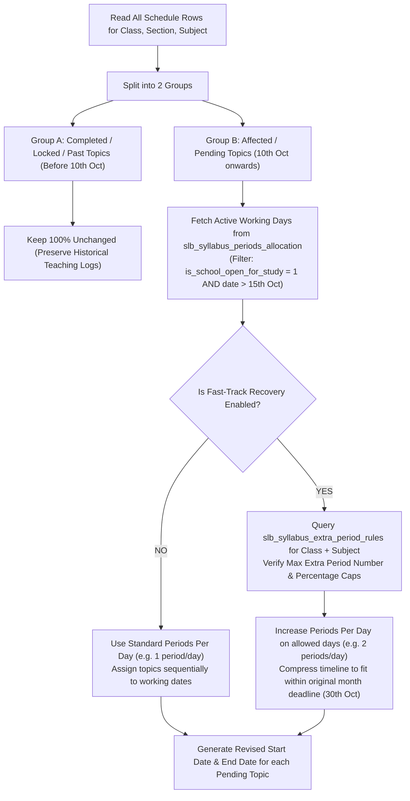

# Syllabus Management: Teacher Leave, Emergency Disruption & AI Re-Scheduling Architecture

**Document Version:** 2.0 (Logic, DDL & Workflow Blueprint)  
**Target Path:** `/home/shail/AntiGravityBrain/SYLLABUS_TEACHER_LEAVE_EMERGENCY_AI_RESCHEDULING_SPEC.md`  
**Date:** September 21, 2026  

---

## 1. Problem Scenario & Objectives

### The Operational Scenario
- A school plans and schedules subject topics for a whole month (e.g., **October 1st to October 30th**).
- On **October 10th to 15th** (6 days / ~6-8 teaching periods), an unexpected disruption occurs:
  - The assigned teacher goes on medical/emergency leave.
  - Or an unscheduled school emergency/holiday closure takes place.
- Topics planned for October 10th-15th cannot be taught during those dates.

### The Problem at Month-End
1. **Incomplete Syllabus Flagged**: At month-end review, the Principal / Academic Coordinator sees overdue topics.
2. **Memory Gap**: Neither the teacher nor the coordinator remembers the exact leave dates or reasons from weeks earlier.
3. **No Automatic Recovery Plan**: No system calculated how to catch up on lost periods before term or month end.

### Objectives
1. **Document Every Disruption**: Capture leave dates, disruption type, and exact reasons.
2. **AI-Driven Smart Re-scheduling**: Automatically shift only uncompleted topics across actual working days.
3. **Recovery via Extra Period Rules**: Compress and catch up on lost periods using `slb_syllabus_extra_period_rules`.
4. **Zero-Guesswork Principal Reporting**: Maintain baseline dates and display the exact disruption reason and recovery actions taken.

---

## 2. Process Flowcharts

### 2.1 End-to-End Disruption & Recovery Lifecycle



---

### 2.2 AI Re-Scheduling Decision Engine Logic



---

## 3. DDL & Database Schema Changes

### 3.1 Enhancements to `slb_syllabus_schedule`

These columns preserve the original baseline schedule before any disruption, store the reschedule flag, and track the reason:

```sql
ALTER TABLE `slb_syllabus_schedule`
  ADD COLUMN `original_start_date` DATE NULL AFTER `scheduled_end_date`,
  ADD COLUMN `original_end_date` DATE NULL AFTER `original_start_date`,
  ADD COLUMN `is_rescheduled` TINYINT(1) NOT NULL DEFAULT 0 AFTER `is_completed`,
  ADD COLUMN `rescheduled_reason` VARCHAR(255) NULL AFTER `is_rescheduled`,
  ADD COLUMN `rescheduled_at` TIMESTAMP NULL DEFAULT NULL AFTER `rescheduled_reason`,
  ADD COLUMN `rescheduled_by` INT UNSIGNED NULL AFTER `rescheduled_at`,
  ADD COLUMN `extra_periods_used` SMALLINT UNSIGNED NOT NULL DEFAULT 0 AFTER `planned_periods`,
  ADD KEY `idx_sylsched_rescheduled` (`is_rescheduled`),
  ADD CONSTRAINT `fk_sylsched_rescheduled_by` FOREIGN KEY (`rescheduled_by`) REFERENCES `users` (`id`) ON DELETE SET NULL;
```

#### Column Purpose:
- `original_start_date`: The very first scheduled start date before any leave or disruption occurred.
- `original_end_date`: The very first scheduled end date before any leave or disruption occurred.
- `is_rescheduled`: Boolean flag (1/0) enabling instant filtering of delayed/shifted topics.
- `rescheduled_reason`: Text description of the cause (e.g., *"Teacher Medical Leave (10-15 Oct)"*).
- `rescheduled_at` & `rescheduled_by`: Audit timestamps and user tracking.
- `extra_periods_used`: Total extra revision/remedial periods injected into this topic to make up for lost time.

---

### 3.2 New Table: `slb_syllabus_disruptions`

A central master log capturing every leave, closure, or event that disrupted the academic syllabus schedule:

```sql
CREATE TABLE IF NOT EXISTS `slb_syllabus_disruptions` (
  `id`                      INT UNSIGNED NOT NULL AUTO_INCREMENT,
  `academic_session_id`     INT UNSIGNED NOT NULL,
  `class_id`                INT UNSIGNED NOT NULL,
  `section_id`              INT UNSIGNED DEFAULT NULL,
  `subject_id`              INT UNSIGNED NOT NULL,
  `teacher_id`              INT UNSIGNED NOT NULL,
  `disruption_type`         ENUM('TEACHER_LEAVE', 'EMERGENCY_CLOSURE', 'WEATHER_HOLIDAY', 'SCHOOL_EVENT', 'EXAM_PREP', 'OTHER') NOT NULL DEFAULT 'TEACHER_LEAVE',
  `start_date`              DATE NOT NULL,
  `end_date`                DATE NOT NULL,
  `periods_impacted`        SMALLINT UNSIGNED NOT NULL DEFAULT 0,
  `reason`                  VARCHAR(255) NOT NULL,
  `recovery_action`         ENUM('SHIFT_DATES', 'EXTRA_PERIODS', 'SUBSTITUTE_TEACHER', 'SPLIT_PERIODS', 'CANCELLED') NOT NULL DEFAULT 'SHIFT_DATES',
  `substitute_teacher_id`   INT UNSIGNED DEFAULT NULL,
  `extra_periods_allocated` SMALLINT UNSIGNED NOT NULL DEFAULT 0,
  `notes`                   VARCHAR(500) DEFAULT NULL,
  `is_resolved`             TINYINT(1) NOT NULL DEFAULT 1,
  `created_by`              INT UNSIGNED DEFAULT NULL,
  `created_at`              TIMESTAMP NULL DEFAULT CURRENT_TIMESTAMP,
  `updated_at`              TIMESTAMP NULL DEFAULT CURRENT_TIMESTAMP ON UPDATE CURRENT_TIMESTAMP,
  PRIMARY KEY (`id`),
  KEY `idx_syl_disrupt_session_class` (`academic_session_id`, `class_id`, `subject_id`),
  KEY `idx_syl_disrupt_dates` (`start_date`, `end_date`),
  CONSTRAINT `fk_syldisrupt_session` FOREIGN KEY (`academic_session_id`) REFERENCES `sch_org_academic_sessions_jnt` (`id`) ON DELETE CASCADE,
  CONSTRAINT `fk_syldisrupt_class` FOREIGN KEY (`class_id`) REFERENCES `sch_classes` (`id`) ON DELETE CASCADE,
  CONSTRAINT `fk_syldisrupt_section` FOREIGN KEY (`section_id`) REFERENCES `sch_sections` (`id`) ON DELETE CASCADE,
  CONSTRAINT `fk_syldisrupt_subject` FOREIGN KEY (`subject_id`) REFERENCES `sch_subjects` (`id`) ON DELETE CASCADE,
  CONSTRAINT `fk_syldisrupt_teacher` FOREIGN KEY (`teacher_id`) REFERENCES `sch_employees` (`id`) ON DELETE RESTRICT,
  CONSTRAINT `fk_syldisrupt_substitute` FOREIGN KEY (`substitute_teacher_id`) REFERENCES `sch_employees` (`id`) ON DELETE SET NULL,
  CONSTRAINT `fk_syldisrupt_user` FOREIGN KEY (`created_by`) REFERENCES `users` (`id`) ON DELETE SET NULL
) ENGINE=InnoDB DEFAULT CHARSET=utf8mb4 COLLATE=utf8mb4_unicode_ci;
```

---

## 4. Business Logic & Step-by-Step Execution Rules

### Step 1: Disruption Detection & Parameter Capture
When a leave occurs, the system captures:
- `academic_session_id`, `class_id`, `section_id`, `subject_id`, `teacher_id`.
- `start_date` & `end_date` (e.g., Oct 10 to Oct 15).
- `disruption_type` (*TEACHER_LEAVE*, *EMERGENCY_CLOSURE*, etc.).
- `reason` (*"Teacher on Medical Leave / Hospitalization"*).
- `recovery_strategy` (*SHIFT_DATES* vs *EXTRA_PERIODS*).

---

### Step 2: Immutability of Past & Completed Records
- **Rule**: Any schedule record with `is_completed = 1` OR `is_locked = 1` OR `scheduled_end_date < disruption.start_date` is **strictly immutable**.
- This guarantees that past teaching history is never overwritten or distorted.

---

### Step 3: Calendar & Working Day Validation
- When recalculating dates for remaining topics, the engine must never simply do `+1 day`.
- **Rule**: Query `slb_syllabus_periods_allocation` where:
  - `academic_session_id = current_session`
  - `class_id = current_class`
  - `subject_id = current_subject`
  - `is_school_open_for_study = 1` (excludes Sundays and declared holidays)
  - `date NOT BETWEEN disruption.start_date AND disruption.end_date` (excludes leave dates)
  - `tot_periods_in_day > 0`
- Only these validated teaching calendar dates are used as slots for scheduling.

---

### Step 4: Baseline Preservation Rule
- **Rule**: Before updating `scheduled_start_date` and `scheduled_end_date`:
  - If `original_start_date` is `NULL`, set `original_start_date = current scheduled_start_date`.
  - If `original_end_date` is `NULL`, set `original_end_date = current scheduled_end_date`.
- This ensures the school retains permanent proof of the initial target dates.

---

### Step 5: Extra Period Compensation Logic (Fast-Track Mode)
If the teacher chooses **Fast-Track Recovery**:
1. Check `slb_syllabus_extra_period_rules` for maximum allowed extra periods (`max_extra_period_allowed_number` or `max_extra_period_allowed_percetage`).
2. Calculate missed periods: e.g., 6 leave days = 6 periods missed.
3. Distribute extra periods onto upcoming available working days (e.g., teaching 2 periods/day on selected days).
4. Compress topic duration windows so all topics finish on or before the original month deadline (**October 30th**).
5. Update `extra_periods_used` on the accelerated topics.

---

### Step 6: Principal & Management Audit Rules
When the Principal or Academic Coordinator views the Syllabus Status / Reports:
1. **Highlight Rescheduled Topics**: Any topic with `is_rescheduled = 1` displays a badge with tooltip showing:
   - Original Baseline Target (`original_start_date` - `original_end_date`).
   - Current Adjusted Target (`scheduled_start_date` - `scheduled_end_date`).
   - Disruption Reason (`rescheduled_reason`).
2. **Disruption Audit Summary Card**: Shows a complete breakdown of all leaves in that month:
   - Total leave days.
   - Periods impacted vs Extra periods compensated.
   - Net variance (e.g., *0 days delay - Fully compensated on schedule*).

---

## 5. Summary of System Logic Matrix

| Action / Event | Affected Table | Logic Executed | Result for User / Principal |
|---|---|---|---|
| **Leave Occurs (10-15 Oct)** | `slb_syllabus_disruptions` | Insert disruption record with reason and date range. | Logged in school audit trail. |
| **Recalculate Dates** | `slb_syllabus_schedule` | Filter working days > 15 Oct, skip holidays/Sundays. | Topics moved to valid teaching days. |
| **Preserve Baseline** | `slb_syllabus_schedule` | Copy initial dates to `original_start_date` & `original_end_date`. | Baseline proof preserved forever. |
| **Apply Extra Periods** | `slb_syllabus_schedule` & `slb_syllabus_extra_period_rules` | Add 1 extra period/day on permitted days within hard caps. | Syllabus finishes by 30th Oct without term overrun. |
| **Month-End Review** | Syllabus Reports / Dashboard | Read `slb_syllabus_disruptions` and `is_rescheduled`. | Principal instantly sees why delay happened and how it was resolved. |
