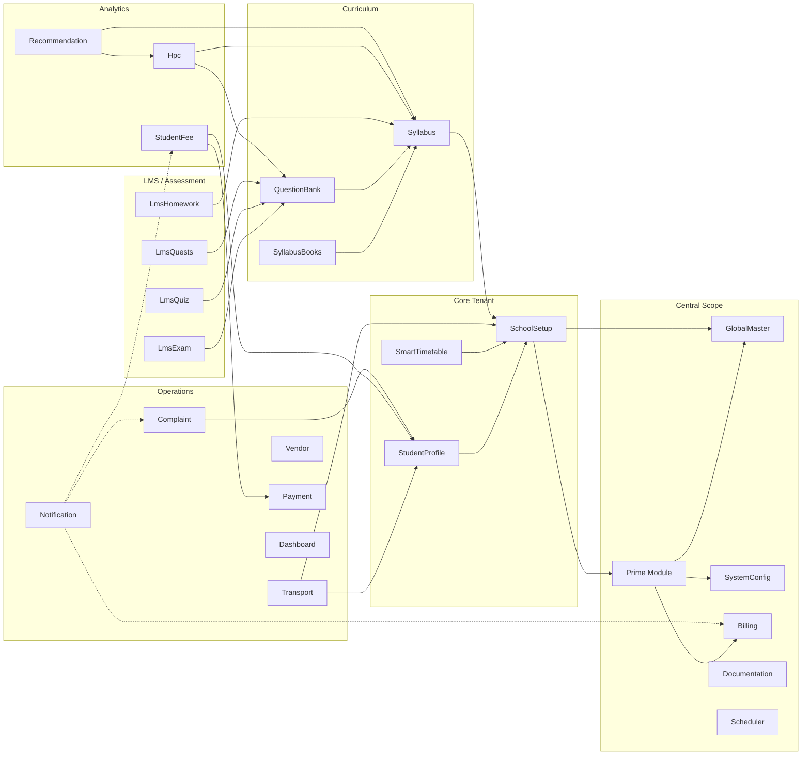
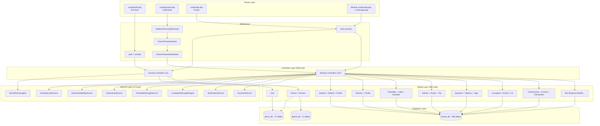
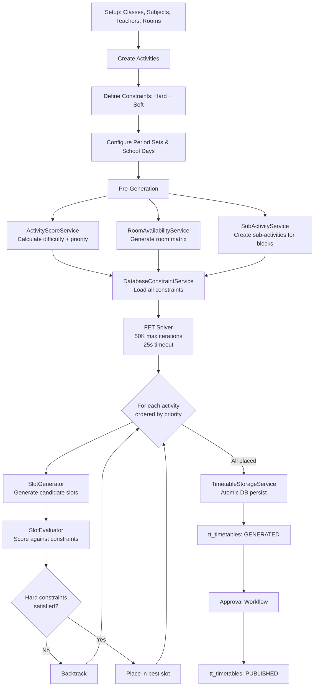
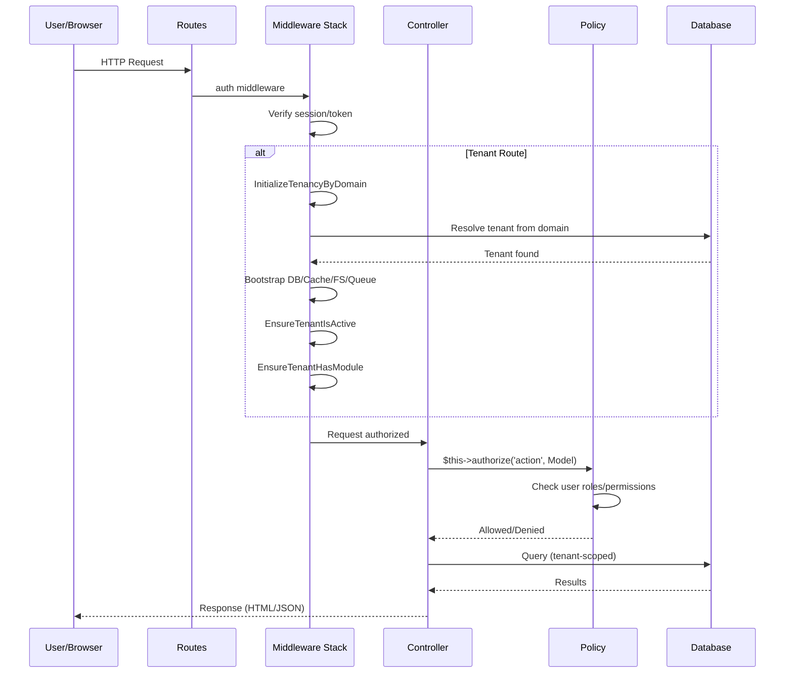
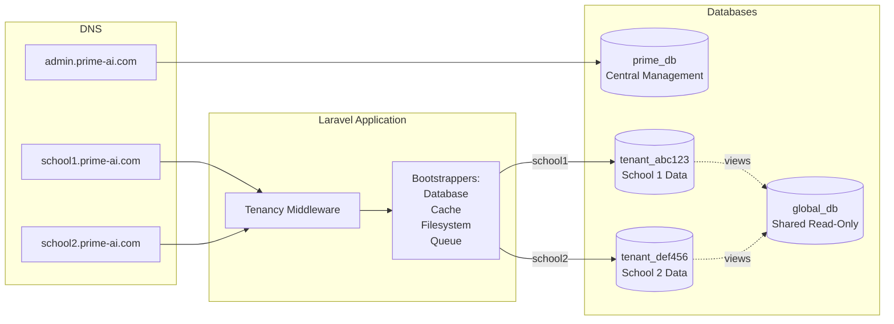
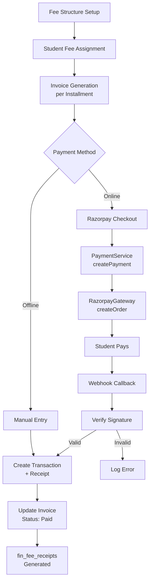

# 12 — System Diagrams

## 1. System Architecture Diagram

```mermaid
graph TB
    subgraph "Client Layer"
        WEB[Web Browser]
        API_CLIENT[API Client / Mobile]
    end

    subgraph "Application Layer"
        NGINX[Nginx / Apache]
        LARAVEL[Laravel 12.0]

        subgraph "Middleware Stack"
            AUTH[auth / verified]
            SANCTUM[auth:sanctum]
            TENANT_MW[InitializeTenancyByDomain]
            ACTIVE_MW[EnsureTenantIsActive]
            MODULE_MW[EnsureTenantHasModule]
        end

        subgraph "Core Application"
            PROVIDERS[Service Providers x5]
            POLICIES[Policies x195+]
            HELPERS[Helpers x3]
            MIDDLEWARE[Middleware x3]
        end

        subgraph "29 Feature Modules"
            CENTRAL_MOD[Central: Prime, GlobalMaster, SystemConfig, Billing]
            TENANT_MOD[Tenant: SchoolSetup, StudentProfile, SmartTimetable, Transport, Syllabus, QuestionBank, Notification, Complaint, Vendor, Payment, StudentFee, LmsExam, LmsQuiz, LmsHomework, LmsQuests, Hpc, Recommendation, Dashboard, Scheduler, Documentation, SyllabusBooks, StudentPortal, Library]
        end
    end

    subgraph "Data Layer"
        GLOBAL_DB[(global_db\n12 tables)]
        PRIME_DB[(prime_db\n27 tables)]
        TENANT_DB[(tenant_{uuid}\n368 tables)]
    end

    subgraph "External Services"
        RAZORPAY[Razorpay API]
        SMTP[SMTP / SES]
        STORAGE[File Storage]
    end

    WEB --> NGINX
    API_CLIENT --> NGINX
    NGINX --> LARAVEL
    LARAVEL --> AUTH
    AUTH --> SANCTUM
    AUTH --> TENANT_MW
    TENANT_MW --> ACTIVE_MW
    ACTIVE_MW --> MODULE_MW
    MODULE_MW --> CENTRAL_MOD
    MODULE_MW --> TENANT_MOD
    CENTRAL_MOD --> GLOBAL_DB
    CENTRAL_MOD --> PRIME_DB
    TENANT_MOD --> TENANT_DB
    TENANT_MOD --> GLOBAL_DB
    TENANT_MOD --> RAZORPAY
    TENANT_MOD --> SMTP
    TENANT_MOD --> STORAGE
```

---

## 2. Module Dependency Diagram



---

## 3. Route → Controller → Model Flow Diagram



---

## 4. Database Relationship Diagram (ERD) — Core Entities

```mermaid
erDiagram
    %% Central
    prm_tenant ||--o{ prm_tenant_domains : "has domains"
    prm_tenant ||--o{ prm_tenant_plan_jnt : "has plans"
    prm_plans ||--o{ prm_tenant_plan_jnt : "assigned to"
    prm_tenant_plan_jnt ||--o{ prm_tenant_plan_module_jnt : "includes modules"
    prm_tenant_plan_jnt ||--o{ bil_tenant_invoices : "generates"

    %% School Setup
    sch_organizations ||--o{ sch_classes : "has"
    sch_organizations ||--o{ sch_sections : "has"
    sch_organizations ||--o{ sch_buildings : "has"
    sch_classes ||--o{ sch_class_section_jnt : "mapped to"
    sch_sections ||--o{ sch_class_section_jnt : "mapped to"
    sch_buildings ||--o{ sch_rooms : "contains"
    sch_subjects ||--o{ sch_subject_teachers : "taught by"
    sch_teachers ||--o{ sch_subject_teachers : "teaches"
    sys_users ||--o| sch_teachers : "is a"
    sys_users ||--o| sch_employees : "is a"

    %% Students
    sys_users ||--o| std_students : "is a"
    std_students ||--|| std_student_details : "has"
    std_students ||--o| std_student_profiles : "has"
    std_students ||--o{ std_student_academic_session : "enrolled in"
    sch_class_section_jnt ||--o{ std_student_academic_session : "contains"
    std_students ||--o{ std_student_guardian_jnt : "has guardians"
    std_guardians ||--o{ std_student_guardian_jnt : "guardian of"
    std_students ||--o{ std_attendance_details : "attendance"

    %% Timetable
    tt_timetables ||--o{ tt_timetable_cells : "contains"
    tt_timetable_cells ||--o{ tt_timetable_cell_teachers : "assigned"
    tt_activities ||--o{ tt_timetable_cells : "placed in"
    tt_activities ||--o{ tt_activity_teachers : "taught by"
    tt_activities ||--o{ tt_sub_activities : "has parts"
    tt_constraints ||--o{ tt_constraint_violations : "violated in"
    tt_timetables ||--o{ tt_generation_runs : "generated by"

    %% Finance
    fin_fee_structure_masters ||--o{ fin_fee_structure_details : "has heads"
    fin_fee_structure_masters ||--o{ fin_fee_installments : "split into"
    fin_fee_head_masters ||--o{ fin_fee_structure_details : "referenced"
    fin_fee_group_masters ||--o{ fin_fee_group_heads_jnt : "contains"
    std_students ||--o{ fin_fee_student_assignments : "assigned"
    std_students ||--o{ fin_fee_invoices : "invoiced"
    fin_fee_invoices ||--o{ fin_fee_transactions : "paid via"
    fin_fee_transactions ||--o{ fin_fee_transaction_details : "details"

    %% Transport
    tpt_vehicle ||--o{ tpt_driver_route_vehicle_jnt : "assigned"
    tpt_routes ||--o{ tpt_driver_route_vehicle_jnt : "served by"
    tpt_routes ||--o{ tpt_pickup_points : "has stops"
    tpt_trips ||--o{ tpt_student_boarding_logs : "tracks"
    tpt_vehicle ||--o{ tpt_daily_vehicle_inspections : "inspected"

    %% Curriculum
    slb_lessons ||--o{ slb_topics : "contains"
    slb_topics ||--o{ slb_topic_competencies : "mapped to"
    slb_competencies ||--o{ slb_topic_competencies : "linked"

    %% Questions & Assessment
    qns_questions_bank ||--o{ qns_question_options : "has options"
    qns_questions_bank ||--o{ qns_question_question_tag_jnt : "tagged"
    lms_exams ||--o{ lms_exam_papers : "has papers"
    lms_exam_papers ||--o{ lms_exam_paper_sets : "has sets"
    lms_quizzes ||--o{ lms_quiz_questions : "contains"

    %% Complaints
    cmp_complaints ||--o{ cmp_complaint_actions : "has actions"
    cmp_complaints ||--o| cmp_ai_insights : "analyzed by AI"
    cmp_complaint_categories ||--o{ cmp_complaints : "categorized"
```



---

## 5. Timetable Generation Flow Diagram



---

## 6. Authentication & Authorization Flow



---

## 7. Multi-Tenancy Data Flow



---

## 8. Fee Payment Workflow


