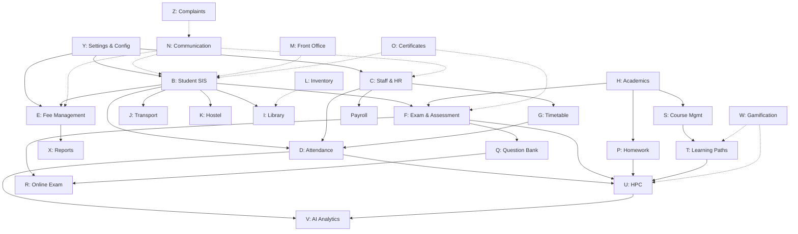

# PRIME-AI — Complete Platform Specification v2.0

> **Academic Intelligence Platform | ERP + LMS + LXP + AI Analytics**
> **Document Version:** 2.0 | **Date:** March 2026
> **Organization:** PrimeGurukul | **Classification:** Confidential
> **Purpose:** Single source of truth for Claude Agent (VS Code) to generate all downstream artifacts

---

## How to Use This Document

This specification is designed as the **primary input** for Claude Agent in VS Code. Feed this entire file to Claude and it will have sufficient context to generate:

1. **Software Requirements Specification (SRS)** — functional & non-functional requirements per module
2. **Detailed Development Plan** — module-by-module build sequence with timelines
3. **Database Schema (DDL)** — complete ERD, migrations, seeders, factories per module
4. **API Specifications** — OpenAPI 3.0 YAML for every endpoint
5. **Test Cases** — Functional, Browser (Dusk), Feature, Unit test suites
6. **Laravel Code** — Models, Controllers, Services, FormRequests, Policies, Events, Jobs
7. **Screen Designs** — Blade + Livewire + Alpine.js templates for every UI screen
8. **Report Designs** — PDF, Excel, Chart.js report specifications
9. **Dashboard Designs** — Role-based widget layouts with data sources
10. **Deployment Plan** — Docker, CI/CD, staging, production, rollback procedures

### Claude Agent Instructions

When generating artifacts from this spec:

- **For SRS:** Read sections 1, 8, and the target module in section 9. Generate functional requirements (FR-{MODULE}-NNN), non-functional requirements, user stories per role, and acceptance criteria.
- **For DB Schema:** Read sections 4, 9 (target module). Generate Mermaid ERD, Laravel migration files, seeders with Indian data (en_IN locale), and factories.
- **For API Design:** Read sections 5, 7, 9 (target module). Generate OpenAPI 3.0 YAML with request/response schemas, validation rules, and example payloads.
- **For Laravel Code:** Read section 5 (coding standards), then module ERD + API spec. Generate Models, Controllers, Services, FormRequests, Policies, Events, Jobs.
- **For Test Cases:** Read section 18, then module business rules + code. Generate Unit (PHPUnit), Feature (HTTP), Browser (Dusk), and Functional test classes.
- **For Screen Designs:** Read section 17, then module screen specs. Generate Blade + Livewire + Alpine.js components.
- **For Reports:** Read section 12, then module report specs. Generate DomPDF/Excel templates.
- **For Dashboards:** Read section 11 for widget specs per role. Generate Livewire dashboard components.
- **For Deployment:** Read section 19. Generate Docker configs, GitHub Actions workflows, deployment scripts.

### Reading Conventions

| Symbol | Meaning |
|--------|---------|
| ✅ | Developed / Complete |
| 🔄 | In Progress / Partially Done |
| ⬜ | Not Started |
| 📐 | Proposed / Inferred (not in original RBS) |
| 🔑 | Critical / Must-Have |
| ⚠️ | Important constraint or caveat |

### Output File Naming Convention

When Claude generates artifacts, use these naming patterns:

| Artifact | Filename Pattern | Example |
|----------|-----------------|---------|
| SRS | `{MODULE_CODE}_{ModuleName}_SRS.md` | `B_StudentSIS_SRS.md` |
| ERD | `{MODULE_CODE}_{ModuleName}_ERD.md` | `E_FeeManagement_ERD.md` |
| API Spec | `{MODULE_CODE}_{ModuleName}_API.yaml` | `D_Attendance_API.yaml` |
| Migration | `{date}_create_{prefix}{table}_table.php` | `2026_04_01_create_stu_students_table.php` |
| Model | `{ModelName}.php` | `Student.php` |
| Controller | `{Model}Controller.php` | `StudentController.php` |
| Service | `{Model}Service.php` | `StudentService.php` |
| FormRequest | `{Action}{Model}Request.php` | `StoreStudentRequest.php` |
| Unit Test | `{Model}ServiceTest.php` | `StudentServiceTest.php` |
| Feature Test | `{Model}ApiTest.php` | `StudentApiTest.php` |
| Browser Test | `{Module}BrowserTest.php` | `StudentBrowserTest.php` |
| Report | `{ReportName}Report.php` | `FeeCollectionReport.php` |
| Requirement | `{MODULE_CODE}_{ModuleName}_Requirement.md` | `STU_Student_Requirement.md` |
| Development Plan | `{MODULE_CODE}_{ModuleName}_DevPlan.md` | `FEE_Fee_DevPlan.md` |

---

## Table of Contents

1. [Project Overview & Vision](#1-project-overview--vision)
2. [Technology Stack & Architecture](#2-technology-stack--architecture)
3. [Multi-Tenancy Architecture](#3-multi-tenancy-architecture)
4. [Database Design Standards](#4-database-design-standards)
5. [Coding Standards & Conventions](#5-coding-standards--conventions)
6. [Authentication & Authorization](#6-authentication--authorization)
7. [API Design Standards](#7-api-design-standards)
8. [Module Registry & Dependencies](#8-module-registry--dependencies)
9. [Module Specifications (All Modules A–Z)](#9-module-specifications)
10. [Cross-Module Integration Points](#10-cross-module-integration-points)
11. [Dashboard Specifications (All Roles)](#11-dashboard-specifications)
12. [Report Specifications](#12-report-specifications)
13. [Notification Architecture](#13-notification-architecture)
14. [AI/ML Capabilities](#14-aiml-capabilities)
15. [NEP 2020 & Indian Education Compliance](#15-nep-2020--indian-education-compliance)
16. [Third-Party Integrations](#16-third-party-integrations)
17. [UI/UX Design System](#17-uiux-design-system)
18. [Testing Strategy](#18-testing-strategy)
19. [Deployment & DevOps](#19-deployment--devops)
20. [Performance & Scalability](#20-performance--scalability)
21. [Security Requirements](#21-security-requirements)
22. [Data Migration & Onboarding](#22-data-migration--onboarding)
23. [Mobile Application](#23-mobile-application)
24. [Development Pipeline & Workflow](#24-development-pipeline--workflow)
25. [Appendices](#25-appendices)

---

# 1. Project Overview & Vision

## 1.1 What is Prime-AI?

**Prime-AI** is a multi-tenant SaaS **Academic Intelligence Platform** built for Indian K-12 schools (Class Nursery–12). It integrates three major systems into a unified platform:

| System | Full Form | Purpose |
|--------|-----------|---------|
| **ERP** | Enterprise Resource Planning | School administration — staff, students, fees, transport, vendors, complaints, scheduling, inventory, hostel, library |
| **LMS** | Learning Management System | Teaching & assessment — homework, quizzes, exams, question bank, syllabus mapping, SCORM content |
| **LXP** | Learning Experience Platform | Personalized learning — AI-driven learning paths, skill graphs, gamification, Holistic Progress Card (HPC) |
| **AI/ML** | Artificial Intelligence Layer | Predictive analytics — performance prediction, attendance forecasting, fee default risk, route optimization |

## 1.2 Target Market

- **Geography:** India (primary), South Asia (future)
- **School Types:** Private K-12 schools, CBSE/ICSE/State Board affiliated
- **School Size:** 500–5,000 students per school
- **Chain Schools:** Multi-branch school groups under single management
- **Focus:** Schools seeking NEP 2020 compliance with digital transformation

## 1.3 Key Stakeholders & User Roles

| Role Code | Role Name | Description | Access Level |
|-----------|-----------|-------------|-------------|
| `SUPRADM` | Super Admin (Prime) | PrimeGurukul platform operator | Prime App — full platform control |
| `MGMT` | Management / Trustee | School owner/chairman/director | Tenant App — full school control |
| `PRINCIPAL` | Principal / Head | Academic & administrative head | Tenant App — school-wide read, academic write |
| `VICE_PRINCIPAL` | Vice Principal | Assists principal | Tenant App — delegated academic authority |
| `HOD` | Head of Department | Department-level academic lead | Tenant App — department-scoped |
| `TEACHER` | Teacher / Faculty | Subject teacher / class teacher | Tenant App — own classes, subjects, students |
| `CLASS_TEACHER` | Class Teacher | Homeroom teacher for a section | Tenant App — section-wide access |
| `ACCOUNTANT` | Accountant | Fee & finance management | Tenant App — finance modules |
| `LIBRARIAN` | Librarian | Library operations | Tenant App — library module |
| `TRANSPORT_MGR` | Transport Manager | Fleet & route management | Tenant App — transport module |
| `HOSTEL_WARDEN` | Hostel Warden | Hostel operations | Tenant App — hostel module |
| `RECEPTIONIST` | Receptionist / Front Office | Visitor & inquiry management | Tenant App — front office module |
| `HR_MANAGER` | HR Manager | Staff HR & payroll | Tenant App — HR module |
| `INVENTORY_MGR` | Inventory Manager | Stock & procurement | Tenant App — inventory module |
| `ADMIN` | School Administrator | IT/system admin for the school | Tenant App — configuration, user management |
| `PARENT` | Parent / Guardian | Parent portal access | Tenant App — own children's data only |
| `STUDENT` | Student | Student self-service portal | Tenant App — own data only |
| `EXAMINER` | External Examiner | 📐 External evaluation access | Tenant App — assigned exam papers only |
| `CAFETERIA_MGR` | Cafeteria Manager | 📐 Mess/cafeteria operations | Tenant App — cafeteria module |

## 1.4 Two-Application Architecture

Prime-AI is split into two separate Laravel applications:

| Application | Purpose | URL Pattern | Database |
|------------|---------|-------------|----------|
| **Prime App** | Platform administration by PrimeGurukul (Super Admin) | `app.primegurukul.com` | `prime_db` (global) |
| **Tenant App** | Individual school operations (all school roles) | `{school-slug}.primegurukul.com` | `tenant_{id}_db` (isolated per school) |

### Prime App Modules (Platform-Level)

| Code | Module | Purpose |
|------|--------|---------|
| `PA` | Dashboard & Analytics | Platform-wide metrics, tenant health, revenue |
| `PB` | Tenant Management | Create, configure, suspend, delete tenants |
| `PC` | Plan & Subscription | Pricing plans, feature flags, billing cycles |
| `PD` | Billing & Invoicing | Invoice generation, payment tracking, Razorpay |
| `PE` | Support & Ticketing | Tenant support requests, SLA tracking |
| `PF` | Content Management | Shared content library, SCORM packages, templates |
| `PG` | System Configuration | Global settings, email/SMS providers, API keys |
| `PH` | User & Access Management | Platform-level users, roles, permissions |
| `PI` | Reports & Analytics | Cross-tenant aggregates, revenue reports |
| `PJ` | Communication | Platform announcements, newsletters, broadcasts |
| `PK` | Audit & Compliance | Platform audit logs, data compliance, GDPR tools |

### Tenant App Modules (School-Level)

| Code | Module | Purpose |
|------|--------|---------|
| `A` | Dashboard | Role-based school dashboard with widgets |
| `B` | Student Information System (SIS) | Student profiles, enrollment, promotion |
| `C` | Staff & HR Management | Staff profiles, attendance, leave, payroll |
| `D` | Attendance Management | Student & staff attendance (manual, biometric, QR) |
| `E` | Fee Management | Fee structure, collection, concessions, receipts |
| `F` | Examination & Assessment | Exam scheduling, marks entry, report cards |
| `G` | Timetable & Scheduling | Auto-generation, substitution, resource allocation |
| `H` | Academics & Curriculum | Syllabus mapping, lesson plans, Bloom's taxonomy |
| `I` | Library Management | Book catalog, issue/return, fines, digital library |
| `J` | Transport Management | Routes, stops, vehicle tracking, fee mapping |
| `K` | Hostel Management | Room allocation, mess, attendance, complaints |
| `L` | Inventory & Assets | Stock management, procurement, vendor management |
| `M` | Front Office & Reception | Visitor log, enquiries, appointments, gate pass |
| `N` | Communication & Notifications | SMS, email, push, in-app, announcements |
| `O` | Certificates & Documents | TC, Character cert, Bonafide, custom templates |
| `P` | Homework & Assignments (LMS) | Assignment creation, submission, grading |
| `Q` | Question Bank & Quiz (LMS) | MCQ bank, auto-paper, Bloom's tagging, SCORM |
| `R` | Online Examination (LMS) | Proctored exams, auto-evaluation, result analysis |
| `S` | Content & Course Management (LMS) | Course builder, video, SCORM player, progress |
| `T` | Learning Paths (LXP) | Personalized adaptive paths, skill prerequisites |
| `U` | Holistic Progress Card (LXP) | Multi-dimensional student profiling (NEP 2020) |
| `V` | AI Analytics & Predictions (ML) | Performance forecasting, risk scores, NLP feedback |
| `W` | Gamification & Engagement (LXP) | Points, badges, leaderboards, streaks |
| `X` | Reports & Analytics | School-wide reporting, custom report builder |
| `Y` | Settings & Configuration | School profile, academic sessions, master data |
| `Z` | Complaint & Grievance | Online complaints, escalation, resolution tracking |

## 1.5 Platform Vision Statement

Prime-AI aims to become India's most intelligent school management platform by combining operational efficiency (ERP), pedagogical excellence (LMS), personalized learning (LXP), and data-driven decision making (AI/ML) — all aligned with NEP 2020's vision of holistic, competency-based education.


---

# 2. Technology Stack & Architecture

## 2.1 Core Technology Stack

| Layer | Technology | Version | Purpose |
|-------|-----------|---------|---------|
| **Language** | PHP | 8.2+ | Server-side logic |
| **Framework** | Laravel | 11.x | MVC framework, Eloquent ORM, Artisan CLI |
| **Database** | MySQL | 8.0+ | Relational data storage (multi-tenant) |
| **Cache** | Redis | 7.x | Session, cache, queue broker |
| **Search** | Laravel Scout + Meilisearch | Latest | Full-text search across modules |
| **Queue** | Laravel Queue (Redis driver) | — | Background jobs, notifications, reports |
| **Frontend** | Blade + Livewire 3 + Alpine.js 3 | Latest | Server-rendered with reactive components |
| **CSS** | Tailwind CSS | 3.x | Utility-first styling |
| **Charts** | Chart.js / ApexCharts | Latest | Dashboard & report visualizations |
| **PDF** | DomPDF + Snappy (wkhtmltopdf) | Latest | Report cards, receipts, certificates |
| **Excel** | Laravel Excel (Maatwebsite) | 3.x | Export/import spreadsheets |
| **Auth** | Laravel Sanctum | Latest | API token + SPA session auth |
| **Permissions** | Spatie Laravel Permission | Latest | Role-based access control (RBAC) |
| **Media** | Spatie Media Library | Latest | File uploads, image optimization |
| **Audit** | Spatie Activity Log | Latest | Model change tracking |
| **WebSocket** | Laravel Reverb / Pusher | Latest | Real-time notifications, live updates |
| **SMS** | MSG91 / Twilio API | — | OTP, alerts, bulk SMS |
| **Email** | SMTP (Mailtrap/SES) | — | Transactional & bulk email |
| **Payment** | Razorpay | Latest | Fee collection, subscriptions |
| **AI/ML** | Python microservices (Flask/FastAPI) | 3.11+ | Prediction models, NLP, recommendations |
| **Container** | Docker + Docker Compose | Latest | Development & production containers |
| **CI/CD** | GitHub Actions | — | Automated testing, linting, deployment |
| **Server** | Ubuntu 22.04 LTS (VPS/Cloud) | — | Production hosting |
| **Web Server** | Nginx + PHP-FPM | Latest | Reverse proxy, SSL termination |
| **Monitoring** | Laravel Telescope + Sentry | Latest | Error tracking, performance monitoring |

## 2.2 High-Level Architecture Diagram

```
┌─────────────────────────────────────────────────────────────────────────┐
│                         PRIME-AI PLATFORM                               │
├────────────────────────────┬────────────────────────────────────────────┤
│    PRIME APP (Super Admin) │         TENANT APP (Schools)               │
│    app.primegurukul.com    │    {slug}.primegurukul.com                 │
├────────────────────────────┴────────────────────────────────────────────┤
│                                                                         │
│  ┌──────────┐  ┌──────────┐  ┌──────────┐  ┌──────────┐  ┌──────────┐ │
│  │  Blade   │  │ Livewire │  │ Alpine.js│  │ Chart.js │  │Tailwind  │ │
│  │Templates │  │Components│  │  Reactive│  │  Charts  │  │  CSS     │ │
│  └────┬─────┘  └────┬─────┘  └────┬─────┘  └────┬─────┘  └──────────┘ │
│       └──────────────┴──────────────┴──────────────┘                    │
│                              │                                          │
│  ┌───────────────────────────┴──────────────────────────────────────┐   │
│  │                    LARAVEL APPLICATION LAYER                      │   │
│  │  ┌──────────┐ ┌──────────┐ ┌──────────┐ ┌──────────┐            │   │
│  │  │Controllers│ │ Services │ │  Models  │ │ Policies │            │   │
│  │  └──────────┘ └──────────┘ └──────────┘ └──────────┘            │   │
│  │  ┌──────────┐ ┌──────────┐ ┌──────────┐ ┌──────────┐            │   │
│  │  │FormRequest│ │Resources │ │  Events  │ │   Jobs   │            │   │
│  │  └──────────┘ └──────────┘ └──────────┘ └──────────┘            │   │
│  │  ┌──────────┐ ┌──────────┐ ┌──────────┐                         │   │
│  │  │Middleware │ │  Traits  │ │  Enums   │                         │   │
│  │  └──────────┘ └──────────┘ └──────────┘                         │   │
│  └──────────────────────────────────────────────────────────────────┘   │
│                              │                                          │
│  ┌───────────────────────────┴──────────────────────────────────────┐   │
│  │                      MIDDLEWARE STACK                             │   │
│  │  TenantResolver → AuthSanctum → RoleGate → AuditLog → RateLimit │   │
│  └──────────────────────────────────────────────────────────────────┘   │
│                              │                                          │
│  ┌──────────────┬────────────┴─────┬───────────────┬────────────────┐  │
│  │  prime_db    │  tenant_1_db     │  tenant_2_db  │  tenant_N_db  │  │
│  │  (Global)    │  (School 1)      │  (School 2)   │  (School N)   │  │
│  │  - tenants   │  - students      │  - students   │  - students   │  │
│  │  - plans     │  - staff         │  - staff      │  - staff      │  │
│  │  - billing   │  - fees          │  - fees       │  - fees       │  │
│  │  - users     │  - attendance    │  - attendance │  - attendance │  │
│  │  - menus     │  - exams         │  - exams      │  - exams      │  │
│  └──────────────┴──────────────────┴───────────────┴────────────────┘  │
│                              │                                          │
│  ┌───────────────────────────┴──────────────────────────────────────┐   │
│  │                    INFRASTRUCTURE LAYER                           │   │
│  │  Redis (Cache/Queue) │ Meilisearch │ S3/MinIO │ AI Microservices │   │
│  └──────────────────────────────────────────────────────────────────┘   │
└─────────────────────────────────────────────────────────────────────────┘
```

## 2.3 Application Directory Structure (Laravel)

```
prime-ai/
├── app/
│   ├── Console/
│   │   └── Kernel.php                    # Scheduled commands
│   ├── Enums/                            # PHP 8.1 Enums
│   │   ├── AttendanceStatus.php
│   │   ├── FeePaymentMode.php
│   │   └── UserRole.php
│   ├── Events/                           # Domain events
│   │   ├── StudentEnrolled.php
│   │   ├── FeePaymentReceived.php
│   │   └── AttendanceMarked.php
│   ├── Exceptions/
│   │   └── Handler.php
│   ├── Http/
│   │   ├── Controllers/
│   │   │   ├── Api/
│   │   │   │   └── V1/                   # Versioned API controllers
│   │   │   │       ├── StudentController.php
│   │   │   │       └── FeeController.php
│   │   │   └── Web/                      # Web controllers (Blade views)
│   │   │       ├── DashboardController.php
│   │   │       └── StudentController.php
│   │   ├── Livewire/                     # Livewire 3 components
│   │   │   ├── Students/
│   │   │   │   ├── StudentList.php
│   │   │   │   ├── StudentForm.php
│   │   │   │   └── StudentDetail.php
│   │   │   └── Dashboard/
│   │   │       ├── StatCard.php
│   │   │       └── AttendanceWidget.php
│   │   ├── Middleware/
│   │   │   ├── TenantResolver.php        # Resolves tenant from subdomain
│   │   │   ├── RoleGate.php              # Permission enforcement
│   │   │   └── AuditLog.php              # Request-level audit logging
│   │   ├── Requests/                     # FormRequest validation
│   │   └── Resources/                    # API Resources (JSON transformers)
│   ├── Jobs/                             # Queued background jobs
│   ├── Listeners/                        # Event listeners
│   ├── Models/                           # Eloquent models
│   │   ├── Traits/
│   │   │   ├── TenantScoped.php          # Automatic tenant_id scoping
│   │   │   ├── HasAuditColumns.php       # created_by, updated_by
│   │   │   └── HasStatusWorkflow.php     # State machine trait
│   │   ├── Student.php
│   │   ├── Staff.php
│   │   └── Tenant.php
│   ├── Notifications/                    # Notification classes
│   ├── Policies/                         # Authorization policies
│   ├── Services/                         # Business logic layer
│   │   ├── BaseService.php
│   │   ├── StudentService.php
│   │   └── FeeService.php
│   └── Traits/                           # Shared traits
├── config/
├── database/
│   ├── migrations/
│   │   ├── prime/                        # prime_db migrations
│   │   └── tenant/                       # tenant_db migrations
│   ├── seeders/
│   └── factories/
├── resources/
│   ├── views/
│   │   ├── layouts/
│   │   │   ├── app.blade.php             # Main tenant layout
│   │   │   ├── prime.blade.php           # Prime admin layout
│   │   │   └── auth.blade.php            # Login/register layout
│   │   ├── components/                   # Reusable Blade components
│   │   ├── livewire/                     # Livewire component views
│   │   └── modules/                      # Module-specific views
│   ├── js/
│   └── css/
├── routes/
│   ├── api.php                           # API routes (versioned)
│   ├── web.php                           # Web routes
│   ├── tenant.php                        # Tenant-specific routes
│   └── prime.php                         # Prime admin routes
├── tests/
│   ├── Unit/
│   ├── Feature/
│   └── Browser/                          # Laravel Dusk
├── docker-compose.yml
├── Dockerfile
└── .github/workflows/                    # CI/CD pipelines
```


---

# 3. Multi-Tenancy Architecture

## 3.1 Database-Per-Tenant Isolation Model

Each school (tenant) gets its own MySQL database. This provides the strongest data isolation and simplifies compliance with Indian data protection regulations.

```
                    ┌──────────────┐
                    │   prime_db   │  ← Platform-level data
                    │              │
                    │  tenants     │  ← Tenant registry
                    │  plans       │  ← Subscription plans
                    │  billing     │  ← Invoices, payments
                    │  global_users│  ← Super admin users
                    │  menus       │  ← Menu definitions
                    │  features    │  ← Feature flag registry
                    └──────────────┘
                           │
           ┌───────────────┼───────────────┐
           │               │               │
    ┌──────┴──────┐ ┌──────┴──────┐ ┌──────┴──────┐
    │tenant_1_db  │ │tenant_2_db  │ │tenant_N_db  │
    │(DPS Noida)  │ │(St. Mary's) │ │(School N)   │
    │             │ │             │ │             │
    │ students    │ │ students    │ │ students    │
    │ staff       │ │ staff       │ │ staff       │
    │ fees        │ │ fees        │ │ fees        │
    │ attendance  │ │ attendance  │ │ attendance  │
    │ ...all mods │ │ ...all mods │ │ ...all mods │
    └─────────────┘ └─────────────┘ └─────────────┘
```

## 3.2 Tenant Resolution Flow

```
Request → Nginx → Laravel
                     │
              ┌──────┴──────┐
              │TenantResolver│  Middleware
              │  Middleware  │
              └──────┬──────┘
                     │
          Extract subdomain from HOST header
          e.g., "dps-noida.primegurukul.com" → "dps-noida"
                     │
          Lookup in prime_db.tenants WHERE slug = 'dps-noida'
                     │
              ┌──────┴──────┐
              │  Found?     │
              └──────┬──────┘
             Yes     │     No → 404 "School not found"
                     │
          Check tenant status (active/suspended/trial)
                     │
          Set DB connection to tenant_{id}_db
          Store tenant in app('current_tenant')
                     │
          Continue to next middleware → Controller
```

## 3.3 Tenant Lifecycle States

```
PENDING → PROVISIONING → TRIAL → ACTIVE → SUSPENDED → TERMINATED
                                    │           │
                                    └───────────┘  (reactivation)
```

| State | Description | Access |
|-------|-------------|--------|
| `PENDING` | Registration submitted, awaiting verification | None |
| `PROVISIONING` | Database being created, seeders running | None |
| `TRIAL` | Free trial period (configurable: 14/30/60 days) | Full access |
| `ACTIVE` | Paid subscription active | Full access per plan |
| `SUSPENDED` | Payment overdue or admin action | Read-only access |
| `TERMINATED` | School removed, data archived | None (data retained 90 days) |

## 3.4 Tenant Provisioning Steps

When a new school is onboarded, the system executes:

1. Create record in `prime_db.tenants` with school details
2. Create MySQL database `tenant_{id}_db`
3. Run all tenant migrations (in dependency order)
4. Seed lookup tables (academic session, attendance statuses, fee heads, etc.)
5. Create default admin user with `ADMIN` role
6. Configure default academic session
7. Apply plan-based feature flags
8. Send welcome email with login credentials
9. Mark tenant status as `TRIAL` or `ACTIVE`

## 3.5 Cross-Tenant Data Rules

| Rule | Description |
|------|-------------|
| **No Cross-Tenant Queries** | Every query MUST be scoped to the current tenant's database. The `TenantScoped` trait enforces this automatically via Eloquent global scope. |
| **No Shared User Accounts** | A user belongs to exactly one tenant. Super Admins are separate in `prime_db`. |
| **No Cross-Tenant Foreign Keys** | Foreign keys never reference another tenant's database. Cross-tenant references use the `prime_db` as an intermediary. |
| **Aggregate Reports** | Only the Super Admin can see cross-tenant aggregates, and only through `prime_db` summary tables (never direct tenant DB queries). |
| **Tenant Data Export** | Each tenant can export their complete data as a ZIP archive (GDPR/data portability compliance). |

## 3.6 TenantScoped Trait Implementation

```php
<?php
// app/Models/Traits/TenantScoped.php

namespace App\Models\Traits;

use Illuminate\Database\Eloquent\Builder;

trait TenantScoped
{
    protected static function bootTenantScoped(): void
    {
        // Auto-apply tenant filter on all queries
        static::addGlobalScope('tenant', function (Builder $builder) {
            if ($tenant = app('current_tenant')) {
                $builder->where('tenant_id', $tenant->id);
            }
        });

        // Auto-set tenant_id on creation
        static::creating(function ($model) {
            if (!$model->tenant_id && $tenant = app('current_tenant')) {
                $model->tenant_id = $tenant->id;
            }
        });
    }
}
```

---

# 4. Database Design Standards

## 4.1 Naming Conventions

| Element | Convention | Example |
|---------|-----------|---------|
| Tables | `snake_case`, plural, prefixed by module code | `stu_students`, `fee_payments` |
| Columns | `snake_case` | `first_name`, `enrollment_date` |
| Primary Key | `id` (auto-increment `BIGINT UNSIGNED`) | `id` |
| Foreign Key | `{referenced_table_singular}_id` | `student_id`, `class_id` |
| Boolean | Prefix with `is_` or `has_` | `is_active`, `has_transport` |
| JSON columns | Suffix with `_json` | `meta_json`, `config_json` |
| Date columns | Suffix with `_date` or `_at` | `enrollment_date`, `paid_at` |
| Enum columns | Use PHP Enum cast | `status` → `StudentStatus::class` |
| Junction tables | Both table names + `_jnt` suffix | `stu_student_subject_jnt` |
| Indexes | `idx_{table}_{columns}` | `idx_stu_students_class_section` |
| Foreign keys | `fk_{table}_{column}_{ref_table}` | `fk_stu_students_class_id_classes` |
| Unique constraints | `unq_{table}_{columns}` | `unq_stu_students_admission_no` |

## 4.2 Table Prefix Registry

| Module Code | Table Prefix | Example Tables |
|------------|-------------|----------------|
| `SYS` | `sys_` | `sys_settings`, `sys_academic_sessions` |
| `USR` | `usr_` | `usr_users`, `usr_roles`, `usr_permissions` |
| `STU` | `stu_` | `stu_students`, `stu_guardians`, `stu_documents` |
| `STF` | `stf_` | `stf_staff`, `stf_qualifications`, `stf_leaves` |
| `ATT` | `att_` | `att_student_attendance`, `att_staff_attendance` |
| `FEE` | `fee_` | `fee_heads`, `fee_structures`, `fee_payments` |
| `EXM` | `exm_` | `exm_exams`, `exm_marks`, `exm_grade_scales` |
| `TBL` | `tbl_` | `tbl_timetables`, `tbl_periods`, `tbl_substitutions` |
| `ACD` | `acd_` | `acd_subjects`, `acd_syllabi`, `acd_lesson_plans` |
| `LIB` | `lib_` | `lib_books`, `lib_issues`, `lib_fines` |
| `TRN` | `trn_` | `trn_routes`, `trn_stops`, `trn_vehicles` |
| `HST` | `hst_` | `hst_rooms`, `hst_allocations`, `hst_mess_menus` |
| `INV` | `inv_` | `inv_items`, `inv_stock_entries`, `inv_purchase_orders` |
| `FRO` | `fro_` | `fro_visitors`, `fro_enquiries`, `fro_appointments` |
| `COM` | `com_` | `com_messages`, `com_announcements`, `com_templates` |
| `CRT` | `crt_` | `crt_templates`, `crt_issued_certificates` |
| `HWK` | `hwk_` | `hwk_assignments`, `hwk_submissions`, `hwk_grades` |
| `QBK` | `qbk_` | `qbk_questions`, `qbk_options`, `qbk_papers` |
| `OEX` | `oex_` | `oex_online_exams`, `oex_attempts`, `oex_proctoring` |
| `CRS` | `crs_` | `crs_courses`, `crs_lessons`, `crs_enrollments` |
| `LPT` | `lpt_` | `lpt_learning_paths`, `lpt_milestones`, `lpt_progress` |
| `HPC` | `hpc_` | `hpc_dimensions`, `hpc_indicators`, `hpc_scores` |
| `ANA` | `ana_` | `ana_predictions`, `ana_risk_scores`, `ana_models` |
| `GMF` | `gmf_` | `gmf_points`, `gmf_badges`, `gmf_leaderboards` |
| `RPT` | `rpt_` | `rpt_report_definitions`, `rpt_generated_reports` |
| `CFG` | `cfg_` | `cfg_school_profile`, `cfg_academic_config` |
| `CMP` | `cmp_` | `cmp_complaints`, `cmp_categories`, `cmp_escalations` |
| `PAY` | `pay_` | `pay_payroll_runs`, `pay_salary_structures`, `pay_slips` |

## 4.3 Universal Columns (Every Tenant Table)

Every table in every tenant database MUST include these columns:

```sql
-- Standard columns (auto-applied by migration template)
id              BIGINT UNSIGNED AUTO_INCREMENT PRIMARY KEY,
tenant_id       BIGINT UNSIGNED NOT NULL,               -- FK to prime_db.tenants
created_by      BIGINT UNSIGNED NULL,                    -- FK to usr_users
updated_by      BIGINT UNSIGNED NULL,                    -- FK to usr_users
created_at      TIMESTAMP NULL DEFAULT NULL,             -- Laravel timestamps
updated_at      TIMESTAMP NULL DEFAULT NULL,             -- Laravel timestamps
deleted_at      TIMESTAMP NULL DEFAULT NULL,             -- Soft deletes (user-facing tables)

-- Indexes
INDEX idx_{table}_tenant_id (tenant_id),
INDEX idx_{table}_created_at (created_at),
```

## 4.4 Academic Session Scoping

Most tenant data is scoped to an academic session. Tables that contain session-specific data MUST include:

```sql
academic_session_id   BIGINT UNSIGNED NOT NULL,          -- FK to sys_academic_sessions
INDEX idx_{table}_session (academic_session_id),
```

## 4.5 Data Type Standards

| Data Type | Usage | MySQL Type |
|-----------|-------|-----------|
| Money/Currency | All amounts in INR | `DECIMAL(12,2)` |
| Percentage | Marks, attendance % | `DECIMAL(5,2)` |
| Phone Number | Indian mobile (+91) | `VARCHAR(15)` |
| Email | All emails | `VARCHAR(191)` |
| PIN Code | Indian postal code | `CHAR(6)` |
| Aadhaar Number | 12-digit ID | `CHAR(12)` ENCRYPTED |
| UDISE Code | School govt. code | `VARCHAR(20)` |
| Admission Number | School-specific | `VARCHAR(30)` UNIQUE per session |
| Blood Group | Student/Staff | ENUM('A+','A-','B+','B-','AB+','AB-','O+','O-') |
| Gender | Student/Staff | ENUM('male','female','other') |

## 4.6 Soft Delete Rules

| Use Soft Deletes | Use Hard Deletes |
|-----------------|-----------------|
| Students, Staff, Parents | System logs, temp records |
| Fee records, Payments | Queue failed jobs |
| Attendance records | Cache records |
| Exam marks, Report cards | OTP records |
| Library issues | Session data |
| All user-facing data | Audit trail entries (never delete) |

## 4.7 Migration Template

Every migration file MUST follow this structure:

```php
<?php
declare(strict_types=1);

use Illuminate\Database\Migrations\Migration;
use Illuminate\Database\Schema\Blueprint;
use Illuminate\Support\Facades\Schema;

return new class extends Migration
{
    public function up(): void
    {
        Schema::create('{prefix}_{table_name}', function (Blueprint $table) {
            $table->id();
            $table->unsignedBigInteger('tenant_id')->index();
            $table->unsignedBigInteger('academic_session_id')->index(); // if session-scoped

            // Module-specific columns here

            $table->unsignedBigInteger('created_by')->nullable();
            $table->unsignedBigInteger('updated_by')->nullable();
            $table->timestamps();
            $table->softDeletes();

            // Indexes
            // Foreign keys
        });
    }

    public function down(): void
    {
        Schema::dropIfExists('{prefix}_{table_name}');
    }
};
```

---

# 5. Coding Standards & Conventions

## 5.1 PHP & Laravel Standards

| Standard | Rule |
|----------|------|
| **PSR** | Follow PSR-12 coding style |
| **PHP Version** | PHP 8.2+ (use typed properties, enums, match expressions, named arguments) |
| **Strict Types** | Every PHP file starts with `declare(strict_types=1);` |
| **Architecture** | Thin Controllers → Fat Services → Eloquent Models |
| **Controller** | Max 5 public methods: `index`, `show`, `store`, `update`, `destroy` |
| **Service Layer** | All business logic lives in Service classes, never in Controllers or Models |
| **FormRequest** | Every store/update action has a dedicated FormRequest class |
| **API Resource** | Every API response uses a JsonResource or ResourceCollection |
| **Policy** | Every model has a Policy class for authorization |
| **Events** | Domain events for significant state changes (StudentEnrolled, FeePaymentReceived) |
| **Transactions** | Multi-step operations wrapped in `DB::transaction()` |
| **No Raw Queries** | Use Eloquent/Query Builder exclusively. Raw SQL only with explicit justification. |

## 5.2 Naming Conventions

| Element | Convention | Example |
|---------|-----------|---------|
| Controller | `{Model}Controller` | `StudentController` |
| Service | `{Model}Service` | `StudentService` |
| FormRequest | `{Action}{Model}Request` | `StoreStudentRequest`, `UpdateStudentRequest` |
| Resource | `{Model}Resource` | `StudentResource` |
| Collection | `{Model}Collection` | `StudentCollection` |
| Policy | `{Model}Policy` | `StudentPolicy` |
| Event | `{PastTenseAction}` | `StudentEnrolled`, `FeePaymentReceived` |
| Listener | `{Action}On{Event}` | `SendWelcomeEmailOnStudentEnrolled` |
| Job | `{Action}{Entity}` | `GenerateReportCard`, `SendBulkSms` |
| Notification | `{Entity}{Action}Notification` | `FeePaymentDueNotification` |
| Migration | `{date}_create_{table}_table` | `2026_01_01_create_stu_students_table` |
| Seeder | `{Module}Seeder` | `StudentSeeder`, `FeeSeeder` |
| Factory | `{Model}Factory` | `StudentFactory` |
| Enum | `{Entity}{Attribute}` | `StudentStatus`, `PaymentMode` |
| Trait | `Has{Capability}` or `{Behavior}Scoped` | `HasAuditColumns`, `TenantScoped` |
| Middleware | `{Action}` | `TenantResolver`, `RoleGate` |

## 5.3 Service Class Template

```php
<?php
declare(strict_types=1);

namespace App\Services;

use App\Models\Student;
use App\Events\StudentEnrolled;
use Illuminate\Support\Facades\DB;
use Illuminate\Pagination\LengthAwarePaginator;

class StudentService extends BaseService
{
    /**
     * List students with filtering, sorting, and pagination.
     *
     * @param array $filters ['class_id', 'section_id', 'status', 'search']
     * @param string $sortBy
     * @param string $sortDir
     * @param int $perPage
     * @return LengthAwarePaginator
     */
    public function list(array $filters = [], string $sortBy = 'name', string $sortDir = 'asc', int $perPage = 25): LengthAwarePaginator
    {
        $query = Student::query()
            ->with(['class', 'section', 'guardian']);

        if (!empty($filters['class_id'])) {
            $query->where('class_id', $filters['class_id']);
        }
        if (!empty($filters['search'])) {
            $query->where(function ($q) use ($filters) {
                $q->where('first_name', 'LIKE', "%{$filters['search']}%")
                  ->orWhere('last_name', 'LIKE', "%{$filters['search']}%")
                  ->orWhere('admission_no', 'LIKE', "%{$filters['search']}%");
            });
        }

        return $query->orderBy($sortBy, $sortDir)->paginate($perPage);
    }

    /**
     * Create a new student enrollment.
     *
     * @throws \Exception
     */
    public function enroll(array $data): Student
    {
        return DB::transaction(function () use ($data) {
            $student = Student::create($data);

            if (!empty($data['guardian'])) {
                $student->guardians()->create($data['guardian']);
            }

            event(new StudentEnrolled($student));

            return $student->load(['class', 'section', 'guardian']);
        });
    }
}
```

## 5.4 Controller Template

```php
<?php
declare(strict_types=1);

namespace App\Http\Controllers\Api\V1;

use App\Http\Controllers\Controller;
use App\Http\Requests\StoreStudentRequest;
use App\Http\Requests\UpdateStudentRequest;
use App\Http\Resources\StudentResource;
use App\Http\Resources\StudentCollection;
use App\Services\StudentService;
use Illuminate\Http\JsonResponse;
use Illuminate\Http\Request;

class StudentController extends Controller
{
    public function __construct(
        private readonly StudentService $studentService
    ) {}

    public function index(Request $request): StudentCollection
    {
        $students = $this->studentService->list(
            filters: $request->only(['class_id', 'section_id', 'status', 'search']),
            sortBy: $request->input('sort_by', 'name'),
            sortDir: $request->input('sort_dir', 'asc'),
            perPage: $request->integer('per_page', 25)
        );
        return new StudentCollection($students);
    }

    public function store(StoreStudentRequest $request): JsonResponse
    {
        $student = $this->studentService->enroll($request->validated());
        return (new StudentResource($student))
            ->response()
            ->setStatusCode(201);
    }

    public function show(Student $student): StudentResource
    {
        return new StudentResource($student->load(['class', 'section', 'guardians', 'documents']));
    }

    public function update(UpdateStudentRequest $request, Student $student): StudentResource
    {
        $student = $this->studentService->update($student, $request->validated());
        return new StudentResource($student);
    }

    public function destroy(Student $student): JsonResponse
    {
        $this->studentService->delete($student);
        return response()->json(['message' => 'Student deleted successfully']);
    }
}
```

## 5.5 Standard API Response Envelope

All API responses follow this format:

```json
{
    "success": true,
    "message": "Students retrieved successfully",
    "data": { ... },
    "meta": {
        "current_page": 1,
        "per_page": 25,
        "total": 150,
        "last_page": 6
    },
    "errors": null
}
```

Error response:
```json
{
    "success": false,
    "message": "Validation failed",
    "data": null,
    "meta": null,
    "errors": {
        "first_name": ["The first name field is required."],
        "class_id": ["The selected class is invalid."]
    }
}
```

## 5.6 Error Code Registry

| Code Range | Category | Examples |
|-----------|----------|---------|
| `E1000–E1999` | Authentication & Authorization | E1001: Invalid credentials, E1002: Token expired, E1003: Insufficient permissions |
| `E2000–E2999` | Validation | E2001: Required field missing, E2002: Invalid format, E2003: Duplicate entry |
| `E3000–E3999` | Business Logic | E3001: Fee already paid, E3002: Student not enrolled, E3003: Attendance already marked |
| `E4000–E4999` | External Service | E4001: SMS gateway failure, E4002: Payment gateway timeout, E4003: Email delivery failed |
| `E5000–E5999` | System | E5001: Database connection failed, E5002: Queue worker down, E5003: Storage full |

---

# 6. Authentication & Authorization

## 6.1 Authentication Flow

```
Login Request (email + password)
    │
    ├── Prime App → Authenticate against prime_db.users
    │                → Return Sanctum token with abilities: ['prime-admin']
    │
    └── Tenant App → Resolve tenant from subdomain
                   → Authenticate against tenant_{id}_db.usr_users
                   → Return Sanctum token with abilities based on role
                   → Include tenant_id in token payload
```

## 6.2 Permission Naming Convention

Format: `{MODULE_CODE}.{SUBMODULE_CODE}.{action}`

| Module | Permission Examples |
|--------|-------------------|
| Student (B) | `B.B1.create`, `B.B1.read`, `B.B1.update`, `B.B1.delete`, `B.B1.export`, `B.B1.bulk_import` |
| Fees (E) | `E.E1.create`, `E.E1.read`, `E.E2.collect_payment`, `E.E3.apply_concession`, `E.E4.generate_receipt` |
| Attendance (D) | `D.D1.mark`, `D.D1.read`, `D.D2.approve`, `D.D3.generate_report` |
| Exams (F) | `F.F1.create_exam`, `F.F2.enter_marks`, `F.F3.publish_results`, `F.F4.generate_report_card` |

## 6.3 Role-Permission Matrix (Summary)

| Permission Area | MGMT | PRINCIPAL | TEACHER | CLASS_TEACHER | ACCOUNTANT | PARENT | STUDENT |
|----------------|------|-----------|---------|---------------|------------|--------|---------|
| Student CRUD | ✅ | ✅ | 👁 Own | 👁 Section | ❌ | 🔒 Own Child | 🔒 Self |
| Staff CRUD | ✅ | 👁 | ❌ | ❌ | ❌ | ❌ | ❌ |
| Fee Collection | ✅ | 👁 | ❌ | ❌ | ✅ | 👁 Own | 👁 Own |
| Mark Attendance | ⚙️ | ⚙️ | ✅ Own Class | ✅ Section | ❌ | ❌ | ❌ |
| Enter Marks | ⚙️ | ⚙️ | ✅ Own Subject | ✅ Section | ❌ | ❌ | ❌ |
| View Report Card | ✅ | ✅ | 👁 Own Students | 👁 Section | ❌ | 🔒 Own Child | 🔒 Self |
| Timetable Manage | ✅ | ✅ | 👁 | 👁 | ❌ | ❌ | 👁 Own |
| Transport Routes | ✅ | 👁 | ❌ | ❌ | ❌ | 👁 Own | ❌ |
| Library Issue/Return | ⚙️ | ⚙️ | ❌ | ❌ | ❌ | ❌ | ❌ |
| Settings/Config | ✅ | ⚙️ | ❌ | ❌ | ❌ | ❌ | ❌ |
| Reports/Analytics | ✅ | ✅ | 👁 Own | 👁 Section | 👁 Finance | ❌ | ❌ |

Legend: ✅ Full access | 👁 Read-only | 🔒 Own records only | ⚙️ Configurable via RBAC | ❌ No access

## 6.4 Multi-Factor Authentication (MFA) 📐

- Optional MFA for Management and Admin roles
- OTP via SMS (MSG91) or Email
- Configurable per-tenant: can be made mandatory for specific roles

---

# 7. API Design Standards

## 7.1 URL Convention

```
/api/v1/{module}/{resource}
/api/v1/{module}/{resource}/{id}
/api/v1/{module}/{resource}/{id}/{sub-resource}
```

Examples:
```
GET     /api/v1/students                    → List students (paginated)
POST    /api/v1/students                    → Create student
GET     /api/v1/students/{id}               → Get student detail
PUT     /api/v1/students/{id}               → Update student
DELETE  /api/v1/students/{id}               → Soft-delete student
GET     /api/v1/students/{id}/attendance    → Student's attendance records
GET     /api/v1/students/{id}/fees          → Student's fee ledger
POST    /api/v1/fees/collect                → Collect fee payment
GET     /api/v1/attendance/daily            → Today's attendance summary
POST    /api/v1/exams/{id}/marks/bulk       → Bulk marks entry
GET     /api/v1/reports/fee-defaulters      → Fee defaulter report
```

## 7.2 Query Parameters

| Parameter | Purpose | Example |
|-----------|---------|---------|
| `page` | Pagination page number | `?page=2` |
| `per_page` | Records per page (max 100) | `?per_page=50` |
| `sort_by` | Sort column | `?sort_by=name` |
| `sort_dir` | Sort direction | `?sort_dir=desc` |
| `search` | Global search term | `?search=rahul` |
| `filter[field]` | Field-specific filter | `?filter[class_id]=5&filter[status]=active` |
| `include` | Eager-load relationships | `?include=class,section,guardian` |
| `fields[resource]` | Sparse fieldsets | `?fields[student]=id,name,class` |
| `export` | Export format | `?export=csv` or `?export=pdf` |

## 7.3 HTTP Status Codes

| Status | Usage |
|--------|-------|
| `200 OK` | Successful GET, PUT, PATCH |
| `201 Created` | Successful POST (resource created) |
| `204 No Content` | Successful DELETE |
| `400 Bad Request` | Malformed request |
| `401 Unauthorized` | Missing or invalid auth token |
| `403 Forbidden` | Valid auth but insufficient permissions |
| `404 Not Found` | Resource doesn't exist or tenant not found |
| `409 Conflict` | Duplicate entry or state conflict |
| `422 Unprocessable Entity` | Validation errors |
| `429 Too Many Requests` | Rate limit exceeded |
| `500 Internal Server Error` | Unexpected server error |

## 7.4 Rate Limiting

| Route Group | Limit | Window |
|------------|-------|--------|
| API (authenticated) | 120 requests | per minute |
| Login attempts | 5 requests | per minute |
| OTP requests | 3 requests | per 5 minutes |
| Bulk operations | 10 requests | per minute |
| Report generation | 5 requests | per 10 minutes |
| Export (CSV/PDF) | 10 requests | per 10 minutes |


---

# 8. Module Registry & Dependencies

## 8.1 Module Dependency Graph



## 8.2 Recommended Build Order

| Priority | Module Code | Module Name | Dependencies | Complexity |
|----------|------------|-------------|-------------|------------|
| P0 | Y | Settings & Configuration | None | Medium |
| P0 | USR | User & Access Management | None | Medium |
| P1 | B | Student Information System | Y, USR | Large |
| P1 | C | Staff & HR Management | Y, USR | Large |
| P2 | D | Attendance Management | B, C | Medium |
| P2 | E | Fee Management | B, Y | X-Large |
| P2 | H | Academics & Curriculum | Y | Medium |
| P3 | F | Examination & Assessment | B, H | X-Large |
| P3 | G | Timetable & Scheduling | C, Y | X-Large |
| P3 | N | Communication & Notifications | B, C | Medium |
| P4 | J | Transport Management | B | Medium |
| P4 | K | Hostel Management | B | Medium |
| P4 | I | Library Management | B | Medium |
| P4 | L | Inventory & Assets | Y | Medium |
| P4 | M | Front Office & Reception | B | Small |
| P4 | Z | Complaint & Grievance | N | Small |
| P4 | O | Certificates & Documents | B, F | Small |
| P5 | P | Homework & Assignments (LMS) | B, H | Medium |
| P5 | Q | Question Bank & Quiz (LMS) | H | Large |
| P5 | R | Online Examination (LMS) | Q, F | Large |
| P5 | S | Content & Course Mgmt (LMS) | H | Large |
| P6 | T | Learning Paths (LXP) | S | Large |
| P6 | U | Holistic Progress Card (LXP) | D, F, P | X-Large |
| P6 | W | Gamification (LXP) | T, U | Medium |
| P7 | V | AI Analytics & Predictions | D, F, E, U | X-Large |
| P7 | X | Reports & Analytics | All modules | Large |
| P7 | A | Dashboard | All modules | Large |
| P7 | PAY | Payroll | C | Large |

## 8.3 Release Grouping

| Release | Modules | Value Proposition |
|---------|---------|------------------|
| **MVP (v1.0)** | Y, USR, B, C, D, E, N | Core school operations: enrollment, attendance, fees, communication |
| **v1.1** | F, G, H, O | Academic core: exams, timetable, curriculum, certificates |
| **v1.2** | J, K, I, L, M, Z | Facility management: transport, hostel, library, inventory, front office |
| **v1.3** | P, Q, R, S | LMS: homework, question bank, online exams, courses |
| **v2.0** | T, U, W, V | LXP + AI: learning paths, HPC, gamification, predictions |
| **v2.1** | X, A, PAY | Analytics & dashboards, payroll |

## 8.4 Module Batch Configuration for SRS Generation

When using Claude to generate SRS in batches (to fit within context limits), use these groupings:

| Batch | Label | Modules |
|-------|-------|---------|
| 1 | Core Foundation | TNT (Tenant & Auth), CFG (Academic Config), STF (Staff), STU (Student) |
| 2 | Financial & Scheduling | FEE, ATT, TTB (Timetable), TRN (Transport) |
| 3 | Operations & Infrastructure | HOS (Hostel), LIB, INV, COM (Communication) |
| 4 | LMS Core | SYL (Syllabus), HWK (Homework), QBK (Question Bank), EXM (Exams) |
| 5 | Assessment & LXP | LXP, HPC, RPT (Reports), CMP (Complaints) |
| 6 | AI, Analytics & Platform | ANL (Analytics), VIS (Visitor), CRT (Certificates), CFG (Cafeteria 📐) |


---

# 9. Module Specifications

> **Structure:** Each module section below follows a consistent template so Claude Agent can parse and generate artifacts systematically. For each module you will find:
> - Module overview and sub-modules
> - Feature hierarchy (Sub-Module → Functionality → Task → Sub-Task)
> - Suggested database tables
> - Key API endpoints
> - Screen/UI specifications
> - Report specifications
> - Business rules and constraints
> - Test case scope

---

---


## Module Y: Settings & Configuration


**Code:** `Y` | **Prefix:** `cfg_/sys_` | **Priority:** P0 | **Complexity:** Medium

**Dependencies:** None (foundation module)

**Description:** School profile, academic session management, master data configuration, class-section-subject mapping, fee head definitions, and all configurable parameters.


### Sub-Modules

| Code | Sub-Module | Status | Description |
|------|-----------|--------|-------------|
| Y1 | School Profile & Branding | ⬜ | School name, logo, address, contact, board affiliation, UDISE |
| Y2 | Academic Session Management | ⬜ | Session creation, activation, rollover, date ranges |
| Y3 | Class & Section Configuration | ⬜ | Classes (Nursery–12), sections (A, B, C...), streams |
| Y4 | Subject Master | ⬜ | Subject definitions, class-subject mapping, elective/compulsory |
| Y5 | House/Group Configuration | ⬜ | House system (for events, sports, discipline) |
| Y6 | Fee Head Master | ⬜ | Fee types (tuition, transport, hostel, exam, etc.) |
| Y7 | General Settings | ⬜ | Attendance rules, grading scales, SMS/email templates, working days |
| Y8 | Menu & Navigation Config | 📐 | Dynamic menu configuration based on role and plan |

### Feature Hierarchy

#### Y1: School Profile & Branding
- **Y1.1 School Information Setup**
  - Y1.1.1 Add/edit school name, tagline, established year
  - Y1.1.2 Upload school logo (multiple sizes: favicon, header, print)
  - Y1.1.3 Set school address (street, city, state, PIN, country)
  - Y1.1.4 Configure contact details (phone, email, website, social media)
  - Y1.1.5 Set board affiliation (CBSE, ICSE, State Board) with affiliation number
  - Y1.1.6 Enter UDISE code and RTE registration details
  - Y1.1.7 Configure school type (co-ed, boys, girls) and category (aided, unaided, govt)
  - Y1.1.8 Set school timings (shift-wise if applicable)
  - Y1.1.9 Upload school banner/hero images for portal

#### Y2: Academic Session Management
- **Y2.1 Session CRUD**
  - Y2.1.1 Create new academic session (e.g., 2026-27) with start/end dates
  - Y2.1.2 Set session as current/active (only one active at a time)
  - Y2.1.3 Configure term/semester structure within session (Term 1, Term 2, etc.)
  - Y2.1.4 Define exam schedule slots per term
  - Y2.1.5 Set working days calendar (mark holidays, half-days)
  - Y2.1.6 Session rollover: copy class-section-subject config to new session
  - Y2.1.7 Archive previous session data (lock for editing, retain for reports)

#### Y3: Class & Section Configuration
- **Y3.1 Class Management**
  - Y3.1.1 Add/edit classes (Nursery, LKG, UKG, 1–12)
  - Y3.1.2 Set class order/sequence for display
  - Y3.1.3 Map classes to board/medium (English, Hindi)
  - Y3.1.4 Configure streams for senior secondary (Science, Commerce, Arts, Vocational)
- **Y3.2 Section Management**
  - Y3.2.1 Add/edit sections per class (A, B, C, D...)
  - Y3.2.2 Set section capacity (max students)
  - Y3.2.3 Assign class teacher to section
  - Y3.2.4 Section-wise subject mapping

#### Y4: Subject Master
- **Y4.1 Subject Configuration**
  - Y4.1.1 Add/edit subjects (name, code, type: theory/practical/activity)
  - Y4.1.2 Mark as compulsory or elective
  - Y4.1.3 Set max marks, passing marks, credit hours
  - Y4.1.4 Map subjects to classes (which classes teach which subjects)
  - Y4.1.5 Subject grouping (e.g., Language Group, Science Group)
  - Y4.1.6 Configure Bloom's taxonomy levels per subject (for LMS tagging)

#### Y5: House/Group Configuration
- **Y5.1 House System**
  - Y5.1.1 Create houses (name, color, motto, house captain assignment)
  - Y5.1.2 Auto-assign students to houses (round-robin or manual)
  - Y5.1.3 House points tracking and leaderboard

#### Y6: Fee Head Master
- **Y6.1 Fee Type Configuration**
  - Y6.1.1 Create fee heads (Tuition Fee, Transport Fee, Lab Fee, Library Fee, etc.)
  - Y6.1.2 Set fee head type (recurring monthly, one-time, annual, term-wise)
  - Y6.1.3 Configure fee head applicability (all students, class-wise, optional)
  - Y6.1.4 Late fee penalty rules per fee head
  - Y6.1.5 Fee head display order on receipts

#### Y7: General Settings
- **Y7.1 Attendance Settings**
  - Y7.1.1 Attendance mode (period-wise, day-wise, subject-wise)
  - Y7.1.2 Minimum attendance percentage threshold (for exam eligibility)
  - Y7.1.3 Auto-notification on absence (SMS/push to parent)
  - Y7.1.4 Half-day rules
- **Y7.2 Grading Scale Configuration**
  - Y7.2.1 Define grade scales (CBSE 9-point, ICSE, custom)
  - Y7.2.2 Map marks ranges to grades (A1: 91-100, A2: 81-90, etc.)
  - Y7.2.3 Configure GPA calculation method
- **Y7.3 Communication Templates**
  - Y7.3.1 SMS templates for attendance, fees, exams, events
  - Y7.3.2 Email templates (HTML) for formal communications
  - Y7.3.3 Push notification templates


### Suggested Database Tables

| Table | Purpose | Key Columns |
|-------|---------|-------------|
| `cfg_school_profile` | School details | name, logo_path, address_json, board, udise_code |
| `sys_academic_sessions` | Academic years | name, start_date, end_date, is_current, terms_json |
| `sys_classes` | Class master | name, display_order, board_id, stream |
| `sys_sections` | Section master | class_id, name, capacity, class_teacher_id |
| `sys_subjects` | Subject master | name, code, type, is_compulsory, max_marks, bloom_levels_json |
| `sys_class_subject_jnt` | Class-subject mapping | class_id, subject_id, periods_per_week |
| `sys_houses` | House master | name, color_code, motto |
| `sys_fee_heads` | Fee type master | name, code, type, frequency, is_optional |
| `cfg_attendance_settings` | Attendance config | mode, min_percentage, auto_notify, half_day_rules_json |
| `cfg_grading_scales` | Grade definitions | name, ranges_json, gpa_method |
| `com_sms_templates` | SMS templates | event_type, template_text, variables_json |
| `com_email_templates` | Email templates | event_type, subject, body_html, variables_json |


### Key API Endpoints

```
GET     /api/v1/settings/school-profile
PUT     /api/v1/settings/school-profile
GET     /api/v1/settings/academic-sessions
POST    /api/v1/settings/academic-sessions
PUT     /api/v1/settings/academic-sessions/{id}/activate
POST    /api/v1/settings/academic-sessions/{id}/rollover
GET     /api/v1/settings/classes
POST    /api/v1/settings/classes
GET     /api/v1/settings/classes/{id}/sections
POST    /api/v1/settings/classes/{id}/sections
GET     /api/v1/settings/subjects
POST    /api/v1/settings/subjects
POST    /api/v1/settings/class-subject-mapping
GET     /api/v1/settings/fee-heads
POST    /api/v1/settings/fee-heads
GET     /api/v1/settings/grading-scales
POST    /api/v1/settings/grading-scales
```


### Screen Specifications

1. **School Profile Settings** — Single-page form with logo upload, address fields, board selection
2. **Academic Session Manager** — List view with create/edit modal, "Set as Current" action button
3. **Class-Section Manager** — Accordion/tree view: Class → Sections, inline add, drag-reorder
4. **Subject Master** — DataTable with filters (class, type), bulk class-subject mapping matrix
5. **Fee Head Configuration** — DataTable with inline create, drag-reorder for receipt display


### Reports from This Module

| Report | Format | Description |
|--------|--------|-------------|
| School Information Sheet | PDF | Printable school profile with logo and details |
| Academic Calendar | PDF/Excel | Working days, holidays, exam dates per session |
| Class-Section-Subject Matrix | PDF/Excel | Which subjects are taught in which class-section |


### Business Rules

| Rule ID | Rule | Enforcement |
|---------|------|-------------|
| BR-Y-001 | Only one academic session can be marked as current | DB constraint + service validation |
| BR-Y-002 | Class names must be unique within a session | DB unique constraint |
| BR-Y-003 | Section capacity must be > 0 | FormRequest validation |
| BR-Y-004 | Session rollover cannot overwrite a session with data | Service layer check |
| BR-Y-005 | Fee heads cannot be deleted if used in active fee structures | Soft delete + dependency check |


### Test Case Scope

- **Unit:** Session activation (only one current), fee head validation, subject mapping constraints
- **Feature:** Session rollover copies all config correctly, class-subject matrix API CRUD
- **Browser:** School profile form submission, logo upload preview, drag-reorder sections
- **Functional:** Academic calendar PDF contains correct holidays


---

## Module B: Student Information System (SIS)

**Code:** `B` | **Prefix:** `stu_` | **Priority:** P1 | **Complexity:** Large
**Dependencies:** Y (Settings & Config), USR (User Management)
**Description:** Complete student lifecycle management from admission enquiry through enrollment, profile management, promotion, transfer, and alumni tracking.

### Sub-Modules

| Code | Sub-Module | Status | Description |
|------|-----------|--------|-------------|
| B1 | Student Registration & Enrollment | ⬜ | Admission form, document upload, enrollment workflow |
| B2 | Student Profile Management | ⬜ | Demographics, guardian details, medical info, documents |
| B3 | Promotion & Transfer | ⬜ | Year-end promotion rules, section change, TC generation |
| B4 | Student Search & Directory | ⬜ | Advanced search, filters, bulk operations |
| B5 | Student Grouping | ⬜ | House assignment, activity groups, special categories |
| B6 | Alumni Management | 📐 | Post-departure tracking, alumni directory |
| B7 | Sibling Management | ⬜ | Link siblings, sibling fee discount applicability |
| B8 | ID Card Generation | ⬜ | Photo ID card template, bulk print |

### Feature Hierarchy

#### B1: Student Registration & Enrollment
- **B1.1 Online Admission Form**
  - B1.1.1 Multi-step admission form (personal, guardian, previous school, documents)
  - B1.1.2 Configurable fields (which fields are mandatory vs optional per school)
  - B1.1.3 Photo upload with cropping tool
  - B1.1.4 Document upload (birth certificate, TC, Aadhaar, caste certificate, photos)
  - B1.1.5 Guardian details (father, mother, local guardian) with contact info
  - B1.1.6 Previous school details and academic records
  - B1.1.7 Medical information (blood group, allergies, conditions, emergency contact)
  - B1.1.8 Transport requirement flag with pickup/drop stop selection
  - B1.1.9 Hostel requirement flag
  - B1.1.10 Admission number auto-generation (configurable format: YYYY/CLASS/NNN)
- **B1.2 Enrollment Workflow**
  - B1.2.1 Application submission → Review → Approve/Reject workflow
  - B1.2.2 Admission fee payment integration (link to Fee module)
  - B1.2.3 Class/section assignment (manual or auto based on capacity)
  - B1.2.4 Welcome kit: generate admission letter, fee card, ID card
  - B1.2.5 Parent portal account auto-creation on enrollment
  - B1.2.6 Bulk enrollment via Excel import (with validation and error report)

#### B2: Student Profile Management
- **B2.1 Profile CRUD**
  - B2.1.1 View/edit all student fields
  - B2.1.2 Profile photo management (upload, crop, version history)
  - B2.1.3 Guardian management (add multiple guardians, set primary contact)
  - B2.1.4 Address management (permanent, correspondence, with PIN code validation)
  - B2.1.5 Custom fields support (school-defined additional fields)
- **B2.2 Student Documents**
  - B2.2.1 Upload/manage student documents (categorized: identity, academic, medical)
  - B2.2.2 Document verification status (pending, verified, rejected)
  - B2.2.3 Document expiry tracking and renewal reminders
- **B2.3 Student Timeline / Activity Log**
  - B2.3.1 Chronological view of all student events (enrollment, promotion, attendance flags, fee payments, exam results, complaints, achievements)

#### B3: Promotion & Transfer
- **B3.1 Year-End Promotion**
  - B3.1.1 Promotion rules engine (pass/fail criteria based on exam results)
  - B3.1.2 Bulk promotion (promote entire section to next class)
  - B3.1.3 Individual promotion/retention/section change
  - B3.1.4 Promotion preview: show which students pass/fail before committing
  - B3.1.5 Promoted students auto-assigned to new session's class/section
- **B3.2 Transfer Certificate (TC)**
  - B3.2.1 TC generation with school template
  - B3.2.2 TC serial number tracking
  - B3.2.3 Reason for leaving, character assessment
  - B3.2.4 TC print in prescribed format (state/board specific)
  - B3.2.5 Digital TC with QR code for verification

#### B4: Student Search & Directory
- **B4.1 Advanced Search**
  - B4.1.1 Search by name, admission no, class, section, parent name, phone, Aadhaar
  - B4.1.2 Filter: active/inactive, gender, category (General/SC/ST/OBC), blood group
  - B4.1.3 Export search results to Excel/PDF
- **B4.2 Bulk Operations**
  - B4.2.1 Bulk class/section assignment
  - B4.2.2 Bulk status change (active, inactive, passed out, TC issued)
  - B4.2.3 Bulk SMS/email to selected students' parents

#### B5: Student Grouping
- **B5.1 House Assignment**
  - B5.1.1 Assign students to houses (manual or auto round-robin)
  - B5.1.2 House-wise student count balancing
- **B5.2 Special Categories**
  - B5.2.1 Mark students as CWSN (Children with Special Needs)
  - B5.2.2 Mark students under RTE quota
  - B5.2.3 Scholarship recipient flagging
  - B5.2.4 Free-ship/half-fee students

#### B7: Sibling Management
- **B7.1 Sibling Linking**
  - B7.1.1 Link students as siblings (share guardian records)
  - B7.1.2 Sibling discount auto-application in Fee module
  - B7.1.3 Combined fee receipt for siblings

#### B8: ID Card Generation
- **B8.1 ID Card Design**
  - B8.1.1 Customizable ID card template (school logo, student photo, details)
  - B8.1.2 Barcode/QR code on ID card (links to student profile)
  - B8.1.3 Bulk ID card print (class-wise, section-wise)
  - B8.1.4 Duplicate ID card request and tracking

### Suggested Database Tables

| Table | Purpose | Key Columns |
|-------|---------|-------------|
| `stu_students` | Core student record | admission_no, first_name, last_name, dob, gender, class_id, section_id, status, photo_path, blood_group, aadhaar_no, religion, category, nationality |
| `stu_guardians` | Parent/guardian details | student_id, relation, name, phone, email, occupation, aadhaar_no, is_primary |
| `stu_addresses` | Student addresses | student_id, type (permanent/correspondence), line1, line2, city, state, pin_code |
| `stu_documents` | Uploaded documents | student_id, document_type, file_path, verification_status, verified_by |
| `stu_previous_schools` | Transfer-in history | student_id, school_name, board, class_completed, tc_number, reason |
| `stu_medical_info` | Medical records | student_id, blood_group, allergies_json, conditions_json, emergency_contact |
| `stu_promotions` | Promotion history | student_id, from_session, to_session, from_class, to_class, result, promoted_by |
| `stu_transfers` | TC records | student_id, tc_number, issue_date, reason, character, remarks |
| `stu_siblings_jnt` | Sibling links | student_id_1, student_id_2, relation |
| `stu_custom_fields` | School-defined fields | student_id, field_name, field_value |
| `stu_id_cards` | ID card issuance | student_id, session_id, card_number, issued_date, status |

### Key API Endpoints

```
GET     /api/v1/students                       → List with filters
POST    /api/v1/students                       → Enroll student
GET     /api/v1/students/{id}                  → Full profile with relations
PUT     /api/v1/students/{id}                  → Update profile
DELETE  /api/v1/students/{id}                  → Soft delete (set inactive)
POST    /api/v1/students/bulk-import           → Excel import
GET     /api/v1/students/{id}/timeline         → Activity timeline
POST    /api/v1/students/promote               → Bulk promotion
POST    /api/v1/students/{id}/transfer-certificate → Generate TC
GET     /api/v1/students/{id}/siblings         → Linked siblings
POST    /api/v1/students/id-cards/generate     → Bulk ID card generation
GET     /api/v1/students/search                → Advanced search
```

### Screen Specifications

1. **Student List** — DataTable with columns: photo, admission no, name, class-section, phone, status. Filters: class, section, status, gender. Actions: view, edit, promote, generate TC, print ID card
2. **Student Registration Form** — Multi-step wizard: Step 1 (Personal), Step 2 (Guardian), Step 3 (Previous School), Step 4 (Medical), Step 5 (Documents), Step 6 (Review & Submit)
3. **Student Profile** — Tabbed view: Overview | Guardian | Documents | Attendance | Fees | Exams | Timeline
4. **Promotion Screen** — Class-Section selector, list of students with pass/fail status, bulk promote button with confirmation
5. **TC Generation** — Form: reason, date, character assessment, preview PDF, issue
6. **Bulk Import** — Upload Excel → validation results → confirm import

### Reports from This Module

| Report | Format | Description |
|--------|--------|-------------|
| Student Strength Report | PDF/Excel | Class-section-wise count with gender split |
| New Admissions Report | PDF/Excel | Date-range filtered new enrollments |
| Student Birthday List | PDF | Month-wise birthday list |
| TC Register | PDF/Excel | All TCs issued in a date range |
| Student Directory | PDF | Class-wise student list with photos and contact |
| Category-wise Summary | PDF/Excel | SC/ST/OBC/General breakdown |
| Sibling Report | PDF/Excel | All sibling groups with fee discount applicability |

### Business Rules

| Rule ID | Rule | Enforcement |
|---------|------|-------------|
| BR-B-001 | Admission number must be unique within an academic session | DB unique constraint |
| BR-B-002 | Student cannot be enrolled in two sections simultaneously | Service layer validation |
| BR-B-003 | TC can only be issued for active students | Policy + service validation |
| BR-B-004 | At least one guardian with phone number is mandatory | FormRequest validation |
| BR-B-005 | Student age must be appropriate for class (configurable) | Service layer with school settings |
| BR-B-006 | Photo must be less than 2MB and in JPG/PNG format | FormRequest + MediaLibrary |
| BR-B-007 | Promotion cannot happen if current session exams not completed | Cross-module check with Exam module |

### Test Case Scope

- **Unit:** Admission number generation, promotion rule engine, sibling linking logic
- **Feature:** Complete enrollment flow via API, bulk import with validation errors, TC generation, promotion preview
- **Browser (Dusk):** Multi-step enrollment form, student search and filter, profile tab navigation, bulk promotion confirmation dialog
- **Functional:** TC PDF contains correct school details, ID card barcode scans to correct student


---

## Module C: Staff & HR Management

**Code:** `C` | **Prefix:** `stf_` | **Priority:** P1 | **Complexity:** Large
**Dependencies:** Y (Settings), USR (Users)
**Description:** Staff lifecycle management including recruitment, profiles, attendance, leave, payroll, appraisal, and separation.

### Sub-Modules

| Code | Sub-Module | Status | Description |
|------|-----------|--------|-------------|
| C1 | Staff Registration & Profiles | ⬜ | Staff onboarding, demographics, qualifications |
| C2 | Staff Attendance | ⬜ | Daily attendance, biometric integration |
| C3 | Leave Management | ⬜ | Leave types, application, approval, balance |
| C4 | Payroll Processing | ⬜ | Salary structure, deductions, payslip generation |
| C5 | Staff Directory & Search | ⬜ | Advanced search, department-wise listing |
| C6 | Department & Designation | ⬜ | Organizational structure |
| C7 | Staff Qualifications & Documents | ⬜ | Certificates, PAN, Aadhaar, bank details |
| C8 | Performance Appraisal | 📐 | KRA, review cycles, self-assessment |
| C9 | Staff ID Card | ⬜ | Template-based ID card generation |

### Key Features

- Employee ID auto-generation (EMP/YYYY/NNN)
- Multi-step registration form (personal, professional, documents)
- Leave management: CL, EL, SL, Maternity, Special, LWP with quotas and carry-forward
- Leave approval workflow (HOD → Principal → Management)
- Salary structure templates with components (Basic, DA, HRA, PF, ESI, TDS)
- Monthly payroll run with attendance-based LWP deduction
- Payslip PDF generation and bank file export
- Subject and class assignment for teaching staff

### Suggested Database Tables

`stf_staff, stf_departments, stf_designations, stf_qualifications, stf_documents, stf_bank_details, stf_leaves_config, stf_leave_applications, stf_leave_balances, pay_salary_structures, pay_staff_salary_jnt, pay_payroll_runs, pay_payslips`

### Business Rules

- BR-C-001: Employee ID unique within tenant
- BR-C-002: Leave cannot exceed available balance (except LWP)
- BR-C-003: Payroll cannot be re-processed after lock
- BR-C-004: PF/ESI deduction mandatory above salary threshold

---

## Module D: Attendance Management

**Code:** `D` | **Prefix:** `att_` | **Priority:** P2 | **Complexity:** Medium
**Dependencies:** B (Students), C (Staff), Y (Settings)
**Description:** Daily attendance recording for students and staff with multiple modes (manual, biometric, QR), reporting, and parent notifications.

### Sub-Modules

| Code | Sub-Module | Status | Description |
|------|-----------|--------|-------------|
| D1 | Student Attendance | ⬜ | Daily/period-wise marking, bulk entry |
| D2 | Staff Attendance | ⬜ | In/out time, biometric, manual override |
| D3 | Attendance Reports | ⬜ | Daily, monthly, cumulative reports |
| D4 | Attendance Notifications | ⬜ | Auto SMS/push to parents on absence |
| D5 | Biometric Integration | 📐 | Hardware device API integration |
| D6 | QR Code Attendance | 📐 | QR-scan based attendance for events |

### Key Features

- Class-section selector → student list with Present/Absent/Late/Half-Day buttons
- Bulk mark all as present (default) with individual overrides
- Period-wise and subject-wise attendance modes
- Attendance lock after configurable cut-off time
- Attendance correction with audit trail and approval workflow
- Auto-SMS to parents on absence
- Monthly attendance register in traditional format

### Suggested Database Tables

`att_student_attendance, att_staff_attendance, att_attendance_locks`

### Business Rules

- BR-D-001: Cannot mark attendance for locked dates
- BR-D-002: Attendance percentage auto-calculated from P/A/L counts
- BR-D-003: Holiday dates excluded from attendance calculations
- BR-D-004: Only class teacher or assigned teacher can mark attendance

---

## Module E: Fee Management

**Code:** `E` | **Prefix:** `fee_` | **Priority:** P2 | **Complexity:** X-Large
**Dependencies:** B (Students), Y (Settings)
**Description:** Complete fee lifecycle: structure definition, collection, concessions, receipts, defaulter tracking, online payment, refunds, and financial reporting.

### Sub-Modules

| Code | Sub-Module | Status | Description |
|------|-----------|--------|-------------|
| E1 | Fee Structure & Configuration | ⬜ | Fee heads, class-wise amounts, installment plans |
| E2 | Fee Collection & Receipts | ⬜ | Payment collection (cash/cheque/online), receipt generation |
| E3 | Fee Concessions & Discounts | ⬜ | Sibling discount, merit scholarship, staff child, RTE, custom |
| E4 | Online Payment Integration | ⬜ | Razorpay payment gateway, parent portal payment |
| E5 | Fee Reports & Analytics | ⬜ | Collection summary, defaulters, forecast |
| E6 | Refund Management | ⬜ | Fee refund workflow for TC/withdrawal |
| E7 | Fine & Penalty | ⬜ | Late fee auto-calculation, manual fine entry |
| E8 | Fee Reminder & Notifications | ⬜ | Auto SMS/email for due dates, overdue alerts |

### Key Features

- Class-wise + student-wise fee structure configuration
- Multiple payment modes: Cash, Cheque, DD, Bank Transfer, UPI, Razorpay Online
- Auto-receipt number generation with financial year prefix
- Fee concession types: percentage-based, fixed-amount, category-wise (RTE, SC/ST, Staff child)
- Sibling discount auto-detection from Student module
- Late fee auto-calculation based on due date rules
- Partial payment support with balance tracking
- Fee refund workflow with approval chain
- Parent portal: view fee ledger, pay online, download receipts
- Razorpay webhook for payment confirmation
- Fee defaulter report with auto-SMS reminder

### Suggested Database Tables

`fee_structures, fee_structure_items, fee_allocations, fee_payments, fee_receipts, fee_concessions, fee_concession_types, fee_refunds, fee_fines, fee_payment_modes, fee_installment_plans`

### Business Rules

- BR-E-001: Fee receipt number unique and sequential within financial year
- BR-E-002: Concession percentage cannot exceed 100%
- BR-E-003: Refund only if original payment verified
- BR-E-004: Online payment confirmed via Razorpay webhook before receipt
- BR-E-005: Fee structure changes don't affect already-generated invoices
- BR-E-006: Late fee stops accruing after configurable maximum

---

## Module F: Examination & Assessment

**Code:** `F` | **Prefix:** `exm_` | **Priority:** P3 | **Complexity:** X-Large
**Dependencies:** B (Students), H (Academics), Y (Settings)
**Description:** Exam scheduling, marks entry, grade calculation, report card generation with CBSE CCE, ICSE, and custom assessment patterns.

### Sub-Modules

| Code | Sub-Module | Status | Description |
|------|-----------|--------|-------------|
| F1 | Exam Configuration | ⬜ | Exam types, weightage, grade scales, assessment patterns |
| F2 | Marks Entry & Processing | ⬜ | Subject-wise marks entry, grade calculation, moderation |
| F3 | Report Card Generation | ⬜ | Template-based report cards with grades, remarks, attendance |
| F4 | Result Analysis | ⬜ | Subject-wise, class-wise, teacher-wise performance analytics |
| F5 | Internal Assessment | ⬜ | Co-curricular, project work, practicals, activity-based assessment |
| F6 | Exam Scheduling | ⬜ | Exam timetable, room allocation, invigilator assignment |

### Key Features

- Multiple assessment patterns: CBSE CCE (FA1-FA4, SA1-SA2), ICSE, custom
- Weightage-based combined result calculation
- Subject-wise marks entry with real-time grade preview
- Marks moderation (grace marks, best-of-N)
- Auto-rank generation (class-wise, section-wise, subject-wise)
- Report card templates: CBSE format, ICSE format, custom school format
- Co-curricular assessment: sports, arts, music, NCC, scouts
- NEP 2020 competency-based report card support

### Suggested Database Tables

`exm_exam_types, exm_exams, exm_subjects_config, exm_marks, exm_grades, exm_grade_scales, exm_report_cards, exm_exam_schedules, exm_internal_assessments, exm_co_curricular_marks`

### Business Rules

- BR-F-001: Marks cannot exceed maximum marks for a subject
- BR-F-002: Report card only published after all subjects' marks entered
- BR-F-003: Grade assignment uses configured grading scale
- BR-F-004: Internal + external assessment weightage = 100%
- BR-F-005: Absentees marked 'AB' — distinct from zero marks

---

## Module G: Timetable & Scheduling

**Code:** `G` | **Prefix:** `tbl_` | **Priority:** P3 | **Complexity:** X-Large
**Dependencies:** C (Staff), Y (Settings)
**Description:** Automatic timetable generation using constraint-satisfaction, manual editing via drag-drop, substitution management, and resource allocation.

### Sub-Modules

| Code | Sub-Module | Status | Description |
|------|-----------|--------|-------------|
| G1 | Timetable Configuration | ⬜ | Period timings, week structure, room/lab definitions |
| G2 | Auto Timetable Generation | ⬜ | Constraint-based solver (FET algorithm level) |
| G3 | Manual Timetable Editing | ⬜ | Drag-drop interface for manual adjustments |
| G4 | Substitution Management | ⬜ | Teacher absence → auto-suggest substitutes |
| G5 | Room & Lab Allocation | ⬜ | Resource scheduling, conflict detection |
| G6 | Timetable Publishing | ⬜ | Publish to teacher/student portals, print formats |

### Key Features

- Constraint-satisfaction timetable generation
- Hard constraints: no teacher clash, no room clash, mandatory subject hours
- Soft constraints: teacher preferences, minimize gaps, distribute subjects evenly
- Drag-and-drop manual editing with real-time conflict detection
- Substitution management with auto-suggestion
- Multiple timetable versions (draft, published, archived)
- Teacher-view, class-view, room-view

### Suggested Database Tables

`tbl_period_definitions, tbl_timetables, tbl_timetable_entries, tbl_rooms, tbl_substitutions, tbl_teacher_preferences, tbl_constraints`

### Business Rules

- BR-G-001: No teacher scheduled for two classes simultaneously
- BR-G-002: No room hosts two classes simultaneously
- BR-G-003: Subject periods/week matches class-subject config
- BR-G-004: Published timetable requires new version to edit

---

## Module H: Academics & Curriculum

**Code:** `H` | **Prefix:** `acd_` | **Priority:** P2 | **Complexity:** Medium
**Dependencies:** Y (Settings)
**Description:** Syllabus mapping, lesson planning, Bloom's taxonomy tagging, chapter/topic management, and curriculum alignment.

### Sub-Modules

| Code | Sub-Module | Status | Description |
|------|-----------|--------|-------------|
| H1 | Syllabus Management | ⬜ | Board-wise syllabus, chapter/topic structure |
| H2 | Lesson Planning | ⬜ | Teacher lesson plan creation, review, compliance tracking |
| H3 | Bloom's Taxonomy Tagging | ⬜ | Tag content and questions to cognitive levels |
| H4 | Learning Outcomes | ⬜ | Define and track learning outcomes per topic |

### Key Features

- Board-specific syllabus definition (CBSE, ICSE, State)
- Chapter → Topic → Sub-topic hierarchy
- Lesson plan template with Bloom's level tagging
- Learning outcome mapping per topic (NEP 2020 competency-based)
- Lesson plan approval workflow (HOD review)
- Syllabus completion tracking

### Suggested Database Tables

`acd_syllabi, acd_chapters, acd_topics, acd_lesson_plans, acd_learning_outcomes, acd_blooms_tags`

### Business Rules

- BR-H-001: Each topic tagged with at least one Bloom's level
- BR-H-002: Lesson plan must cover at least one learning outcome

---

## Module I: Library Management

**Code:** `I` | **Prefix:** `lib_` | **Priority:** P4 | **Complexity:** Medium
**Dependencies:** B (Students), C (Staff)
**Description:** Book catalog, accession register, issue/return tracking, fine management, digital library, OPAC search, and barcode integration.

### Sub-Modules

| Code | Sub-Module | Status | Description |
|------|-----------|--------|-------------|
| I1 | Book Catalog & Accession | ⬜ | Add books, ISBN lookup, accession register |
| I2 | Issue & Return | ⬜ | Book checkout, return, renewal, reservation |
| I3 | Fine Management | ⬜ | Overdue fine calculation, collection |
| I4 | Digital Library | 📐 | E-book upload, online reading |
| I5 | OPAC Search | ⬜ | Student/staff book search portal |
| I6 | Barcode Integration | ⬜ | Barcode scanning for issue/return |

### Key Features

- Book catalog with ISBN auto-lookup, DDC classification
- Accession number auto-generation
- Issue/return with barcode scanning
- Configurable rules: max books, loan period, renewal limits per role
- Overdue fine auto-calculation
- Reservation queue
- Reports: most issued books, dormant books, fine collection

### Suggested Database Tables

`lib_books, lib_book_copies, lib_categories, lib_issues, lib_returns, lib_reservations, lib_fines, lib_vendors, lib_purchase_orders, lib_ebooks`

### Business Rules

- BR-I-001: Cannot borrow more than configured maximum
- BR-I-002: Fine = (return_date - due_date) × daily_fine_rate
- BR-I-003: Reserved books held 48 hours before releasing
- BR-I-004: Book cannot be deleted if copies currently issued

---

## Module J: Transport Management

**Code:** `J` | **Prefix:** `trn_` | **Priority:** P4 | **Complexity:** Medium
**Dependencies:** B (Students), Y (Settings)
**Description:** Route planning, stop management, vehicle tracking, driver/conductor assignment, student-route mapping, transport fee integration.

### Sub-Modules

| Code | Sub-Module | Status | Description |
|------|-----------|--------|-------------|
| J1 | Route & Stop Management | ⬜ | Define routes, stops, distances, pickup times |
| J2 | Vehicle Fleet | ⬜ | Vehicle registration, insurance, fitness, driver mapping |
| J3 | Student-Route Assignment | ⬜ | Assign students to routes/stops |
| J4 | Transport Fee Mapping | ⬜ | Distance-based fee slabs, integration with Fee module |
| J5 | Route Optimization | 📐 | AI-based route optimization (ML module) |
| J6 | GPS Tracking | 📐 | Real-time vehicle tracking (future) |

### Key Features

- Route definition with Google Maps integration
- Vehicle fleet management (registration, insurance expiry, fitness tracking)
- Student-stop-route mapping with pickup/drop time estimation
- Distance-based transport fee slab configuration
- Auto-link to Fee module for transport fee generation
- Route-wise student list for conductor reference

### Suggested Database Tables

`trn_routes, trn_stops, trn_route_stops_jnt, trn_vehicles, trn_drivers, trn_vehicle_assignments, trn_student_transport, trn_fee_slabs`

### Business Rules

- BR-J-001: Vehicle capacity cannot be exceeded
- BR-J-002: Insurance/fitness expiry triggers alerts

---

## Module K: Hostel Management

**Code:** `K` | **Prefix:** `hst_` | **Priority:** P4 | **Complexity:** Medium
**Dependencies:** B (Students), Y (Settings)
**Description:** Room allocation, hostel attendance, mess management, hostel fee integration, visitor log.

### Sub-Modules

| Code | Sub-Module | Status | Description |
|------|-----------|--------|-------------|
| K1 | Room & Bed Management | ⬜ | Building, floor, room, bed hierarchy |
| K2 | Student Room Allocation | ⬜ | Assign students to rooms, roommate management |
| K3 | Hostel Attendance | ⬜ | Daily check-in/out, leave tracking |
| K4 | Mess Management | ⬜ | Menu planning, meal tracking, dietary preferences |
| K5 | Hostel Fee Integration | ⬜ | Link to Fee module for hostel charges |
| K6 | Hostel Complaint Register | ⬜ | Maintenance requests, complaint tracking |

### Key Features

- Building → Floor → Room → Bed hierarchy with occupancy tracking
- Room allocation with swap/transfer support
- Hostel-specific attendance (separate from school)
- Mess menu planning (weekly rotation)
- Hostel fee linked to room type (AC/Non-AC, single/shared)

### Suggested Database Tables

`hst_buildings, hst_floors, hst_rooms, hst_beds, hst_allocations, hst_attendance, hst_mess_menus, hst_meal_logs, hst_complaints, hst_visitor_logs`

### Business Rules

- BR-K-001: Room capacity cannot be exceeded
- BR-K-002: Student can only be allocated to one room

---

## Module L: Inventory & Assets

**Code:** `L` | **Prefix:** `inv_` | **Priority:** P4 | **Complexity:** Medium
**Dependencies:** Y (Settings)
**Description:** Stock management, purchase orders, vendor registry, asset tracking, depreciation, and procurement workflow.

### Sub-Modules

| Code | Sub-Module | Status | Description |
|------|-----------|--------|-------------|
| L1 | Item & Category Master | ⬜ | Item definitions, categories, units of measure |
| L2 | Stock Management | ⬜ | Stock in/out, current stock, reorder levels |
| L3 | Purchase Orders | ⬜ | PO creation, approval, GRN matching |
| L4 | Vendor Management | ⬜ | Vendor registry, rating, payment terms |
| L5 | Asset Tracking | ⬜ | Fixed asset register, depreciation, maintenance |
| L6 | Procurement Workflow | ⬜ | Indent → Quotation → Comparison → PO → GRN → Invoice |

### Key Features

Full procurement workflow from indent to payment, with GRN matching and approval chain.

### Suggested Database Tables

`inv_categories, inv_items, inv_stock_entries, inv_purchase_orders, inv_po_items, inv_grn, inv_vendors, inv_assets, inv_asset_maintenance, inv_indents`

### Business Rules

- BR-L-001: Stock cannot go negative
- BR-L-002: PO requires approval above configurable threshold

---

## Module M: Front Office & Reception

**Code:** `M` | **Prefix:** `fro_` | **Priority:** P4 | **Complexity:** Small
**Dependencies:** B (Students)
**Description:** Visitor management, inquiry tracking, appointment scheduling, gate pass, and courier management.

### Sub-Modules

| Code | Sub-Module | Status | Description |
|------|-----------|--------|-------------|
| M1 | Visitor Management | ⬜ | Visitor registration, photo capture, badge printing |
| M2 | Inquiry & Admission Inquiry | ⬜ | Walk-in/phone inquiry tracking, follow-up |
| M3 | Appointment Scheduling | ⬜ | Schedule meetings with teachers/principal |
| M4 | Gate Pass | ⬜ | Student early dismissal, visitor exit pass |
| M5 | Courier & Postal | 📐 | Incoming/outgoing courier tracking |

### Key Features

Visitor registration with photo, inquiry follow-up tracking, gate pass workflow.

### Suggested Database Tables

`fro_visitors, fro_visitor_passes, fro_inquiries, fro_inquiry_followups, fro_appointments, fro_gate_passes, fro_couriers`

### Business Rules

- BR-M-001: Visitor badge must be returned before exit
- BR-M-002: Student gate pass requires parent/guardian verification

---

## Module N: Communication & Notifications

**Code:** `N` | **Prefix:** `com_` | **Priority:** P3 | **Complexity:** Medium
**Dependencies:** B (Students), C (Staff)
**Description:** Multi-channel communication: SMS, email, push notifications, in-app messaging, announcements, and event-driven notification system.

### Sub-Modules

| Code | Sub-Module | Status | Description |
|------|-----------|--------|-------------|
| N1 | SMS Gateway Integration | ⬜ | MSG91/Twilio integration, DLT template compliance |
| N2 | Email System | ⬜ | Template-based emails, bulk email |
| N3 | Push Notifications | ⬜ | FCM integration for mobile app |
| N4 | In-App Messaging | ⬜ | Teacher-parent messaging, admin announcements |
| N5 | Announcement Board | ⬜ | School-wide, class-wise, section-wise announcements |
| N6 | Emergency Alerts | ⬜ | Priority broadcast (school closure, emergency) |
| N7 | Notification Preferences | ⬜ | Per-user channel preferences |
| N8 | Event-Driven Notifications | ⬜ | Auto-trigger on attendance, fees, exams events |

### Key Features

- Multi-channel: SMS, Email, Push, In-App
- DLT-compliant SMS templates (mandatory for India)
- Template engine with variables: {student_name}, {class}, {amount}, {date}
- Audience targeting: all parents, class-wise, section-wise, individual
- Event-driven auto-notifications
- Scheduled notifications, read receipts, emergency broadcast

### Suggested Database Tables

`com_notifications, com_notification_recipients, com_sms_logs, com_email_logs, com_push_logs, com_announcements, com_messages, com_message_threads, com_templates, com_user_preferences, com_dlt_templates`

### Business Rules

- BR-N-001: SMS requires valid DLT template ID
- BR-N-002: Emergency alerts bypass user notification preferences

---

## Module O: Certificates & Documents

**Code:** `O` | **Prefix:** `crt_` | **Priority:** P4 | **Complexity:** Small
**Dependencies:** B (Students), F (Exams)
**Description:** Template-based certificate generation for TC, Character Certificate, Bonafide, Merit, Custom certificates with serial tracking.

### Sub-Modules

| Code | Sub-Module | Status | Description |
|------|-----------|--------|-------------|
| O1 | Certificate Templates | ⬜ | Design and manage templates |
| O2 | Certificate Issuance | ⬜ | Generate, track, revoke certificates |
| O3 | Bulk Certificate Generation | ⬜ | Class-wise merit certificates |

### Key Features

Template designer with variables, pre-built templates (TC, Character, Bonafide), QR code for verification, bulk generation.

### Suggested Database Tables

`crt_templates, crt_template_variables, crt_issued_certificates, crt_serial_counters`

### Business Rules

- BR-O-001: Serial number unique and sequential per certificate type

---

## Module P: Homework & Assignments (LMS)

**Code:** `P` | **Prefix:** `hwk_` | **Priority:** P5 | **Complexity:** Medium
**Dependencies:** B (Students), H (Academics)
**Description:** Assignment creation with file attachments, student submission tracking, online grading, and deadline management.

### Sub-Modules

| Code | Sub-Module | Status | Description |
|------|-----------|--------|-------------|
| P1 | Assignment Creation | ⬜ | Create homework with instructions, attachments, deadlines |
| P2 | Student Submission | ⬜ | Online submission (text, file upload), late handling |
| P3 | Grading & Feedback | ⬜ | Teacher grading, rubrics, comments |
| P4 | Assignment Analytics | ⬜ | Submission rates, average scores |

### Key Features

Rich text editor, file attachments, deadline with late-marking, rubric-based grading, Bloom's tagging.

### Suggested Database Tables

`hwk_assignments, hwk_attachments, hwk_submissions, hwk_submission_files, hwk_grades, hwk_rubrics`

### Business Rules

- BR-P-001: Submission deadline enforced (late submissions flagged)
- BR-P-002: Only assigned teacher can grade

---

## Module Q: Question Bank & Quiz (LMS)

**Code:** `Q` | **Prefix:** `qbk_` | **Priority:** P5 | **Complexity:** Large
**Dependencies:** H (Academics)
**Description:** Structured question bank with Bloom's taxonomy tagging, difficulty levels, auto paper generation, SCORM quiz.

### Sub-Modules

| Code | Sub-Module | Status | Description |
|------|-----------|--------|-------------|
| Q1 | Question Entry & Management | ⬜ | MCQ, subjective, fill-in-blank, match, assertion-reason |
| Q2 | Question Tagging | ⬜ | Subject, chapter, topic, Bloom's level, difficulty |
| Q3 | Auto Paper Generation | ⬜ | Blueprint-based automatic question paper creation |
| Q4 | Quiz Builder | ⬜ | Timed quizzes with auto-grading for MCQs |
| Q5 | Question Import/Export | ⬜ | Excel/QTI format import, export |

### Key Features

- Question types: MCQ, True/False, Fill-in-blank, Match, Short/Long answer, Assertion-Reason, Case-study
- Rich content with MathJax/LaTeX support
- Bloom's taxonomy + difficulty level tagging
- Auto paper generation from blueprint
- Question analytics: difficulty index, discrimination index

### Suggested Database Tables

`qbk_questions, qbk_options, qbk_question_tags, qbk_papers, qbk_paper_questions_jnt, qbk_paper_blueprints, qbk_quizzes, qbk_quiz_attempts, qbk_quiz_responses`

### Business Rules

- BR-Q-001: Question can only be deleted if not used in published papers
- BR-Q-002: Blueprint marks total must equal paper total marks

---

## Module R: Online Examination (LMS)

**Code:** `R` | **Prefix:** `oex_` | **Priority:** P5 | **Complexity:** Large
**Dependencies:** Q (Question Bank), F (Exams)
**Description:** Proctored online examinations with timer, randomization, auto-evaluation for MCQs, manual grading for subjective.

### Sub-Modules

| Code | Sub-Module | Status | Description |
|------|-----------|--------|-------------|
| R1 | Exam Configuration | ⬜ | Create online exams with settings |
| R2 | Exam Taking Interface | ⬜ | Student-facing exam UI with navigation, timer |
| R3 | Auto-Evaluation | ⬜ | MCQ auto-grading, instant results |
| R4 | Manual Evaluation | ⬜ | Teacher grading for subjective |
| R5 | Basic Proctoring | 📐 | Tab-switch detection, full-screen enforcement |
| R6 | Result Analysis | ⬜ | Item analysis, score distribution |

### Key Features

Timer, question randomization, auto-submit, tab-switch detection, instant MCQ results.

### Suggested Database Tables

`oex_online_exams, oex_exam_settings, oex_attempts, oex_responses, oex_proctoring_logs, oex_results`

### Business Rules

- BR-R-001: Student can only attempt exam within scheduled window
- BR-R-002: Auto-submit on timer expiry

---

## Module S: Content & Course Management (LMS)

**Code:** `S` | **Prefix:** `crs_` | **Priority:** P5 | **Complexity:** Large
**Dependencies:** H (Academics)
**Description:** Course builder with video, documents, SCORM content, student enrollment, progress tracking.

### Sub-Modules

| Code | Sub-Module | Status | Description |
|------|-----------|--------|-------------|
| S1 | Course Builder | ⬜ | Create courses with modules, lessons, sequence |
| S2 | Content Upload | ⬜ | Video, PDF, SCORM packages, external links |
| S3 | SCORM Player | ⬜ | SCORM 1.2/2004 content playback and tracking |
| S4 | Student Enrollment | ⬜ | Enroll students (class-wise or individual) |
| S5 | Progress Tracking | ⬜ | Lesson completion, quiz scores, time spent |
| S6 | Discussion Forums | 📐 | Course-level discussion boards |

### Key Features

Course → Module → Lesson hierarchy, SCORM player, progress tracking, completion certificates.

### Suggested Database Tables

`crs_courses, crs_modules, crs_lessons, crs_content, crs_enrollments, crs_progress, crs_scorm_packages, crs_scorm_tracking`

### Business Rules

- BR-S-001: Lessons must be completed in sequence (unless overridden)
- BR-S-002: SCORM completion status tracked via JavaScript API

---

## Module T: Learning Paths (LXP)

**Code:** `T` | **Prefix:** `lpt_` | **Priority:** P6 | **Complexity:** Large
**Dependencies:** S (Courses)
**Description:** Personalized, adaptive learning paths with skill prerequisites, milestone tracking, AI recommendations.

### Sub-Modules

| Code | Sub-Module | Status | Description |
|------|-----------|--------|-------------|
| T1 | Path Design | ⬜ | Create learning paths with prerequisite mapping |
| T2 | Skill Graph | ⬜ | Skill/competency dependency graph |
| T3 | Adaptive Recommendations | 📐 | AI-driven content recommendations |
| T4 | Milestone Tracking | ⬜ | Progress checkpoints, unlock conditions |

### Key Features

Skill dependency graph, prerequisite-based path unlocking, AI content recommendations.

### Suggested Database Tables

`lpt_learning_paths, lpt_path_milestones, lpt_path_courses_jnt, lpt_skills, lpt_skill_prerequisites, lpt_student_progress, lpt_recommendations`

### Business Rules

- BR-T-001: Prerequisite skills must be completed before path unlocks

---

## Module U: Holistic Progress Card (LXP)

**Code:** `U` | **Prefix:** `hpc_` | **Priority:** P6 | **Complexity:** X-Large
**Dependencies:** D (Attendance), F (Exams), P (Homework)
**Description:** Multi-dimensional student assessment aligned with NEP 2020: cognitive, socio-emotional, physical, creative, values.

### Sub-Modules

| Code | Sub-Module | Status | Description |
|------|-----------|--------|-------------|
| U1 | HPC Dimension Configuration | ⬜ | Define assessment dimensions and indicators |
| U2 | Data Collection | ⬜ | Collect scores from multiple sources |
| U3 | HPC Score Calculation | ⬜ | Weighted aggregation across dimensions |
| U4 | HPC Report Card | ⬜ | Visual, multi-dimensional student profile |
| U5 | HPC Analytics | ⬜ | Cohort comparison, growth tracking, intervention alerts |

### Key Features

- 5 dimensions: Cognitive, Socio-emotional, Physical, Creative, Values
- Auto-populate from exam marks, attendance, homework
- Teacher input for behavioral dimensions
- Spider/radar chart visualization
- Year-over-year growth tracking
- Intervention alerts for declining dimensions

### Suggested Database Tables

`hpc_dimensions, hpc_indicators, hpc_rubrics, hpc_scores, hpc_student_profiles, hpc_reports, hpc_growth_tracking`

### Business Rules

- BR-U-001: HPC requires data from at least 3 dimensions to generate
- BR-U-002: Self-assessment available only for grade 6+

---

## Module V: AI Analytics & Predictions (ML)

**Code:** `V` | **Prefix:** `ana_` | **Priority:** P7 | **Complexity:** X-Large
**Dependencies:** D (Attendance), F (Exams), E (Fees), U (HPC)
**Description:** ML-powered predictive analytics: performance forecasting, attendance prediction, fee default risk, NLP feedback analysis.

### Sub-Modules

| Code | Sub-Module | Status | Description |
|------|-----------|--------|-------------|
| V1 | Performance Prediction | 📐 | Predict student grades from historical data |
| V2 | Attendance Forecasting | 📐 | Predict attendance patterns, dropout risk |
| V3 | Fee Default Risk | 📐 | Score parents by payment default probability |
| V4 | Route Optimization | 📐 | Optimize transport routes for distance/time |
| V5 | NLP Feedback Analysis | 📐 | Sentiment analysis on complaints, feedback |
| V6 | Dashboard Insights | 📐 | AI-generated insights and recommendations |

### Key Features

- Python microservices (Flask/FastAPI) called via REST API
- Models: Random Forest, XGBoost, LSTM, Logistic Regression, OR-Tools, BERT
- Prediction results stored in ana_predictions table
- Monthly/weekly model retraining schedule

### Suggested Database Tables

`ana_predictions, ana_model_metadata, ana_risk_scores, ana_insights, ana_feedback_analysis, ana_model_runs`

### Business Rules

- BR-V-001: Predictions are advisory only, not used for automatic decisions
- BR-V-002: Model accuracy tracked and alerted if below threshold

---

## Module W: Gamification & Engagement (LXP)

**Code:** `W` | **Prefix:** `gmf_` | **Priority:** P6 | **Complexity:** Medium
**Dependencies:** T (Learning Paths), U (HPC)
**Description:** Points, badges, leaderboards, streaks, and achievements for student engagement.

### Sub-Modules

| Code | Sub-Module | Status | Description |
|------|-----------|--------|-------------|
| W1 | Points System | ⬜ | Earn points for lessons, quizzes, attendance |
| W2 | Badge System | ⬜ | Achievement badges (first quiz, 100% attendance) |
| W3 | Leaderboards | ⬜ | Class-wise, school-wise, subject-wise rankings |
| W4 | Streaks & Challenges | ⬜ | Daily login streaks, weekly challenges |

### Key Features

Configurable point rules, badge definitions, real-time leaderboards.

### Suggested Database Tables

`gmf_points_log, gmf_point_rules, gmf_badges, gmf_student_badges, gmf_leaderboards, gmf_streaks, gmf_challenges`

### Business Rules

- BR-W-001: Points cannot be manually awarded without admin approval

---

## Module X: Reports & Analytics

**Code:** `X` | **Prefix:** `rpt_` | **Priority:** P7 | **Complexity:** Large
**Dependencies:** All modules
**Description:** School-wide reporting engine with pre-built reports, custom report builder, scheduled delivery, export.

### Sub-Modules

| Code | Sub-Module | Status | Description |
|------|-----------|--------|-------------|
| X1 | Pre-Built Reports | ⬜ | Standard reports per module |
| X2 | Custom Report Builder | 📐 | Drag-drop report designer |
| X3 | Scheduled Reports | ⬜ | Auto-generate and email on schedule |
| X4 | Export Engine | ⬜ | PDF, Excel, CSV export for all reports |

### Key Features

20+ pre-built reports across all modules, scheduled email delivery, PDF/Excel export.

### Suggested Database Tables

`rpt_report_definitions, rpt_report_parameters, rpt_generated_reports, rpt_scheduled_reports, rpt_custom_reports`

### Business Rules

- BR-X-001: Report access governed by role permissions
- BR-X-002: Generated reports cached for 24 hours

---

## Module Z: Complaint & Grievance

**Code:** `Z` | **Prefix:** `cmp_` | **Priority:** P4 | **Complexity:** Small
**Dependencies:** N (Communication)
**Description:** Online complaint submission, categorization, assignment, escalation, and resolution tracking.

### Sub-Modules

| Code | Sub-Module | Status | Description |
|------|-----------|--------|-------------|
| Z1 | Complaint Registration | ⬜ | Submit complaints (academic, infrastructure, transport) |
| Z2 | Assignment & Tracking | ⬜ | Assign to staff, track status, SLA timers |
| Z3 | Escalation Rules | ⬜ | Auto-escalate if unresolved within SLA |
| Z4 | Resolution & Feedback | ⬜ | Mark resolved, collect satisfaction feedback |

### Key Features

Complaint categories, SLA-based escalation, resolution tracking with parent feedback.

### Suggested Database Tables

`cmp_categories, cmp_complaints, cmp_assignments, cmp_escalation_rules, cmp_resolution_feedback`

### Business Rules

- BR-Z-001: Auto-escalate after SLA breach
- BR-Z-002: Complaint cannot be closed without resolution notes

---

## Module A: Dashboard

**Code:** `A` | **Prefix:** `—` | **Priority:** P7 | **Complexity:** Large
**Dependencies:** All modules (aggregates data)
**Description:** Role-based dashboard with configurable widgets showing real-time school metrics, quick actions, and alerts.

### Sub-Modules

| Code | Sub-Module | Status | Description |
|------|-----------|--------|-------------|
| A1 | Management Dashboard | ⬜ | Revenue, enrollment, attendance KPIs |
| A2 | Principal Dashboard | ⬜ | Academic performance, teacher metrics |
| A3 | Teacher Dashboard | ⬜ | My classes, attendance, homework |
| A4 | Accountant Dashboard | ⬜ | Collection, defaulters, payment modes |
| A5 | Parent Dashboard | ⬜ | Child attendance, fees, grades |
| A6 | Student Dashboard | ⬜ | Timetable, homework, gamification |

### Key Features

See Section 11 for detailed dashboard widget specifications per role.

### Suggested Database Tables

No dedicated tables — uses data from all modules

### Business Rules

- BR-A-001: Dashboard data refreshes every 5 minutes (cached)
- BR-A-002: Widget visibility based on role permissions


---

# 10. Cross-Module Integration Points

| Integration | Modules | Data Flow | Type |
|-------------|---------|-----------|------|
| Fee on Enrollment | B → E | Student enrolled → create fee allocations | Event-driven |
| Attendance → HPC | D → U | Attendance % feeds into Physical dimension | Scheduled aggregation |
| Exam → HPC | F → U | Subject grades feed into Cognitive dimension | Event-driven |
| Homework → HPC | P → U | Completion rate feeds into Cognitive dimension | Scheduled |
| Attendance → Parent SMS | D → N | Absence → auto-send SMS to parent | Event-driven |
| Fee Overdue → Reminder | E → N | Overdue balance → send reminder | Scheduled daily |
| TC Issue → Fee Check | B → E | TC requested → check for outstanding fees | Synchronous check |
| Timetable → Attendance | G → D | Period definitions → enable period-wise attendance | Reference lookup |
| Exam → Result → Report Card | F → O | Results published → enable report card generation | Dependency check |
| Leave → Substitution | C → G | Leave approved → auto-suggest substitutions | Event-driven |
| Student → Library | B → I | Student status → limit book issuance | Reference check |
| Fee → Accounting | E → ACC | Payment received → create accounting entry | Event-driven (📐) |
| Transport → Fee | J → E | Student assigned route → create transport fee | Event-driven |
| Hostel → Fee | K → E | Student allocated room → create hostel fee | Event-driven |

---

# 11. Dashboard Specifications

## 11.1 Management Dashboard (MGMT Role)

| Widget | Type | Data Source | Position |
|--------|------|-------------|----------|
| Total Students (Active) | Stat Card | Student module | Row 1, Col 1 |
| Total Staff (Active) | Stat Card | Staff module | Row 1, Col 2 |
| Fee Collection Today | Stat Card (INR) | Fee module | Row 1, Col 3 |
| Attendance Today (%) | Stat Card | Attendance module | Row 1, Col 4 |
| Fee Collection Trend | Line Chart | Fee module (30 days) | Row 2, Full |
| Fee Outstanding | Stat Card (INR) | Fee module | Row 3, Col 1 |
| Upcoming Fee Due | Table | Fee module | Row 3, Col 2 |
| Student Strength by Class | Bar Chart | Student module | Row 4, Col 1 |
| Recent Admissions | Table (5 rows) | Student module | Row 4, Col 2 |
| Staff Leave Summary | Pie Chart | Staff module | Row 5, Col 1 |
| Quick Actions | Button Group | — | Sidebar |

Quick Actions: Add Student, Collect Fee, New Announcement, View Reports

## 11.2 Principal Dashboard

| Widget | Type | Data Source |
|--------|------|-------------|
| School Attendance Today | Gauge Chart | Attendance |
| Class-wise Attendance | Horizontal Bar | Attendance |
| Exam Performance Trend | Line Chart | Exams (term-over-term) |
| Top Performers | Table (10 rows) | Exams |
| Upcoming Events | Calendar Widget | School calendar |
| Teacher Attendance | Stat Card | Staff attendance |
| Pending Approvals | Count Badge | Leave, complaints |
| Recent Complaints | Table (5 rows) | Complaints |

## 11.3 Teacher Dashboard

| Widget | Type | Data Source |
|--------|------|-------------|
| My Classes Today | Timetable Strip | Timetable |
| Mark Attendance (Quick Action) | Button per class | Attendance |
| Pending Homework Submissions | Count Badge | Homework |
| My Leave Balance | Stat Cards | Leave |
| Recent Announcements | Feed | Communication |
| Upcoming Exams | Table | Exams |

## 11.4 Accountant Dashboard

| Widget | Type | Data Source |
|--------|------|-------------|
| Today's Collection | Stat Card (INR) | Fees |
| Month's Collection vs Target | Progress Bar | Fees |
| Fee Defaulters Count | Stat Card | Fees |
| Payment Mode Split | Donut Chart | Fees |
| Recent Transactions | Table (10 rows) | Fees |
| Pending Refunds | Count Badge | Fees |

## 11.5 Parent Dashboard

| Widget | Type | Data Source |
|--------|------|-------------|
| Child's Attendance (%) | Gauge | Attendance |
| Fee Status (Paid / Due) | Stat Card | Fees |
| Recent Marks/Grades | Table | Exams |
| Homework Pending | Count Badge | Homework |
| Announcements | Feed | Communication |
| Quick: Pay Fee Online | Button | Fees (Razorpay) |

## 11.6 Student Dashboard

| Widget | Type | Data Source |
|--------|------|-------------|
| My Timetable Today | Schedule Strip | Timetable |
| Attendance This Month | Calendar Heatmap | Attendance |
| Pending Assignments | Table | Homework |
| Upcoming Exams | Table | Exams |
| My Courses (LMS) | Card Grid | Courses |
| Points & Badges | Gamification Widget | Gamification |

## 11.7 Prime Admin (Super Admin) Dashboard

| Widget | Type | Data Source |
|--------|------|-------------|
| Total Active Tenants | Stat Card | prime_db |
| Total Students (All Tenants) | Stat Card | Aggregated |
| Revenue This Month (INR) | Stat Card | Billing |
| Tenant Health Matrix | Table (Green/Yellow/Red) | Monitoring |
| New Subscriptions | Trend Line | Billing |
| Support Tickets Open | Count Badge | Support |

---

# 12. Report Specifications

## 12.1 Report Generation Stack

| Component | Technology | Purpose |
|-----------|-----------|---------|
| PDF Generation | DomPDF + Snappy | Report cards, certificates, receipts |
| Excel Export | Laravel Excel (Maatwebsite) | Data exports, bulk reports |
| CSV Export | PHP native | Simple data downloads |
| Chart Images | Chart.js (server-side via Puppeteer or client-side) | Charts in PDF reports |
| Print Layout | Blade templates with `@media print` CSS | Browser-based printing |

## 12.2 Paper Sizes & Orientations

| Report Type | Paper | Orientation | Margin |
|-------------|-------|-------------|--------|
| Report Cards | A4 | Portrait | 1 inch |
| Fee Receipts | A5 / Half A4 | Portrait | 0.5 inch |
| ID Cards | CR80 (3.375" × 2.125") | Landscape | 0.1 inch |
| Certificates | A4 | Landscape | 1 inch |
| Attendance Register | A4 | Landscape | 0.75 inch |

## 12.3 Pre-Built Report Catalog

| Category | Report Name | Format | Description |
|----------|------------|--------|-------------|
| Students | Strength Summary | PDF/Excel | Class-section-wise count with gender |
| Students | Birthday List | PDF | Month-wise birthdays |
| Students | Category Report | PDF/Excel | SC/ST/OBC/General breakdown |
| Attendance | Daily Register | PDF | Traditional attendance register |
| Attendance | Monthly Summary | PDF/Excel | Student-wise P/A/L count |
| Attendance | Low Attendance Alert | PDF | Below-threshold students |
| Fees | Collection Summary | PDF/Excel | Day/month-wise collection |
| Fees | Defaulter List | PDF/Excel | Outstanding fees with aging |
| Fees | Receipt Register | PDF/Excel | All receipts in date range |
| Fees | Head-wise Collection | PDF/Excel | Fee head breakdown |
| Exams | Result Sheet | PDF/Excel | Subject-wise marks and grades |
| Exams | Topper List | PDF | Class/school toppers |
| Exams | Subject Analysis | PDF/Excel | Average, pass%, highest, lowest |
| Staff | Staff Directory | PDF | Department-wise with photos |
| Staff | Leave Register | PDF/Excel | Monthly leave summary |
| Staff | Payroll Summary | PDF/Excel | Department-wise salary totals |
| Library | Most Issued Books | PDF/Excel | Popularity ranking |
| Library | Overdue Report | PDF/Excel | Books not returned by due date |
| Transport | Route-wise Students | PDF | Student list per route |
| Transport | Vehicle Fitness Status | PDF/Excel | Expiry dates for fitness/insurance |

---

# 13. Notification Architecture

## 13.1 Event-Driven Notification Flow

```
Domain Event (e.g., StudentAbsent)
    │
    └── Event Listener
            │
            ├── Check notification preferences (user opted in?)
            ├── Resolve template (get SMS/email template with variables)
            ├── Queue notification job
            │       │
            │       ├── SMS Channel → MSG91 API → Delivery report
            │       ├── Email Channel → SMTP/SES → Delivery report
            │       ├── Push Channel → FCM → Delivery report
            │       └── In-App Channel → Database → Read receipt
            │
            └── Log to com_notifications table
```

## 13.2 Notification Events Registry

| Event | Channels | Audience | Trigger |
|-------|----------|----------|---------|
| Student Absent | SMS, Push | Parent | Attendance marked absent |
| Fee Payment Due | SMS, Email | Parent | 7 days before due date |
| Fee Overdue | SMS, Email, Push | Parent | 1, 7, 15 days after due date |
| Fee Payment Received | SMS, Email | Parent | Payment confirmed |
| Exam Schedule Published | Push, In-App | Parent, Student | Exam published |
| Result Published | SMS, Push | Parent, Student | Report card published |
| Homework Assigned | Push, In-App | Student, Parent | Homework created |
| Leave Approved/Rejected | Push, In-App | Staff | Leave status change |
| Emergency Alert | SMS, Push, Email | All | Admin triggers |
| Birthday Wish | SMS, Push | Student/Staff | Auto on birthday |

---

# 14. AI/ML Capabilities

See Module V specification for detailed model specifications.

| Capability | Module | Algorithm | Update Frequency |
|------------|--------|-----------|-----------------|
| Performance Prediction | V1 | Random Forest / XGBoost | Monthly |
| Attendance Forecasting | V2 | LSTM / Prophet | Weekly |
| Fee Default Risk | V3 | Logistic Regression | Monthly |
| Route Optimization | V4 | Genetic Algorithm / OR-Tools | On-demand |
| NLP Feedback Analysis | V5 | BERT / TextBlob | Real-time |
| Timetable Generation | G2 | Backtracking + Genetic Algorithm | On-demand |
| Auto Paper Generation | Q3 | Blueprint-based random selection | On-demand |
| Learning Path Recommendation | T3 | Collaborative Filtering | Weekly |
| Anomaly Detection | V6 | Isolation Forest | Daily |

---

# 15. NEP 2020 & Indian Education Compliance

| NEP Requirement | Prime-AI Implementation | Module |
|----------------|------------------------|--------|
| Holistic assessment beyond academics | HPC with 5 dimensions | U |
| Competency-based learning outcomes | Learning outcomes per topic | H |
| Formative + summative assessment | Internal + external exam structure | F |
| Multidisciplinary learning | Subject grouping, elective management | Y, H |
| Student portfolio | Student timeline + document vault | B |
| Reduced exam stress | Continuous assessment, CCE support | F |
| Art & sports integration | Co-curricular assessment in HPC | U, F5 |
| Technology-enabled learning | LMS + LXP platform | S, T |
| Inclusive education (CWSN) | CWSN category tracking | B, F |
| Board compliance (CBSE/ICSE) | Configurable grade scales, report card formats | Y7, F |

---

# 16. Third-Party Integrations

| Integration | Purpose | Technology | Module |
|-------------|---------|-----------|--------|
| **Razorpay** | Online fee payment, subscription billing | REST API + Webhooks | E, PD |
| **MSG91** | SMS delivery (OTP, alerts, bulk) | REST API | N |
| **Firebase Cloud Messaging (FCM)** | Push notifications | FCM HTTP v1 API | N |
| **Google Maps** | Transport route visualization | Maps JavaScript API | J |
| **SMTP (SES/Mailtrap)** | Email delivery | SMTP protocol | N |
| **Tally ERP** | Accounting export (📐) | XML export | E |
| **SCORM 1.2 / 2004** | E-learning content | SCORM player (JS) | S |
| **Google OAuth** | Social login | OAuth 2.0 | USR |
| **Meilisearch** | Full-text search | REST API | System |
| **Sentry** | Error tracking | SDK | System |

---

# 17. UI/UX Design System

## 17.1 Design Principles

- Clean & professional with ample whitespace
- Indian context: Indian names, addresses, phone formats, INR currency
- Mobile-first responsive
- WCAG 2.1 AA accessible
- RTL-ready for future Hindi/Urdu

## 17.2 Component Library

| Component | Technology | Usage |
|-----------|-----------|-------|
| DataTable | Livewire + Alpine.js | List views with search, filter, sort, paginate |
| Form Builder | Blade components | Standardized form fields |
| Modal Dialog | Alpine.js | Create/edit forms, confirmations |
| Sidebar Navigation | Blade + Alpine.js | Collapsible module navigation |
| Stat Card | Blade component | Dashboard metrics |
| Chart Widget | Livewire + Chart.js | Dashboard charts |
| Toast Notification | Alpine.js | Success/error/warning feedback |
| File Upload | Livewire | Drag-drop with progress |
| Date Picker | Alpine.js + Flatpickr | Date and date-range |
| Dependent Dropdown | Livewire | Cascading selects (Board → Class → Section) |
| Rich Text Editor | Trix / Quill | Homework descriptions, email templates |

## 17.3 Color Palette

| Role | Primary Color | Usage |
|------|--------------|-------|
| System | `#1B4F72` (Deep Blue) | Headers, primary buttons |
| Success | `#27AE60` (Green) | Present, active, paid |
| Warning | `#E67E22` (Orange) | Late, pending, due soon |
| Danger | `#C0392B` (Red) | Absent, overdue, rejected |
| Info | `#2E86C1` (Blue) | Links, highlights |
| Neutral | `#7F8C8D` (Gray) | Secondary text, borders |

## 17.4 Typography

| Element | Font | Size | Weight |
|---------|------|------|--------|
| Page Title | Inter / System | 24px | Bold |
| Section Heading | Inter / System | 18px | Semi-bold |
| Body Text | Inter / System | 14px | Regular |
| Table Header | Inter / System | 13px | Semi-bold |
| Table Cell | Inter / System | 13px | Regular |
| Caption/Label | Inter / System | 12px | Regular |

---

# 18. Testing Strategy

## 18.1 Test Pyramid

```
              /\
             /  \          Browser Tests (Dusk) ~10%
            /────\
           /      \        Feature Tests (HTTP) ~40%
          /────────\
         /          \
        /────────────\     Unit Tests ~50%
       /              \
      /────────────────\
```

## 18.2 Test Categories per Module

| Category | Target | Tool | What to Test |
|----------|--------|------|-------------|
| **Unit** | Services, Models, Enums | PHPUnit | Business logic, calculations, validation, relationships |
| **Feature** | API Endpoints, Middleware | PHPUnit (HTTP) | Full request-response, auth, authorization, validation |
| **Browser** | UI Screens | Laravel Dusk | Form submission, JS interactions, navigation |
| **Functional** | Output Artifacts | PHPUnit | PDF content, email rendering, Excel structure |

## 18.3 Test Data Strategy

- **Factories** for generating test data (one per model)
- `en_IN` Faker locale for realistic Indian data
- Database transactions (rollback after each test)
- Separate test database: `tenant_test_db`
- Every test runs in complete tenant isolation

## 18.4 Coverage Requirements

| Module Category | Minimum Coverage |
|----------------|-----------------|
| Services (business logic) | 90% |
| Controllers | 85% |
| Models | 80% |
| Form Requests | 90% |
| Overall per module | 80% |

## 18.5 Test Naming Convention

```
test_{action}_{scenario}_{expected_result}

Examples:
test_enroll_student_with_valid_data_creates_student_record()
test_enroll_student_without_guardian_returns_validation_error()
test_collect_fee_with_partial_payment_updates_balance()
test_mark_attendance_for_locked_date_returns_403()
test_non_admin_cannot_delete_student()
```

---

# 19. Deployment & DevOps

## 19.1 Environment Strategy

| Environment | Purpose | URL | Database |
|-------------|---------|-----|----------|
| **Local** | Developer machine | `prime-ai.test` | Local MySQL |
| **Staging** | QA & demo | `staging.primegurukul.com` | Staging MySQL |
| **Production** | Live | `app.primegurukul.com`, `*.primegurukul.com` | Production MySQL |

## 19.2 Docker Stack

```yaml
services:
  app:
    image: prime-ai:latest
    build: .
    ports: ["8000:8000"]
    depends_on: [mysql, redis, meilisearch]
  nginx:
    image: nginx:alpine
    ports: ["80:80", "443:443"]
  mysql:
    image: mysql:8.0
    volumes: ["mysql_data:/var/lib/mysql"]
  redis:
    image: redis:7-alpine
  meilisearch:
    image: getmeili/meilisearch:latest
  queue-worker:
    image: prime-ai:latest
    command: php artisan queue:work --tries=3
  scheduler:
    image: prime-ai:latest
    command: php artisan schedule:work
  ai-service:
    build: ./ai-service
    ports: ["5000:5000"]
```

## 19.3 Deployment Checklist

1. Run `php artisan test` — all tests pass
2. Run `php artisan migrate --pretend` — review SQL
3. Take database backup
4. Deploy code
5. Run `php artisan migrate`
6. Run `php artisan config:cache && route:cache && view:cache`
7. Restart queue workers
8. Run smoke tests
9. Monitor Sentry for 30 minutes

## 19.4 Backup Strategy

| Backup Type | Frequency | Retention | Storage |
|-------------|-----------|-----------|---------|
| Full database | Daily 2 AM | 30 days | S3 |
| Incremental | Every 6 hours | 7 days | S3 |
| File storage | Daily | 30 days | S3 |
| Configuration | On every deploy | 90 days | Git + S3 |

---

# 20. Performance & Scalability

| Metric | Target |
|--------|--------|
| Page load time | < 2 seconds |
| API response time | < 500ms (p95) |
| Database query | < 100ms |
| Concurrent users/tenant | 200 |
| Total tenants | 2,000 |
| Report generation | < 30 seconds |

## 20.1 Caching Strategy

| Cache Key Pattern | TTL | Invalidation |
|-------------------|-----|-------------|
| `tenant:{id}:config` | 1 hour | On settings update |
| `tenant:{id}:menu:{role}` | 1 hour | On permission change |
| `tenant:{id}:classes` | 24 hours | On class CRUD |
| `tenant:{id}:dashboard:{role}:{widget}` | 5 minutes | Auto-expire |

---

# 21. Security Requirements

| Area | Requirement | Implementation |
|------|-------------|----------------|
| Authentication | Password hashing | bcrypt |
| Session | Secure cookies, HTTP-only, SameSite | Laravel session config |
| CSRF | CSRF token on all forms | Laravel middleware |
| XSS | Output escaping | Blade `{{ }}` auto-escaping |
| SQL Injection | Parameterized queries | Eloquent only |
| Data Encryption | Sensitive data at rest | AES-256 for Aadhaar, PAN |
| HTTPS | All traffic encrypted | SSL + HSTS |
| Rate Limiting | Prevent brute force | Laravel rate limiter |
| Audit Trail | All sensitive operations | Spatie Activity Log |
| Data Isolation | Tenant segregation | Database-per-tenant + TenantScoped |

---

# 22. Data Migration & Onboarding

## 22.1 Onboarding Workflow

1. School signs up on Prime App
2. Super Admin approves and provisions tenant
3. School Admin completes Setup Wizard (profile, sessions, classes, subjects, fees, staff, students)
4. Data verification and go-live

## 22.2 Import Templates

| Data | Format | Template Columns |
|------|--------|------------------|
| Students | Excel (.xlsx) | 40+ columns (name, dob, guardian, class, section, etc.) |
| Staff | Excel (.xlsx) | Employee ID, name, department, designation, qualifications |
| Fee Structures | Excel (.xlsx) | Class × Fee Head matrix |
| Library Books | Excel (.xlsx) | ISBN, title, author, category, copies |

---

# 23. Mobile Application

| Attribute | Detail |
|-----------|--------|
| Platform | React Native (iOS + Android) |
| API | Same Laravel REST API |
| Auth | Sanctum mobile token |
| Offline | SQLite for offline attendance |
| Push | FCM |
| Biometric | Fingerprint/Face ID for login |

---

# 24. Development Pipeline & Workflow

## 24.1 Development Phases per Module

| Phase | Steps | Inputs | Outputs |
|-------|-------|--------|---------|
| **Phase 1** | SRS, Dependency Map, Data Dictionary, Architecture, Coding Standards | RBS + This Spec | Documentation |
| **Phase 2** | ERD, API Spec (OpenAPI), UI/UX Wireframes | Phase 1 outputs | Design artifacts |
| **Phase 3** | Migrations, Models, FormRequests, Services, Controllers, Events, Jobs | Phase 2 outputs | Laravel code |
| **Phase 4** | Blade templates, Livewire components, Alpine.js, Dashboard widgets | Phase 2+3 | Frontend code |
| **Phase 5** | Unit tests, Feature tests, Browser tests, Bug fixes, Code review | Phase 3+4 | Test suites |
| **Phase 6** | API docs, User guide, Release notes | All above | Documentation |
| **Phase 7** | Integration test, Performance test, Security audit, Deploy | All above | Production |

## 24.2 Claude Agent Usage Instructions

When feeding this spec to Claude Agent in VS Code:

1. **For SRS Generation:** Provide this full spec + your RBS file. Ask for functional and non-functional requirements for a specific module.
2. **For DB Schema:** Provide sections 4 and the target module spec. Ask for ERD + migrations.
3. **For API Design:** Provide sections 5, 7, and the module spec. Ask for OpenAPI 3.0 YAML.
4. **For Code Generation:** Provide section 5 + module ERD + API spec. Ask for Laravel code.
5. **For Test Generation:** Provide module business rules + code. Ask for test suites.
6. **For Dashboard:** Provide section 11 + module controllers. Ask for Livewire widgets.
7. **For Reports:** Provide section 12 + module report specs. Ask for DomPDF/Excel templates.

---

# 25. Appendices

## 25.1 Module Code Quick Reference

| Code | Module | Prefix | Layer |
|------|--------|--------|-------|
| PA–PK | Prime App Modules | varies | Platform |
| A | Dashboard | — | ERP |
| B | Student SIS | stu_ | ERP |
| C | Staff & HR | stf_ | ERP |
| D | Attendance | att_ | ERP |
| E | Fee Management | fee_ | ERP |
| F | Exam & Assessment | exm_ | ERP |
| G | Timetable | tbl_ | ERP |
| H | Academics | acd_ | ERP |
| I | Library | lib_ | ERP |
| J | Transport | trn_ | ERP |
| K | Hostel | hst_ | ERP |
| L | Inventory | inv_ | ERP |
| M | Front Office | fro_ | ERP |
| N | Communication | com_ | ERP |
| O | Certificates | crt_ | ERP |
| P | Homework (LMS) | hwk_ | LMS |
| Q | Question Bank (LMS) | qbk_ | LMS |
| R | Online Exam (LMS) | oex_ | LMS |
| S | Courses (LMS) | crs_ | LMS |
| T | Learning Paths (LXP) | lpt_ | LXP |
| U | HPC (LXP) | hpc_ | LXP |
| V | AI Analytics (ML) | ana_ | ML |
| W | Gamification (LXP) | gmf_ | LXP |
| X | Reports | rpt_ | Cross-cutting |
| Y | Settings | cfg_/sys_ | Foundation |
| Z | Complaints | cmp_ | ERP |
| PAY | Payroll | pay_ | ERP |

## 25.2 Glossary of Terms

| Term | Definition |
|------|-----------|
| **Tenant** | A single school with its own isolated database |
| **Academic Session** | A school year (e.g., 2026-27) |
| **Term** | A subdivision of a session (Term 1, Term 2) |
| **Section** | A subdivision of a class (e.g., Class 5-A) |
| **Stream** | Academic track for senior secondary (Science, Commerce, Arts) |
| **Fee Head** | A type of fee charge (Tuition, Transport, Lab, etc.) |
| **Fee Structure** | Combination of fee heads and amounts for a class/student |
| **Concession** | Discount on fees (merit, sibling, RTE, staff child) |
| **HPC** | Holistic Progress Card — multi-dimensional assessment per NEP 2020 |
| **SCORM** | Shareable Content Object Reference Model — e-learning standard |
| **Bloom's Taxonomy** | Cognitive levels: Remember, Understand, Apply, Analyze, Evaluate, Create |
| **CWSN** | Children with Special Needs |
| **RTE** | Right to Education Act — mandates free seats in private schools |
| **UDISE** | Unified District Information System for Education — school ID code |
| **CCE** | Continuous and Comprehensive Evaluation — CBSE pattern |
| **DLT** | Distributed Ledger Technology — mandatory SMS template registration in India |
| **TC** | Transfer Certificate |
| **GRN** | Goods Received Note — inventory acknowledgment |

## 25.3 Environment Variables Reference

```env
APP_NAME=PrimeAI
APP_ENV=production
APP_URL=https://app.primegurukul.com
TENANT_DOMAIN=primegurukul.com

DB_CONNECTION=mysql
DB_HOST=127.0.0.1
DB_PORT=3306
PRIME_DB_DATABASE=prime_db
TENANT_DB_PREFIX=tenant_

REDIS_HOST=127.0.0.1
REDIS_PORT=6379

QUEUE_CONNECTION=redis

MAIL_MAILER=smtp
MAIL_FROM_ADDRESS=noreply@primegurukul.com

MSG91_AUTH_KEY=
MSG91_SENDER_ID=PRIMEAI

RAZORPAY_KEY_ID=
RAZORPAY_KEY_SECRET=
RAZORPAY_WEBHOOK_SECRET=

FCM_SERVER_KEY=

MEILISEARCH_HOST=http://127.0.0.1:7700

AI_SERVICE_URL=http://127.0.0.1:5000

SENTRY_LARAVEL_DSN=

FILESYSTEM_DISK=s3
AWS_DEFAULT_REGION=ap-south-1
AWS_BUCKET=primegurukul-storage
```

## 25.4 Scheduled Tasks Registry

| Task | Schedule | Module | Command |
|------|----------|--------|---------|
| Fee overdue reminders | Daily 8 AM | E, N | `fees:send-overdue-reminders` |
| Attendance summary SMS | Daily 11 AM | D, N | `attendance:send-daily-summary` |
| Birthday wishes | Daily 7 AM | N | `notifications:birthday-wishes` |
| Fee default risk scoring | Weekly Sunday | V | `ai:compute-fee-risk-scores` |
| Performance prediction | Monthly 1st | V | `ai:run-performance-predictions` |
| Database backup | Daily 2 AM | System | `backup:run` |
| Telescope prune | Daily 3 AM | System | `telescope:prune` |
| Queue monitor | Every 5 min | System | `queue:monitor` |
| Session cleanup | Weekly | System | `session:gc` |
| Report card generation | On-demand | F | `reports:generate-report-cards` |
| Payroll processing | Monthly last day | PAY | `payroll:process-monthly` |

---

*Prime-AI Complete Platform Specification v2.0 — PrimeGurukul — March 2026*
*This document is the single source of truth for Claude Agent to generate all development artifacts.*
