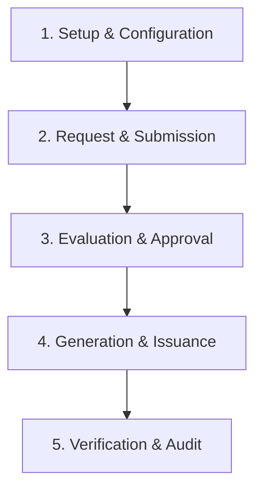

# Certificate & Template Management Module - System Overview & Architecture

The **Certificate & Template Management (CRT) Module** is a comprehensive, end-to-end digital document issuance, workflow, and verification engine designed for K-12 educational institutions on the Prime-AI platform. It manages template design, student/parent certificate request workflows, secure PDF generation with embedded QR codes and HMAC-SHA256 verification hashes, bulk issuance, student/staff ID cards, and a Document Management System (DMS) for incoming student documentation.

---

## 1. System Architecture & Core Lifecycle Workflow

The system is designed as a secure, closed-loop document lifecycle framework operating across a 5-stage workflow:

### Stage 1: Setup & Configuration
* **Certificate Types**: Define type details such as category, requires approval, validity length, and unique serial counter formats (e.g. `{TYPE_CODE}-{YYYY}-{SEQ6}`).
* **Template Designer**: Create and version HTML/CSS templates containing dynamic merge fields (e.g. `{{student_name}}`, `{{class_section}}`).
* **ID Card Configs**: Configure coordinates, sizing (A5/CR80), and field positions for student and staff ID cards.

### Stage 2: Request & Submission
* Students and parents request certificates (e.g. Bonafide, Character, Migration) directly via their portal, attaching supporting documentation (MIME-checked, max 5MB).
* Clerks or administrators submit requests on behalf of students in the office.

### Stage 3: Evaluation & Approval
* Administrative requests go to the approval queue. The Principal or School Admin reviews the request, verifies the student's status, checks linked DMS documents, and decides.
* Rejections require a mandatory reason. If a type does not require approval, it skips this stage.

### Stage 4: Generation & Issuance
* On approval (or direct command for achievement types), the system increments the serial counter via `SELECT FOR UPDATE` in a database transaction.
* DomPDF renders the HTML, embedding a unique base64 QR code and security watermark if it is a duplicate. The PDF is saved under a tenant-isolated storage path.
* For Transfer Certificates (TCs), a fee-clear check runs; student records are updated to `tc_issued = true` and current status is set to `Withdrawn`.

### Stage 5: Verification & Audit
* The certificate has a public no-login verification page `/verify/{hash}` displaying privacy-masked details. 
* All verification scans and downloads are logged to the database for auditing.

---

## 2. System Actor Matrix

| Actor | Key Responsibilities | Primary Interface Areas |
| :--- | :--- | :--- |
| **School Administrator** | Setup certificate types, design templates, manage ID card layouts, approve requests, issue/revoke certificates, audit verification logs. | Certificate Admin Dashboard, Master Setup, Reports |
| **Principal** | Final authority on legal certificates (TC, Migration), review approval queues, override fee block warnings, digital signature setup. | Requests Queue, TC Register, Analytics Reports |
| **Clerk / Front Office** | Submit requests on behalf of students/parents, upload DMS files, track physical handovers of certificates and ID cards. | Requests, DMS Document List, ID Card Handover |
| **Class Teacher** | View certificates issued to students in their assigned class/section. | Issued Register (Class Filtered) |
| **Student / Parent** | Request certificates, track request lifecycle stages, download issued PDFs. | Student/Parent Portal |
| **Third-Party Verifier** | Scan QR code or call the public API to verify the authenticity of a certificate. | Public Verification Page, REST API Endpoint |

---

## 3. Master Screen & Tab Directory

The Certificate Module comprises **6 Submenus** containing **12 distinct Tabs**:

### Submenu 1: Template Management (2 Tabs)
1. **Certificate Types**: Define names, codes, categories, validity, and serial formats.
2. **Templates**: Visual HTML/CSS template designer, version history list, and previewer.

### Submenu 2: Certificates (3 Tabs)
3. **Requests**: Pending, Under Review, and All requests workflows.
4. **Issued Register**: List of issued certificates with download and revocation controls.
5. **Bulk Generation**: Criteria filters (class/section) for executing async batch PDF/ZIP generation.

### Submenu 3: ID Cards (2 Tabs)
6. **ID Card Config**: Create layouts, set fields, orientations, card sizes, and grid sheets.
7. **Generate ID Cards**: Filter students and export printable ID card sheets with handover tracking.

### Submenu 4: Document Management (1 Tab / Screen)
8. **DMS**: List and view uploaded student files, review pending approvals, and record verification status.

### Submenu 5: Verification (1 Tab / Screen)
9. **Verification Logs**: Search and filter records of third-party verification scans.

### Submenu 6: Reports (3 Tabs)
10. **Issued Certificates**: Exportable registry (Excel/CSV) of all issued documents.
11. **Pending Requests**: Grid highlighting overdue requests (`required_by_date < today`) in red.
12. **Type Analytics**: Visual Chart.js reports showing monthly trends and category volumes.
