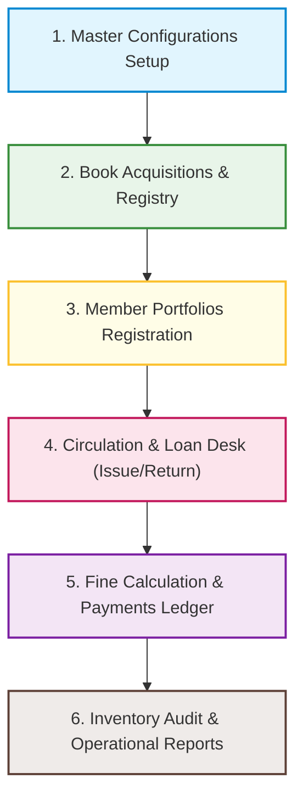
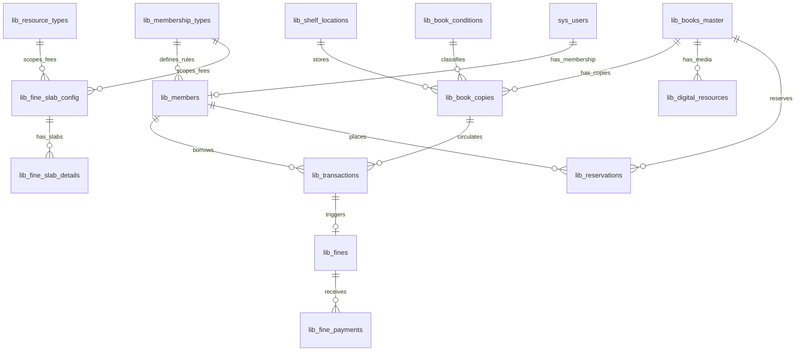

# Library Module — System Overview & Architecture

## 1. System Purpose & Module Overview
The **Library Module** is an enterprise-grade resource cataloging, circulation tracking, reservation queueing, and fine calculation system. It handles physical books, copies, digital media files, license scopes, member portfolios, and integrates with a slab-based late fee charging engine, financial collections ledger, inventory audit sessions, and analytics dashboards.

---

## 2. Core Business Processes & Lifecycles
The library system is built around six integrated process stages:



*   **1. Master Configurations:** Librarians establish classifications (Categories, Genres, Authors, Keywords, Publishers), specify copy conditions, map membership categories, and configure fine pricing slab range limits.
*   **2. Book Acquisitions:** Physical copies are assigned unique barcodes, accession codes, RFID tags, and storage locations. Digital PDFs or audiobooks are uploaded with license keys and access restriction rules.
*   **3. Member Portfolios:** System logins (`sys_users`) are registered as library members, linked to specific membership limits, and assigned barcode cards.
*   **4. Circulation & Loan Desk:** Members check out books. The system computes due dates, checks limits, locks suspended accounts, and updates copy availability states. Check-ins evaluate return conditions, process returns, and log history.
*   **5. Fine Calculation Engine:** If returned late, the system evaluates active fine slabs, generates pending logs, receives payments via Cash or Online systems, and manages authorized waivers.
*   **6. Inventory Audit & Reports:** Librarians initialize audit sessions, scan shelf inventory to detect misplaced or damaged items, and compile executive operational and digital usage reports.

---

## 3. Comprehensive Database Relationships Map
The library schema utilizes a normalized relational design:



---

## 4. Submenu & Screen Catalog Tab Directory
All detailed requirement documents are organized as clickable directory files grouped by submenus:

### Submenu 1: Library Masters Setup
*   [01. Library Categories](file:///C:/laragon/www/pgdatabase/4-Module_Requirement/Library/01-Library_Masters-Categories.md) — Hierarchical catalog categorization and depth caps.
*   [02. Library Genres](file:///C:/laragon/www/pgdatabase/4-Module_Requirement/Library/02-Library_Masters-Genres.md) — Literature classifications.
*   [03. Library Authors](file:///C:/laragon/www/pgdatabase/4-Module_Requirement/Library/03-Library_Masters-Authors.md) — Writer directory.
*   [04. Library Keywords](file:///C:/laragon/www/pgdatabase/4-Module_Requirement/Library/04-Library_Masters-Keywords.md) — Index search tags.
*   [05. Library Publishers](file:///C:/laragon/www/pgdatabase/4-Module_Requirement/Library/05-Library_Masters-Publishers.md) — Publishing companies records.
*   [06. Library Resource Types](file:///C:/laragon/www/pgdatabase/4-Module_Requirement/Library/06-Library_Masters-Resource_Types.md) — Media format tags.
*   [07. Library Book Master](file:///C:/laragon/www/pgdatabase/4-Module_Requirement/Library/07-Library_Masters-Book_Master.md) — General bibliography.
*   [08. Membership Types](file:///C:/laragon/www/pgdatabase/4-Module_Requirement/Library/08-Library_Masters-Membership_Types.md) — Loan rules and borrow limits.
*   [09. Book Conditions](file:///C:/laragon/www/pgdatabase/4-Module_Requirement/Library/09-Library_Masters-Book_Condition.md) — Standard wear-and-tear classification codes.
*   [10. Library Members](file:///C:/laragon/www/pgdatabase/4-Module_Requirement/Library/10-Library_Masters-Members.md) — Member cards registry.
*   [11. Fine Master List](file:///C:/laragon/www/pgdatabase/4-Module_Requirement/Library/11-Library_Masters-Fine_Master_List.md) — Late-return fine configuration audit dashboard.
*   [12. Add/Edit Fine Master](file:///C:/laragon/www/pgdatabase/4-Module_Requirement/Library/12-Library_Masters-Add_Edit_Fine_Master.md) — Header configurations, caps, and priorities.
*   [13. Add Day Range (Fine Slabs)](file:///C:/laragon/www/pgdatabase/4-Module_Requirement/Library/13-Library_Masters-Add_Day_Range.md) — Incremental day slab penalty rates.

### Submenu 2: Library Transactions Workflows
*   [14. Shelf Locations](file:///C:/laragon/www/pgdatabase/4-Module_Requirement/Library/14-Library_Transactions-Shelf_Location.md) — Physical shelving coordinates.
*   [15. Book Purchase / Copies](file:///C:/laragon/www/pgdatabase/4-Module_Requirement/Library/15-Library_Transactions-Book_Purchase.md) — Physical copy registry.
*   [16. Digital Resources](file:///C:/laragon/www/pgdatabase/4-Module_Requirement/Library/16-Library_Transactions-Digital_Resources.md) — Media uploads and license locks.
*   [17. Book Issue Screen](file:///C:/laragon/www/pgdatabase/4-Module_Requirement/Library/17-Library_Transactions-Book_Issue.md) — Circulation checkout desk.
*   [18. Book Return Screen](file:///C:/laragon/www/pgdatabase/4-Module_Requirement/Library/18-Library_Transactions-Book_Return.md) — Circulation check-in desk.
*   [19. Book Reservations](file:///C:/laragon/www/pgdatabase/4-Module_Requirement/Library/19-Library_Transactions-Reservations.md) — Queueing holds on checked-out books.
*   [20. Fine Details Ledger](file:///C:/laragon/www/pgdatabase/4-Module_Requirement/Library/20-Library_Transactions-Fine_Details.md) — Fine payments collection.
*   [21. Other Charges](file:///C:/laragon/www/pgdatabase/4-Module_Requirement/Library/21-Library_Transactions-Other_Charges.md) — Posting manual fees linked to transactions.

### Submenu 3: History & Audit logs
*   [22. Transactions History Log](file:///C:/laragon/www/pgdatabase/4-Module_Requirement/Library/22-History_Audit-Transactions_History.md) — Read-only immutable log console.
*   [23. Inventory Audit Header](file:///C:/laragon/www/pgdatabase/4-Module_Requirement/Library/23-History_Audit-Inventory_Audit.md) — Initializing stock audit sessions.
*   [24. Inventory Audit Details](file:///C:/laragon/www/pgdatabase/4-Module_Requirement/Library/24-History_Audit-Inventory_Audit_Details.md) — Scanner input panel and deviation alerts.

### Submenu 4: Library Reports
*   [25. Fine Reports](file:///C:/laragon/www/pgdatabase/4-Module_Requirement/Library/25-Library_Reports-Fine_Reports.md) — Collection rates dashboard.
*   [26. Circulation Analysis](file:///C:/laragon/www/pgdatabase/4-Module_Requirement/Library/26-Library_Reports-Circulation_Analysis.md) — Checkout traffic charts.
*   [27. Overdue Reports](file:///C:/laragon/www/pgdatabase/4-Module_Requirement/Library/27-Library_Reports-Overdue_Reports.md) — Aging overdue pipelines.
*   [28. Acquisition Reports](file:///C:/laragon/www/pgdatabase/4-Module_Requirement/Library/28-Library_Reports-Acquisition_Reports.md) — Purchase spending analyses.
*   [29. Digital Resource Reports](file:///C:/laragon/www/pgdatabase/4-Module_Requirement/Library/29-Library_Reports-Digital_Resource_Reports.md) — Digital media usage statistics.
*   [30. Dashboard Reports](file:///C:/laragon/www/pgdatabase/4-Module_Requirement/Library/30-Library_Reports-Dashboard_Reports.md) — Operational KPIs and behavior metrics.

---

## 5. Business Logic & Global Integration Rules
To ensure data consistency, the following global policies apply across all library screens:
1. **Multi-Tenancy Isolation:** Every database query (Standard tables, Eloquent relationships, reports, and search forms) must be scoped by the tenant identifier.
2. **System Safeguards & Protected Fields:**
   * Default condition codes (`GOOD`, `DAMAGED`, `LOST`) cannot be modified or soft-deleted.
   * Completed or Cancelled inventory audit sessions are locked and read-only.
3. **Double-Entry Financial Integrations:** Fine calculations and payments post events using `RemoteEntryService::processEvent` to synchronize with the finance ledger.
4. **Circulation Status Constraints:**
   * Books cannot be issued if a member’s status is suspended, expired, or deactivated.
   * Books cannot be deleted if active transactions (`status = 'Issued' OR status = 'Overdue'`) are associated with their copies.

---

## 6. Laravel Dusk Automation Test Architecture
Automating tests across the Library Module uses Laravel Dusk to verify workflows, UI tabs, modal windows, and integrations.

### 1. Unified Selectors Strategy
To avoid CSS class variations breaking tests, the module UI includes distinct Dusk selectors:
*   `@category-tab`, `@members-tab`, `@fine-ledger-tab`, `@other-charges-tab` — Navigation tabs.
*   `@add-btn` (e.g. `@add-category-btn`, `@add-member-btn`) — Create buttons.
*   `@save-btn` — Standard submit buttons.
*   `@search-input` (e.g. `@fine-search-input`) — Query inputs.

### 2. Mocking File Uploads
For digital resource attachments, tests place test assets in `tests/Browser/Modules/Library/files/test.pdf` and utilize:
```php
$browser->attach('file_attachment', __DIR__.'/files/test.pdf');
```

### 3. Verification of Modal Interactivity
When opening range modals or payment screens:
```php
$browser->click('@manage-slabs-btn')
        ->waitFor('#manage-slabs-modal') // Modal ID target
        ->type('to_day', '10')
        ->press('@save-range-btn')
        ->waitUntilMissing('#manage-slabs-modal');
```

### 4. Running Dusk Test Command
Dusk scripts are executed via Artisan commands to verify features under tenant mock environments:
```bash
php artisan dusk tests/Browser/Modules/Library
```
