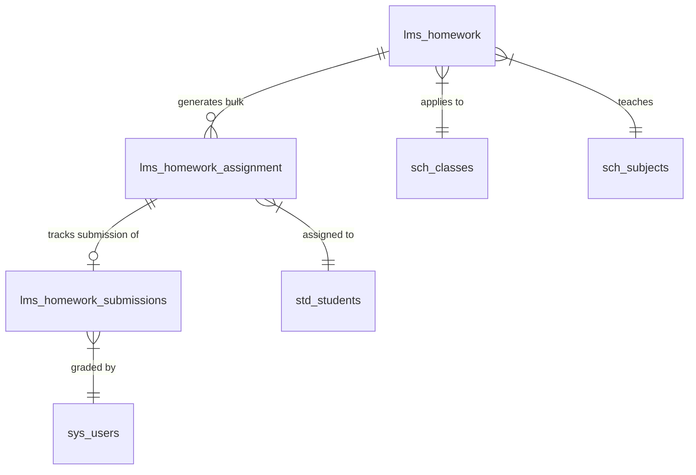

# LMS Homework & Assignments — Module Overview

## 1. Module Purpose & Overview

The **LMS Homework & Assignments** (`LmsHomework`) module is a core part of the Prime-AI learning management platform. It allows teachers to create structured, syllabus-aligned homework templates, assign them automatically or conditionally to student groups, and evaluate student submissions using an annotation canvas.

---

## 2. System Architecture & Entity Relationships

The data lifecycle is powered by three main database tables:
1. **`lms_homework`**: Defines the parent homework template created by a teacher. Includes academic alignment (class, section, subject, lesson, topic), grading policies, default due dates, late submission toggle, and release conditions.
2. **`lms_homework_assignment`**: Created in bulk when a homework template transitions from `DRAFT` to `PUBLISHED`. There is a unique `1:1` row mapping per student per homework. It supports per-student status tracking, notification timestamps, viewed-at counters, and teacher overrides (e.g., emergency due-date extensions or custom late submission rules).
3. **`lms_homework_submissions`**: Stores the student's actual submission response (text responses and file uploads stored in a JSON array) and subsequent evaluation details (marks obtained, teacher feedback, and resubmission status).

### Database Relationship Map


---

## 3. Stakeholders & Roles

| Actor | Role / System Permission | Key Functions in Module |
|---|---|---|
| **Teacher** | `tenant.home-work.viewAny`, `tenant.home-work.create`, `tenant.home-work.update`, `tenant.home-work.delete`, `tenant.home-work-assignment-tracking.viewAny`, `tenant.home-work-assignment-tracking.update` | Creates, edits, and soft-deletes homework templates. Publishes homework. Reviews and grades submissions. Overrides student-level settings. |
| **Student** | `student.homework.viewAny`, `student.homework.create` | Views released assignments. Accesses description and attachments. Submits text responses and uploaded files. Views grades and teacher feedback. |
| **Parent** | `parent.homework.viewAny` | Monitors child's homework assignments, overdue alerts, submitted status, and grades. |
| **System Scheduler** | Background execution | Runs nightly batch commands to transition assignments to `OVERDUE` status and trigger automated release checks. |

---

## 4. Lifecycle & State Machine Transitions

### A. Homework Template Lifecycle (lms_homework)
1. **`DRAFT`**: Template is created and can be updated. Not visible to students.
2. **`PUBLISHED`**: Bulk assignment records (`lms_homework_assignment`) are created for all active student enrollments. Template becomes locked (read-only).
3. **`ARCHIVED`**: Archived by teacher. No further student submissions allowed.

```
[Teacher Creates] ---> DRAFT (Editable)
                        |
                 [publish() Action]
                        |
                        v
                   PUBLISHED (Read-only; Assignment rows created)
                        |
                 [archive() Action]
                        |
                        v
                    ARCHIVED (Closed for submissions)
```

### B. Student Assignment Lifecycle (lms_homework_assignment)
1. **`PENDING_RELEASE`**: Mapped to student but hidden. Awaiting release condition triggers (`ON_TOPIC_COMPLETE` or `ON_SCHEDULED_DATE`).
2. **`ASSIGNED`**: Released and visible on the student portal. Not yet viewed.
3. **`VIEWED`**: Student has opened the homework on their portal.
4. **`SUBMITTED`**: Student submitted their work on time.
5. **`LATE_SUBMITTED`**: Student submitted after the due date (allowed under policy overrides).
6. **`GRADED`**: Evaluated and scored by the teacher.
7. **`OVERDUE`**: Due date passed without a submission (set by scheduled job).
8. **`EXEMPTED`**: Teacher has exempted the student from completing the homework.

---

## 5. Dashboard Tab Architecture

The module interface features a tabbed navigation system under the `/lms-home-work/home-works` route:
1. **Homework Analytics**: View submission performance statistics and score curves.
2. **Homework**: List, create, edit, show, and publish homework templates.
3. **Assignment Tracking**: Track individual students and configure due-date and late submission overrides.
4. **Summary**: Consolidated reporting grid of student statuses.
5. **Homework Submission**: Review student uploads and open the **Paper Check** evaluator canvas.

---

## 6. Manual Testing Prerequisites

To perform manual scenario verification:
1. Ensure the database has active, seeded tables for class sections, academic sessions, subjects, and users.
2. At least one user must have an active **Teacher** role assigned, and multiple users must be registered as **Students** enrolled in the target class-section.
3. Accessible media storage must be running for attachment uploads.

---

## 7. Dusk Automation Overview

All sub-modules provide Dusk templates utilizing browser test methods. Dusk flows log in as `teacherUser` or `studentUser`, navigating to `/lms-home-work/home-works?tab=home_work#home_work` to verify features like status toggles, validation errors, and submission forms.
