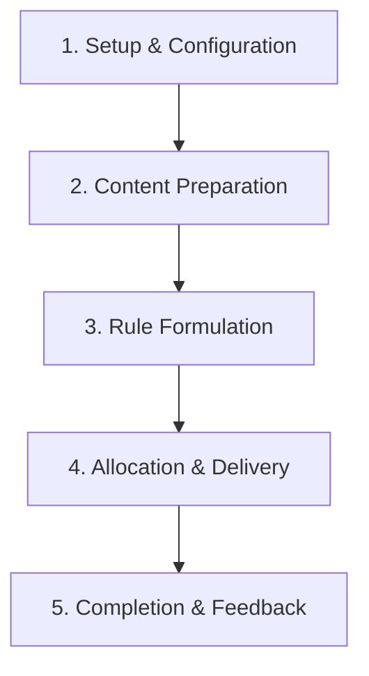

# Recommendation Module - System Overview & Architecture

The **Recommendation Module** is an automated and manual personalized learning assistance engine designed for educational institutions. It analyzes student performance metrics (such as exam/quiz scores, homework completions, and academic milestones), matches them against configurable trigger conditions, and assigns targeted learning materials or structured material bundles to help students fill learning gaps.

---

## 1. System Architecture & Core Lifecycle Workflow

The system is designed as a closed-loop personalized learning framework. It operates across a 5-stage lifecycle, starting with static master setups, transitioning to content grouping, rule definition, automated execution, and closing the loop with student feedback and score tracking.

### Stage 1: Setup & Configuration (Recommendation Master)
* **Trigger Events**: Defining event hooks that activate the recommendation engine. For example, `ON_ASSESSMENT_RESULT` triggers whenever a quiz or quest score is posted.
* **Recommendation Modes**: Defining execution formats.
  * `SPECIFIC_MATERIAL`: Recommends a single, specific document or media.
  * `SPECIFIC_BUNDLE`: Recommends a multi-material package.
  * `DYNAMIC_BY_TOPIC`: Automatically searches the database for active materials matching the failed topic.
  * `DYNAMIC_BY_COMPETENCY`: Searches for materials based on matching competency codes.
* **Dynamic Material Types**: Formats of learning content (e.g., PDF, Video, Audio).
* **Dynamic Purposes**: Focus of the remedial effort (e.g., Remedial, Enrichment, Revision).
* **Assessment Types**: Categories of assessments (e.g., QUIZ, QUEST, EXAM, ALL).

### Stage 2: Content Preparation (Materials & Bundles)
* **Recommendation Materials**: Authors write and upload files (PDFs, media files) or URLs (external YouTube/web articles) mapped to specific classes, subjects, and topics.
* **Material Bundles**: Grouping related materials into comprehensive packages with specific sequence orders and mandatory flags.

### Stage 3: Rule Formulation (Recommendation Rules)
* Rules define conditional ranges (e.g., Score between 0% and 40% on Grade 9 Math) that map to target materials or bundles.
* Rules are flagged as **Automated** (triggers instantly when results are posted) or **Manual** (requires verification).

### Stage 4: Allocation & Delivery (Student Recommendations)
* Recommendations are assigned to students, generating a unique transaction UUID.
* **Automated Dispatch**: The `RecommendationEngineService` processes published scores, computes question statistics, and generates student-specific records in `rec_student_recommendations`.
* **Manual Dispatch**: Teachers assign tracks directly to individual students or classes.

### Stage 5: Completion & Feedback (Student Portal)
* Students view recommendations, access materials, and complete any reassigned quizzes.
* Students can mark recommendations as completed, submit ratings (1 to 5 stars), and leave textual feedback.

---

## 2. System Actor Matrix

| Actor | Key Responsibilities | Primary Interface Areas |
| :--- | :--- | :--- |
| **Curriculum Administrator** | Setup trigger events, define assessment types, manage recommendation modes, set up material types and purposes. | Recommendation Master |
| **Teacher / Tutor** | Author recommendation materials, construct material bundles, configure automated rules, manually assign recommendations, track student completion rates. | Recommendation Management, Rules |
| **Student** | Access assigned remedial resources, complete learning tasks, submit ratings and learning feedback. | Student Portal / Recommendations |

---

## 3. Master Screen & Tab Directory

The Recommendation Module comprises **2 Submenus** containing **9 distinct Tabs**:

### Submenu 1: Recommendation Master (5 Tabs)
1. **Trigger Events**: Defining event names and codes that activate the recommendation engine.
2. **Recommendation Modes**: Defining execution formats (e.g., Auto-assign, Teacher approval required).
3. **Dynamic Material**: Types of learning formats (e.g., PDF, Video tutorial, interactive game).
4. **Dynamic Purposes**: Focus of the remedial effort (e.g., Revision, Bridge Course, Advanced Reading).
5. **Assessment Type**: Category of source assessment (e.g., Weekly Quiz, Monthly Test, Final Exam).

### Submenu 2: Recommendation Management (4 Tabs)
6. **Materials**: Authoring and uploading files/URLs for individual remedial topics.
7. **Material Bundles**: Grouping related materials into comprehensive packages.
8. **Rules**: Setting conditional range bounds (e.g., Score < 40%) mapping to materials or bundles.
9. **Student Recommendations**: Tracking active student remedial plans, completing tasks, logging scores, and rating submissions.
