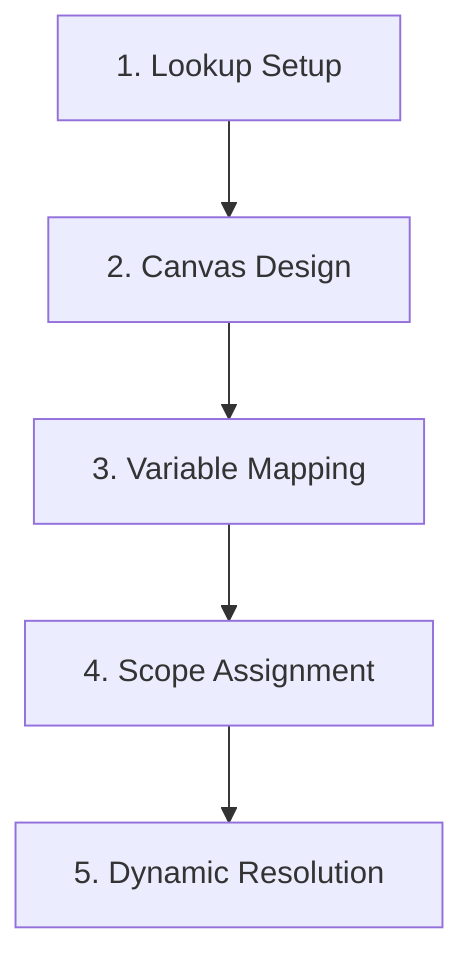

# Template Management Module - System Overview & Architecture

The **Template Management (TMP) Module** is a core engine designed for creating, designing, and assigning visual layouts (such as marksheets, report cards, ID cards, fee receipts, and admit cards) across the Prime-AI school ERP platform. 

It consists of a visual template constructor, a reusable variable mapping schema, and a scope-based priority assignment engine that resolves which layout template to render based on the academic session, class, class group, or school-wide level.

---

## 1. System Architecture & Resolution Workflow

The module operates across three logical layers: Lookup Masters (types and purposes), Template Design (canvas layout and variable mapping), and Template Assignment (linking templates to scopes and resolving them at runtime).

### 1.1 Resolution Priority Chain (CLASS_SCOPED Purposes)
For target documents that are class-scoped (e.g. Marksheet Printing, Student ID Cards), the resolution engine resolves the template using a 3-step fallback hierarchy:

1.  **Priority 1: Direct Class Match**: Looks for an active assignment matching the target student's class (`class_id = class_id`).
2.  **Priority 2: Class Group Fallback**: Looks for an active assignment matching a class group containing the target class (linked via `msh_class_group_items_jnt`).
3.  **Priority 3: School-Wide Fallback**: Falls back to the default assignment where both `class_id` and `class_group_id` are `NULL`.
4.  **Failure**: Returns an error if no template assignment is found for the session and purpose.

---

## 2. Variable Resolution Engine

Template variables act as dynamic placeholders (e.g. `{{student_name}}`, `{{grade}}`) replaced at render time. The module handles variables in two distinct modes:

1.  **Automated Mode**: The variable is mapped to database columns (`db_name`, `table_name`, `field_name`). The template engine queries these columns automatically to resolve values at runtime (e.g., fetching name from `std_students`).
2.  **Manual Mode**: Columns mapping is `NULL`. The calling module computes the value (e.g., Marksheet module calculates `total_marks` or `grade`) and passes it in the rendering context, fallback to pivot `default_value` if absent.

---

## 3. System Actor Matrix

| Actor | Key Responsibilities | Primary Interface Areas |
| :--- | :--- | :--- |
| **School Administrator** | Define custom categories, register functional purposes, design layouts, map variables, configure scope assignments. | Templates Tabs Screen |
| **Principal / Academic Head**| Review and verify marksheets layouts, print test ID cards, approve templates before deployment. | Template Canvas Preview, Reports |
| **Class Teacher** | Trigger PDF generation (e.g., printing marksheets or report cards) which dynamically invokes the resolved template. | Marksheet / Gradebook Module |
| **System Engine** | Resolve templates using fallback hierarchy, substitute placeholders via automated/manual mapping, render final PDFs. | Service Layer, Background PDF Jobs |

---

## 4. Master Screen & Tab Directory

The Template configuration is centralized in **1 Menu Route** (`/template/templates-tabs`) containing **5 distinct Tabs**:

1.  **Templates**: visual designer listing, canvas JSON configurations, background branding image uploads, and active state toggles.
2.  **Template Types**: Category lookup list (e.g., Marksheet, ID Card, Fee Receipt).
3.  **Template Purposes**: functional registry mapping codes (e.g. `MARKSHEET_PRINT`) to scope rules (Class Scoped vs School Wide).
4.  **Template Variables**: Master registry defining placeholders and their data source resolution parameters.
5.  **Template Assignments**: Management grid to scope layouts to sessions, classes, or class groups with uniqueness validation.
