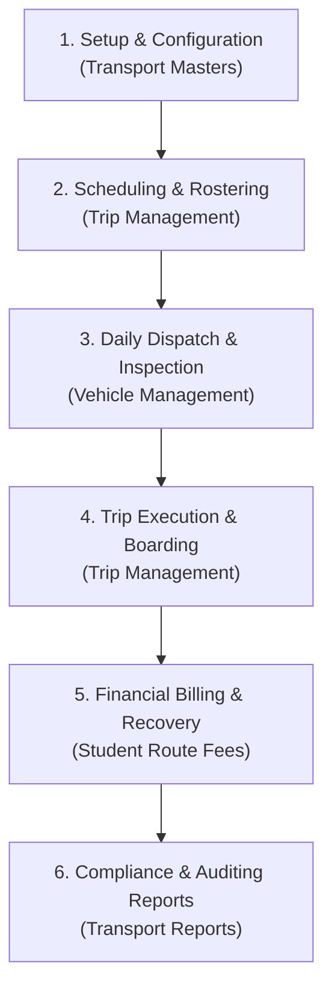
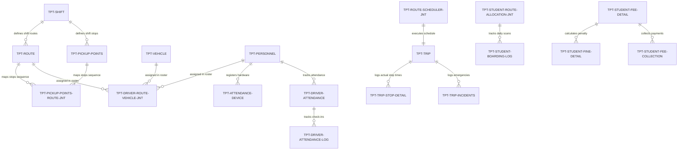

# Transport Module — System Overview & Architecture

## 1. System Purpose & Core Lifecycle Workflow

The **Transport Module** is a comprehensive fleet management, student tracking, and automated billing system designed for educational institutions. It facilitates route planning, personnel assignment, daily roster scheduling, real-time trip execution, IoT-based student boarding logs, vehicle inspection/maintenance cycles, and student fee/fine recovery.

The core operational lifecycle follows a six-stage sequential path:



---

## 2. System Actor Matrix

| Actor | Primary Responsibilities | Interface Scope |
| :--- | :--- | :--- |
| **Transport Manager** | Route planning, driver-vehicle roster schedules, maintenance & fuel approvals, device registrations. | Transport Master, Vehicle Management, Trip Management, Reports |
| **Driver / Helper** | Pre-trip checklist inspections, fuel log entry submissions, real-time stop updates, student scan boarding logs. | Mobile Companion Application, Staff Attendance |
| **Accountant** | Bulk transport fee creation, late fine waived adjustments, invoice collections, payments audits. | Student Route Fees, Fee Logs |
| **Student / Parent** | Boarding notifications tracking, allocation stop requests, online fee payments. | Student Portal |

---

## 3. Shared Global Settings & Integrations

The Transport module connects directly with the **Vendor Management** module using global system parameters:

### `trip_usage_needs_to_be_updated_into_vendor_usage_log`
* **Type**: Boolean (stored in `sch_settings` table).
* **Behavior**: If set to `1` (True), upon trip completion approval, the system pushes the trip mileage and fuel usage to the Vendor Management module (`vnd_usage_logs`) to compute lease billing.

### Maintenance-to-Vendor Billing
* Approved maintenance completion logs in `tpt_vehicle_maintenance` (for vehicles marked "Leased" or "Rented") automatically push payment liability records to `vnd_vendor_bill_due_for_payment`.

---

## 4. Database ERD Linkages & Schema Map

The module is powered by 25 core tables prefixed with `tpt_`:



---

## 5. Master Directory Index

The Transport Module comprises **6 Submenus** containing **40 distinct Tabs**:

### Submenu 1: Transport Master
*   [01-Transport_Master-Dashboard.md](file:///C:/laragon/www/pgdatabase/4-Module_Requirement/Transport/01-Transport_Master-Dashboard.md) — real-time monitoring console.
*   [02-Transport_Master-Vehicle.md](file:///C:/laragon/www/pgdatabase/4-Module_Requirement/Transport/02-Transport_Master-Vehicle.md) — fleet vehicle compliance certifications.
*   [03-Transport_Master-Staff.md](file:///C:/laragon/www/pgdatabase/4-Module_Requirement/Transport/03-Transport_Master-Staff.md) — driver licensing and background screenings.
*   [04-Transport_Master-Shift.md](file:///C:/laragon/www/pgdatabase/4-Module_Requirement/Transport/04-Transport_Master-Shift.md) — operational date range buckets.
*   [05-Transport_Master-Route.md](file:///C:/laragon/www/pgdatabase/4-Module_Requirement/Transport/05-Transport_Master-Route.md) — geospatial route paths and types.
*   [06-Transport_Master-Trans_Stops.md](file:///C:/laragon/www/pgdatabase/4-Module_Requirement/Transport/06-Transport_Master-Trans_Stops.md) — static pickup coordinates.
*   [07-Transport_Master-Pickup_Stops_List.md](file:///C:/laragon/www/pgdatabase/4-Module_Requirement/Transport/07-Transport_Master-Pickup_Stops_List.md) — read-only stops review grid.
*   [08-Transport_Master-Assign_Stops_to_Route.md](file:///C:/laragon/www/pgdatabase/4-Module_Requirement/Transport/08-Transport_Master-Assign_Stops_to_Route.md) — stop sequence ordering and fares.
*   [09-Transport_Master-Device_Setup.md](file:///C:/laragon/www/pgdatabase/4-Module_Requirement/Transport/09-Transport_Master-Device_Setup.md) — UUID Crew device registration.
*   [10-Transport_Master-Fine_Master.md](file:///C:/laragon/www/pgdatabase/4-Module_Requirement/Transport/10-Transport_Master-Fine_Master.md) — late fee policy rules.

### Submenu 2: Vehicle Management
*   [11-Vehicle_Management-Fuel_Log.md](file:///C:/laragon/www/pgdatabase/4-Module_Requirement/Transport/11-Vehicle_Management-Fuel_Log.md) — mileage fuel efficiency audits.
*   [12-Vehicle_Management-Inspection.md](file:///C:/laragon/www/pgdatabase/4-Module_Requirement/Transport/12-Vehicle_Management-Inspection.md) — pre-trip safety checklists.
*   [13-Vehicle_Management-Service_Log.md](file:///C:/laragon/www/pgdatabase/4-Module_Requirement/Transport/13-Vehicle_Management-Service_Log.md) — breakdown service requests.
*   [14-Vehicle_Management-Veh_Approval.md](file:///C:/laragon/www/pgdatabase/4-Module_Requirement/Transport/14-Vehicle_Management-Veh_Approval.md) — manager approval gateways.
*   [15-Vehicle_Management-Veh_Maintenance.md](file:///C:/laragon/www/pgdatabase/4-Module_Requirement/Transport/15-Vehicle_Management-Veh_Maintenance.md) — active workshop repairs logs.

### Submenu 3: Staff Management
*   [16-Staff_Management-Staff_Attendance.md](file:///C:/laragon/www/pgdatabase/4-Module_Requirement/Transport/16-Staff_Management-Staff_Attendance.md) — clock-in/out scanner records.

### Submenu 4: Trip Management
*   [17-Trip_Management-Driver_Vehicle_Roster.md](file:///C:/laragon/www/pgdatabase/4-Module_Requirement/Transport/17-Trip_Management-Driver_Vehicle_Roster.md) — crew vehicle mappings.
*   [18-Trip_Management-Route_Scheduler.md](file:///C:/laragon/www/pgdatabase/4-Module_Requirement/Transport/18-Trip_Management-Route_Scheduler.md) — daily execution schedules generator.
*   [19-Trip_Management-Daily_Trip.md](file:///C:/laragon/www/pgdatabase/4-Module_Requirement/Transport/19-Trip_Management-Daily_Trip.md) — trip dispatch logs.
*   [20-Trip_Management-Stoppage_Status_Update.md](file:///C:/laragon/www/pgdatabase/4-Module_Requirement/Transport/20-Trip_Management-Stoppage_Status_Update.md) — stop arrival timers.
*   [21-Trip_Management-Stoppage_Details.md](file:///C:/laragon/www/pgdatabase/4-Module_Requirement/Transport/21-Trip_Management-Stoppage_Details.md) — scheduled vs. actual variances.
*   [22-Trip_Management-Student_Board_Unboard.md](file:///C:/laragon/www/pgdatabase/4-Module_Requirement/Transport/22-Trip_Management-Student_Board_Unboard.md) — RFID passenger logging.
*   [23-Trip_Management-Trip_Incidents.md](file:///C:/laragon/www/pgdatabase/4-Module_Requirement/Transport/23-Trip_Management-Trip_Incidents.md) — transit emergencies logs.
*   [24-Trip_Management-Trip_Approve.md](file:///C:/laragon/www/pgdatabase/4-Module_Requirement/Transport/24-Trip_Management-Trip_Approve.md) — end-of-run manager sign-offs.

### Submenu 5: Student Route Fees Management
*   [25-Student_Route_Fees-Student_Transport_Allocation.md](file:///C:/laragon/www/pgdatabase/4-Module_Requirement/Transport/25-Student_Route_Fees-Student_Transport_Allocation.md) — mapping students to routes.
*   [26-Student_Route_Fees-Fee_Creation.md](file:///C:/laragon/www/pgdatabase/4-Module_Requirement/Transport/26-Student_Route_Fees-Fee_Creation.md) — monthly invoicing engine.
*   [27-Student_Route_Fees-Fine_Detail.md](file:///C:/laragon/www/pgdatabase/4-Module_Requirement/Transport/27-Student_Route_Fees-Fine_Detail.md) — late fee waiver adjustments.
*   [28-Student_Route_Fees-Fee_Collection.md](file:///C:/laragon/www/pgdatabase/4-Module_Requirement/Transport/28-Student_Route_Fees-Fee_Collection.md) — cash/cheque/online collections.
*   [29-Student_Route_Fees-Fee_Log.md](file:///C:/laragon/www/pgdatabase/4-Module_Requirement/Transport/29-Student_Route_Fees-Fee_Log.md) — immutable payments ledger.

### Submenu 6: Transport Report
*   [30-Transport_Reports-Route_Performance.md](file:///C:/laragon/www/pgdatabase/4-Module_Requirement/Transport/30-Transport_Reports-Route_Performance.md) — average delays analytics.
*   [31-Transport_Reports-St_Transport_Usage.md](file:///C:/laragon/www/pgdatabase/4-Module_Requirement/Transport/31-Transport_Reports-St_Transport_Usage.md) — student ride histories.
*   [32-Transport_Reports-Stop_Locality_Analysis.md](file:///C:/laragon/www/pgdatabase/4-Module_Requirement/Transport/32-Transport_Reports-Stop_Locality_Analysis.md) — passenger sector densities.
*   [33-Transport_Reports-Trip_Discipline.md](file:///C:/laragon/www/pgdatabase/4-Module_Requirement/Transport/33-Transport_Reports-Trip_Discipline.md) — speed infractions and safety scores.
*   [34-Transport_Reports-Driver_Attendant.md](file:///C:/laragon/www/pgdatabase/4-Module_Requirement/Transport/34-Transport_Reports-Driver_Attendant.md) — crew attendance compliance.
*   [35-Transport_Reports-Transport_Finance_Leakage_Report.md](file:///C:/laragon/www/pgdatabase/4-Module_Requirement/Transport/35-Transport_Reports-Transport_Finance_Leakage_Report.md) — revenue vs. cost leakage reports.
*   [36-Transport_Reports-Cost_Maintenance.md](file:///C:/laragon/www/pgdatabase/4-Module_Requirement/Transport/36-Transport_Reports-Cost_Maintenance.md) — historical vehicle repair bills.
*   [37-Transport_Reports-Management_Summary.md](file:///C:/laragon/www/pgdatabase/4-Module_Requirement/Transport/37-Transport_Reports-Management_Summary.md) — executive KPI summary cards.
*   [38-Transport_Reports-Student_Boarding_Unboarding.md](file:///C:/laragon/www/pgdatabase/4-Module_Requirement/Transport/38-Transport_Reports-Student_Boarding_Unboarding.md) — passenger attendance list.
*   [39-Transport_Reports-Notifications.md](file:///C:/laragon/www/pgdatabase/4-Module_Requirement/Transport/39-Transport_Reports-Notifications.md) — delivery success metrics.
*   [40-Transport_Reports-Universal_Transport.md](file:///C:/laragon/www/pgdatabase/4-Module_Requirement/Transport/40-Transport_Reports-Universal_Transport.md) — multi-year utilization trends.

---

## 6. Unified Laravel Dusk Testing Strategy

The module-wide Laravel Dusk end-to-end testing suite is structured around a complete daily operations run verification script:

```php
namespace Tests\Browser;

use Tests\DuskTestCase;
use Laravel\Dusk\Browser;
use App\Models\User;
use App\Models\Vehicle;
use App\Models\Personnel;

class UnifiedTransportModuleTest extends DuskTestCase
{
    /**
     * Executes a full module-wide operations run test, validating vehicle creation,
     * safety inspections, route allocations, trip runs, passenger RFID scans,
     * fee billing, and manager audit collections.
     */
    public function testUnifiedOperationsAndFinancialCalculations()
    {
        $this->browse(function (Browser $browser) {
            $browser->loginAs(User::find(1))
                    
                    // 1. Create Shift & Vehicle
                    ->visit('/transport/shift')
                    ->click('@add-new-shift-btn')
                    ->type('code', 'MS26')
                    ->type('name', 'Morning Shift 2026')
                    ->keys('input[name="effective_from"]', '05232026')
                    ->keys('input[name="effective_to"]', '05232027')
                    ->click('@save-shift-btn')
                    ->waitForText('saved successfully')
                    
                    ->visit('/transport/vehicle')
                    ->click('@add-new-vehicle-btn')
                    ->type('vehicle_no', 'VIN9876543210ABCDEF')
                    ->type('registration_no', 'DL-2C-1234')
                    ->select('vehicle_type_id', '1') // Bus
                    ->select('fuel_type_id', '3') // CNG
                    ->type('capacity', '40')
                    ->type('max_capacity', '50')
                    ->keys('input[name="fitness_valid_upto"]', '12312028')
                    ->keys('input[name="insurance_valid_upto"]', '12312028')
                    ->keys('input[name="pollution_valid_upto"]', '12312028')
                    ->keys('input[name="fire_extinguisher_valid_upto"]', '12312028')
                    ->click('@save-vehicle-btn')
                    ->waitForText('saved successfully')
                    
                    // 2. Perform Pre-Trip Safety Inspection (Passing)
                    ->visit('/transport/daily-vehicle-inspection')
                    ->click('@new-inspection-btn')
                    ->select('vehicle_id', '1')
                    ->type('odometer_reading', '12000')
                    ->check('tire_condition_ok')
                    ->check('lights_condition_ok')
                    ->check('brakes_condition_ok')
                    ->check('fire_extinguisher_condition_ok')
                    ->check('seat_belts_condition_ok')
                    ->click('@save-inspection-btn')
                    ->waitForText('saved successfully')
                    
                    // 3. Roster & Schedule Trip
                    ->visit('/transport/driver-route-vehicle')
                    ->click('@add-roster-btn')
                    ->select('shift_id', '1')
                    ->select('route_id', '1')
                    ->select('vehicle_id', '1')
                    ->select('driver_id', '1')
                    ->keys('input[name="effective_from"]', '05232026')
                    ->click('@save-roster-btn')
                    ->waitForText('saved successfully')
                    
                    ->visit('/transport/route-scheduler')
                    ->click('@generate-schedule-btn')
                    ->keys('input[name="scheduled_date"]', '05242026')
                    ->select('shift_id', '1')
                    ->select('route_id', '1')
                    ->select('vehicle_id', '1')
                    ->select('driver_id', '1')
                    ->click('@save-schedule-btn')
                    ->waitForText('saved successfully')
                    
                    // 4. Start, Scan Boarding, and Complete Trip
                    ->visit('/transport/trip')
                    ->click('@start-trip-btn-1')
                    ->waitFor('@confirm-start-btn')
                    ->type('start_odometer_reading', '12000.00')
                    ->type('start_fuel_reading', '80.00')
                    ->click('@confirm-start-btn')
                    
                    ->visit('/transport/student/bording')
                    ->type('rfid_payload', 'CARD998877')
                    ->select('boarding_stop_id', '1')
                    ->click('@submit-scan-btn')
                    ->pause(15000)
                    ->type('rfid_payload', 'CARD998877')
                    ->select('boarding_stop_id', '3')
                    ->click('@submit-scan-btn')
                    
                    ->visit('/transport/trip')
                    ->click('@complete-trip-btn-1')
                    ->waitFor('@confirm-complete-btn')
                    ->type('end_odometer_reading', '12025.00')
                    ->type('end_fuel_reading', '75.00')
                    ->click('@confirm-complete-btn')
                    
                    // 5. Approve Completed Run
                    ->click('@trip-approve-tab')
                    ->click('@approve-trip-btn-1')
                    ->waitFor('@submit-audit-btn')
                    ->type('remarks', 'Verified run details')
                    ->click('@submit-audit-btn')
                    
                    // 6. Generate Billing & Process Payment
                    ->visit('/transport/fee-master')
                    ->click('@fee-creation-tab')
                    ->select('std_academic_sessions_id', '1')
                    ->select('billing_month', '2026-05-01')
                    ->keys('input[name="due_date"]', '05102026')
                    ->click('@generate-invoices-btn')
                    ->waitForText('Generated invoices successfully')
                    
                    ->visit('/transport/fee-collection')
                    ->click('@add-collection-btn')
                    ->select('student_fee_detail_id', '1')
                    ->type('paid_amount', '1800.00')
                    ->select('payment_mode', 'Cash')
                    ->click('@save-collection-btn')
                    ->waitForText('saved successfully');
        });
    }
}
```
