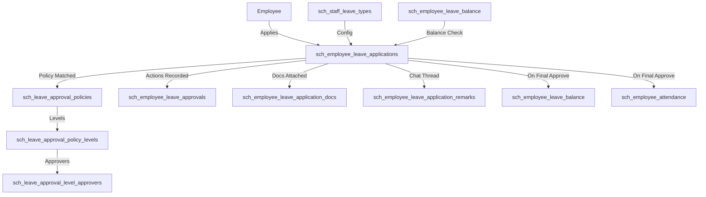
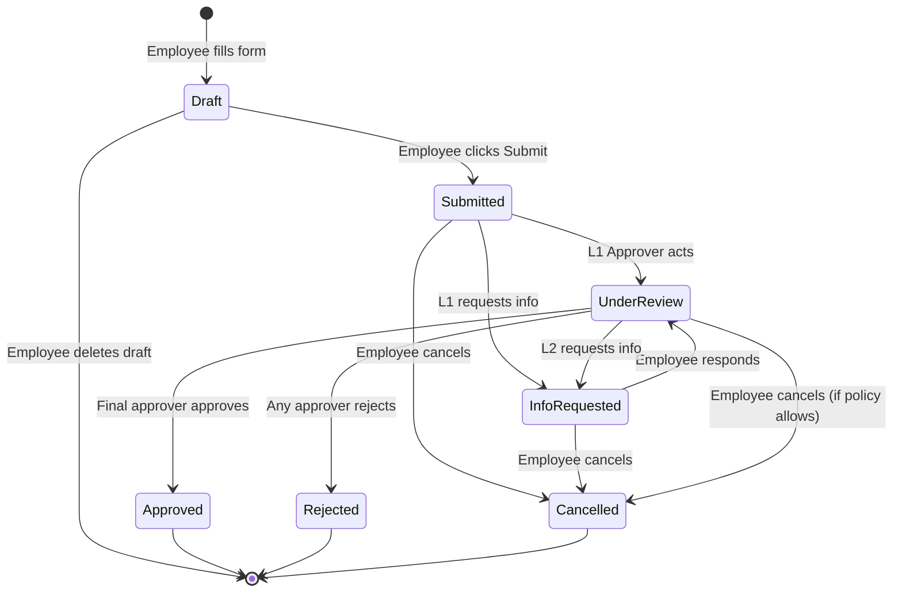
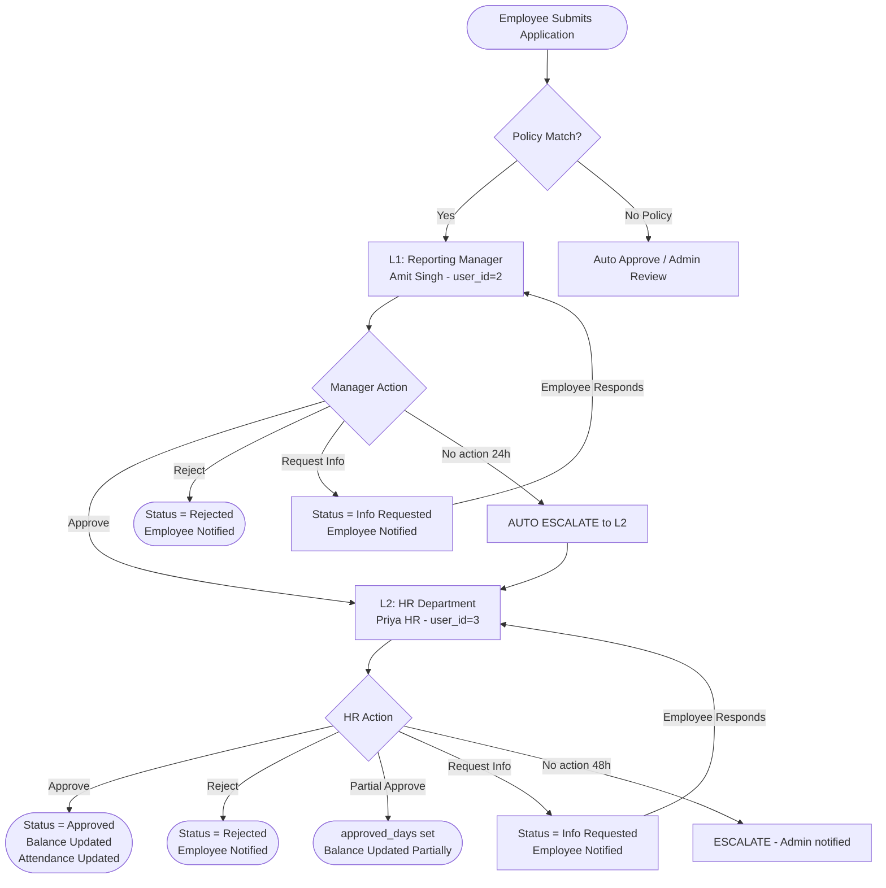
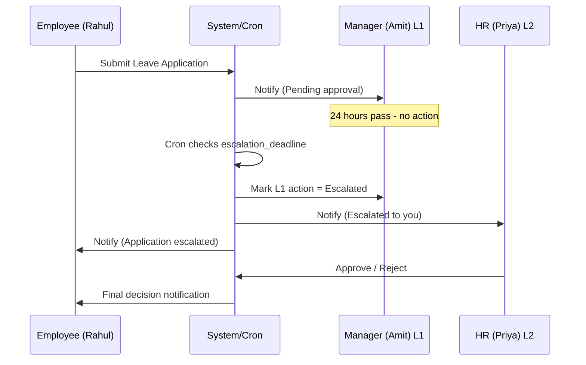
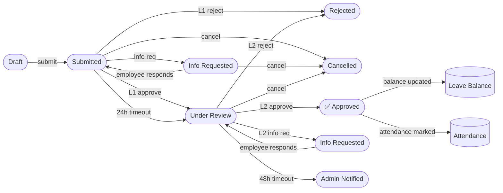

# Leave Management — Complete Flow & Testing Guide
**Module:** Employee Setup → Leave Management  
**DDL Version:** v5.0  
**Date:** 2026-05-11  

---

## 📌 Table of Contents
1. [System Architecture Overview](#1-system-architecture)
2. [Leave Application Flow](#2-leave-application-flow)
3. [Approval Pipeline Flow](#3-approval-pipeline-flow)
4. [Escalation Flow](#4-escalation-flow)
5. [Step-by-Step Testing (Practical)](#5-step-by-step-testing)
6. [DB State at Each Stage](#6-db-state-at-each-stage)

---

## 1. System Architecture



---

## 2. Leave Application Flow



---

## 3. Approval Pipeline Flow (2-Level)



---

## 4. Escalation Flow



---

## 5. Step-by-Step Testing (Practical)

---

### 🔷 PHASE 1 — Data Setup

#### Step 1.1 — Create Leave Types
```sql
INSERT INTO `sch_staff_leave_types`
  (`code`, `name`, `is_paid`, `requires_doc`, `allows_half_day`,
   `allows_back_dated`, `requires_approval`, `min_days_per_application`,
   `max_days_per_application`, `min_advance_notice_days`, `is_active`)
VALUES
  ('CL',  'Casual Leave',      1, 0, 1, 0, 1, 0.5, 3,    0, 1),
  ('SL',  'Sick Leave',        1, 1, 1, 1, 1, 0.5, 7,    0, 1),
  ('EL',  'Earned Leave',      1, 0, 1, 0, 1, 1.0, 15,   7, 1),
  ('LWP', 'Leave Without Pay', 0, 0, 0, 0, 1, 1.0, NULL, 0, 1);
```
✅ **Verify:** `SELECT id, code, name FROM sch_staff_leave_types;`

---

#### Step 1.2 — Create Approval Policy
```sql
-- Policy
INSERT INTO `sch_leave_approval_policies`
  (`name`, `priority`, `is_active`)
VALUES ('Default School Policy', 10, 1);
-- @policy_id = LAST_INSERT_ID()

-- L1
INSERT INTO `sch_leave_approval_policy_levels`
  (`policy_id`, `level_number`, `level_name`, `approval_mode`, `escalation_after_hours`, `is_active`)
VALUES (1, 1, 'Reporting Manager', 'ANY_ONE', 24, 1);

-- L2
INSERT INTO `sch_leave_approval_policy_levels`
  (`policy_id`, `level_number`, `level_name`, `approval_mode`, `escalation_after_hours`, `is_active`)
VALUES (1, 2, 'HR Department', 'ANY_ONE', 48, 1);

-- L1 Approver
INSERT INTO `sch_leave_approval_level_approvers`
  (`level_id`, `approver_type`, `approver_user_id`, `is_active`)
VALUES (1, 'USER', 2, 1);

-- L2 Approver
INSERT INTO `sch_leave_approval_level_approvers`
  (`level_id`, `approver_type`, `approver_user_id`, `is_active`)
VALUES (2, 'USER', 3, 1);
```
✅ **Verify:**
```sql
SELECT lap.name, lapl.level_number, lapl.level_name, lala.approver_user_id
FROM sch_leave_approval_policies lap
JOIN sch_leave_approval_policy_levels lapl ON lapl.policy_id = lap.id
JOIN sch_leave_approval_level_approvers lala ON lala.level_id = lapl.id;
```

---

#### Step 1.3 — Seed Employee Leave Balance
```sql
-- employee_id=1, leave_type_id: 1=CL, 2=SL, 3=EL
INSERT INTO `sch_employee_leave_balance`
  (`employee_id`, `academic_year`, `leave_type_id`,
   `opening_balance`, `carry_forward`, `total_used`, `total_pending`)
VALUES
  (1, '2025-26', 1, 12.00, 0.00, 2.00, 0.00),
  (1, '2025-26', 2, 10.00, 0.00, 0.00, 0.00),
  (1, '2025-26', 3, 20.00, 5.00, 3.00, 0.00);
```
✅ **Verify:**
```sql
SELECT lt.code, elb.opening_balance, elb.total_used,
       elb.available_balance
FROM sch_employee_leave_balance elb
JOIN sch_staff_leave_types lt ON lt.id = elb.leave_type_id
WHERE elb.employee_id = 1;
-- CL: 10 | SL: 10 | EL: 22
```

---

### 🔷 PHASE 2 — Employee Submits Application (TAB 1)

#### Step 2.1 — Submit CL Application
```sql
-- Employee (id=1) applies 2-day CL
INSERT INTO `sch_employee_leave_applications`
  (`employee_id`, `academic_session_id`, `leave_type_id`,
   `from_date`, `to_date`, `total_days`, `is_half_day`, `is_emergency`,
   `reason`, `status`, `approval_policy_id`,
   `current_level_number`, `pending_with_user_id`,
   `applied_by`, `submitted_at`)
VALUES
  (1, 1, 1, '2026-05-15', '2026-05-16', 2.0, 0, 0,
   'Personal work at home', 'Submitted', 1, 1, 2, 1, NOW());

SET @app_id = LAST_INSERT_ID();
```

#### Step 2.2 — Update Balance (total_pending +2)
```sql
UPDATE sch_employee_leave_balance
SET total_pending = total_pending + 2.0
WHERE employee_id = 1 AND leave_type_id = 1 AND academic_year = '2025-26';
```

#### Step 2.3 — Create L1 Approval Row (Pending)
```sql
INSERT INTO `sch_employee_leave_approvals`
  (`leave_application_id`, `policy_level_id`, `level_number`,
   `level_name`, `approver_user_id`, `action`)
VALUES (@app_id, 1, 1, 'Reporting Manager', 2, 'Pending');
```

✅ **Verify Application State:**
```sql
SELECT id, status, current_level_number, pending_with_user_id, total_days
FROM sch_employee_leave_applications WHERE id = @app_id;
-- status=Submitted | level=1 | pending_with=2
```

---

### 🔷 PHASE 3 — Manager Reviews (TAB 2, L1)

#### Step 3.1 — Manager Views Pending Applications
```sql
SELECT ela.id, e.first_name, e.last_name,
       lt.name AS leave_type, ela.from_date, ela.to_date,
       ela.total_days, ela.reason, ela.status
FROM sch_employee_leave_applications ela
JOIN sch_employees e ON e.id = ela.employee_id
JOIN sch_staff_leave_types lt ON lt.id = ela.leave_type_id
WHERE ela.pending_with_user_id = 2
  AND ela.status IN ('Submitted','Under Review')
  AND ela.deleted_at IS NULL;
```

#### Step 3.2a — Manager APPROVES
```sql
-- Update L1 approval row
UPDATE sch_employee_leave_approvals
SET action = 'Approved', acted_at = NOW(),
    remarks = 'Approved. Plan covered.'
WHERE leave_application_id = @app_id AND level_number = 1;

-- Create L2 approval row
INSERT INTO `sch_employee_leave_approvals`
  (`leave_application_id`, `policy_level_id`, `level_number`,
   `level_name`, `approver_user_id`, `action`)
VALUES (@app_id, 2, 2, 'HR Department', 3, 'Pending');

-- Move application to L2
UPDATE sch_employee_leave_applications
SET status = 'Under Review',
    current_level_number = 2,
    pending_with_user_id = 3
WHERE id = @app_id;
```

✅ **Verify:**
```sql
SELECT status, current_level_number, pending_with_user_id
FROM sch_employee_leave_applications WHERE id = @app_id;
-- Under Review | 2 | 3
```

#### Step 3.2b — Manager REJECTS (alternate path)
```sql
UPDATE sch_employee_leave_approvals
SET action = 'Rejected', acted_at = NOW(),
    remarks = 'Busy period, cannot approve.'
WHERE leave_application_id = @app_id AND level_number = 1;

UPDATE sch_employee_leave_applications
SET status = 'Rejected',
    final_reviewed_by = 2,
    final_reviewed_at = NOW(),
    final_remarks = 'Busy period, cannot approve.',
    pending_with_user_id = NULL
WHERE id = @app_id;

-- Reset pending balance
UPDATE sch_employee_leave_balance
SET total_pending = total_pending - 2.0
WHERE employee_id = 1 AND leave_type_id = 1 AND academic_year = '2025-26';
```

#### Step 3.2c — Manager Requests Info (alternate path)
```sql
-- Change application status
UPDATE sch_employee_leave_applications
SET status = 'Info Requested' WHERE id = @app_id;

-- Insert remark
INSERT INTO `sch_employee_leave_application_remarks`
  (`leave_application_id`, `remark_type`, `message`,
   `is_from_approver`, `remarked_by`)
VALUES (@app_id, 'Info_Request',
        'Please clarify: is this emergency or planned?', 1, 2);

SET @remark_id = LAST_INSERT_ID();
```

#### Step 3.2d — Employee Responds to Info Request
```sql
INSERT INTO `sch_employee_leave_application_remarks`
  (`leave_application_id`, `remark_type`, `message`,
   `is_from_approver`, `remarked_by`, `parent_remark_id`)
VALUES (@app_id, 'Response',
        'It is planned. Substitute arranged for my classes.', 0, 1, @remark_id);

-- Manager read the remark
UPDATE sch_employee_leave_application_remarks
SET read_at = NOW(), read_by = 2 WHERE id = @remark_id;

-- Status back to Submitted for manager to re-decide
UPDATE sch_employee_leave_applications
SET status = 'Submitted' WHERE id = @app_id;
```

---

### 🔷 PHASE 4 — HR Final Approval (TAB 2, L2)

#### Step 4.1 — HR Views Pending
```sql
SELECT ela.id, e.first_name, ela.from_date,
       ela.to_date, ela.total_days, ela.status
FROM sch_employee_leave_applications ela
JOIN sch_employees e ON e.id = ela.employee_id
WHERE ela.pending_with_user_id = 3
  AND ela.status IN ('Under Review')
  AND ela.deleted_at IS NULL;
```

#### Step 4.2 — HR APPROVES (Final)
```sql
-- Update L2 approval row
UPDATE sch_employee_leave_approvals
SET action = 'Approved', acted_at = NOW(),
    remarks = 'Approved by HR.'
WHERE leave_application_id = @app_id AND level_number = 2;

-- Finalize application
UPDATE sch_employee_leave_applications
SET status = 'Approved',
    final_reviewed_by = 3,
    final_reviewed_at = NOW(),
    approved_days = 2.0,
    pending_with_user_id = NULL
WHERE id = @app_id;

-- Update leave balance
UPDATE sch_employee_leave_balance
SET total_used    = total_used + 2.0,
    total_pending = total_pending - 2.0
WHERE employee_id = 1 AND leave_type_id = 1 AND academic_year = '2025-26';

-- Mark attendance as On Leave for each day
INSERT INTO sch_employee_attendance
  (`employee_id`, `date`, `status`, `leave_application_id`,
   `is_holiday`, `is_weekend`, `marked_by`, `auto_marked`)
VALUES
  (1, '2026-05-15', 'On Leave', @app_id, 0, 0, 3, 1),
  (1, '2026-05-16', 'On Leave', @app_id, 0, 0, 3, 1)
ON DUPLICATE KEY UPDATE
  status = 'On Leave', leave_application_id = @app_id;
```

✅ **Verify Final State:**
```sql
-- Application
SELECT status, final_reviewed_by, approved_days
FROM sch_employee_leave_applications WHERE id = @app_id;
-- Approved | 3 | 2.0

-- Balance
SELECT total_used, total_pending, available_balance
FROM sch_employee_leave_balance
WHERE employee_id = 1 AND leave_type_id = 1;
-- 4.0 | 0.0 | 8.0

-- Attendance
SELECT date, status FROM sch_employee_attendance
WHERE employee_id = 1
  AND date BETWEEN '2026-05-15' AND '2026-05-16';
-- Both days: On Leave
```

---

### 🔷 PHASE 5 — Escalation Test

#### Step 5.1 — Simulate 24hr Timeout (Manual Test)
```sql
-- Force submitted_at to 25 hours ago
UPDATE sch_employee_leave_applications
SET submitted_at = DATE_SUB(NOW(), INTERVAL 25 HOUR)
WHERE id = @app_id;

-- Check which applications need escalation
SELECT ela.id, ela.submitted_at, lapl.escalation_after_hours,
       DATE_ADD(ela.submitted_at,
         INTERVAL lapl.escalation_after_hours HOUR) AS escalation_deadline
FROM sch_employee_leave_applications ela
JOIN sch_leave_approval_policies lap ON lap.id = ela.approval_policy_id
JOIN sch_leave_approval_policy_levels lapl
     ON lapl.policy_id = lap.id
     AND lapl.level_number = ela.current_level_number
WHERE ela.status IN ('Submitted','Under Review')
  AND DATE_ADD(ela.submitted_at,
        INTERVAL lapl.escalation_after_hours HOUR) < NOW();
```

#### Step 5.2 — Run Escalation
```sql
-- Mark L1 as Escalated
UPDATE sch_employee_leave_approvals
SET action = 'Escalated', escalated_at = NOW(), escalated_to_level = 2
WHERE leave_application_id = @app_id AND level_number = 1;

-- Insert L2 row
INSERT INTO sch_employee_leave_approvals
  (`leave_application_id`, `policy_level_id`, `level_number`,
   `level_name`, `approver_user_id`, `action`)
VALUES (@app_id, 2, 2, 'HR Department', 3, 'Pending');

-- Move to L2
UPDATE sch_employee_leave_applications
SET current_level_number = 2, pending_with_user_id = 3
WHERE id = @app_id;
```

---

## 6. DB State at Each Stage

| Stage | `status` | `current_level` | `pending_with_user_id` | `total_pending` | `total_used` |
|-------|----------|-----------------|------------------------|-----------------|--------------|
| Draft saved | `Draft` | NULL | NULL | 0 | 0 |
| Employee submits | `Submitted` | 1 | 2 (Manager) | +2.0 | unchanged |
| L1 approves | `Under Review` | 2 | 3 (HR) | +2.0 | unchanged |
| L1 rejects | `Rejected` | NULL | NULL | 0 | unchanged |
| L1 info request | `Info Requested` | 1 | 2 | +2.0 | unchanged |
| Employee responds | `Submitted` | 1 | 2 | +2.0 | unchanged |
| L2 final approve | `Approved` | NULL | NULL | 0 | +2.0 |
| L2 partial approve | `Approved` | NULL | NULL | 0 | +partial |
| L1 escalated | `Submitted` | 2 | 3 (HR) | +2.0 | unchanged |
| Employee cancels | `Cancelled` | NULL | NULL | 0 | unchanged |

---

## 7. Quick Diagnostic Queries

### Full Application Status
```sql
SELECT
  ela.id,
  CONCAT(e.first_name,' ',e.last_name) AS employee,
  lt.code AS leave_type,
  ela.from_date, ela.to_date, ela.total_days,
  ela.status, ela.current_level_number,
  ela.pending_with_user_id, ela.approved_days
FROM sch_employee_leave_applications ela
JOIN sch_employees e ON e.id = ela.employee_id
JOIN sch_staff_leave_types lt ON lt.id = ela.leave_type_id
WHERE ela.id = @app_id;
```

### Approval Trail
```sql
SELECT level_number, level_name, approver_user_id,
       action, acted_at, remarks, escalated_at, escalated_to_level
FROM sch_employee_leave_approvals
WHERE leave_application_id = @app_id
ORDER BY level_number;
```

### Communication Thread
```sql
SELECT remark_type,
       IF(is_from_approver,'Approver','Employee') AS from_who,
       message, created_at, read_at
FROM sch_employee_leave_application_remarks
WHERE leave_application_id = @app_id AND deleted_at IS NULL
ORDER BY created_at;
```

### Employee Balance Summary
```sql
SELECT lt.code, lt.name,
       elb.opening_balance + elb.carry_forward AS entitled,
       elb.total_used, elb.total_pending, elb.available_balance
FROM sch_employee_leave_balance elb
JOIN sch_staff_leave_types lt ON lt.id = elb.leave_type_id
WHERE elb.employee_id = 1 AND elb.academic_year = '2025-26';
```

---

## 8. Leave Application FSM — Complete State Map



---
*Source: `Employee_setup_ddl_v5.sql` — Leave Management Section*  
*Guide Version: 1.0 | Created: 2026-05-11*
