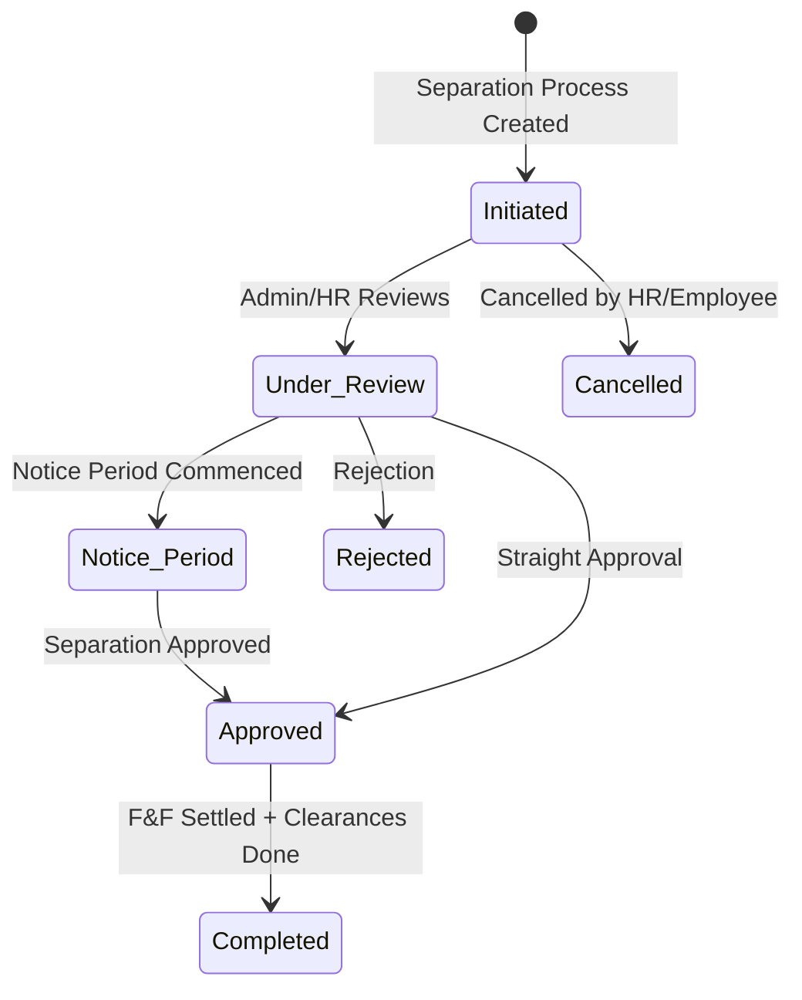

# Technical Specification & Requirements: Employee Lifecycle (Transfer, Promotion & Separation)
## Document ID: SR-EM-10
**Module:** SchoolSetup / EmployeeSetup  
**Version:** 5.0 (Final) 
**Date:** May 2026  
**Status:** Approved Specification

---

## Module Overview

The **Employee Lifecycle** module handles career milestones and transitions of employees inside the school database, including departmental/location transfers, role promotions, and organizational separations (Resignation, Retirement, Termination, Absconding, or Death).

The primary system entity involved for separations and lifecycle tracking under the tabbed leave dashboard is:
* **Employee Separation** (`sch_employee_separations`): Tracks, reviews, and completes separation requests, checklist approvals, and exit interviews.

---

## 1. Database Schema Details (`sch_employee_separations`)

| Column Name | Data Type | Cast / Type | Default | Nullable | Description |
| :--- | :--- | :--- | :--- | :--- | :--- |
| `id` | `BIGINT` | Primary Key | *Auto-increment* | No | Unique identifier. |
| `employee_id` | `BIGINT` | Foreign Key | | No | Reference to target `sch_employees.id`. |
| `separation_type` | `VARCHAR(30)` | `string` | | No | Type of separation: `Resignation`, `Termination`, `Retirement`, `End_of_Contract`, `Death`, `Absconded`, `Other`. |
| `initiated_by` | `VARCHAR(20)` | `string` | | No | Initiator: `Employee` (self), `Employer` (HR/Admin), `System`. |
| `initiated_at` | `TIMESTAMP` | `datetime` | `NULL` | Yes | Time when process was initiated. |
| `notice_period_days` | `INT` | `integer` | `0` | Yes | Number of notice period days required. |
| `notice_start_date` | `DATE` | `date` | | No | Start date of the notice period. |
| `intended_last_working_date` | `DATE` | `date` | `NULL` | Yes | Initial expected last working day. |
| `actual_last_working_date` | `DATE` | `date` | `NULL` | Yes | Confirmed actual last working day (must be on or after `notice_start_date`). |
| `reason_category` | `VARCHAR(100)` | `string` | `NULL` | Yes | High-level categorization of the separation reason. |
| `reason` | `TEXT` | `string` | `NULL` | Yes | Detailed reasons or remarks. |
| `status` | `VARCHAR(30)` | `string` | `Initiated` | No | State machine status: `Initiated`, `Under_Review`, `Notice_Period`, `Approved`, `Completed`, `Rejected`, `Cancelled`. |
| `approved_by` | `BIGINT` | Foreign Key | `NULL` | Yes | Reference to approving user (`sys_users.id`). |
| `approved_at` | `TIMESTAMP` | `datetime` | `NULL` | Yes | Timestamp of approval. |
| `exit_interview_done` | `TINYINT(1)` | `boolean` | `0` | No | Flag indicating if exit interview is completed. |
| `exit_interview_notes` | `TEXT` | `string` | `NULL` | Yes | Notes from the exit interview session. |
| `clearance_complete` | `TINYINT(1)` | `boolean` | `0` | No | Flag indicating if department clearances (IT, Library, Accounts) are complete. |
| `clearance_summary_json` | `JSON` | `array` | `[]` | Yes | Detailed check status checklist (e.g., assets returned, outstanding dues). |
| `final_settlement_done` | `TINYINT(1)` | `boolean` | `0` | No | Flag indicating if Full & Final (F&F) settlement is completed. |
| `final_settlement_amount` | `DECIMAL(10,2)` | `float` | `0.00` | Yes | Final payout or recovery amount. |
| `relieving_letter_issued` | `TINYINT(1)` | `boolean` | `0` | No | Flag indicating if the official relieving letter has been sent. |
| `experience_letter_issued` | `TINYINT(1)` | `boolean` | `0` | No | Flag indicating if the experience certificate has been sent. |
| `is_eligible_for_rehire` | `TINYINT(1)` | `boolean` | `1` | No | Flag indicating eligibility for future re-employment. |
| `rehire_notes` | `TEXT` | `string` | `NULL` | Yes | Specific reasoning or guidelines for re-employment eligibility. |
| `is_active` | `TINYINT(1)` | `boolean` | `1` | No | Active indicator. |
| `created_by` | `BIGINT` | `integer` | `NULL` | Yes | Creator ID. |
| `deleted_at` | `TIMESTAMP` | Soft Delete | `NULL` | Yes | Soft-delete timestamp. |

---

## 2. Workflow State Machine & Lifecycle Transitions



### A. State Definitions
1. **`Initiated`**: The separation process has been created (either by Employee resignation or Employer notice). Clearances and interviews are scheduled.
2. **`Under_Review`**: The request is actively being evaluated by Department Heads and the HR Director.
3. **`Notice_Period`**: The employee is serving their active notice period. Accounts and asset tracking are underway.
4. **`Approved`**: Separation has been approved by the HR Director. The actual last working day is officially set.
5. **`Completed`**: Final settlement has been paid, all clearance items are checked off, letters are generated/issued, and the employee status is set to inactive.
6. **`Rejected`** / **`Cancelled`**: Separation is discarded; employee remains in active service.

---

## 3. Business Logic & Validation Rules

### A. Form Validation (`EmployeeSeparationRequest`)
* **`employee_id`**: Required on creation (`POST`), must exist in `sch_employees`.
* **`separation_type`**: Required. Must be one of `Resignation`, `Termination`, `Retirement`, `End_of_Contract`, `Death`, `Absconded`, `Other`.
* **`initiated_by`**: Required. Must be one of `Employee`, `Employer`, `System`.
* **`notice_start_date`**: Required valid date.
* **`actual_last_working_date`**: Must be a valid date after or equal to `notice_start_date` to ensure chronological integrity.
* **`final_settlement_amount`**: Must be numeric and non-negative.
* **`relieving_letter` / `experience_letter`**: Must be valid file uploads (PDF, JPG, JPEG, PNG, max 2MB).

### B. Status Update Mechanics (`EmployeeSeparationController@updateStatus`)
When an administrator transitions the status of a separation record via the AJAX dropdown:
1. **Audit Logs & Triggers**: Capture the old and new status.
2. **Auto-Approval Details**: If transitioned to `Approved` or `Completed` from a lower state, the system automatically binds:
   ```php
   $updateData['approved_by'] = Auth::id();
   $updateData['approved_at'] = now();
   ```
3. **Notification dispatch**: Dispatches a standard `EMPLOYEE_SEPARATION_STATUS_UPDATED` notification to the target employee informing them of the review outcome.
