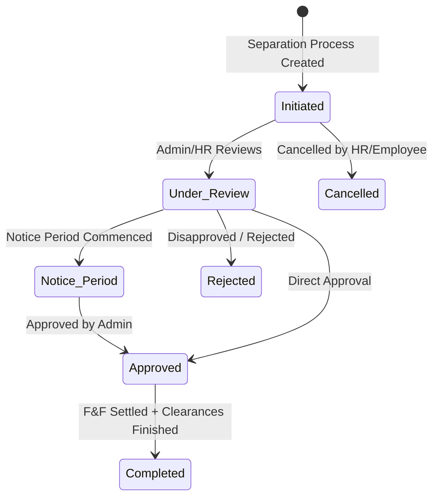

# Technical Specification & Requirements: Employee Lifecycle (Separation & Retirement)
## Document ID: SR-EM-10-TAB2
**Module:** SchoolSetup / EmployeeSetup  
**Version:** 5.0 (Final)  
**Date:** May 2026  
**Status:** Approved Specification  

---

## 1. Tab Overview: Separation & Retirement (`separation`)

The **Separation & Retirement** tab handles career exit transitions of employees inside the school. This includes voluntary resignations, administrative terminations, retirements, contract completion, absconding, and other forms of employment separation. 

The primary system entity involved is:
* **Employee Separation** (`sch_employee_separations`): Tracks full clearance checklists, exit interviews, settlements, and legal document issuances.

---

## 2. Database Schema Details (`sch_employee_separations`)

| Column Name | Data Type | Cast / Type | Default | Nullable | Description |
| :--- | :--- | :--- | :--- | :--- | :--- |
| `id` | `BIGINT` | Primary Key | *Auto-increment* | No | Unique identifier. |
| `employee_id` | `BIGINT` | Foreign Key | | No | Reference to target `sch_employees.id`. |
| `separation_type` | `VARCHAR(30)` | `string` | | No | Type of separation: `Resignation`, `Termination`, `Retirement`, `End_of_Contract`, `Death`, `Absconded`, `Other`. |
| `initiated_by` | `VARCHAR(20)` | `string` | | No | Initiator: `Employee`, `Employer`, `System`. |
| `initiated_at` | `TIMESTAMP` | `datetime` | `NULL` | Yes | Time when process was initiated. |
| `notice_period_days` | `INT` | `integer` | `0` | Yes | Number of notice period days required. |
| `notice_start_date` | `DATE` | `date` | | No | Start date of the notice period. |
| `intended_last_working_date` | `DATE` | `date` | `NULL` | Yes | Expected last working day. |
| `actual_last_working_date` | `DATE` | `date` | `NULL` | Yes | Confirmed actual last working day (must be on or after `notice_start_date`). |
| `reason_category` | `VARCHAR(100)` | `string` | `NULL` | Yes | Categorization of the separation reason. |
| `reason` | `TEXT` | `string` | `NULL` | Yes | Detailed exit reasons or remarks. |
| `status` | `VARCHAR(30)` | `string` | `Initiated` | No | State machine status: `Initiated`, `Under_Review`, `Notice_Period`, `Approved`, `Completed`, `Rejected`, `Cancelled`. |
| `approved_by` | `BIGINT` | Foreign Key | `NULL` | Yes | Reference to approving user (`sys_users.id`). |
| `approved_at` | `TIMESTAMP` | `datetime` | `NULL` | Yes | Timestamp of approval. |
| `exit_interview_done` | `TINYINT(1)` | `boolean` | `0` | No | Exit interview status. |
| `exit_interview_notes` | `TEXT` | `string` | `NULL` | Yes | Exit interview notes. |
| `clearance_complete` | `TINYINT(1)` | `boolean` | `0` | No | Indicates if asset/department clearance is complete. |
| `clearance_summary_json` | `JSON` | `array` | `[]` | Yes | Checklist audit (IT, library, accounts). |
| `final_settlement_done` | `TINYINT(1)` | `boolean` | `0` | No | Full & Final settlement completion status. |
| `final_settlement_amount` | `DECIMAL(10,2)` | `decimal:2` | `0.00` | Yes | Settlement payout amount. |
| `relieving_letter_issued` | `TINYINT(1)` | `boolean` | `0` | No | Whether the relieving letter was sent. |
| `experience_letter_issued` | `TINYINT(1)` | `boolean` | `0` | No | Whether the experience certificate was sent. |
| `relieving_letter_media_id` | `BIGINT` | Foreign Key | `NULL` | Yes | Media reference for relieving letter file. |
| `experience_letter_media_id` | `BIGINT` | Foreign Key | `NULL` | Yes | Media reference for experience letter file. |
| `is_eligible_for_rehire` | `TINYINT(1)` | `boolean` | `1` | No | Rehire eligibility status. |
| `rehire_notes` | `TEXT` | `string` | `NULL` | Yes | Rehire guidelines or reasoning. |
| `is_active` | `TINYINT(1)` | `boolean` | `1` | No | Record active flag. |
| `created_by` | `BIGINT` | Foreign Key | `NULL` | Yes | Creator ID (`sys_users.id`). |
| `deleted_at` | `TIMESTAMP` | Soft Delete | `NULL` | Yes | Soft-delete timestamp. |

---

## 3. Workflow State Machine & Status Updates

---

## 4. Business Logic & Validation Rules

### A. Form Validation (`EmployeeSeparationRequest`)
* **`employee_id`**: Required on creation (`POST`), must exist in active `sch_employees`.
* **`separation_type`**: Required string, in: `Resignation`, `Termination`, `Retirement`, `End_of_Contract`, `Death`, `Absconded`, `Other`.
* **`initiated_by`**: Required string, in: `Employee`, `Employer`, `System`.
* **`notice_start_date`**: Required valid date.
* **`actual_last_working_date`**: Optional date. Must be after or equal to `notice_start_date`.
* **`final_settlement_amount`**: Optional numeric value, minimum 0.
* **`relieving_letter` / `experience_letter`**: Valid files (PDF, JPG, JPEG, PNG, max 2MB).

### B. Auto-Approval Mechanism
When transitioning status to `Approved` or `Completed` via AJAX:
* Automatically binds `approved_by` to the authenticated user's ID (`Auth::id()`).
* Automatically binds `approved_at` to the current timestamp (`now()`).

### C. Notification Triggers
* **On Store**: Dispatches `EMPLOYEE_SEPARATION_CREATED` notification.
* **On Status Change**: Dispatches `EMPLOYEE_SEPARATION_STATUS_UPDATED` notification.
