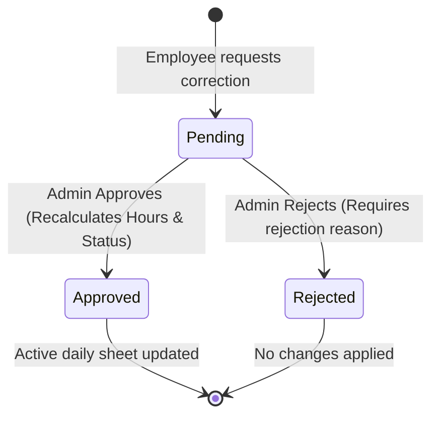

# Screen Requirement Traceability: Employee Attendance Tabs
## Document ID: SR-EM-12-MAPPING
**Module:** SchoolSetup / EmployeeSetup  
**Screen Name:** Employee Attendance Management  
**Route:** `school-setup.employee-attendance.index`  
**Dusk Test File:** [EmployeeAttendanceTest.php](file:///wsl.localhost/Ubuntu/home/shail/projects/prime_ai/tests/Browser/Modules/SchoolSetup/EmployeeAttendanceTest.php)  
**Status:** Approved & Verified (Test Automated)

---

## 1. Traceability Matrix

This screen is built as a consolidated tabbed dashboard with three primary operational views. Below is a mapping of each view to its database schema, key validations, and the automated browser tests verifying its behavior:

| Tab Title | Route Parameter | Target Eloquent Model | Primary DB Table | Core Validation Rule | Automated Dusk Test Case |
| :--- | :--- | :--- | :--- | :--- | :--- |
| **Employee Attendance** | `tab=employee_attendance` | `EmployeeAttendance` | `sch_employee_attendance` | Daily composite unique check (`employee_id` + `date`) | [test_can_view_attendance_sheet](file:///wsl.localhost/Ubuntu/home/shail/projects/prime_ai/tests/Browser/Modules/SchoolSetup/EmployeeAttendanceTest.php#L47-L58)<br>[test_can_save_attendance_individual_status](file:///wsl.localhost/Ubuntu/home/shail/projects/prime_ai/tests/Browser/Modules/SchoolSetup/EmployeeAttendanceTest.php#L60-L145) |
| **Employee Punches** | `tab=employee_attendance_punches` | `EmployeeAttendancePunch` | `sch_employee_attendance_punches` | Immutable raw swipe logs sorting (`punch_at desc`) | [test_can_view_employee_punches_tab](file:///wsl.localhost/Ubuntu/home/shail/projects/prime_ai/tests/Browser/Modules/SchoolSetup/EmployeeAttendanceTest.php#L147-L179) |
| **Employee Corrections** | `tab=employee_attendance_corrections` | `EmployeeAttendanceCorrection` | `sch_employee_attendance_corrections` | Non-duplicate pending logs, required review remarks on rejection | [test_can_approve_correction_request](file:///wsl.localhost/Ubuntu/home/shail/projects/prime_ai/tests/Browser/Modules/SchoolSetup/EmployeeAttendanceTest.php#L181-L260)<br>[test_can_reject_correction_request](file:///wsl.localhost/Ubuntu/home/shail/projects/prime_ai/tests/Browser/Modules/SchoolSetup/EmployeeAttendanceTest.php#L262-L340) |

---

## 2. Comprehensive Tab Specifications

### 2.1 Tab 1: Employee Attendance (`employee_attendance`)

> [!NOTE]
> This tab provides a real-time layout where administrators mark daily attendance statuses (Present, Absent, Half Day, On Leave) and specify custom hours or remarks.

#### A. Data Schema Highlights
- `employee_id` (FK to `sch_employees`, non-nullable)
- `date` (DATE, non-nullable)
- `status` (FK to `sch_staff_attendance_types`, non-nullable)
- `check_in_time` / `check_out_time` (TIME, nullable)
- `working_hours` (DECIMAL, nullable)

#### B. Functional Rules
1. **Weekend/Holiday Auto-detection**: Automatically highlights and inherits holiday statuses when calendar overlaps.
2. **Shift Grace Calculation**: Compares clock-in times to employee shifts to calculate `late_minutes` and `early_minutes`.
3. **Double Entry Block**: Restricts duplicate marking for the same employee-date combination.

#### C. Automated Test Coverage
- Navigates to `/school-setup/employee-attendance?tab=employee_attendance`.
- Verifies header elements ("Employee Details") and the bulk "Save Attendance" form button.
- Simulates clicking the status radio buttons, opening the detail modal to type `09:15` (Check-In) and `17:15` (Check-Out) with remarks.
- Saves the form, asserts the success flash message, and queries the database to guarantee the record matches the exact modal input.

---

### 2.2 Tab 2: Employee Punches (`employee_attendance_punches`)

> [!TIP]
> This tab acts as an immutable audit trail, tracking every raw biometric scan, QR scanner check-in, or RFID card swipe.

#### A. Data Schema Highlights
- `employee_id` (FK to `sch_employees`, non-nullable)
- `attendance_id` (FK to daily processed attendance, nullable)
- `punch_at` (TIMESTAMP, non-nullable)
- `punch_type` (VARCHAR: `In`, `Out`, `Break_In`, `Break_Out`)
- `attendance_source` (VARCHAR: `Biometric`, `Manual`, `QRCode`, `WebCheckIn`)

#### B. Functional Rules
1. **Immature Raw Punching**: Biometric devices stream entries straight into this table before processing.
2. **Geofence Boundary Check**: Validates device coordinates against perimeter; flags `is_invalid = 1` if boundaries are crossed.

#### C. Automated Test Coverage
- Seeds a raw punch record (`EmployeeAttendancePunch`) with dummy credentials.
- Visits `/school-setup/employee-attendance?tab=employee_attendance_punches`.
- Waits for the container selector `#employee_attendance_punches-pane` to render.
- Asserts presence of employee code, name, punch direction (`IN`), and source type (`Manual`).
- Cleans up and deletes the dummy punch log immediately.

---

### 2.3 Tab 3: Employee Corrections (`employee_attendance_corrections`)

> [!IMPORTANT]
> This tab manages employee adjustment requests, enabling timesheet edits via a strict review and approval pipeline.

#### A. State Machine Workflow


#### B. Functional Rules
1. **Approve Action**: Updates `sch_employee_attendance` check-in/out and status, recalculates working hours/overtime, and marks status as `Approved`.
2. **Reject Action**: Leaves timesheets untouched, requires a text-based rejection remark, and sets status to `Rejected`.

#### C. Automated Test Coverage
- **Approval Flow (`test_can_approve_correction_request`)**:
  - Seeds a daily attendance record and a pending correction request.
  - Opens `/school-setup/employee-attendance?tab=employee_attendance_corrections`.
  - Finds the specific approve button and clicks it to trigger the approval modal.
  - Enters `Approved by Dusk Automation` in `review_remarks` and submits.
  - Asserts that both the correction request (`Approved`) and daily attendance times (`09:00` - `17:00`) are updated in the database.
- **Rejection Flow (`test_can_reject_correction_request`)**:
  - Seeds a pending correction request.
  - Clicks the reject button to open the reject modal.
  - Types `Rejected: invalid times` in the mandatory reason box and submits.
  - Asserts the correction is flagged `Rejected` in the database, with no timesheet updates applied to the core attendance log.

---

## 3. Database Indexing Strategy (Performance)

To ensure this dashboard remains responsive with thousands of daily employee entries, the database must have covering indexes:

```sql
-- Coverage for daily attendance listings
CREATE UNIQUE INDEX idx_attendance_emp_date ON sch_employee_attendance (employee_id, date);

-- Coverage for punch timeline audit queries
CREATE INDEX idx_punches_timeline ON sch_employee_attendance_punches (employee_id, punch_at DESC);

-- Coverage for pending correction approval queues
CREATE INDEX idx_corrections_pending ON sch_employee_attendance_corrections (status, created_at DESC);
```
