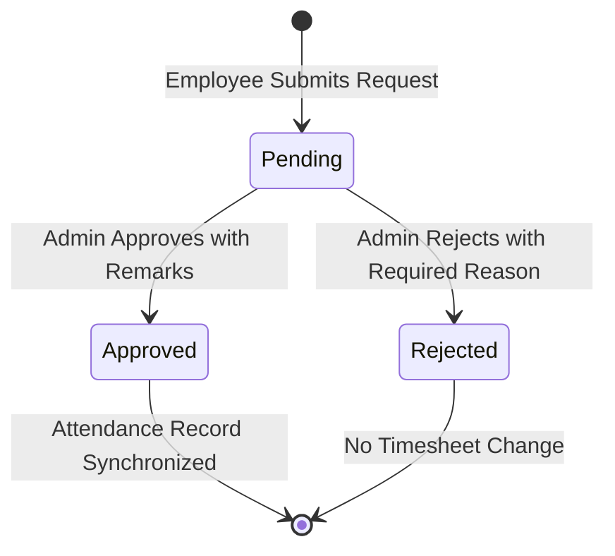

# Technical Specification & Requirements: Employee Attendance Corrections
## Document ID: SR-EM-12-TAB3
**Module:** SchoolSetup / EmployeeSetup  
**Version:** 5.0 (Final)  
**Date:** May 2026  
**Status:** Approved Specification  

---

## 1. Tab Overview: Employee Corrections (`employee_attendance_corrections`)

The **Employee Corrections** tab manages time adjustment requests. Employees who forget to check in, swipe incorrectly, or experience device failures can submit requests to edit their times. HR administrators review, approve, or reject these requests with custom notes, which automatically updates the active daily attendance sheet.

The primary system entity involved is:
* **Employee Attendance Correction** (`sch_employee_attendance_corrections`): Manages request data, requested statuses, review notes, and attachment media logs.

---

## 2. Database Schema Details (`sch_employee_attendance_corrections`)

| Column Name | Data Type | Default | Nullable | Description |
| :--- | :--- | :--- | :--- | :--- |
| `id` | `BIGINT` | *Auto-increment* | No | Primary Key. |
| `attendance_id` | `BIGINT` | | No | Reference to target processed daily record `sch_employee_attendance.id`. |
| `employee_id` | `BIGINT` | | No | Reference to target `sch_employees.id`. |
| `correction_type` | `VARCHAR(30)` | | No | Type: `Forgot_Punch_In`, `Forgot_Punch_Out`, `Wrong_Status`, `Time_Adjustment`, `On_Tour`, `Work_From_Home`, `Other`. |
| `requested_check_in` | `TIME` | `NULL` | Yes | Suggested corrected check-in time. |
| `requested_check_out`| `TIME` | `NULL` | Yes | Suggested corrected check-out time. |
| `requested_status` | `VARCHAR(50)` | `NULL` | Yes | Name of target status requested (e.g. `Present`, `Half Day`). |
| `reason` | `TEXT` | | No | Reason explaining why the correction is needed. |
| `supporting_doc_media_id` | `BIGINT` | `NULL` | Yes | Attachment ID from Media manager. |
| `status` | `VARCHAR(20)` | `'Pending'`| No | State: `Pending`, `Approved`, `Rejected`, `Cancelled`. |
| `reviewed_by` | `BIGINT` | `NULL` | Yes | Reference to reviewer `sys_users.id`. |
| `reviewed_at` | `TIMESTAMP` | `NULL` | Yes | Review timestamp. |
| `review_remarks` | `TEXT` | `NULL` | Yes | Reviewer comments / justification. |
| `applied_at` | `TIMESTAMP` | `NULL` | Yes | Exact time the timesheet changes were applied. |
| `is_active` | `TINYINT(1)` | `1` | No | Record active status. |
| `created_by` | `BIGINT` | `NULL` | Yes | Request creator. |
| `deleted_at` | `TIMESTAMP` | `NULL` | Yes | Soft-delete timestamp. |

---

## 3. Workflow & Approval State Machine

### A. Approval Flow Details
* **Approve Request (`EmployeeAttendanceController@approveCorrection`)**:
  - Optional `review_remarks` accepted.
  - Updates matching `sch_employee_attendance` record's `check_in_time`, `check_out_time`, or `status` to the requested parameters.
  - Recalculates metrics: working hours, late minutes, early minutes, and overtime status.
  - Set `status = 'Approved'`, `reviewed_by = Auth::id()`, `reviewed_at = now()`, and `applied_at = now()`.

* **Reject Request (`EmployeeAttendanceController@rejectCorrection`)**:
  - Required `review_remarks` must be supplied.
  - Marks status as `Rejected`.
  - Stays in database for audit trail. No change made to daily attendance sheet.
