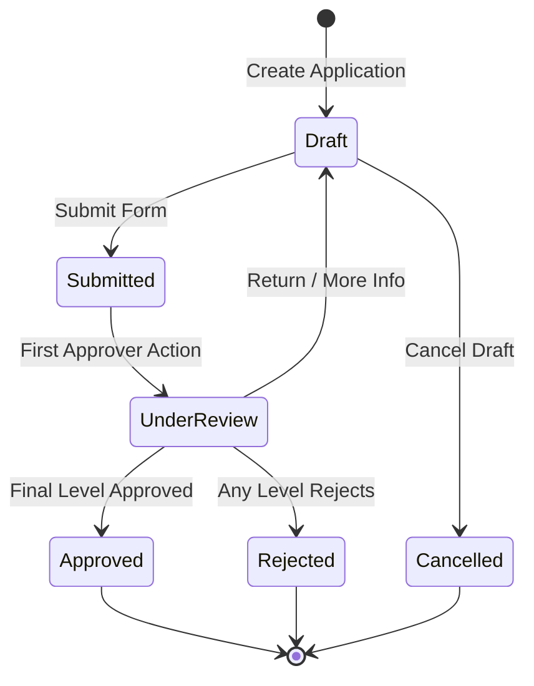
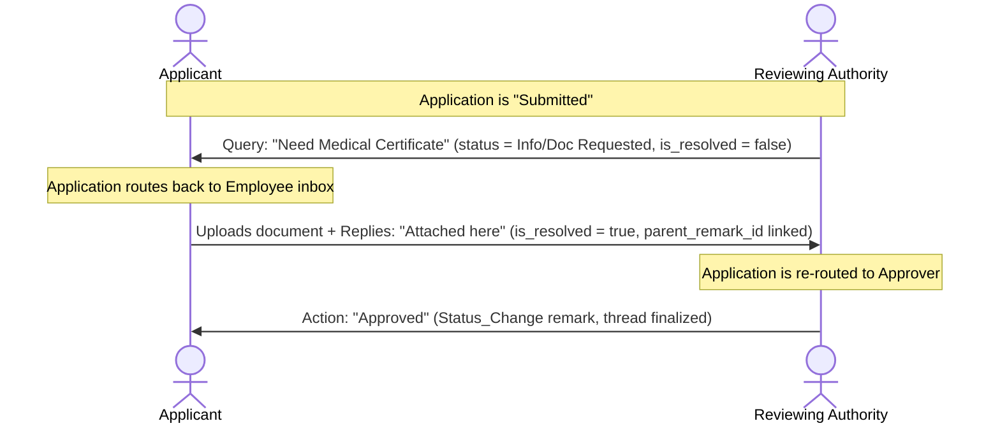

# Technical Specification & Requirements: Leave Applications

This document outlines the detailed requirements, database schemas, validation rules, business logic, calculations, and workflow state transitions for the **Leave Applications** and related configuration modules.

---

## Module Overview

The Leave Applications module provides a highly customizable leave management workflow. It allows administrative users to define various leave types, apply granular eligibility criteria (configurations) based on employee parameters, track real-time leave balances across academic/annual sessions, and submit applications that adhere to strict business rules.

The system is comprised of four primary inter-related entities:
1. **Staff Leave Types** (Base dictionary of leave categories)
2. **Staff Leave Config** (Eligibility and entitlement rules applied to specific roles/departments)
3. **Employee Leave Balance** (Real-time tracking of employee entitlements, usage, and pending days)
4. **Employee Leave Applications** (The actual leave application request submitted by or on behalf of employees)

---

## 1. Staff Leave Types (`sch_staff_leave_types`)

This table serves as the primary catalog of available leave categories (e.g., Casual Leave, Sick Leave, Maternity Leave) and defines their base characteristics.

### Database Schema Details

| Column Name | Data Type | Cast / Type | Default | Nullable | Description |
| :--- | :--- | :--- | :--- | :--- | :--- |
| `id` | `BIGINT` | Primary Key | *Auto-increment* | No | Unique identifier for the leave type. |
| `code` | `VARCHAR(50)` | `string` | | No | Unique shorthand code (e.g., `CL`, `SL`, `EL`). |
| `name` | `VARCHAR(100)` | `string` | | No | Descriptive name (e.g., "Casual Leave"). |
| `description` | `TEXT` | `string` | `NULL` | Yes | Explanatory note describing when this leave is applicable. |
| `is_paid` | `TINYINT(1)` | `boolean` | `1` | No | Flag indicating whether this is a paid leave. |
| `is_carry_forwardable` | `TINYINT(1)` | `boolean` | `0` | No | Can unused balances be carried forward to the next session? |
| `max_carry_forward` | `DECIMAL(8,2)` | `decimal:2` | `0.00` | No | Maximum number of days allowed to be carried forward. |
| `is_encashable` | `TINYINT(1)` | `boolean` | `0` | No | Can this leave be encashed for money? |
| `is_encashable_at_separation` | `TINYINT(1)` | `boolean` | `0` | No | Can unused days be encashed during resignation/retirement? |
| `max_encashable_days` | `DECIMAL(8,2)` | `decimal:2` | `0.00` | No | Maximum encashable days. |
| `requires_doc` | `TINYINT(1)` | `boolean` | `0` | No | Does this leave require supporting documents (e.g. medical certificate)? |
| `min_doc_required_days` | `INT` | `integer` | `3` | No | Minimum leave duration that triggers mandatory document submission. |
| `requires_substitute` | `TINYINT(1)` | `boolean` | `0` | No | Must the applicant assign another employee as a substitute/backup? |
| `allows_half_day` | `TINYINT(1)` | `boolean` | `0` | No | Can the employee apply for a half-day (0.5 days) leave? |
| `allows_back_dated` | `TINYINT(1)` | `boolean` | `0` | No | Can the leave start on a date prior to today's date? |
| `requires_approval` | `TINYINT(1)` | `boolean` | `1` | No | Does this leave require going through an approval workflow? |
| `min_days_per_application` | `DECIMAL(4,1)` | `decimal:1` | `0.5` | No | Minimum days allowed in a single application request. |
| `max_days_per_application` | `DECIMAL(4,1)` | `decimal:1` | `NULL` | Yes | Maximum days allowed in a single application request. |
| `min_advance_notice_days` | `INT` | `integer` | `0` | No | Minimum advance days notice needed (ignored if marked as emergency). |
| `max_consecutive_days` | `INT` | `integer` | `0` | No | Maximum consecutive days allowed in a single stretch. |
| `display_order` | `INT` | `integer` | `0` | No | Relative sorting order in frontend drop-downs and lists. |
| `color_hex` | `VARCHAR(7)` | `string` | `#CCCCCC` | No | Hexadecimal color code representing the leave type on calendars. |
| `is_system` | `TINYINT(1)` | `boolean` | `0` | No | Standard system-locked leave (cannot be edited or deleted). |
| `is_active` | `TINYINT(1)` | `boolean` | `1` | No | Active status toggle. |
| `created_by` | `BIGINT` | `integer` | `NULL` | Yes | ID of user who created the record. |
| `deleted_at` | `TIMESTAMP` | Soft Delete | `NULL` | Yes | Timestamp of soft-deletion. |

### Base Validation Rules

* **Create (`store`):**
  * `code`: `required|string|max:50|unique:tenant.sch_staff_leave_types,code`
  * `name`: `required|string|max:100|unique:tenant.sch_staff_leave_types,name`
  * `is_paid`, `is_carry_forwardable`, `is_encashable`, `requires_doc`, `requires_substitute`, `allows_half_day`, `allows_back_dated`, `requires_approval`: `boolean`
  * `max_carry_forward`: `required_if:is_carry_forwardable,1|numeric|min:0`
  * `min_doc_required_days`: `required_if:requires_doc,1|integer|min:1`
  * `min_days_per_application`: `required|numeric|min:0.5`
  * `max_days_per_application`: `nullable|numeric|gte:min_days_per_application`
  * `min_advance_notice_days`, `max_consecutive_days`, `display_order`: `integer|min:0`
  * `color_hex`: `nullable|string|max:7`
* **Update (`update`):**
  * Same rules, but unique validation excludes current record ID:
    * `code`: `required|string|max:50|unique:tenant.sch_staff_leave_types,code,` . `$id`
    * `name`: `required|string|max:100|unique:tenant.sch_staff_leave_types,name,` . `$id`

---

## 2. Staff Leave Config (`sch_staff_leave_config`)

Defines custom override parameters and allocations for specific cohorts of employees (e.g. teaching staff vs. administrative staff, contract vs. permanent).

### Database Schema Details

| Column Name | Data Type | Cast / Type | Default | Nullable | Description |
| :--- | :--- | :--- | :--- | :--- | :--- |
| `id` | `BIGINT` | Primary Key | *Auto-increment* | No | Unique identifier. |
| `leave_type_id` | `BIGINT` | Foreign Key | | No | Reference to `sch_staff_leave_types.id`. |
| `applies_to_role_id` | `BIGINT` | Foreign Key | `NULL` | Yes | Target role (from `sys_roles.id`). `NULL` means applies to all roles. |
| `applies_to_department_id` | `BIGINT` | Foreign Key | `NULL` | Yes | Target department (`sch_department.id`). `NULL` means all departments. |
| `applies_to_designation_id` | `BIGINT` | Foreign Key | `NULL` | Yes | Target designation (`sch_designation.id`). `NULL` means all designations. |
| `applies_to_employment_type` | `VARCHAR(50)` | `string` | `NULL` | Yes | Target employment type (e.g. `Permanent`, `Probation`, `Contract`). |
| `annual_entitlement` | `DECIMAL(5,2)` | `decimal:2` | `0.00` | No | Base annual entitlement (in days) allocated to matching staff. |
| `accrual_method` | `VARCHAR(50)` | `string` | `UPFRONT` | No | Entitlement credit model: `UPFRONT`, `MONTHLY_ACCRUAL`, `PRO_RATA`. |
| `accrual_start_offset_months` | `INT` | `integer` | `0` | No | Waiting period in months before accrual starts after joining. |
| `is_carry_forwardable` | `TINYINT(1)` | `boolean` | `0` | No | Override for carry forward capability. |
| `max_carry_forward` | `DECIMAL(5,2)` | `decimal:2` | `0.00` | No | Override for max carry forward limit. |
| `is_encashable_at_separation` | `TINYINT(1)` | `boolean` | `0` | No | Override for encashment at separation. |
| `max_encashable_days` | `DECIMAL(5,2)` | `decimal:2` | `0.00` | No | Override for max encashable days. |
| `available_during_probation` | `TINYINT(1)` | `boolean` | `1` | No | Can employees on probation apply for this leave? |
| `probation_entitlement_pro_rata` | `TINYINT(1)` | `boolean` | `0` | No | Should the annual entitlement be pro-rated during probation? |
| `priority` | `INT` | `integer` | `99` | No | Rule matching priority (lower value = higher priority). |
| `is_active` | `TINYINT(1)` | `boolean` | `1` | No | Status toggle. |
| `created_by` | `BIGINT` | `integer` | `NULL` | Yes | ID of creator. |
| `deleted_at` | `TIMESTAMP` | Soft Delete | `NULL` | Yes | Soft-delete timestamp. |

### Rule Specificity Resolution Algorithm

When matching an employee's profile to a configuration rule, the system evaluates active (`is_active = 1`) `StaffLeaveConfig` rules for the selected `leave_type_id` using this matching process:

1. **Hierarchy Matching Check:** Filter configurations where the employee's active role, department, designation, and employment type match the config parameters **or** where those parameters are `NULL` (universal match).
2. **Apply Specificity Sort:**
   * **First Sort:** Sort ascending by `priority` (lower numeric values match first).
   * **Second Sort:** Sort descending by **Specificity Score** (most-specific rule matching first). The specificity score is calculated as the count of non-null parameters matching the employee profile:
     ```php
     $specificity = 0;
     if ($config->applies_to_role_id) $specificity++;
     if ($config->applies_to_department_id) $specificity++;
     if ($config->applies_to_designation_id) $specificity++;
     if ($config->applies_to_employment_type) $specificity++;
     ```
3. **Primary Match Selection:** The first item in the sorted collection (`->first()`) represents the matching configuration for that employee.

---

## 3. Employee Leave Balance (`sch_employee_leave_balance`)

Maintains real-time leave ledger values for each employee per annual session and leave type.

### Database Schema Details

| Column Name | Data Type | Cast / Type | Default | Nullable | Description |
| :--- | :--- | :--- | :--- | :--- | :--- |
| `id` | `BIGINT` | Primary Key | *Auto-increment* | No | Unique identifier. |
| `employee_id` | `BIGINT` | Foreign Key | | No | Reference to `sch_employees.id`. |
| `annual_leave_sessions_id` | `VARCHAR(9)` | `string` | | No | Reference to session `name` (e.g. `2026-27`). |
| `leave_type_id` | `BIGINT` | Foreign Key | | No | Reference to `sch_staff_leave_types.id`. |
| `opening_balance` | `DECIMAL(5,2)` | `decimal:2` | `0.00` | No | Initial credited days at session start. |
| `carry_forward` | `DECIMAL(5,2)` | `decimal:2` | `0.00` | No | Brought-forward balance from previous session. |
| `total_used` | `DECIMAL(5,2)` | `decimal:2` | `0.00` | No | Total leave days approved and finalized. |
| `total_pending` | `DECIMAL(5,2)` | `decimal:2` | `0.00` | No | Leave days currently in "Submitted" or "Under Review" state. |
| `manual_adjustment` | `DECIMAL(5,2)` | `decimal:2` | `0.00` | No | Mid-session administrative adjustments (positive/negative). |
| `adjustment_reason` | `VARCHAR(255)` | `string` | `NULL` | Yes | Explanation for the manual adjustment. |
| `is_active` | `TINYINT(1)` | `boolean` | `1` | No | Status indicator. |
| `created_by` | `BIGINT` | `integer` | `NULL` | Yes | Creator ID. |
| `updated_by` | `BIGINT` | `integer` | `NULL` | Yes | Editor ID. |
| `deleted_at` | `TIMESTAMP` | Soft Delete | `NULL` | Yes | Soft-delete timestamp. |

### Calculations & Business Formulas

* **Total Entitled Days:**
  $$\text{Total Entitled} = \text{opening\_balance} + \text{carry\_forward} + \text{manual\_adjustment}$$
* **Net Available Balance:**
  $$\text{Available Balance} = (\text{opening\_balance} + \text{carry\_forward} + \text{manual\_adjustment}) - \text{total\_used} - \text{total\_pending}$$

### Automatic Seeding Logic
When a new `AnnualLeaveSession` is activated or a new employee profile is verified, balance records are automatically created:
* **Pre-requisite Validation:** Only seed configurations that point to currently active, non-orphaned leave types in the database using a `whereHas('leaveType')` filter constraint.
* **Seeding Formula:** `opening_balance` defaults to the matched configuration's `annual_entitlement`. `carry_forward` defaults to `0.00` until session rollover calculations run.

---

## 4. Employee Leave Applications (`sch_employee_leave_applications`)

Stores individual leave requests and manages their lifecycle, approvals, and balance transitions.

### Database Schema Details

| Column Name | Data Type | Cast / Type | Default | Nullable | Description |
| :--- | :--- | :--- | :--- | :--- | :--- |
| `id` | `BIGINT` | Primary Key | *Auto-increment* | No | Unique identifier. |
| `employee_id` | `BIGINT` | Foreign Key | | No | Reference to applicant (`sch_employees.id`). |
| `annual_leave_sessions_id` | `BIGINT` | Foreign Key | | No | Reference to academic session (`sch_annual_leave_sessions.id`). |
| `leave_type_id` | `BIGINT` | Foreign Key | | No | Reference to target `sch_staff_leave_types.id`. |
| `from_date` | `DATE` | `date` | | No | Leave start date (inclusive). |
| `to_date` | `DATE` | `date` | | No | Leave end date (inclusive). |
| `total_days` | `DECIMAL(4,1)` | `decimal:1` | | No | Calculated duration in days (deducting holidays/weekends). |
| `is_half_day` | `TINYINT(1)` | `boolean` | `0` | No | Flag indicating half-day request. |
| `half_day_slot` | `VARCHAR(20)` | `string` | `NULL` | Yes | Slot definition: `Morning` or `Afternoon`. |
| `is_emergency` | `TINYINT(1)` | `boolean` | `0` | No | Flag indicating emergency bypass of notice rules. |
| `reason` | `TEXT` | `string` | | No | Applicant's explanation for requesting leave. |
| `substitute_employee_id` | `BIGINT` | Foreign Key | `NULL` | Yes | Backup employee ID (`sch_employees.id`). |
| `status` | `VARCHAR(30)` | `string` | `Draft` | No | State: `Draft`, `Submitted`, `Under Review`, `Approved`, `Rejected`, `Cancelled`. |
| `approval_policy_id` | `BIGINT` | Foreign Key | `NULL` | Yes | Matched approval policy (`sch_leave_approval_policies.id`). |
| `current_level_number` | `INT` | `integer` | `NULL` | Yes | Current active level in approval flow. |
| `pending_with_user_id` | `BIGINT` | Foreign Key | `NULL` | Yes | Current active approver (`sys_users.id`). |
| `applied_by` | `BIGINT` | Foreign Key | | No | User submitting request (`sys_users.id`). |
| `submitted_at` | `TIMESTAMP` | `datetime` | `NULL` | Yes | Submission timestamp. |
| `cancelled_by` | `BIGINT` | Foreign Key | `NULL` | Yes | User cancelling request. |
| `cancelled_at` | `TIMESTAMP` | `datetime` | `NULL` | Yes | Cancellation timestamp. |
| `cancellation_reason` | `VARCHAR(255)` | `string` | `NULL` | Yes | Cancellation reason. |
| `final_reviewed_by` | `BIGINT` | Foreign Key | `NULL` | Yes | Final reviewer. |
| `final_reviewed_at` | `TIMESTAMP` | `datetime` | `NULL` | Yes | Final review timestamp. |
| `approved_days` | `DECIMAL(4,1)` | `decimal:1` | `0.0` | No | Actual approved days (granted on final review). |
| `final_remarks` | `TEXT` | `string` | `NULL` | Yes | Remarks by final reviewer. |
| `is_active` | `TINYINT(1)` | `boolean` | `1` | No | Active status toggle. |
| `created_by` | `BIGINT` | `integer` | `NULL` | Yes | Creator ID. |
| `deleted_at` | `TIMESTAMP` | Soft Delete | `NULL` | Yes | Soft-delete timestamp. |

---

## 5. Working Days, Weekends, and Holidays Calculation Logic

The backend uses a strict algorithm to compute `total_days` (actual working days) in `calculateLeaveDays($fromDate, $toDate, $sessionId, $isHalfDay)`:
1. **Half-Day Check:** If `is_half_day` is true, the method bypasses other iterations and immediately returns `0.5`.
2. **Weekend Check:** The method loops through each date in the period (inclusive). If the date falls on a weekend (`$date->isWeekend()`), it is omitted from the count.
3. **Holiday Check:** Active holidays (`sch_holidays`) for the session that fall within the range are fetched:
   ```php
   Holiday::where('annual_leave_sessions_id', $sessionId)
       ->whereBetween('holiday_date', [$fromDate, $toDate])
       ->where('is_active', 1)
       ->pluck('holiday_date');
   ```
   If any date matches the holidays array, it is omitted from the count.
4. **Final Return:** The remaining working day count is compiled and updated as the definitive request size.

---

## Business Validation Rules (Exhaustive)

Before a leave application can be saved or transitioned into the `Submitted` status, the following backend validations must pass:

1. **Date Range Bounds:** `to_date` must be greater than or equal to `from_date`.
2. **Session Consistency Check:** `from_date` and `to_date` must fall within the selected `AnnualLeaveSession` boundaries (e.g. `start_date` to `end_date` of that academic year session).
3. **Half-day Restriction:**
   * If `is_half_day` is checked, the `total_days` must be forced to exactly `0.5` in the backend.
   * The selected `leave_type` must have `allows_half_day` set to true.
   * `half_day_slot` must be explicitly selected as either `Morning` or `Afternoon`.
4. **Back-dated Validation:**
   * If `from_date` is in the past (prior to today), the selected `leave_type` must allow back-dated entries (`allows_back_dated` = true).
5. **Notice Period Validation:**
   * If the application is **not** an emergency (`is_emergency` = false), the notice period is calculated:
     $$\text{Days Notice} = \text{from\_date} - \text{today}$$
   * `Days Notice` must be greater than or equal to `min_advance_notice_days` defined in the resolved configurations or base leave type.
6. **Double Application / Overlap Check:**
   * The database must be queried for existing active/non-finalized applications:
     ```php
     EmployeeLeaveApplication::where('employee_id', $employeeId)
         ->whereNotIn('status', ['Rejected', 'Cancelled'])
         ->where('from_date', '<=', $toDate)
         ->where('to_date', '>=', $fromDate)
         ->exists();
     ```
   * If an overlap is found, the transaction is aborted.
7. **Probation Limitations:**
   * If `Employee.employment_type = 'Probation'`, then the resolved `StaffLeaveConfig.available_during_probation` must be `true` (default: true).
8. **Substitute Requirement:**
   * If `StaffLeaveType.requires_substitute = true`:
     * `substitute_employee_id` must be provided and active.
     * `substitute_employee_id` **cannot** be equal to `employee_id` (an employee cannot substitute for themselves).
9. **Document Requirements:**
   * If `StaffLeaveType.requires_doc = true` AND the application's `total_days` is greater than or equal to `StaffLeaveType.min_doc_required_days`:
     * At least one valid attachment must exist in the application's associated documents (`EmployeeLeaveApplicationDoc`) before transitioning to `Submitted`.
10. **Paid Leave Balance Verification:**
    * If `StaffLeaveType.is_paid = true`:
      * An active balance record must exist for the employee, session, and leave type.
      * The requested `total_days` must be less than or equal to the employee's `available_balance` computed from `sch_employee_leave_balance`.
11. **Application Limits:**
    * `total_days` must be $\ge$ `min_days_per_application`.
    * `total_days` must be $\le$ `max_days_per_application` (if configured).
    * `total_days` must be $\le$ `max_consecutive_days` (if configured).

---

## Workflow State Transitions & Database Sync

The lifecycle of an application and how it updates the `sch_employee_leave_balance` table during state changes is illustrated below:



### Database Synchronization Details

All state changes must occur within an isolated database transaction to maintain balance ledger consistency:

#### A. When transitioning from `Draft` -> `Submitted`
1. If the leave type is **paid**, find the matching `EmployeeLeaveBalance` record and increment the `total_pending` counter:
   $$\text{total\_pending} = \text{total\_pending} + \text{total\_days}$$
2. Generate all the pending approval records (`EmployeeLeaveApproval`) across the levels of the matched `LeaveApprovalPolicy` and link the initial level's approver to `pending_with_user_id`.

#### B. When transitioning from `Submitted`/`Under Review` -> `Approved` (Final Action)
1. If the leave type is **paid**, decrement the pending counter and increment the used counter:
   $$\text{total\_pending} = \text{total\_pending} - \text{total\_days}$$
   $$\text{total\_used} = \text{total\_used} + \text{total\_days}$$
2. Set `approved_days` equal to `total_days` and populate `final_reviewed_at`, `final_reviewed_by`, and update the status to `Approved`.

#### C. When transitioning from `Submitted`/`Under Review` -> `Rejected` or `Cancelled`
1. If the leave type is **paid**, decrement the pending counter:
   $$\text{total\_pending} = \text{total\_pending} - \text{total\_days}$$
2. Mark the status as `Rejected` or `Cancelled`, setting the respective timestamps (`acted_at`, `cancelled_at`) and auditing users.

---

## 6. Delete, Restore, and Force-Delete Balance & Asset Lifecycle Rules

To maintain database referential integrity and ledger consistency, deletion events trigger cascading balance and physical asset transitions:

### A. Soft-Deletion (`destroy`)
When an application is soft-deleted, its status is evaluated to correct the employee balance:
1. **If status is `Submitted`, `Under Review`, `Info Requested`, `Doc Requested` or `Escalated`:**
   $$\text{total\_pending} = \text{total\_pending} - \text{total\_days}$$
2. **If status is `Approved`:**
   $$\text{total\_used} = \text{total\_used} - \text{approved\_days}$$
3. The application record is then soft-deleted (`deleted_at` timestamp is populated).

### B. Restoration (`restore`)
When a soft-deleted application is restored:
1. **If status is `Submitted`:**
   $$\text{total\_pending} = \text{total\_pending} + \text{total\_days}$$
2. **If status is `Approved`:**
   $$\text{total\_used} = \text{total\_used} + \text{total\_days}$$
3. The `deleted_at` column is returned to `NULL`.

### C. Force-Deletion (`forceDelete`)
Force-deleting an application permanently purges all records and physical storage assets in a database transaction:
1. **Media Library Clearance:** Deletes all uploaded physical files from the server storage (via Spatie Media Library collection `leave_documents`).
2. **Document Record Clearance:** Force-deletes all associated `EmployeeLeaveApplicationDoc` records.
3. **Discussion Audit Clearance:** Force-deletes all comments and remarks (`EmployeeLeaveApplicationRemark`).
4. **Approval Instance Clearance:** Force-deletes all sequential approval instances (`EmployeeLeaveApproval`).
5. **Record Purge:** Permanently drops the application row from the `sch_employee_leave_applications` table.

---

## 7. Chat, Remarks, and Discussion Thread Workflow (`sch_employee_leave_application_remarks`)

To enable seamless, contextual communication between applicants and reviewing authorities, the system supports a real-time, threaded remarks/chat panel mapped directly to each leave application's timeline.

### A. Remarks Database Schema Details

| Column Name | Data Type | Cast / Type | Default | Nullable | Description |
| :--- | :--- | :--- | :--- | :--- | :--- |
| `id` | `BIGINT` | Primary Key | *Auto-increment* | No | Unique identifier. |
| `leave_application_id` | `BIGINT` | Foreign Key | | No | Reference to `sch_employee_leave_applications.id`. |
| `approval_level_id` | `BIGINT` | Foreign Key | `NULL` | Yes | Reference to specific `sch_leave_approval_policy_levels.id` if triggered during a level action. |
| `remark_type` | `VARCHAR(30)` | `string` | `Comment` | No | Options: `Comment` (free chat message) or `Status_Change` (system-generated audit log). |
| `message` | `TEXT` | `string` | | No | The remark body. |
| `is_from_approver` | `TINYINT(1)` | `boolean` | `0` | No | True if remarks are left by an approver/admin, False if by applicant. |
| `remarked_by` | `BIGINT` | Foreign Key | | No | The authoring user (`sys_users.id`). |
| `parent_remark_id` | `BIGINT` | Foreign Key | `NULL` | Yes | Reference to parent comment for nested replies. |
| `is_resolved` | `TINYINT(1)` | `boolean` | `0` | No | True if clarifications requested in this comment are resolved. |
| `resolved_at` | `TIMESTAMP` | `datetime` | `NULL` | Yes | Resolution timestamp. |
| `read_at` | `TIMESTAMP` | `datetime` | `NULL` | Yes | Timestamp indicating when the recipient read the message. |
| `read_by` | `BIGINT` | Foreign Key | `NULL` | Yes | The user who read the comment (`sys_users.id`). |
| `old_status` | `VARCHAR(30)` | `string` | `NULL` | Yes | Previous application status (for `Status_Change` types). |
| `new_status` | `VARCHAR(30)` | `string` | `NULL` | Yes | Updated application status (for `Status_Change` types). |
| `is_active` | `TINYINT(1)` | `boolean` | `1` | No | Active toggle. |
| `created_by` | `BIGINT` | `integer` | `NULL` | Yes | Creator ID. |

### B. Chat & Discussion State Workflow



### C. Technical Implementation & Business Rules

1. **System-Generated Audit (`Status_Change`):**
   * Whenever an action occurs (e.g. initial submission, level approval, escalation, skipping, rejection, cancellation, or administrative locking), the system automatically creates a `Status_Change` record.
   * It populates `old_status`, `new_status`, `message` (summarizing the transition), `is_from_approver` (evaluated dynamically based on the actor's system roles), and `remarked_by` (the actor's user ID).
2. **Auto-Read Receipt Mechanic:**
   * To prevent unread count issues, when a user views the list of applications (`index`) or is redirected to the application show view (`show`), the system runs an automatic read transition:
     ```php
     EmployeeLeaveApplicationRemark::where('leave_application_id', $applicationId)
         ->whereNull('read_at')
         ->where('remarked_by', '!=', Auth::id())
         ->update([
             'read_at' => now(),
             'read_by' => Auth::id()
         ]);
     ```
   * This automatically ensures that recipients (e.g., employee checking HOD query, HOD checking employee reply) mark the discussion as read simply by accessing the dashboard or details page.
3. **Clarification Resolution Loop:**
   * When an application is flagged as `Info Requested` or `Doc Requested`, the query is flagged with `is_resolved = 0`.
   * Upon applicant's resubmission (with new comment or document attachments), the system automatically updates the unresolved remarks:
     ```php
     $queryRemarks->update([
         'is_resolved' => true,
         'resolved_at' => now()
     ]);
     ```
4. **Discussion Thread Locking:**
   * If an Administrator or Approver actions the request with `lock_application = true`, a system comment `[System: Thread Locked]` is posted. Under a locked thread, all participant inputs are blocked, ensuring post-approval records cannot be altered or argued mid-term.
