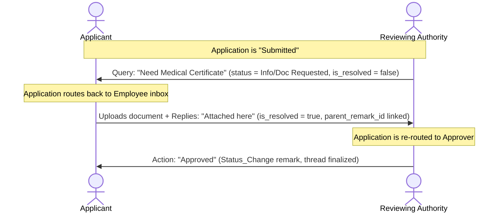

# Technical Specification & Requirements: Leave Approval Requests

This document outlines the detailed requirements, database schemas, validation rules, business logic, calculations, and workflow state transitions for the **Leave Approval Requests** and related policy configurations.

---

## Module Overview

The Leave Approval module provides hierarchical routing, multi-level checks, and custom approval strategies for employee leave applications. It ensures that requests are automatically routed to correct authorities (managers, departments, roles, or designated users), supports custom approval rules, and automatically handles escalations and actions.

The system is comprised of four primary inter-related entities:
1. **Leave Approval Policies** (Primary routing definitions matching employee cohorts)
2. **Approval Policy Levels** (Defines sequence and criteria of checks per policy)
3. **Policy Level Approvers** (Resolves actual approvers dynamically based on applicant context)
4. **Leave Approval Requests** (Active approval instances and action logging)

---

## 1. Leave Approval Policies (`sch_leave_approval_policies`)

Defines the highest level rules for leave approval routing. Policies are matched to employees based on their active profiles.

### Database Schema Details

| Column Name | Data Type | Cast / Type | Default | Nullable | Description |
| :--- | :--- | :--- | :--- | :--- | :--- |
| `id` | `BIGINT` | Primary Key | *Auto-increment* | No | Unique identifier. |
| `name` | `VARCHAR(100)` | `string` | | No | Descriptive name (e.g. "Teacher Casual Leave Policy"). |
| `description` | `TEXT` | `string` | `NULL` | Yes | Explanation of the policy's purpose. |
| `applies_to_role_id` | `BIGINT` | Foreign Key | `NULL` | Yes | Target role (from `sys_roles.id`). `NULL` means all roles. |
| `applies_to_department_id` | `BIGINT` | Foreign Key | `NULL` | Yes | Target department (`sch_department.id`). `NULL` means all departments. |
| `applies_to_designation_id` | `BIGINT` | Foreign Key | `NULL` | Yes | Target designation (`sch_designation.id`). `NULL` means all designations. |
| `applies_to_leave_type_id` | `BIGINT` | Foreign Key | `NULL` | Yes | Target leave type (`sch_staff_leave_types.id`). `NULL` means all. |
| `priority` | `INT` | `integer` | `99` | No | Evaluation order (lower values match first). |
| `is_active` | `TINYINT(1)` | `boolean` | `1` | No | Toggle status. |
| `created_by` | `BIGINT` | `integer` | `NULL` | Yes | Creator user ID. |
| `deleted_at` | `TIMESTAMP` | Soft Delete | `NULL` | Yes | Soft-delete timestamp. |

### Policy Resolution Algorithm
When a leave application is transitioned to the `Submitted` state, the system resolves the matching policy:
1. Filter all active policies (`is_active = 1`) that match the applicant's role, department, designation, and selected leave type (or are `NULL`).
2. Sort ascending by `priority` (primary sort).
3. Sort descending by **Specificity Score** (secondary sort). The score represents the count of non-null attributes matching the employee:
   ```php
   $specificity = 0;
   if ($p->applies_to_role_id) $specificity++;
   if ($p->applies_to_department_id) $specificity++;
   if ($p->applies_to_designation_id) $specificity++;
   if ($p->applies_to_leave_type_id) $specificity++;
   ```
4. The first matching policy is assigned to `approval_policy_id` on the application.

---

## 2. Approval Policy Levels (`sch_leave_approval_policy_levels`)

Defines sequential steps within a policy (e.g. Level 1: HOD, Level 2: HR Manager).

### Database Schema Details

| Column Name | Data Type | Cast / Type | Default | Nullable | Description |
| :--- | :--- | :--- | :--- | :--- | :--- |
| `id` | `BIGINT` | Primary Key | *Auto-increment* | No | Unique identifier. |
| `policy_id` | `BIGINT` | Foreign Key | | No | Reference to `sch_leave_approval_policies.id`. |
| `level_number` | `INT` | `integer` | `1` | No | Sequence number (e.g., Level 1, Level 2). |
| `level_name` | `VARCHAR(100)` | `string` | | No | Label (e.g., "Department Head Review"). |
| `approval_mode` | `VARCHAR(20)` | `string` | `ANY_ONE` | No | Options: `ANY_ONE` (first action decides) or `ALL` (everyone must approve). |
| `escalation_after_hours` | `INT` | `integer` | `0` | No | Time limit in hours before automatic escalation triggers. `0` disables it. |
| `notify_applicant_on_escalation` | `TINYINT(1)` | `boolean` | `0` | No | Should applicants receive a notification when the level escalates? |
| `is_active` | `TINYINT(1)` | `boolean` | `1` | No | Status indicator. |
| `created_by` | `BIGINT` | `integer` | `NULL` | Yes | Creator ID. |
| `deleted_at` | `TIMESTAMP` | Soft Delete | `NULL` | Yes | Soft-delete timestamp. |

### Level Number Composite Unique Constraint
To prevent sequential overlaps within a single policy:
* **Constraint Rule:** Within the same `policy_id`, a `level_number` must be strictly unique.
* **Validation Rule (Laravel):**
  ```php
  Rule::unique('sch_leave_approval_policy_levels')->where(function ($query) use ($request) {
      return $query->where('policy_id', $request->policy_id)->whereNull('deleted_at');
  })
  ```

### Cascade Deletion Blocker
To protect integrity, a policy level **cannot be soft-deleted or force-deleted** if:
1. There are any pending approvals (`action = 'Pending'`) currently associated with that level.
2. There are active applications currently on that sequence level (`current_level_number = level.level_number` and status is not `Approved`, `Rejected`, or `Cancelled`).

---

## 3. Policy Level Approvers (`sch_leave_approval_level_approvers`)

Maps specific approver identities or dynamic roles to a policy level step.

### Database Schema Details

| Column Name | Data Type | Cast / Type | Default | Nullable | Description |
| :--- | :--- | :--- | :--- | :--- | :--- |
| `id` | `BIGINT` | Primary Key | *Auto-increment* | No | Unique identifier. |
| `level_id` | `BIGINT` | Foreign Key | | No | Reference to `sch_leave_approval_policy_levels.id`. |
| `approver_type` | `VARCHAR(30)` | `string` | | No | Resolution type: `USER`, `ROLE`, `DESIGNATION`, `DEPARTMENT_HEAD`, `REPORTING_TO`. |
| `approver_user_id` | `BIGINT` | Foreign Key | `NULL` | Yes | Reference to direct user (`sys_users.id`). |
| `approver_role_id` | `BIGINT` | Foreign Key | `NULL` | Yes | Reference to target role (`sys_roles.id`). |
| `approver_designation_id` | `BIGINT` | Foreign Key | `NULL` | Yes | Reference to designation (`sch_designation.id`). |
| `approver_department_id` | `BIGINT` | Foreign Key | `NULL` | Yes | Target department for the manager check. |
| `approver_reporting_to_id` | `BIGINT` | Foreign Key | `NULL` | Yes | Reference to manager. |
| `is_active` | `TINYINT(1)` | `boolean` | `1` | No | Active toggle status. |
| `created_by` | `BIGINT` | `integer` | `NULL` | Yes | Creator ID. |
| `deleted_at` | `TIMESTAMP` | Soft Delete | `NULL` | Yes | Soft-delete timestamp. |

### Unique Composite Assignment Constraint
To prevent duplicate assignments of the same entity to a level:
* **Constraint Rule:** The combination of `level_id`, `approver_type`, and the specific ID of the entity (`approver_user_id` / `approver_role_id` / `approver_designation_id` / `approver_department_id`) must be strictly unique.
* **Controller Validation Check:**
  ```php
  LeaveApprovalLevelApprover::where([
      'level_id' => $validated['level_id'],
      'approver_type' => $validated['approver_type'],
      'approver_user_id' => $validated['approver_user_id'] ?? null,
      'approver_role_id' => $validated['approver_role_id'] ?? null,
      'approver_designation_id' => $validated['approver_designation_id'] ?? null,
      'approver_department_id' => $validated['approver_department_id'] ?? null,
  ])->exists();
  ```

### Dynamic Approver Resolution Logic

At runtime, the actual user IDs authorized to approve are resolved based on the `approver_type`:

```php
match($this->approver_type) {
    'USER'            => User::where('id', $this->approver_user_id)->get(),
    'ROLE'            => User::whereHas('employee.employeeProfiles', fn($q) => $q->where('role_id', $this->approver_role_id)->where('is_active', true))->get(),
    'DESIGNATION'     => User::whereHas('employee.employeeProfiles', fn($q) => $q->where('designation_id', $this->approver_designation_id)->where('is_active', true))->get(),
    'DEPARTMENT_HEAD' => User::whereHas('employee.employeeProfiles', fn($q) => $q->where('department_id', $this->approver_department_id)->where('can_manage_staff', true)->where('is_active', true))->get(),
    'REPORTING_TO'    => $employee->activeEmployeeProfile && $employee->activeEmployeeProfile->reportingTo 
                            ? collect([$employee->activeEmployeeProfile->reportingTo->user]) 
                            : collect(),
    default           => collect()
};
```

---

## 4. Leave Approval Requests (`sch_employee_leave_approvals`)

Records active, pending, or completed approval request instances linked to individual applications.

### Database Schema Details

| Column Name | Data Type | Cast / Type | Default | Nullable | Description |
| :--- | :--- | :--- | :--- | :--- | :--- |
| `id` | `BIGINT` | Primary Key | *Auto-increment* | No | Unique identifier. |
| `leave_application_id` | `BIGINT` | Foreign Key | | No | Reference to `sch_employee_leave_applications.id`. |
| `policy_level_id` | `BIGINT` | Foreign Key | | No | Reference to `sch_leave_approval_policy_levels.id`. |
| `level_number` | `INT` | `integer` | | No | Duplicate level number for audit speed. |
| `level_name` | `VARCHAR(100)` | `string` | | No | Duplicate level label for history logs. |
| `approver_user_id` | `BIGINT` | Foreign Key | `NULL` | Yes | The user authorized (or who acted) on this request (`sys_users.id`). |
| `action` | `VARCHAR(30)` | `string` | `Pending` | No | Actions: `Pending`, `Approved`, `Rejected`, `Info Requested`, `Doc Requested`, `Escalated`, `Skipped`. |
| `remarks` | `TEXT` | `string` | `NULL` | Yes | Approver notes explaining their action. |
| `acted_at` | `TIMESTAMP` | `datetime` | `NULL` | Yes | Timestamp of action. |
| `escalation_deadline` | `TIMESTAMP` | `datetime` | `NULL` | Yes | Absolute timestamp after which this level escalates. |
| `escalated_at` | `TIMESTAMP` | `datetime` | `NULL` | Yes | Timestamp when escalation occurred. |
| `escalated_to_level` | `INT` | `integer` | `NULL` | Yes | Target level number where the request escalated. |
| `is_active` | `TINYINT(1)` | `boolean` | `1` | No | Status indicator. |
| `created_by` | `BIGINT` | `integer` | `NULL` | Yes | Creator ID. |
| `deleted_at` | `TIMESTAMP` | Soft Delete | `NULL` | Yes | Soft-delete timestamp. |

---

## Approval Action Workflows & Decisions

When an approver takes action on a pending `sch_employee_leave_approvals` record, the system processes decisions as follows:

### A. Action: `Approved`
If the current policy level's `approval_mode` is:
* **`ANY_ONE`:**
  1. Instantly mark all other `Pending` approvals at this same level number for this application as **`Skipped`** (with a remark "Skipped due to ANY_ONE approval mode").
  2. Proceed to check if this is the final level of the policy:
     * **If Yes:** Mark the application's status as `Approved`. Decrement `total_pending` and increment `total_used` in the employee's `sch_employee_leave_balance`.
     * **If No:** Transition the application to `Under Review`, identify the next sequential `level_number`, resolve its approvers, populate `pending_with_user_id`, and set their `escalation_deadline`.
* **`ALL`:**
  1. Mark the current record as `Approved`.
  2. Check if other `Pending` approval records exist at the **same** level number:
     * **If Yes:** Leave the application status as `Under Review` (waiting for others).
     * **If No:** Proceed to check if this is the final level (following the same logic above).

### B. Action: `Rejected`
Regardless of `approval_mode`, a rejection at **any** level immediately stops the approval chain:
1. Mark the current approval record as `Rejected`.
2. Instantly update the application's status to `Rejected`.
3. Update `final_reviewed_by` and `final_reviewed_at` on the application.
4. **Balance Correction:** Query the matching `EmployeeLeaveBalance` and decrement the `total_pending` counter by the application's `total_days`.
5. Dispatch rejection notifications.

### C. Action: `Info Requested` / `Doc Requested`
1. Update the application status to `Info Requested` or `Doc Requested`.
2. Set the application's `pending_with_user_id` equal to the **applicant's** `user_id` (routing it back to their inbox).
3. The application goes back into a draft-like state, permitting the employee to edit values or upload requested attachments.

### D. Action: `Escalated`
1. Re-route the application to the next higher level number.
2. Mark the current level request as `Escalated` and set `escalated_at` to the current time.
3. Compute the `escalation_deadline` for the next level using `nextLevel.escalation_after_hours`.

---

## Advanced Feature: Administrative Overrule (Locking)

Administrative users (e.g., HR Directors / Super Admins) can bypass normal policy workflows using a **Lock Action**:
* **Mechanism:** When checking the `lock_application` option during approval, the system immediately overrules all subsequent sequential levels.
* **Result:** It records the final decision (`Approved` or `Rejected`) instantly. All pending balances (`total_pending` and `total_used` ledger) are adjusted in a single transaction, the workflow is declared finished, and the thread is locked against further edits.

---

## 5. Chat, Remarks, and Discussion Thread Workflow (`sch_employee_leave_application_remarks`)

To enable seamless, contextual communication between applicants and reviewing authorities, the system supports a real-time, threaded remarks/chat panel mapped directly to each leave application's timeline.

### A. Remarks Database Schema Details

| Column Name | Data Type | Cast / Type | Default | Nullable | Description |
| :--- | :--- | :--- | :--- | :--- | :--- |
| `id` | `BIGINT` | Primary Key | *Auto-increment* | No | Unique identifier. |
| `leave_application_id` | `BIGINT` | Foreign Key | | No | Reference to `sch_employee_leave_applications.id`. |
| `approval_level_id` | `BIGINT` | Foreign Key | `NULL` | Yes | Reference to specific `sch_leave_approval_policy_levels.id` if triggered during a level action. |
| `remark_type` | `VARCHAR(30)` | `string` | `Comment` | No | Options: `Comment` (free chat message) or `Status_Change` (system-generated audit log). |
| `message` | `TEXT` | `string` | | No | The remark body. |
| `is_from_approver` | `TINYINT(1)` | `boolean` | `0` | No | True if remarks are left by an approver/admin, False if by applicant. |
| `remarked_by` | `BIGINT` | Foreign Key | | No | The authoring user (`sys_users.id`). |
| `parent_remark_id` | `BIGINT` | Foreign Key | `NULL` | Yes | Reference to parent comment for nested replies. |
| `is_resolved` | `TINYINT(1)` | `boolean` | `0` | No | True if clarifications requested in this comment are resolved. |
| `resolved_at` | `TIMESTAMP` | `datetime` | `NULL` | Yes | Resolution timestamp. |
| `read_at` | `TIMESTAMP` | `datetime` | `NULL` | Yes | Timestamp indicating when the recipient read the message. |
| `read_by` | `BIGINT` | Foreign Key | `NULL` | Yes | The user who read the comment (`sys_users.id`). |
| `old_status` | `VARCHAR(30)` | `string` | `NULL` | Yes | Previous application status (for `Status_Change` types). |
| `new_status` | `VARCHAR(30)` | `string` | `NULL` | Yes | Updated application status (for `Status_Change` types). |
| `is_active` | `TINYINT(1)` | `boolean` | `1` | No | Active toggle. |
| `created_by` | `BIGINT` | `integer` | `NULL` | Yes | Creator ID. |

### B. Chat & Discussion State Workflow



### C. Technical Implementation & Business Rules

1. **System-Generated Audit (`Status_Change`):**
   * Whenever an action occurs (e.g. initial submission, level approval, escalation, skipping, rejection, cancellation, or administrative locking), the system automatically creates a `Status_Change` record.
   * It populates `old_status`, `new_status`, `message` (summarizing the transition), `is_from_approver` (evaluated dynamically based on the actor's system roles), and `remarked_by` (the actor's user ID).
2. **Auto-Read Receipt Mechanic:**
   * To prevent unread count issues, when a user views the list of applications (`index`) or is redirected to the application show view (`show`), the system runs an automatic read transition:
     ```php
     EmployeeLeaveApplicationRemark::where('leave_application_id', $applicationId)
         ->whereNull('read_at')
         ->where('remarked_by', '!=', Auth::id())
         ->update([
             'read_at' => now(),
             'read_by' => Auth::id()
         ]);
     ```
   * This automatically ensures that recipients (e.g., employee checking HOD query, HOD checking employee reply) mark the discussion as read simply by accessing the dashboard or details page.
3. **Clarification Resolution Loop:**
   * When an application is flagged as `Info Requested` or `Doc Requested`, the query is flagged with `is_resolved = 0`.
   * Upon applicant's resubmission (with new comment or document attachments), the system automatically updates the unresolved remarks:
     ```php
     $queryRemarks->update([
         'is_resolved' => true,
         'resolved_at' => now()
     ]);
     ```
4. **Discussion Thread Locking:**
   * If an Administrator or Approver actions the request with `lock_application = true`, a system comment `[System: Thread Locked]` is posted. Under a locked thread, all participant inputs are blocked, ensuring post-approval records cannot be altered or argued mid-term.
