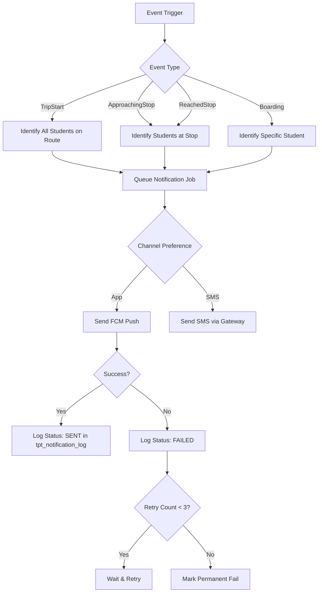

# Transport Module - UX Flows (v2)

**Focus:** Interaction flows for new Safety & Tracking features.

---

## 1. Driver Trip & Student Scanning Flow

**Actor:** Driver / Attendant
**Goal:** Execute a trip and accurately log student boarding/unboarding.

```mermaid
graph TD
    A[Start App] --> B{Device Authorized?};
    B -- No --> C[Show 'Unauthorized Device'];
    C --> D[Contact Admin];
    B -- Yes --> E[Login Success];
    E --> F[Select Trip (Morning/Evening)];
    F --> G[Start Trip];
    G --> H{Arrive at Stop};
    H --> I[App Logs 'ReachedStop'];
    I --> J[Trigger Notification (Parent)];
    J --> K[Open Scanner];
    K --> L(Scan Student QR/RFID);
    L --> M{Valid Student?};
    M -- Yes --> N[Log 'BOARD' Event];
    N --> O[Show Green Tick & Name];
    M -- No --> P[Show 'Invalid Student' Alert];
    O --> Q{All Students Boarded?};
    Q -- No --> K;
    Q -- Yes --> R[Move to Next Stop];
    R --> S{End of Route?};
    S -- No --> H;
    S -- Yes --> T[End Trip];
```

---

## 2. Notification System Flow

**Actor:** System (Automated)
**Goal:** Deliver timely alerts to parents while handling failures.



---

## 3. Device Registration Flow

**Actor:** Admin & Driver
**Goal:** Securely bind a hardware device to a driver account.

1.  **Driver** installs App on new phone.
2.  **Driver** attempts Login.
3.  **System** checks `device_uuid` against `tpt_attendance_device`.
4.  **System** detects "Unknown Device" -> Blocks Login -> Sends Alert to Admin.
5.  **Admin** opens "Attendance Devices" Screen.
6.  **Admin** sees "Pending Approval" for Driver X on Device Y.
7.  **Admin** verifies and clicks "Approve".
8.  **System** creates record in `tpt_attendance_device` with `is_active=1`.
9.  **Driver** can now Login.

---
**End of UX Flows**
