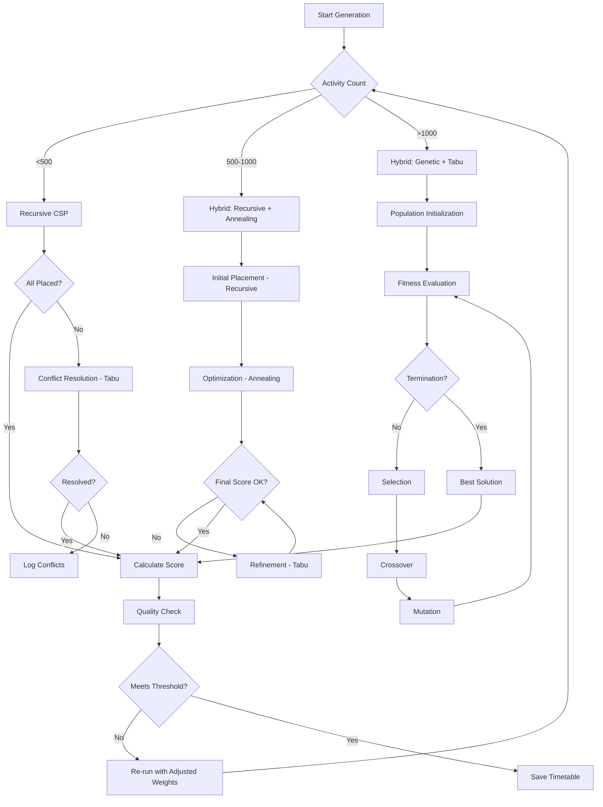

# ALGORITHM EXECUTION WORKFLOW
------------------------------

```mermaid
graph TD
    A[Start Generation] --> B{Activity Count}
    B -->|<500| C[Recursive CSP]
    B -->|500-1000| D[Hybrid: Recursive + Annealing]
    B -->|>1000| E[Hybrid: Genetic + Tabu]
    
    C --> F{All Placed?}
    F -->|Yes| G[Calculate Score]
    F -->|No| H[Conflict Resolution - Tabu]
    H --> I{Resolved?}
    I -->|Yes| G
    I -->|No| J[Log Conflicts]
    
    D --> K[Initial Placement - Recursive]
    K --> L[Optimization - Annealing]
    L --> M{Final Score OK?}
    M -->|No| N[Refinement - Tabu]
    N --> M
    M -->|Yes| G
    
    E --> O[Population Initialization]
    O --> P[Fitness Evaluation]
    P --> Q{Termination?}
    Q -->|No| R[Selection]
    R --> S[Crossover]
    S --> T[Mutation]
    T --> P
    Q -->|Yes| U[Best Solution]
    U --> G
    
    G --> V[Quality Check]
    V --> W{Meets Threshold?}
    W -->|No| X[Re-run with Adjusted Weights]
    X --> B
    W -->|Yes| Y[Save Timetable]
```

