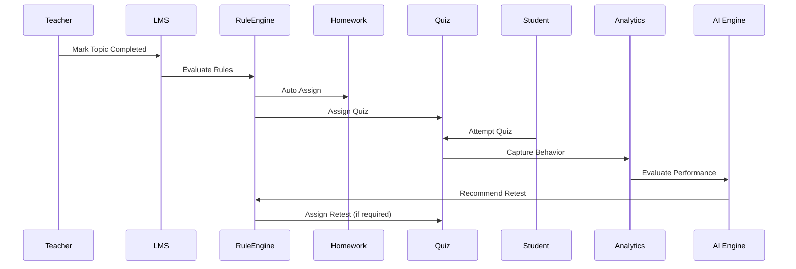

# LMS – AI Rule Execution Pipeline & Process Architecture
## Deliverable 3

**Role:** Business Analyst GPT – School ERP / LMS / AI Architect  
**Scope:** LMS (Homework, Question Bank, Quiz, Quest, Exam, Student Attempt)  
**Compliance:** NEP 2020, Holistic Progress Card  
**Audience:** Product Owner, CTO, AI Engineer, DBA, Backend Team  

---

## 1. AI-DRIVEN LEARNING & ASSESSMENT LOOP

```
Syllabus Progression
        ↓
Topic / Sub-Topic / Micro Topic Completed
        ↓
AI Rule Engine Trigger
        ↓
Homework → Quiz → Retest (if required) → Quest → Exam
        ↓
Student Attempt + Behavioral Telemetry
        ↓
Performance Category Calculation
        ↓
AI Recommendation Engine
        ↓
Holistic Progress Card (NEP 2020)
```

---

## 2. CORE AI RULE ENGINE CONCEPT

### 2.1 Rule Engine Characteristics
- Event-driven
- Configuration-based (DB driven)
- AI assisted (recommendation, not blind automation)
- Fully auditable

### 2.2 Rule Structure

| Element | Description |
|------|------------|
| Event | Topic completion, quiz submission |
| Condition | Score, behavior, attempts |
| Action | Assign homework/quiz/retest |
| Config | School-level parameters |
| AI Override | Allowed / Not allowed |

### 2.3 Example Rules

```
IF topic.status = COMPLETED
AND homework.auto_release = TRUE
THEN assign_homework()

IF quiz.score < passing_percentage
AND auto_retest_required = TRUE
THEN generate_retest_quiz()
```

---

## 3. MODULE-WISE PROCESS ARCHITECTURE

### 3.1 Homework Auto-Assignment Flow

```
Teacher updates Topic Status
        ↓
Topic Hierarchy Validation
        ↓
Homework Rule Evaluation
        ↓
Homework Published
        ↓
Student + Parent Notification
```

AI Enhancements:
- Workload balancing
- Subject-wise pressure detection

---

### 3.2 Quiz Lifecycle Flow

```
Topic Completed
        ↓
Quiz Ordinal Check
        ↓
Quiz Assigned (Performance-based)
        ↓
Student Attempts Quiz
        ↓
Behavioral Telemetry Captured
        ↓
Performance Category Calculated
```

Telemetry Captured:
- Time per question
- Answer changes
- Re-attempts
- Skipped questions

---

### 3.3 Auto-Retest Loop (Mastery Learning)

```
Quiz Submission
        ↓
Performance Evaluation
        ↓
Auto Retest Required?
        ↓
Yes → Generate New Quiz → Assign
        ↓
No → Proceed Further
```

Supports NEP principle of **mastery over memorization**.

---

### 3.4 Quest (Learning Quest) Flow

```
Major Lesson / Topic Group Completed
        ↓
Quest Assigned
        ↓
MCQ Auto Evaluation
        ↓
Descriptive Evaluation by Teacher
        ↓
Final Performance Rating
```

Used for:
- Unit readiness
- Diagnostic assessment

---

### 3.5 Online Exam Flow

```
Exam Scheduled
        ↓
Student Attempt (Timer Enforced)
        ↓
MCQ Auto Evaluation
        ↓
Descriptive Evaluation
        ↓
Grade + Division Calculation
        ↓
Result Card Generated
```

---

## 4. PERFORMANCE CATEGORY ENGINE

### 4.1 Inputs

| Input Type | Source |
|---------|--------|
| Quiz Score | Quiz Attempts |
| Quest Score | Quest Evaluation |
| Exam Score | Exam Attempts |
| Homework | Homework Completion |
| Behavior | Telemetry Tables |

### 4.2 Sample Categories

| Category | Rule |
|------|-----|
| TOPPER | ≥ 90% + Low Guessing |
| EXCELLENT | ≥ 80% |
| GOOD | ≥ 70% |
| AVERAGE | ≥ 60% |
| NEED IMPROVEMENT | < 60% |

### 4.3 AI Recommendations

| Category | Recommendation |
|------|---------------|
| TOPPER | Challenge Quest |
| EXCELLENT | Advanced Quiz |
| GOOD | Practice Quiz |
| AVERAGE | Revision Homework |
| POOR | Retest + Intervention |

---

## 5. NEP 2020 & HOLISTIC PROGRESS CARD ALIGNMENT

### 5.1 NEP Mapping

| NEP Principle | LMS Implementation |
|--------------|-------------------|
| Formative Assessment | Homework, Quiz |
| Competency Based | Question tagging |
| Mastery Learning | Auto Retest |
| Holistic Growth | Behavior + Academics |
| Reduced Exam Stress | Learning Quests |

### 5.2 Holistic Progress Card Inputs

| Dimension | Data Source |
|---------|-------------|
| Academic | Quiz, Exam |
| Behavioral | Telemetry |
| Engagement | Attempts |
| Improvement | Retest Success |
| Consistency | Homework |

---

## 6. AI RULE SEQUENCE (MERMAID)



---

## 7. FINAL NOTES

- Fully configuration driven
- NEP compliant by design
- AI is advisory, not opaque
- Scalable across schools and boards

**This document is AI-ready and DDL-aligned.**
