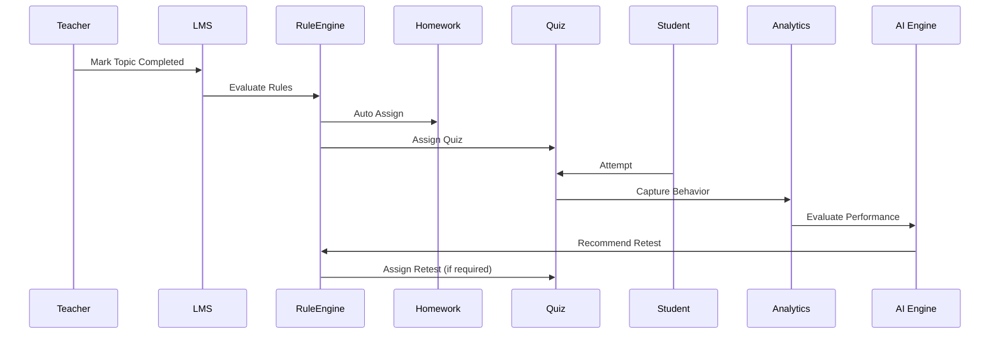

# LMS MODULE – DETAILED REQUIREMENT SPECIFICATION

## 1. HOMEWORK & ASSIGNMENT MANAGEMENT

### 1.1 Homework Planning & Alignment

#### 1.1.1 Advance Homework Creation

**Purpose**
Allow teachers to plan homework in advance, aligned with curriculum progression.

**Actors**
  - Teacher, System

**How it Works**
  - Teacher creates Homework for:
    + Class
    + Section
    + Subject

  - Homework can be marked as “Draft” or “Auto-Release”

  - Homework is linked to:
    + Topic / Sub-Topic / Mini / Micro Topic

**Example**
  - Class 6 → Science → “Sources of Energy”
  - Homework auto-releases when “Solar Energy – Micro Topic” is marked Completed

**NEP Mapping**
  - Continuous formative assessment
  - Structured learning progression

**AI Enablement**
  - AI predicts workload balance
  - AI suggests optimal release timing


### 1.1.2 Topic Completion Driven Homework Auto-Assignment

**Purpose**
Remove manual dependency and enforce learning discipline.

**Actors**
  - Teacher, System

**How it Works**
  - When teacher marks a Topic/Sub-Topic/Mini/Micro Topic as COMPLETED
  - System automatically:
    + Publishes linked Homework
    + Assigns it to eligible students

**Configuration Driven**
  - auto_release_on_topic_completion = true/false

**Example**
``` text

  Topic Status → Completed
    ↓
  Homework → Auto Assigned
    ↓
  Student & Parent Notified
``` 

### 1.2 Homework Content & Submission

#### 1.2.1 Homework Content Types

**Supported Formats**
  - Long Text (TEXT / HTML / MARKDOWN)
  - Scanned handwritten image (PDF/JPG/PNG)

**Reference attachments**

**Actors**
  - Teacher

**Example**

“Solve Q1–Q5 in notebook and upload scanned copy”

### 1.2.2 Student Submission & Evidence

**Purpose**
Allow flexible submission while capturing proof of learning.

**Actors**
  - Student

**How it Works**
  - Student uploads:
    + Image / PDF
    + Optional text explanation

**System records:**
  - Submission time
  - Late submission flag

### 1.3 Review, Feedback & Reassignment

#### 1.3.1 Homework Review & Remarks

**Actors**
  - Teacher

**Capabilities**
  - View submission status (Submitted / Pending / Late)
  - Add:
    + Text remarks
    + Audio/video feedback (optional future scope)

### 1.3.2 Reassignment & Improvement Loop

**Purpose**
Promote mastery learning.

**How it Works**
  - Teacher marks Homework as:
    + Accepted
    + Needs Improvement

  - Homework can be re-assigned with new due date

**NEP Mapping**
  - Competency-based feedback
  - Learning over scoring

## 5. Marks & Configuration
### 5.1 Marks Enabled / Disabled

**Config Driven**
  - homework_has_marks = true / false

**If Enabled**
  - Marks captured
  - Included in formative assessment analytics

## 6. Communication & Escalation
### 6.1 Non-Submission Alerts

**Actors**
  - System, Teacher

**How it Works**
  - System identifies overdue homework
  - Teacher can send:
    + Student notification
    + Parent notification

**AI Enablement**
  - Predict chronic non-compliance
  - Suggest counselling/intervention


## 2. QUESTION CREATION & QUESTION BANK

### 2.1 Question Authoring

#### 2.1.1 Multi-Dimensional Question Classification

**Purpose**
Create reusable, analytics-ready questions.

**Dimensions**
  - Class
  - Subject
  - Topic → Ultra Topic
  - Competency
  - Bloom Taxonomy
  - Cognitive Skill
  - Complexity Level
  - Question Type

**2.1.2 Question Formats**

**Supported**
  - TEXT
  - HTML
  - MARKDOWN
  - LATEX
  - JSON
  - Image-based

### 2.2 MCQ & Options Management

#### 2.2.1 Option-Level Intelligence

**Each option stores:**
  - Correct / Incorrect
  - Explanation (Why correct / Why wrong)
  - Media attachment

**Example**
Option B is incorrect because it ignores unit conversion

### 2.3 Review, Approval & Versioning

#### 2.3.1 Review Workflow

**Statuses**

  - DRAFT
  - IN_REVIEW
  - APPROVED
  - REJECTED
  - PUBLISHED
  - ARCHIVED

**Audit Captured**
  - Reviewer
  - Timestamp
  - Comments

#### 2.3.2 Version History

**Captured**
  - Old version snapshot
  - Change summary
  - Changed by
  - Changed on

### 2.4 Ownership, Availability & Usage

#### 2.4.1 Ownership
  - PrimeGurukul
  - School

#### 2.4.2 Availability Scope
  - GLOBAL
  - SCHOOL_ONLY
  - CLASS_ONLY
  - SECTION_ONLY
  - STUDENT_ONLY

### 2.5 Analytics & AI Metadata

#### 2.5.1 Question Statistics

**Captured Automatically:**
  - Difficulty Index
  - Discrimination Index
  - Guessing Factor
  - Avg / Min / Max time
  - Attempt count

#### 2.5.2 Performance & Recommendation Mapping

**Mapped to:**
  - TOPPER
  - EXCELLENT
  - GOOD
  - AVERAGE

**With Recommendation Type:**
  - REVISION
  - PRACTICE
  - CHALLENGE


## 3. QUIZ MANAGEMENT

### 3.1 Quiz Creation & Assignment

#### 3.1.1 Topic Driven Quiz Assignment
  - Auto assigned on Topic Completion
  - Manual scheduling supported

#### 3.1.2 Differential Quiz Assignment

**Purpose**
  - Personalized assessment.

**Example**
Same topic → Different quiz sets for:
  - High performers
  - Average students
  - Remedial group

### 3.2 Quiz Configuration

**Parameters**
  - Time Limit
  - Attempts Allowed
  - Negative Marking
  - Random Order
  - Show Marks
  - Result Publish Mode

### 3.3 Behavioral Telemetry (Critical)

**Captured per Question:**
  - Time spent
  - Revisit count
  - Answer change count
  - Skipped questions

**AI Use**
  - Predict exam readiness
  - Identify guessing behavior
  - Cognitive fatigue detection

### 3.4 Auto Retest Logic

**If:**

``` text
auto_retest_required = true
```

**System:**
  - Generates new quiz
  - Assigns to same topic


## 4. QUEST (LEARNING QUEST)

### 4.1 Learning Quest Definition

**Covers:**
  - Multiple topics
  - Full lesson

**Used before:**
  - Unit test
  - Term exam

### 4.2 Descriptive Questions
  - Teacher evaluated
  - Rubric based marking (future ready)

### 4.3 Result Publishing & Analytics
  - Scheduled publishing
  - Performance auto-rated

## 5. ONLINE EXAM

### 5.1 Exam Composition
  - MCQ + Descriptive
  - Timer enforced
  - Secure attempt logging

### 5.2 Evaluation & Result

Teacher checks descriptive answers

**System:**
  - Calculates grades
  - Assigns division
  - Generates report card

**NEP Mapping**
  - Holistic Progress Card
  - Multi-dimensional evaluation


## 6. OFFLINE EXAM

### 6.1 Unified Assessment Dashboard

**Student sees:**
  - Due Quiz
  - Due Quest
  - Due Exam

### 6.2 Result Visibility Control

Result visibility based on:
  - Admin configuration
  - Publish schedule


----------------------------------------------------------------------------------------------------------------------------------------


## 7. STUDENT ATTEMPT & DASHBOARD

## 8. ASSESSMENT MANAGEMENT

## 9. ASSESSMENT DESIGN

## 10. ASSESSMENT EXECUTION

## 11. ASSESSMENT RESULTS

## 12. ASSESSMENT ANALYTICS

## 13. ASSESSMENT REPORTING

## 14. ASSESSMENT CONFIGURATION

## 15. ASSESSMENT SETUP


----------------------------------------------------------------------------------------------------------------------------------------


# 1. LMS AI RULE EXECUTION PIPELINE (END-TO-END)

## 1.1 High-Level AI-Driven Learning Loop

```
SYLLABUS PROGRESSION
        ↓
Topic / Sub-Topic / Micro Topic Status = COMPLETED
        ↓
AUTO RULE ENGINE
        ↓
Homework → Quiz → Retest (if needed) → Quest → Exam
        ↓
STUDENT ATTEMPTS + BEHAVIOR CAPTURE
        ↓
PERFORMANCE CATEGORY CALCULATION
        ↓
RECOMMENDATION ENGINE
        ↓
HOLISTIC PROGRESS CARD (NEP 2020)
```

## 2. CORE AI RULE ENGINE – CONCEPTUAL DESIGN

### 2.1 Rule Engine Philosophy

Your LMS follows a Config-Driven, Event-Triggered AI Rule Model.

Rule Components
| Component	    | Description
|---------------|-----------------------------------------------------
| Event      	| Topic completion, Quiz submission, Exam evaluation
| Condition  	| Performance %, behavior metrics, attempt count
| Action     	| Assign Homework / Quiz / Retest / Quest
| Configuration	| Stored in DB (no hard-coding)
| AI Override	| AI can recommend but not force (unless allowed)

### 2.2 Example Rule (Human-Readable)
```
IF topic.status = COMPLETED
AND homework.auto_release = TRUE
THEN assign_homework()

IF quiz.score < passing_percentage
AND performance.auto_retest_required = TRUE
THEN generate_new_quiz()
```

## 3. MODULE-WISE PROCESS ARCHITECTURE

### 3.1 Homework Auto-Assignment Flow
```
Teacher updates Topic Status
        ↓
System validates Topic Hierarchy
        ↓
Homework Rule Engine
        ↓
Homework Published
        ↓
Student & Parent Notified
```

**AI Enhancements**
  - Predict overload across subjects
  - Suggest staggered release

### 3.2 Quiz Lifecycle Flow
```
Topic Completed
        ↓
Check Quiz Ordinal
        ↓
Assign Quiz (Performance-based Group)
        ↓
Student Attempts Quiz
        ↓
Behavioral Telemetry Captured
        ↓
Score + Performance Category Calculated
        ↓
Auto Retest Logic
        ↓
New Quiz Generated (if needed)
```

**Telemetry Captured**
  - Time per question
  - Answer changes
  - Revisits
  - Skipped questions

### 3.3 Auto Retest Logic (Critical AI Loop)
```
IF quiz.score < passing_percentage
AND performance.auto_retest_required = TRUE
THEN generate_new_quiz()
```

```
Quiz Submitted
        ↓
Performance Category Evaluated
        ↓
IF auto_retest_required = TRUE
        ↓
AI Generates New Quiz (Same Topic)
        ↓
Quiz Assigned
```

### 3.4 Quest (Learning Quest) Flow

```
Lesson Group Completed
        ↓
Quest Assigned
        ↓
MCQ Auto Evaluation
        ↓
Descriptive → Teacher Evaluation
        ↓
Final Score + Performance Category
```

### 3.5 Online Exam Flow

```
Exam Scheduled
        ↓
Student Attempts (Timer Enforced)
        ↓
MCQ Auto Check
        ↓
Descriptive → Teacher Review
        ↓
Grade & Division Calculation
        ↓
Result Card Generated
```

### 3.6 Offline Exam Flow

```
Exam Scheduled
        ↓
Student Attempts (Timer Enforced)
        ↓
MCQ Auto Check
        ↓
Descriptive → Teacher Review
        ↓
Grade & Division Calculation
        ↓
Result Card Generated
```

## 4. Performance Category Engine

### 4.1 Inputs Used

| Dimension           | Source               |
| ------------------- | -------------------- |
| Quiz Scores         | Quiz Attempt Tables  |
| Quest Scores        | Quest Evaluation     |
| Exam Scores         | Exam Evaluation      |
| Homework Completion | Homework Submissions |
| Behavior            | Telemetry Tables     |

### 4.2 Example Categories

| Category         | Rule Example         |
| ---------------- | -------------------- |
| TOPPER           | ≥ 90% + Low Guessing |
| EXCELLENT        | ≥ 80%                |
| GOOD             | ≥ 70%                |
| AVERAGE          | ≥ 60%                |
| NEED IMPROVEMENT | < 60%                |

### 4.3 AI-Driven Recommendations

| Category  | Recommendation        |
| --------- | --------------------- |
| TOPPER    | Challenge Quest       |
| EXCELLENT | Advanced Quiz         |
| GOOD      | Practice Quiz         |
| AVERAGE   | Revision Homework     |
| POOR      | Retest + Intervention |


## 5. NEP 2020 & HOLISTIC PROGRESS CARD ALIGNMENT

### 5.1 NEP Compliance Mapping

| NEP Principle        | LMS Support         |
| -------------------- | ------------------- |
| Formative Assessment | Homework, Quiz      |
| Competency-Based     | Question tagging    |
| Mastery Learning     | Auto Retest         |
| Holistic Growth      | Behavior + Academic |
| Reduced Exam Stress  | Quests              |

### 5.2 Holistic Progress Card Dimensions

| Dimension   | Data Source    |
| ----------- | -------------- |
| Academic    | Quiz / Exam    |
| Behavioral  | Telemetry      |
| Engagement  | Attempts       |
| Improvement | Retest success |
| Consistency | Homework       |

### 6. MERMAID SEQUENCE DIAGRAM (AI RULE FLOW)




**AI Enhancements**
  - Predict overload across subjects
  - Suggest staggered release

**Purpose**
  - Personalized learning experience
  - Adaptive learning path
  - Intelligent feedback

**Components**
  - AI Rule Engine
  - Learning Path Engine
  - Adaptive Feedback Engine
