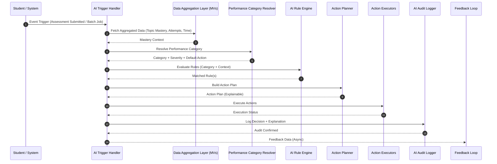

# AI Rule Execution Pipeline
*(Student → Topic → Performance → Action)*

This document describes a **deterministic, explainable, and production‑ready AI Rule Execution Pipeline**
for a School ERP + LMS + LXP system (PHP + Laravel), designed to work **without ML initially** and
upgrade seamlessly to ML later.

---

## 0. Design Principles

1. Deterministic first (no black box decisions)
2. Fully explainable & auditable
3. Event‑driven, not request‑heavy
4. Data‑driven rules (school configurable)
5. ML‑ready architecture

---

## 1. High‑Level Pipeline Flow

```
Student Activity
   ↓
Data Aggregation (Materialized Views)
   ↓
Topic Mastery Evaluation
   ↓
Performance Category Resolution
   ↓
AI Rule Matching
   ↓
Action Planning
   ↓
Action Execution
   ↓
Audit & Feedback Loop
```

Each block is **isolated and replaceable**.

---

## 2. Pipeline Stages (Detailed)

---

### STAGE 1: Trigger Events

AI rules execute only on **meaningful events**.

**Common Triggers**
- Assessment / Quiz submission
- Nightly batch job (cron)
- Topic mastery recalculation
- Teacher manual override

**Example Event Payload**
```json
{
  "event": "ASSESSMENT_SUBMITTED",
  "student_id": 1024,
  "context": {
    "assessment_id": 556,
    "subject_id": 12
  }
}
```

---

### STAGE 2: Data Aggregation Layer

Uses **precomputed Materialized Views only** (no heavy joins).

**Data Sources**
- mv_student_topic_mastery
- mv_student_lesson_mastery
- mv_student_subject_mastery

**Example Aggregated Payload**
```json
{
  "student_id": 1024,
  "topic_id": 78,
  "mastery_percent": 46.2,
  "questions_attempted": 7,
  "avg_time_factor": 0.62,
  "last_activity_days": 3
}
```

---

### STAGE 3: Performance Category Resolution

Maps mastery % → exactly **one Performance Category**.

**Resolution Priority**
1. CLASS scope
2. BOARD scope
3. SCHOOL scope

**Resolved Output**
```json
{
  "performance_category": {
    "code": "NEED_IMPROVEMENT",
    "severity": "HIGH",
    "default_ai_action": "REMEDIATE",
    "level": 4
  }
}
```

This step is **pure lookup logic** (fast, predictable).

---

### STAGE 4: AI Rule Matching Engine

Rules are stored in database (no hardcoding).

**Rule Inputs**
- Performance category
- Mastery %
- Attempts count
- Time efficiency
- Recency

**Example Rule Condition JSON**
```json
{
  "min_attempts": 5,
  "mastery_lt": 50,
  "time_efficiency_lt": 0.7
}
```

**Evaluation Algorithm**
1. Load active rules for category
2. Sort by priority
3. Evaluate conditions
4. First matching rule wins (or multiple if allowed)

---

### STAGE 5: Action Planning Layer

Rules generate an **Action Plan**, not direct execution.

**Example Action Plan**
```json
{
  "student_id": 1024,
  "topic_id": 78,
  "actions": [
    {
      "type": "ASSIGN_QUESTIONS",
      "complexity": "EASY",
      "count": 10
    },
    {
      "type": "ASSIGN_CONTENT",
      "content_type": "VIDEO"
    },
    {
      "type": "NOTIFY_TEACHER",
      "severity": "HIGH"
    }
  ],
  "reason": "Low mastery after multiple attempts"
}
```

This enables:
- Preview
- Approval
- Override
- Audit

---

### STAGE 6: Action Execution Engine

Each action is executed by a **specialized service**.

**Executors**
- Question Recommendation Service
- LMS / LXP Content Service
- Notification Module
- Academic Escalation Workflow

Pseudo‑call:
```php
ActionExecutor::execute($actionPlan);
```

---

### STAGE 7: Audit & Explainability Layer

Every AI decision is logged.

**ai_decision_log**
- student_id
- topic_id
- performance_category
- rule_id
- action_json
- explanation
- executed_at

This ensures:
- Transparency
- Trust
- Compliance
- Parent / Teacher explainability

---

### STAGE 8: Feedback Loop (Future‑Ready)

Optional future inputs:
- Student improvement trends
- Teacher overrides
- Action effectiveness
- Time‑based learning curves

Feeds:
- Rule refinement
- ML model training
- Policy updates

---

## 3. Suggested Laravel Architecture

```
AI/
 ├── Triggers/
 ├── DataCollectors/
 ├── CategoryResolver/
 ├── RuleEngine/
 ├── ActionPlanner/
 ├── Executors/
 └── AuditLogger/
```

**Single Entry Point**
```php
AIEngine::handleEvent($event);
```

---

## 4. Why This Pipeline Works

- Deterministic & explainable
- High performance (MV‑based)
- Zero ML dependency initially
- Fully configurable per school
- Clean upgrade path to ML

---

## 5. Next Logical Extensions

- Topic Mastery → Recommendation Engine
- Teacher / Parent AI Dashboards
- ML‑based rule scoring
- Adaptive Testing Engine
- AI confidence & bias monitoring

---

**Document Version:** 1.0  
**Author:** ERP Architect GPT  


---

Below are two sequence diagrams for your AI Rule Execution Pipeline:

ASCII sequence diagram → easy to read in docs / terminals

Mermaid sequence diagram → can be rendered directly in Markdown, GitHub, GitLab, VS Code

Both are aligned exactly with the pipeline you approved.

### ASCII Sequence Diagram

Student / System
      |
      |  (1) Event Trigger
      |----------------------------->
      |        AI Trigger Handler
      |
      |  (2) Collect Aggregated Data
      |----------------------------->
      |     Data Aggregation Layer
      |        (Materialized Views)
      |
      |  (3) Topic Mastery %
      |<-----------------------------
      |
      |  (4) Resolve Performance Category
      |----------------------------->
      |     Performance Category Resolver
      |
      |  (5) Category + Context
      |<-----------------------------
      |
      |  (6) Match AI Rules
      |----------------------------->
      |        Rule Engine
      |
      |  (7) Matched Rule(s)
      |<-----------------------------
      |
      |  (8) Build Action Plan
      |----------------------------->
      |        Action Planner
      |
      |  (9) Action Plan
      |<-----------------------------
      |
      |  (10) Execute Actions
      |----------------------------->
      |   Action Executors
      |   |-- Question Recommendation
      |   |-- LMS / LXP Content
      |   |-- Notification Service
      |
      |  (11) Execution Result
      |<-----------------------------
      |
      |  (12) Audit & Explain
      |----------------------------->
      |     AI Decision Logger
      |
      |  (13) Logged Decision
      |<-----------------------------
      |
      |  (14) Feedback Loop (Async)
      |----------------------------->
      |  Rule Tuning / ML Training

### Mermaid Sequence Diagram


